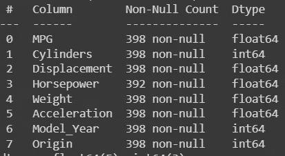
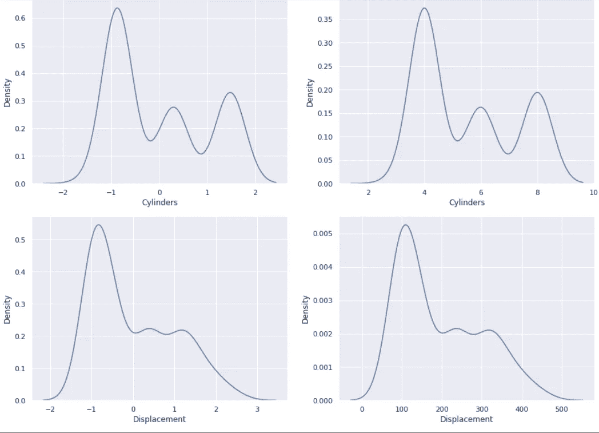
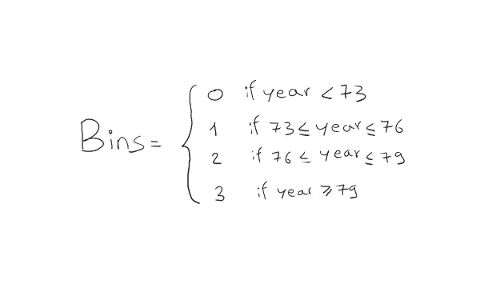
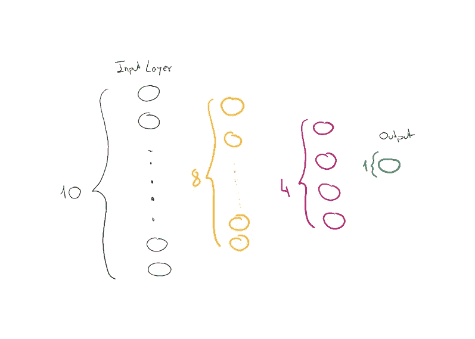

# 用 PyTorch 预测汽车效率

> 原文：<https://towardsdatascience.com/cars-efficiency-predictions-with-pytorch-dd7060477c22>

由 [Unsplash](https://unsplash.com?utm_source=medium&utm_medium=referral) 上的[Rock star](https://unsplash.com/@rockstaar_?utm_source=medium&utm_medium=referral)拍摄

## 了解如何在 PyTorch 中构建完整的深度学习管道

## 介绍

众所周知，在过去的几个月里，汽油价格飞涨。由于成本因素和与环境相关的原因，人们正在用汽油加满最低必要量。但是，你有没有注意到，当你在互联网上查找你的汽车从 A 点到 B 点应该花多少汽油时，这些数字几乎从来都不符合现实？

在这篇文章中，我想开发一个简单的模型，可以预测一辆汽车的效率(或消耗)，以每加仑汽油行驶的英里数来衡量。

目标是解决管道中的所有步骤，如数据处理、特征工程、培训和评估。

所有这些都将使用 PyTorch 在 Python 中完成。特别是，我将依赖于 Colab 笔记本，我总是发现它对这些小项目非常方便！😄

## **数据集**

我们将在这个项目中使用的数据集现在是一个里程碑， [*来自 UCI 库*](https://archive.ics.uci.edu/ml/datasets/Auto%2BMPG) 的自动 MPG 数据集。它由 **9 个特征**组成，包含 **398 条记录**。具体来说，变量名及其类型如下:

*1。mpg* :连续
2。*气缸*:多值离散
3。*位移*:连续
4。*马力*:连续
5。*重量*:连续
6。*加速*:连续
7。*车型年*:多值离散
8。*原点*:多值离散
9。*汽车名称*:字符串(每个实例唯一)

## 我们来编码吧！

首先，我们加载数据集并适当地重命名列。na_values 属性用于使 pandas 识别类型为“？”的数据应被视为 null。

现在使用 *df.head()* 来显示数据集。

df.head()

使用 *df.describe()* 函数，我们可以显示数据集的一些基本统计数据，以开始了解我们将找到哪些值。

df.describe()

否则，我们可以使用 *df.info()* 来查看是否有空值，并找出我们的变量的类型。

df.inof()(图片由作者提供)

我们首先看到马力特性包含空值，因此我们可以开始从数据集中删除对应于这些值的记录，并重置 dataframe 索引，如下所示。

现在如果我们去打印 *len(df) → 392* ，因为我们已经剔除了行。

接下来要做的是将数据集分成训练集和测试集。我们使用一个非常有用的 sklearn 函数来完成这个任务。让我们接着保存 *df_train.describe()。transpose()* table，因为我们将需要一些统计人员对一些特性进行预处理。

*训练统计:*

## 数字特征

我们现在要处理一些特征。我们经常把数字变量和分类变量区别对待。首先，我们从定义我们要归一化的数值变量开始。

要归一化一个特征，我们需要做的就是减去该特征的平均值，然后除以标准偏差，为此我们需要之前提取的统计数据。

如果我们现在根据原始数据集中的要素绘制归一化要素，您会注意到这些值由于标准化而发生了怎样的变化。那么它们将具有 0 平均值和 1 的标准偏差。

标准化(图片由作者提供)

标准化(图片由作者提供)

现在，关于 Model_Year 特性，我们对特定汽车型号是哪一年制造的并不感兴趣。但也许我们对区间或区间更感兴趣。例如，如果该型号是在 73 '和 76 '之间制造的，则该汽车是类型 1。这些范围有点随意，您可以尝试更多的范围，看看哪个效果最好。

垃圾箱范围(图片由作者提供)

## **分类特征**

就范畴特征而言，我们基本上有两种主要方法。第一种是使用 **one-hot vectors** 将类别(字符串)转换成只包含一个 1 的二进制向量。例如，零类别将被编码为[1，0，0，0]，类别 1 将被编码为[0，1，0，0]，等等。

否则，我们可以使用一个**嵌入**层，将每个类别映射到一个可以训练的*‘随机’*向量，这样我们就可以得到一个类别的向量表示，它可以管理大量的信息。

**当类别数量很大时，使用有限大小的嵌入会有很大的优势。**

在这种情况下，我们使用独热编码。

让我们也提取我们需要预测的标签。

## PyTorch 数据集和数据加载器

现在我们的数据已经准备好了，我们创建一个**数据集**以便在训练期间更好地管理我们的批次。

## 模型创建

我们构建了一个小网络，它有两个隐藏层，一个是 8 个神经元，一个是 4 个神经元。

模型(图片由作者提供)

## 培养

现在我们定义损失函数，我们将使用 **MSE** 和**随机梯度下降**作为优化器。

为了预测新的数据点，我们可以将测试数据提供给模型。

# 最后的想法

在这篇短文中，我们看到了如何使用 PyTorch 解决现实生活中的问题。我们从做一些 EDA 开始，以了解我们手上有什么样的数据集。然后，我向您展示了在预处理阶段如何区别对待数值变量和分类变量。将列值拆分成多个仓的技术被广泛使用。然后我们看到 PyTorch 如何允许我们用很少的步骤创建一个自定义数据集，我们可以逐批迭代。我们创建的模型是一个非常简单的模型，只有几层，但是使用正确的损失函数和适当的优化器可以让我们快速地训练我们的网络。我希望这篇文章对发现(或回顾)PyTorch 的一些特性有所帮助。

# 结束了

*马赛洛·波利蒂*

[Linkedin](https://www.linkedin.com/in/marcello-politi/) ， [Twitter](https://twitter.com/_March08_) ， [CV](https://march-08.github.io/digital-cv/)