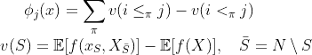
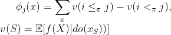
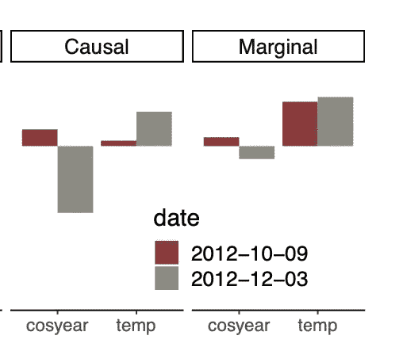
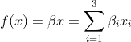
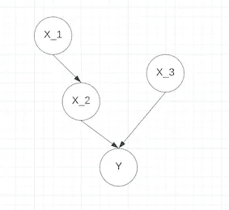
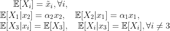
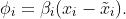
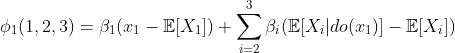
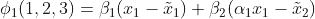
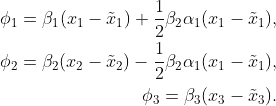

# 因果 SHAP 值:SHAP 值的一种可能的改进

> 原文：<https://towardsdatascience.com/casual-shap-values-a-possible-improvement-of-shap-values-4d4d62925b71>

## 介绍和案例研究

[图片由埃文·丹尼斯拍摄](https://unsplash.com/photos/i--IN3cvEjg)

正如我在之前的[帖子](/why-shap-values-might-not-be-perfect-cbc8056056be)中解释的那样，广泛用于机器学习可解释性的 SHAP 价值观框架不幸未能反映其结果中的因果结构。研究人员一直在提出可能的解决方案来消除这种限制。在这篇文章中，我将回顾其中一个被提议的选择，因果 SHAP 值(CSV)，并给出一个简单的例子和详细的计算来说明 CSV 和“传统的”SHAP 值之间的区别。

# 传统 SHAP 价值观及其局限性

让我们首先回顾一下 SHAP 值的定义，这是一种基于合作博弈论的方法，旨在解释一种机器学习模型，将特征重要性归因于特征对最终输出所做贡献的回报。对于给定的模型 f，考虑 j∈{1，2，…n}:=N 的特征 x_j 的 SHAP 值由下式给出

其中π是选择为均匀分布的 N 和符号

We can notice immediately that the above computation is based on a marginal expectation, which, explains why SHAP values cannot reflect the causal relation of the model.

# CSVs: a possible improvement of SHAP

## Definition of CSVs

Consider a very simple case where feature 1 is the direct cause of feature 2 and we would like to argue that we cannot give the two features the same weight when evaluating their contributions to the output of the model. By intuition, the cause should be considered more important than the effect when attributing feature importance. Such intuition leads to the causal SHAP values (CSVs) framework, proposed by [Heskes 等人](https://arxiv.org/abs/2011.01625)的排列，旨在修改当前的 SHAP 值框架，而不破坏其期望的属性，即效率、对称性、虚拟性和可加性。

CSV 具有以下定义:

我们立即注意到与前一个定义的不同(根据作者的偏好，达到一个常数):边际期望被由 [Pearl 的 do 演算](https://plato.stanford.edu/entries/causal-models/do-calculus.html)实现的介入期望所取代。对于那些不熟悉这个概念的人，只需注意 do(。)是一个数学运算符，允许我们在一个随意的模型中进行干预，通常由有向无环图(DAG)表示，这个“do”可以从字面上理解为“do it”。基于 CSV 的定义，让我们回头看看上面的例子:做特征 1，特征 2 的值不再是自由的，并且因果将被介入期望考虑。

## 与 SHAP 的区别

省略计算的细节，我们想提到的是，特征 x_i 的 CSV 可以分解成两部分:直接贡献和间接贡献。当特征变量 X_i 取特征 x_i 的值时，直接贡献是预测的变化，而间接贡献是由于干预 do(X_i=x_i)引起的变化。从这个意义上说，CSV 与传统 CSV 的区别在于这种间接贡献的额外信息。

下图给出了自行车租赁模型中的 SHAP 值和 CSV:以一年中的时间和温度的 cos 值作为输入，模型预测自行车租赁计数。我们可以看到，在考虑一年中的时间对温度的影响时，CSV 更重视 cos_year 值。

图片由[赫斯克斯等人](https://arxiv.org/abs/2011.01625)拍摄:自行车租赁模式的 SHAP 价值观

为了结束这一部分，让我们继续，通过**用介入期望**代替模型的边际期望，使得特征的**间接贡献与其直接贡献一起被考虑**，偶然 SHAP 值可以被视为当前 SHAP 值的概括。

# CSV 的具体示例

让我们通过考虑以下只有三个变量的简单模型来说明 CSV 是如何工作的:

让我们假设变量遵循由下面的 DAG 给出的偶然模型，其中我们假设 x_1 是 x_2 的父，x_3 独立于其他两个。

作者图片:休闲模特

此外，我们假设:

首先，很容易得到所有特征的 SHAP 值:

让我们现在转向 CSV。以第一个特征为例。根据定义，CSVs 被给定为{1，2，3}的所有排列的介入期望的总和。作为例子，我们将计算φ_ 1(1，2，3)。将线性函数代入φ的定义，我们得到:

根据偶然模型，我们有 E[X_2|do(x_1)]=α_1x_1，而 E[X_3|do(x_1)]=E[X_3]这导致:

类似的计算给出了所有三个特征的 CSV:

我们从结果中观察到，当模型具有一定的因果结构时，CSV 最终具有不同的特征属性。由于在上面所示的 DAG 图中，X_1 是 X_2 的父节点，所以当我们从 x_2 的 SHAP 值中移除一项时，由于它是由 x_1 而不是 x_2 本身引起的，所以在 x_1 的值中增加了一项作为其间接影响。

# CSV 的局限性

我们最后想说，如果用 CSV 取代 SHAP 还为时过早。尽管设计巧妙，但 CSV 的局限性也很明显。总的来说，我们数据科学家对 SHAP 解释任何黑盒模型的能力感到兴奋，这些黑盒模型的随意结构在实践中很难获得，如果没有这些信息，我们将永远无法对 do-calculus 进行很好的估计。然而，即使只有一部分偶然的信息可用，它仍然有助于更好地理解模型。