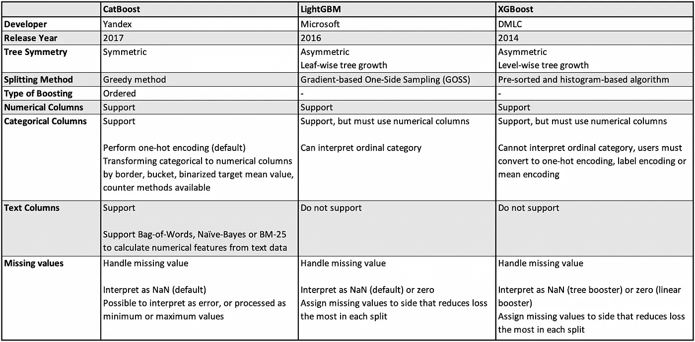
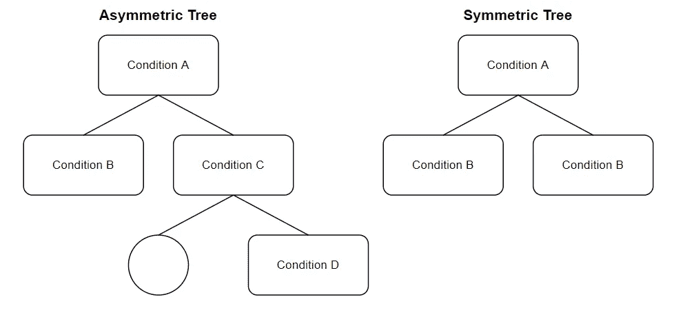
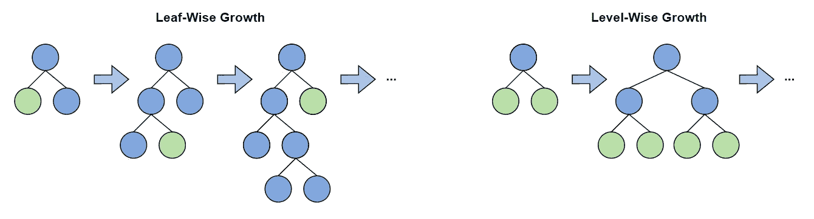
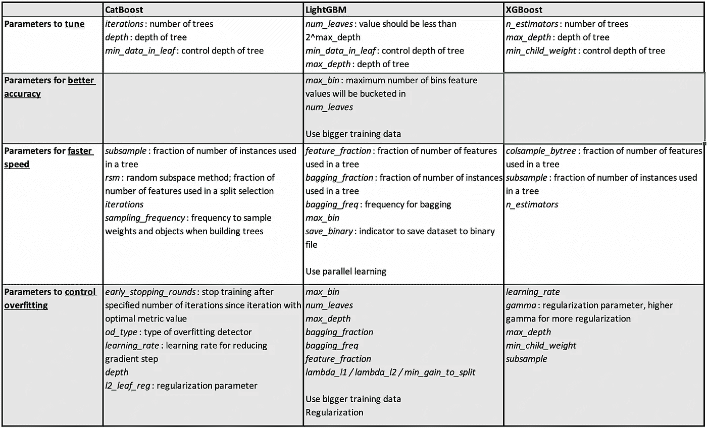

# CatBoost 与 LightGBM 与 XGBoost

> 原文：<https://towardsdatascience.com/catboost-vs-lightgbm-vs-xgboost-c80f40662924>

## 哪个算法最好？

[廷杰伤害律师事务所](https://unsplash.com/@tingeyinjurylawfirm?utm_source=medium&utm_medium=referral)在 [Unsplash](https://unsplash.com?utm_source=medium&utm_medium=referral) 上的照片

***【CatBoost】***(类别提升) ***LightGBM*** (光梯度提升机) ***XGBoost*** (极限梯度提升)都是梯度提升算法。在深入研究它们在特征和性能方面的相似性和差异之前，我们必须了解术语集成学习以及它与梯度增强的关系。

# 目录

1.  [集成学习](https://medium.com/p/c80f40662924/#d9ec)
2.  [Catboost vs . light GBM vs . XGBoost 特性](https://medium.com/p/c80f40662924/#5d39)
3.  [提高精度、速度和控制过拟合](https://medium.com/p/c80f40662924/#72c7)
4.  [性能对比](https://medium.com/p/c80f40662924/#1801)

# 集成学习

集成学习是一种结合来自多个模型的预测以获得更稳定和更好概括的预测的技术。这个想法是平均不同模型的个别错误，以减少过度拟合的风险，同时保持强大的预测性能。

在回归中，总体预测通常是单个树预测的平均值，而在分类中，总体预测基于加权投票，概率是所有树的平均值，概率最高的类是最终预测的类。

有两种主要的集成学习方法，即 bagging 和 boosting，尽管 ML(机器学习)算法可以是两者的组合，但有一定的变化。

*   **Bagging** 方法使用数据的随机子集(替换取样)并行构建模型，并汇总所有模型的预测
*   **Boosting** 方法利用全部数据依次建立模型，每个模型在前一个模型的误差上进行改进

CatBoost、LightGBM 和 XGBoost 都是梯度增强算法的变体。现在，您已经理解了打包和提升之间的区别，我们可以继续讨论算法如何实现梯度提升的区别。

# Catboost 与 LightGBM 和 XGBoost 特性的关系

下表总结了这三种算法之间的差异，请继续阅读，以了解详细的特征。

表 CatBoost、LightGBM 和 XGBoost 的特征——按作者分类的图像

## 树对称

在 CatBoost 中，对称树或平衡树指的是在树的同一深度上所有节点的分裂条件是一致的。另一方面，LightGBM 和 XGBoost 会产生不对称的树，这意味着相同深度的每个节点的分割条件可能不同。

图 1:不对称树与对称树——作者图片

对于对称树，这意味着分裂条件必须导致相同深度的所有节点的最低损失。平衡树架构的好处包括更快的计算和评估以及控制过拟合。

尽管 LightGBM 和 XGBoost 都是非对称树，但是 LightGBM 是按叶生长的，而 XGBoost 是按层生长的。简而言之，我们可以认为 LightGBM 是选择性地生长树，从而产生比 XGBoost 更小更快的模型。

图 2: LightGBM(左)与 XGBoost(右)——作者图片

## 分裂法

拆分方式是指如何确定拆分条件。

在 CatBoost 中，使用贪婪方法，从而将特征分裂对的可能候选列表分配给叶子作为分裂，并且选择导致最小惩罚的分裂。

在 LightGBM 中，基于梯度的单侧采样(GOSS)保留所有具有大梯度的数据实例，并对具有小梯度的数据实例执行随机采样。梯度是指损失函数切线的斜率。具有较大梯度的数据点具有较高的误差，并且对于找到最佳分裂点是重要的，而具有较小梯度的数据点具有较小的误差，并且对于保持学习决策树的准确性是重要的。这种采样技术导致训练模型的数据实例更少，因此训练时间更快。

在 XGBoost 中，预排序算法考虑所有特征，并根据特征值对它们进行排序。之后，进行线性扫描，以确定导致最大信息增益的特征和特征值的最佳分割。基于直方图的算法以相同的方式工作，但是它不是考虑所有特征值，而是将特征值分组到离散的箱中，而是基于离散的箱找到分裂点，这比预先排序的算法更有效，尽管仍然比 GOSS 慢。

## 增压类型

选择数据进行训练的方式有所不同。有序推进指的是每个模型训练一个数据子集并评估另一个数据子集的情况。有序提升的好处包括增强对未知数据的稳健性。

## 分类列

不同算法的分类列的参数如下:

*   CatBoost: `cat_features`，`one_hot_max_size`
*   LightGBM: `categorical_feature`
*   XGBoost: NA

# 提高精度、速度和控制过拟合

在集成学习中，对不同模型的预测进行平均有助于过拟合。然而，与任何基于树的算法一样，仍然存在过度拟合的可能性。可以在将数据集分成训练集、验证集和测试集的过程中处理过拟合，从而实现交叉验证、提前停止或树修剪。为了比较不同的算法，我们将集中于使用模型参数控制过拟合。

注意，为了控制模型的复杂性，XGBoost 使用参数`max_depth`(因为它是逐层增长的)，而 LightGBM 使用参数`num_leaves`(因为它是逐叶增长的)。

表 2:用于调整精度、速度和过度拟合的参数—图片由作者提供

# **性能对比**

在不同的数据集上，有各种关于准确性和速度的基准测试。我发现在几个数据集上概括算法性能是草率的，特别是如果过度拟合和数字/分类变量没有得到适当的考虑。

然而，一般来说，从文献来看，XGBoost 和 LightGBM 产生的性能相似，CatBoost 和 LightGBM 的性能比 XGBoost 快得多，尤其是对于较大的数据集。

希望您对三种最流行的 ML boosting 算法有更好的理解——CatBoost、LightGBM 和 XGBoost，它们主要在结构上有所不同。在实践中，数据科学家通常会对他们的数据尝试不同类型的 ML 算法——所以现在还不要排除任何算法！除了在不同算法之间进行选择时的可理解性、性能和时序考虑之外，通过超参数调整来微调模型以及通过流水线架构或超参数来控制过拟合也是至关重要的。

# 相关链接

## **CatBoost**

*   文档:[https://catboost.ai/en/docs/](https://catboost.ai/en/docs/)
*   官方 GitHub:[https://github.com/catboost/catboost](https://github.com/catboost/catboost)
*   论文:[http://learningsys.org/nips17/assets/papers/paper_11.pdf](http://learningsys.org/nips17/assets/papers/paper_11.pdf)

## **LightGBM**

*   文件:[https://lightgbm.readthedocs.io/](https://lightgbm.readthedocs.io/)
*   官方 GitHub:[https://github.com/microsoft/LightGBM](https://github.com/microsoft/LightGBM)
*   论文:[https://proceedings . neur IPS . cc/paper/2017/file/6449 f 44 a 102 FDE 848669 BDD 9 EB 6b 76 fa-paper . pdf](https://proceedings.neurips.cc/paper/2017/file/6449f44a102fde848669bdd9eb6b76fa-Paper.pdf)

## **XGBoost**

*   文档:【https://xgboost.readthedocs.io/ 
*   官方 GitHub:【https://github.com/dmlc/xgboost 
*   论文:[https://arxiv.org/pdf/1603.02754.pdf](https://arxiv.org/pdf/1603.02754.pdf)