# 使用 CatBoost 的分类嵌入

> 原文：<https://towardsdatascience.com/categorical-embeddings-with-catboost-9f87ceda76a2>

## 研究使用来自 fast.ai 神经网络的分类嵌入是否可以提高 CatBoost 在分类任务中的性能


泰勒·伊斯顿在 [Unsplash](https://unsplash.com?utm_source=medium&utm_medium=referral) 上的照片

[CatBoost](https://catboost.ai/) 是 Yandex 的开源机器学习算法。它的名字来源于单词**Cat**egory**Boost**ing。正如您所料，该库的主要优势之一是以比其他决策树算法更直观的方式处理分类数据。与其他决策树算法相比，它的性能也很好。我将 fast.ai 分类嵌入传递给随机森林和 XGBoost 模型，代替一次性编码的分类变量，取得了很好的结果。本文旨在回答 CatBoost 是否也能从使用它们中获益的问题。我们将使用 Kaggle 的[pet finder . my Adoption Prediction](https://www.kaggle.com/competitions/petfinder-adoption-prediction)数据集对此进行调查。 [PetFinder.my](https://www.petfinder.my/) 是一个帮助防止虐待马来西亚流浪动物并在那里为它们寻找新家的资源。如果这是你感兴趣的话题，他们确实有一个志愿者人工智能任务组。该组织好心地允许我在这篇文章中使用他们的数据集。

我的 Kaggle 笔记本，包括下面显示的代码，可以在这里找到[。](https://www.kaggle.com/code/johnwillcox/notebook7496488236)

在本文中，我们将了解:

1.  什么是范畴嵌入
2.  如何制作和检查一个 fast.ai 表格学习器
3.  如何构建 CatBoost 模型
4.  传递分类嵌入来代替或补充离散分类值是否可以提高性能

# 什么是范畴嵌入？

类别要素是不包含连续数据的要素，具有来自一组固定类(或类别)的离散值。这些类别可以是数字，尽管它们通常是字符串值。这些值需要以某种方式转换成数字，然后才能输入到大多数机器学习模型中，因为大多数模型只接受数字输入。CatBoost 是不常见的，因为它接受没有这种转换的分类特征。但是[即使是 CatBoost 也以类似的方式转换这些功能](http://catboost.ai/en/docs/concepts/algorithm-main-stages_cat-to-numberic)。

一种典型的方法是一键编码。为每个固定类别建立一个单独的二进制变量，当样本属于给定类别时，该变量的值为 1，否则为 0。如果我们查看 PetFinder.my 数据集中的 Breed1 特性，我们会看到文档中描述了 307 个狗和猫的品种，其中 176 个出现在训练数据集中。对该列进行一次性编码意味着要管理额外的 176 列！此外，我们会失去任何内在的关系或品种之间可能存在的相似性。

范畴嵌入(有时称为实体嵌入)克服了这两个缺点。嵌入是分类数据的向量表示。例如，在嵌入之前，Breed1 数据点由单个分类变量表示，用每个品种的数字 ID 填充(品种名称可以在附带的 BreedLabels.csv 文件中看到)。

```
df_train.Breed1.value_counts()
```

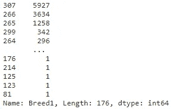

嵌入后，Breed1 数据如下所示。

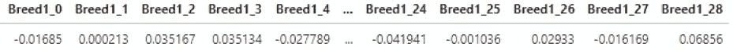

我们可以看到，单列已被 29 列浮点值所取代。我们将在后面看到 29 这个数字是如何确定的。但是现在，知道离散数据已经被一些连续的数据点所取代就足够了，这些数据点可以直接用作我们模型的特征输入。这个数字几乎比一次性编码数据所需的数字小一个数量级。

值得注意的是，这些输入既连续又有意义，正如论文“[分类变量的实体嵌入](https://arxiv.org/abs/1604.06737)”(郭城和费利克斯·贝克汉)中所展示的。作者表明，连续值描述了潜在类别的内在属性。这意味着我们可以计算和比较不同类别(在我们的例子中，猫和狗品种)之间的嵌入距离，并发现我们认为在现实生活中相似的类别之间的距离比我们认为相距较远的类别之间的距离更短。

例如，在宠物收养的情况下，我们可能会认为两种家庭犬种，拉布拉多犬和梗犬，彼此之间的距离比罗威纳犬更近，罗威纳犬更多地被认为是一种护卫犬。并且，计算这些品种的嵌入之间的简单欧几里德距离，我们看到这确实是事实。

```
breed1_embeddings = [x for x in df_train_embeddings.columns if x.startswith('Breed1_')]
terrier=df_train_embeddings[df_train_embeddings.Breed1=='218'][breed1_embeddings].head(1)
labrador=df_train_embeddings[df_train_embeddings.Breed1=='141'][breed1_embeddings].head(1)
rottweiler=df_train_embeddings[df_train_embeddings.Breed1=='189'][breed1_embeddings].head(1)
print('Terrier -> Labrador', round(np.linalg.norm(np.array(terrier)-np.array(labrador)),3))
print('Rottweiler -> Terrier', round(np.linalg.norm(np.array(rottweiler)-np.array(terrier)),3))
print('Rottweiler -> Labrador', round(np.linalg.norm(np.array(rottweiler)-np.array(labrador)),3))
```

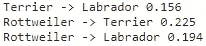

# 安装

好了，现在我们知道了一点什么是嵌入，以及它们如何帮助我们，让我们通过代码来使用 fast.ai 库生成它们。如果你不熟悉 fast.ai，[是一家由杰瑞米·霍华德和瑞秋·托马斯创立的研究机构](https://www.fast.ai/)，致力于让深度学习变得更容易实现。

首先，我们导入我们的库。

```
import catboost as cb
from fastai.tabular.all import *
import numpy as np
import os
import pandas as pd
import scipy as sp
import seaborn as sns
from sklearn.model_selection import train_test_split
from typing import Dict, Tuple
```

然后，我们加载提供的训练、测试和样本提交文件。

```
input_folder = '../input/petfinder-adoption-prediction'
df_train = pd.read_csv(f'{input_folder}/train/train.csv')
df_test = pd.read_csv(f'{input_folder}/test/test.csv')
df_sample_submission = pd.read_csv(f'{input_folder}/test/sample_submission.csv')
df_sample_submission.drop('AdoptionSpeed', axis=1, inplace=True)
```

## 预处理

我们对数据做一些非常基本的预处理。品种栏似乎很混乱，用各种组合来表示一只狗或猫是混种。所以我们设计了一个简单的二进制标志。

```
def get_mixed_breed(breed1: int, breed2: int) -> int:    
    # mixed breed with both breeds specified
    if breed1 != 307 and breed2 != 307 and breed1 != 0 and breed2 != 0 and breed1 != breed2:
        return 1
    # mixed breed with only one breed specified
    elif (breed1 != 307 and breed1 != 0 and breed2 == 307) or (breed2 != 307 and breed2 != 0 and breed1 == 307):
        return 2
    # mixed breed with no breed specified
    elif (breed1 == 307 and breed2 == 307) or (breed1 == 307 and breed2 == 0):
        return 3

    # breed is not mixed
    return 0df_train['mixed_breed'] = df_train.apply(lambda row: get_mixed_breed(row.Breed1, row.Breed2), axis=1)
df_test['mixed_breed'] = df_test.apply(lambda row: get_mixed_breed(row.Breed1, row.Breed2), axis=1)
```

每个宠物档案的描述都通过谷歌的自然语言 API 运行，这意味着我们可以提取描述长度、语言、情感程度和分数的特征。

```
def get_sentiment(filename: str) -> pd.Series:    
    try:
        with open(filename) as file:
            data = json.load(file)
        return pd.Series((data['documentSentiment']['magnitude'], data['documentSentiment']['score'], data['language']))
    except FileNotFoundError:
        return pd.Series((np.nan, np.nan))

df_train[['description_sentiment_magnitude', 'description_sentiment_score', 'description_language']] = df_train.PetID.apply(lambda pet_id: get_sentiment(f'{input_folder}/train_sentiment/{pet_id}.json'))
df_test[['description_sentiment_magnitude', 'description_sentiment_score', 'description_language']] = df_test.PetID.apply(lambda pet_id: get_sentiment(f'{input_folder}/test_sentiment/{pet_id}.json'))
df_train['description_length'] = df_train.Description.str.count(' ')
df_test['description_length'] = df_test.Description.str.count(' ')
```

从阅读这 3 个样本的描述中，我们可以看到年龄被错误地输入了月份而不是年份。

```
df_train.loc[df_train.PetID=='e3b589e13', 'Age']=2
df_train.loc[df_train.PetID=='e77f9e778', 'Age']=3
df_train.loc[df_train.PetID=='53923463d', 'Age']=3
```

我们定义了相关(目标)变量以及分类和连续特征的列表，并根据 CatBoost 的要求创建了类型为`str`的分类变量。

```
reproducible_results = True
random_state = 42 if reproducible_results else None
dependent_var = 'AdoptionSpeed'
categorical = ['Breed1', 'Breed2', 'Gender', 'Color1', 'Color2', 'Color3', 'State', 'Vaccinated', 'Dewormed', 'Sterilized', 'mixed_breed', 'Type', 'MaturitySize', 'FurLength', 'Health', 'description_language']
continuous = ['Age', 'Quantity', 'Fee', 'VideoAmt', 'PhotoAmt', 'description_length', 'description_sentiment_score', 'description_sentiment_magnitude']df_train[categorical] = df_train[categorical].astype('str')
df_test[categorical] = df_test[categorical].astype('str')
```

如果我们想要可再现的结果，特别是从 fast.ai 表格学习器中，我们可以重新播种*一切*。

```
def seed_everything(seed): 
    random.seed(seed) 
    os.environ['PYTHONHASHSEED'] = str(seed) 
    np.random.seed(seed) 
    torch.manual_seed(seed) 
    torch.cuda.manual_seed_all(seed) 
    torch.cuda.manual_seed(seed) 
    torch.backends.cudnn.deterministic = True

if reproducible_results:
    seed_everything(random_state)
```

现在我们使用 [sklearn 的](https://scikit-learn.org/stable/modules/generated/sklearn.model_selection.train_test_split.html) `train_test_split`实用程序将训练数据分成 80/20 分割的训练集和验证集。我们设置分层参数以确保训练和验证数据的 AdoptionSpeed 类的划分是相同的。

```
train_xs, valid_xs, _, _ = train_test_split(df_train, df_train[dependent_var], test_size=0.2, shuffle=True, stratify=df_train[dependent_var], random_state=random_state)
splits = (train_xs.index.tolist(), valid_xs.index.tolist())
```

## 表格熊猫


[斯通王](https://unsplash.com/@stonewyq?utm_source=medium&utm_medium=referral)在 [Unsplash](https://unsplash.com?utm_source=medium&utm_medium=referral) 上的照片

fast.ai `[TabularPandas](https://docs.fast.ai/tabular.core.html#TabularPandas)`对象是[熊猫数据帧](https://pandas.pydata.org/docs/reference/api/pandas.DataFrame.html)的有用包装器。我们选择[对](https://docs.fast.ai/tabular.core.html#Categorify)进行分类，[填充缺失值](https://docs.fast.ai/tabular.core.html#FillMissing)(默认行为是使用中值)，而[对](https://docs.fast.ai/data.transforms.html#Normalize)我们的数据进行标准化。`splits`参数是一个元组，包含训练集和验证集的行索引列表。我们将使用`CategoryBlock`来完成这个分类任务。

```
procs = [Categorify, FillMissing, Normalize]
tabdata = TabularPandas(df=df_train, procs=procs, cat_names=categorical.copy(), cont_names=continuous.copy(), splits=splits, y_names=dependent_var, y_block=CategoryBlock())
```

## 嵌入尺寸

现在，我们第一次可以看到. ai 计划以多快的速度构建分类嵌入。[这个方法](https://docs.fast.ai/tabular.model.html#get_emb_sz)给了我们要使用的默认嵌入大小。

```
embedding_sizes = get_emb_sz(tabdata)
embedding_sizes
```

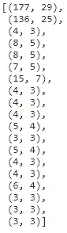

该方法返回一个元组列表，每个分类变量一个，按照我们在`cat_features`参数中添加它们的顺序。我们来看第一个元组。列表中的第一个分类变量是 Breed1。正如我们已经看到的，在训练数据集中有 176 个不同的值。

```
df_train['Breed1'].nunique()
```

第一个元组是(177，29)。177 值是具有一个额外类别的 176 个唯一值，该类别将用于任何验证、测试或未来样本，该样本具有迄今为止未在训练数据集中表示的未知值。

29 是 fast 的连续值的数目。ai 已经确定它将用来表示 Breed1。换句话说，我们认为在收养宠物的情况下，主要品种之间的关系可以用 29 个连续的值来充分表达。让我们看看这个数字是如何得出的。

```
emb_sz_rule??
```

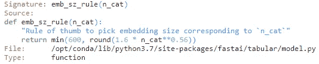

我们可以看到 fast.ai 用来确定嵌入矩阵大小的经验法则——它是 600 的最小值或类别数的 0.56 次方乘以 1.6。杰瑞米·霍华德提到，这条规则是通过运行许多模型并调整尺寸以找出最佳公式得出的。他特别提到这只是一个起点，应该像任何其他超参数一样进行优化(他甚至开玩笑地称之为他的“[可怕的嵌入黑客](https://twitter.com/jeremyphoward/status/1242128706740551681)”)。我们将在后面看到如何覆盖嵌入的默认大小。

我在上面说过,`get_emb_sz`方法返回一个元组列表，每个元组对应一个分类变量。然而，仔细观察，我们看到有 19 个元组(或嵌入)，但我们只有 16 个分类变量！为了理解这是怎么回事，我们可以看看表格熊猫对象的属性`cat_names`。

```
[col for col in tabdata.cat_names]
```

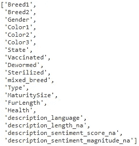

我们已经获得了 3 个新的分类变量，最后三个带有`_na`后缀。这种意外的行为是由于我们在创建表格熊猫对象时传递给它的`FillMissing` proc 参数。默认情况下，该方法在替换那些`na`值之前，为每个具有`na`值的连续变量添加一列。这样做是为了确保模型保留对给定样本缺少列值这一事实的预测能力。(请注意，如果需要，您可以使用`FillMissing(add_col=False)`来覆盖此行为。)

# 制作表格学习器

考虑嵌入大小的另一种方式是注意每个嵌入都是表格学习模型的输入层，因此每个嵌入的大小实际上是该嵌入层的输出数量。为了更好地理解这一点，我们可以继续创建表格学习器，看看整体结构。

```
def get_default_nn_layers(num_embeddings: int, num_continuous: int, num_outputs: int, num_layers: int=2) -> List[int]:
    num_input_nodes = num_embeddings + num_continuous  
    first_layer = 2**(num_layers-1) * round((((2 / 3) * num_input_nodes) + num_outputs) / 2**(num_layers-1))

    return [first_layer] + [int(first_layer / 2**n) for n in range(1, num_layers)]num_embeddings = sum(n for _, n in get_emb_sz(tabdata))
num_classes = df_train[dependent_var].nunique()
layers = get_default_nn_layers(num_embeddings, num_continuous=len(continuous), num_outputs=num_classes)
batchsize = 16
train_dl = TabDataLoader(tabdata.train, bs=batchsize, shuffle=True, drop_last=False)
valid_dl = TabDataLoader(tabdata.valid, bs=batchsize, shuffle=False, drop_last=False)
dls = DataLoaders(train_dl, valid_dl)
config = tabular_config(ps=[0.001, 0.01], embed_p=0.04)
nn_model = tabular_learner(dls=dls, layers=layers, config=config, loss_func=CrossEntropyLossFlat(), metrics=accuracy, n_out=num_classes)
```

这里有很多，让我们来分解一下。首先，我们使用`layers`参数指定隐藏层的数量和每层中神经元的数量，以覆盖`[tabular_learner](https://docs.fast.ai/tabular.learner.html#tabular_learner)`的默认值[200，100]。我发现一个有用的经验法则是从两层开始，第一层包含的神经元数量等于输入节点数量加上输出(在此上下文中为类)数量的 2/3 倍，第二层包含这个数量的一半。我的`get_default_nn_layers`方法简单地获取嵌入的总数、连续变量的总数(每个变量一个输入)、输出类的数量和所需的层数，以返回层的建议起始值(在我们的例子中是[88，44])。这是一个应该像其他参数一样优化的超参数。如果神经元数量过多，网络可能会过拟合，如果神经元数量过少，网络可能会过拟合。

接下来，我们生成[表格数据加载器对象](https://docs.fast.ai/tabular.core.html#TabDataLoader)，一个用于训练集，一个用于验证集。我们选择 16 个小批量(因为这是一个小数据集，训练很快)。我们选择在每次迭代数据加载器时打乱训练集。

最后，我们创建模型本身。我们传入一个`[tabular_config](https://docs.fast.ai/tabular.model.html#tabular_config)`参数，这样我们就可以指定退出率。 [Geoffrey Hinton 和其他人](https://arxiv.org/abs/1207.0580)介绍了一种正则化技术，在训练时随机比例的激活被设置为零，试图减少过度拟合的可能性。`ps`参数提供两个隐藏层的退出率，而`embed_p`参数提供嵌入层的退出率。我们选择`[CrossEntropyLossFlat](https://docs.fast.ai/losses.html#CrossEntropyLossFlat)`方法作为损失函数，并指示模型使用`[accuracy](https://docs.fast.ai/metrics.html#accuracy)`度量。

## 检查模型

现在我们创建了模型，让我们看看底层结构。

```
nn_model.model
```

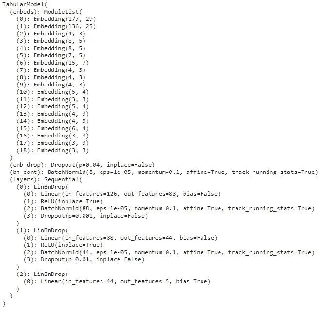

我们看到 16 个分类变量的 19 个嵌入层，加上由库生成的另外 3 个嵌入层，后面是嵌入删除层。

8 个连续变量还有一个额外的输入层。这被称为 BatchNorm1d，因为表格学习器应用批量标准化，即标准化每批每个输入的激活的过程(回想一下，这里的批次包含 16 个样本)。这有助于规范网络并加快收敛速度。

接下来，我们有两个隐藏层的第一个。我们看到 126 个输入特征(来自分类嵌入层和 8 个连续层的总共 118 个输出节点)，馈入 ReLU 激活层，在应用第一轮非嵌入退出之前，对 88 个输出应用批量归一化。第二个隐藏层有 88 个输入和 44 个输出，在应用最终漏失之前再次进行批量归一化。最后，输出层有 44 个输入和 5 个输出，每个 AdoptionSpeed 类一个。

在我们调整网络和生成嵌入之前，最后一点需要注意。我在上面提到嵌入数组的建议大小仅仅是建议。如果我们想要覆盖任何给定列的默认嵌入大小，我们可以将包含列名和值的字典传递给调用中的`emb_szs`参数，以构造表格学习器。

```
embedding_sizes_override={'Breed1': 30, 'Breed2': 24, 'State': 8}
nn_model = tabular_learner(dls=dls, layers=layers, config=config, emb_szs=embedding_sizes_override, loss_func=CrossEntropyLossFlat(), metrics=accuracy, n_out=num_classes)
```

## 训练模型

现在让我们训练网络。

```
valley = nn_model.lr_find()
plt.show()
num_epochs = 5
nn_model.fit_one_cycle(n_epoch=num_epochs, lr_max=valley, wd=0.01)
nn_model.recorder.plot_loss()
plt.show()
```

我们使用 [fit_one_cycle](https://docs.fast.ai/callback.schedule.html#Learner.fit_one_cycle) 方法实现[单周期回调](https://fastai1.fast.ai/callbacks.one_cycle.html)来提高收敛速度。我们采用来自 [fast.ai 学习率查找器](https://docs.fast.ai/callback.schedule.html#Learner.lr_find)的建议学习率，以及权重衰减的默认参数。同样，这里没有列出的这些和其他超参数都可以并且应该进行调整和优化。

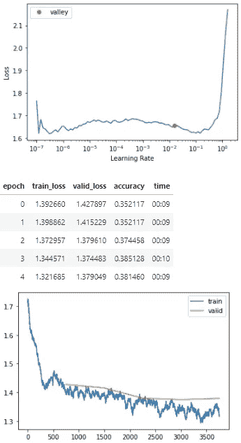

## 检查嵌入物

既然我们已经训练了网络，表格学习者模型将已经学习了分类嵌入。让我们来看看它们。

```
def embed_features(learner: tabular_learner, xs: TabularPandas) -> pd.DataFrame:
    xs = xs[learner.dls.cat_names]
    for i, col in enumerate(xs.columns):
        embeddings = learner.model.embeds[i]
        embedding_data = embeddings(tensor(xs[col], dtype=torch.int64))
        embedding_names = [f'{col}_{j}' for j in range(embedding_data.shape[1])]

        df_local = pd.DataFrame(data=embedding_data, index=xs.index, columns=embedding_names)
        xs = xs.drop(col, axis=1)
        xs = xs.join(df_local)

    return xsdf_train_embeddings = embed_features(learner=nn_model, xs=tabdata.train.xs)
df_valid_embeddings = embed_features(learner=nn_model, xs=tabdata.valid.xs)
embedded = df_train_embeddings.columns.tolist() 
df_train_embeddings = df_train_embeddings.merge(right=df_train, left_index=True, right_index=True)
df_valid_embeddings = df_valid_embeddings.merge(right=df_train, left_index=True, right_index=True)
```

`embed_features`方法采用一个表格学习器模型和一个表格熊猫来返回一个只包含新的嵌入列和值的 dataframe 的副本。上面的代码(重新)为定型和验证数据集生成嵌入值，并将它们与原始列联接，准备将它们输入到决策树模型(或任何其他类型的模型)中。

```
state_embeddings = [x for x in df_train_embeddings.columns if x.startswith('State_')]
df_train_embeddings[['State']+state_embeddings].head(10)
```

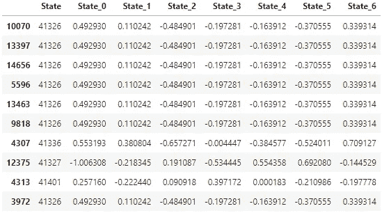

在这里，我们看到州特征的原始值和这 10 个样本中表示的三个值的相关 7 个分类嵌入(三个唯一的州值是 41326、41327 和 41401，分别对应于柔佛、槟榔屿和吉隆坡)。

我们使用表格熊猫`process`方法准备我们的测试数据。

```
tabdata_test = tabdata.new(df_test)
tabdata_test.process()
df_test_embeddings = embed_features(learner=nn_model, xs=tabdata_test)
df_test_embeddings = df_test_embeddings.merge(right=df_test, left_index=True, right_index=True)
```

# 构建 CatBoost 模型


照片由[克里斯服从](https://unsplash.com/@whyloyd?utm_source=medium&utm_medium=referral)于 [Unsplash](https://unsplash.com?utm_source=medium&utm_medium=referral)

我采用的是单标签、有序、多类、不平衡的分类任务。那是相当多的。我们来分解一下。

*   单一标签意味着一个给定的样本只能分配到一个采用速度类别
*   序数意味着类之间有一个固有的顺序。它们的范围从 0 到 4，0 表示宠物在上市当天被收养，4 表示宠物在上市 100 天后没有被收养
*   多类别意味着给定样品可以被分配到三个或更多类别(与二进制分类任务相反，在二进制分类任务中，样品将被分配到两个类别中的一个)
*   不平衡意味着在训练数据集中类的频率是偏斜的(并且，可能在测试数据集中)；例如，制作类的直方图显示，采用速度为 4 的样本数是采用速度为 0 的样本数的 10 倍

所有这一切意味着，我们可以通过几种不同的方式来实现使用 CatBoost 预测采用速度的目标。我们可以使用带有[多类](https://catboost.ai/en/docs/concepts/loss-functions-multiclassification#MultiClass)损失函数的 [CatBoost 分类器](https://catboost.ai/en/docs/concepts/python-reference_catboostclassifier)来分配给多个类。我们可以使用 [WKappa](https://catboost.ai/en/docs/concepts/loss-functions-multiclassification#WKappa) (二次加权 Kappa)评估指标来利用平凡性来改进结果。我们还可以确定类权重，将其传递给模型，以尝试解决训练数据集的不平衡性质。

然而，竞赛中最成功的团队倾向于利用回归技术，结合使用 [Nelder-Meads 算法](https://codesachin.wordpress.com/2016/01/16/nelder-mead-optimization/)和二次加权 kappa 度量的优化舍入器来帮助确定最佳点，以设置类别之间的阈值。让我们一步一步来。

## CatBoost 回归器

首先，让我们定义方法来获取我们的 [CatBoost 回归器](https://catboost.ai/en/docs/concepts/python-reference_catboostregressor)和相关的[数据池](https://catboost.ai/en/docs/concepts/python-reference_pool)。

```
def get_catboost_regressor(iterations: int=1000, loss_function: str='RMSE', eval_metric: str='RMSE', ignored_features: List[str]=['PetID'], depth: int=6) -> cb.CatBoostRegressor:
    return cb.CatBoostRegressor(iterations=iterations, loss_function=loss_function, eval_metric=eval_metric, ignored_features=ignored_features, depth=depth, random_seed=random_state)def get_catboost_pool(df: pd.DataFrame, use_categorical: bool, use_embedded: bool, has_label: bool=True) -> cb.Pool:
    columns = continuous + (categorical if use_categorical else []) + (embedded if use_embedded else []) + ['PetID']
    cat_features = ['PetID'] + (categorical if use_categorical else [])    
    label = df[dependent_var] if has_label else None

    return cb.Pool(data=df[columns], label=label, cat_features=cat_features)
```

如果我们不覆盖默认参数，返回一个使用默认参数的回归量。我们告诉 CatBoost 忽略 PetID 列，因为尽管我们希望以后使用它，但我们不希望模型试图从 PetID 值中学习。

`get_catboost_pool`使用带有附加布尔值的数据帧来定义我们希望模型使用的列组。

顺便提一下，熟悉 CatBoost 池文档的读者可能会注意到我们在这里没有使用的参数`[embedding_features](https://catboost.ai/en/docs/concepts/python-reference_pool#embedding_features)`。尽管有这个名字，这个参数并不涉及分类嵌入。它与用于文本分析的特定类型的嵌入相关(在这里[讨论](/boosted-embeddings-with-catboost-8dc15e18fb9a))。

我们将进行三次试验进行比较。

1.  仅使用连续特征和离散分类特征
2.  使用由表格学习器生成的连续特征和分类嵌入
3.  使用由表格学习器生成的连续特征、离散分类特征和分类嵌入

## 第 1 轮-仅连续特征和离散分类特征

```
# switch to indicate whether or not to feed the original categorical values into the CatBoost regressor
use_categorical = True
# switch to indicate whether or not to feed categorical embeddings into the CatBoost regressor
use_embedded = Falsetrain_pool = get_catboost_pool(df=df_train_embeddings, use_categorical=use_categorical, use_embedded=use_embedded)
valid_pool = get_catboost_pool(df=df_valid_embeddings, use_categorical=use_categorical, use_embedded=use_embedded)
test_pool = get_catboost_pool(df=df_test_embeddings, use_categorical=use_categorical, use_embedded=use_embedded, has_label=False)model = get_catboost_regressor(iterations=10000)
```

现在，我们将模型拟合 10，000 次迭代，仅显示每 1000 轮的输出。CatBoost 根据验证集自动评估模型的每次迭代，并恢复到得分最低的迭代。

```
model.fit(X=train_pool, eval_set=valid_pool, verbose=1000)
```

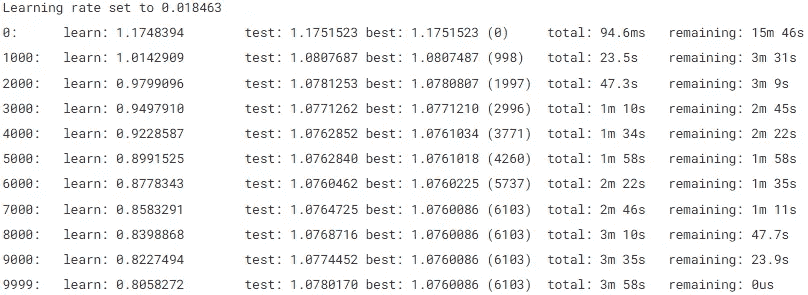

在连续特征和离散分类特征上训练的最佳模型的 RMSE 是 1.0760086，在 6，104 次训练迭代后达到。

现在我们拟合了我们的模型，让我们看看预测是什么样子的。

```
predictions = model.predict(train_pool)
predictions
```

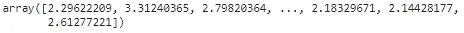

预测是以一个浮动数组的形式出现的。我们需要以某种方式将它们中的每一个都转换成 0 到 4 之间的整数。我们可以简单地通过舍入来实现，使用 0.5、1.5、2.5 和 3.5 之间的阈值。但是更好的技术可能是使用算法来确定要使用的最佳阈值。

## 优化舍入器

我们将使用许多领先的竞赛笔记本中引用的优秀的`OptimizedRounder`类和相关方法。我用的是 Kaggle 里[第八名笔记本](https://www.kaggle.com/code/adityaecdrid/8th-place-solution-code/script?scriptVersionId=12171797)的版本。定义很长，所以我不会在这里包括它们，但是你可以在我的笔记本版本中看到它们，在这篇文章的顶部。

```
optR = OptimizedRounder()
optR.fit(predictions, df_train_embeddings[dependent_var].values)
coefficients = optR.coefficients()
coefficients
```

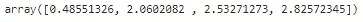

## 二次加权 Kappa

优化舍入器使用二次加权 kappa 度量来确定为训练集返回最小误差的上述 4 个边界。二次加权 kappa 对在序数尺度上相距较远的错误分类给予更大的权重。在不使用二次加权 kappa 度量的情况下，被误分类为类别 1 或类别 4 的类别 0 的样本将具有相同的误差。对于二次加权 kappa，错误分类到类别 4 的惩罚比错误分类到类别 1 的惩罚严厉 4 = 16 倍。

## 做预测

最后，我们可以根据测试数据集进行预测，并将结果提交给 Kaggle。PetFinder.my 的采用是一个纯内核的竞赛，要求所有提交都通过内核输出来完成。(如果你自己尝试这样做，你需要在 Kaggle 内核右下角的笔记本设置中关闭互联网接入。)

```
test_predictions = model.predict(test_pool)
test_predictions = optR.predict(test_predictions, coefficients)
df_predictions = pd.concat([df_test[['PetID']], pd.DataFrame(test_predictions, columns=[dependent_var])], axis=1)
df_submission = pd.merge(df_sample_submission, df_predictions, on='PetID')
df_submission.to_csv('submission.csv', index=False)
```

Kaggle 使用连续和离散分类特征对该提交进行评分，得分为 0.35155。

## 第 2 轮—连续特征和分类嵌入

```
use_categorical = False
use_embedded = True
```

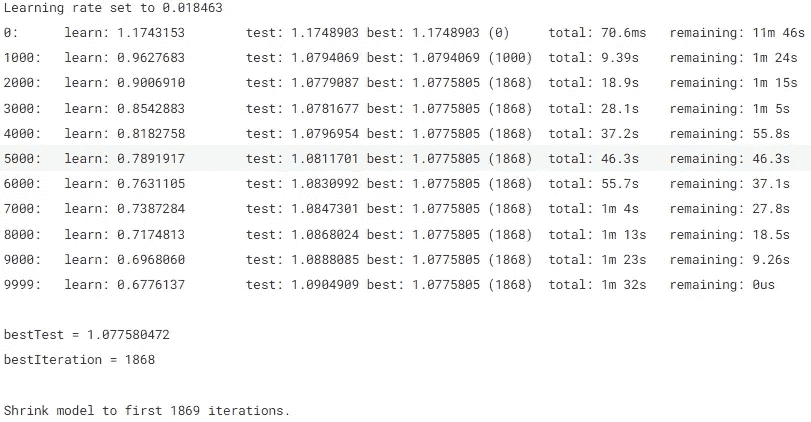

在连续特征和分类嵌入上训练的最佳模型的 RMSE 是 1.0775805，在 1，869 次训练迭代后达到。这比第一轮的 0.15%略有下降。

Kaggle 对本次提交的评分为 0.34823，比我们的第一次 Kaggle 评分下降了 0.94%。

# 第 3 轮—连续特征、离散分类特征和分类嵌入

```
use_categorical = True
use_embedded = True
```

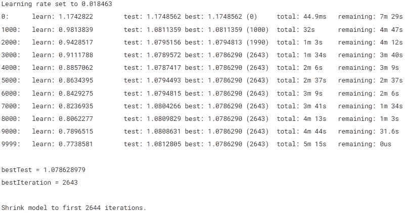

在连续特征、离散分类特征和分类嵌入上训练的最佳模型的 RMSE 值是 1.0787290。这比第一轮的最佳 RMSE 下降了 0.24%。

然而，当我们将这个模型提交给 Kaggle 时，我们得到了最好的分数，0.35787，比第一轮提交的 1.80%有所提高。

# 结论

我们进行了三次训练并提交给 Kaggle，有和没有离散的分类特征和分类嵌入。我们只做了最少量的预处理和特征工程。这些是结果。

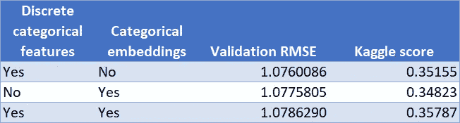

我们发现，针对验证数据集的最低 RMSE 是由仅使用离散分类特征的模型实现的(所有模型都使用归一化的连续特征)。然而，在 RMSE，三种模式之间的差异很小。

Kaggle 分数是最重要的指标。它决定了参赛者在整体竞争中的位置。它还提供了模型针对全新数据集做出概括预测的能力的最佳指示。

我们可以看到，在这一指标上得分最高的模型是我们使用原始连续特征、离散分类特征和分类嵌入所尝试的最终模型。该模型的得分为 0.35787，比我们第二好的提交结果提高了 1.8%。这可能不是一个巨大的进步，但在每一分都很重要的 Kaggle 比赛中意义重大。

这也许并不奇怪。尽管分类嵌入是从离散的分类特征中提取的，但其中包含的信息不仅仅是离散值。这是因为表格学习器已经推断出离散值之间的关系，并将这些关系封装在分类嵌入中。

我选择了 PetFinder.my 领养数据集，因为它很小，很容易理解。具有更多分类变量的较大数据集，或者具有更高基数(更多离散值)的分类变量的数据集，可能会从分类嵌入的使用中获益更多。此外，我没有对表格学习器的超参数进行优化，例如调整神经元和层的数量、学习速率、权重衰减、退出、嵌入大小等。所有这些可能使范畴嵌入变得更有意义。