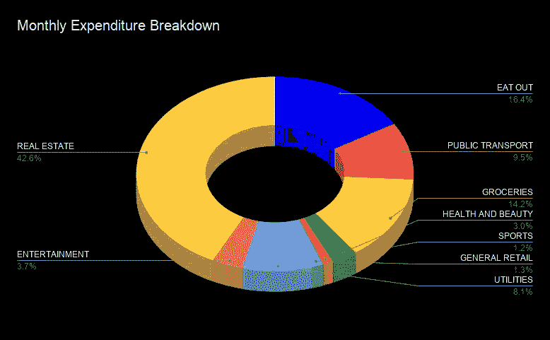
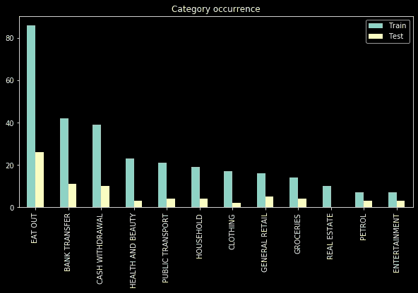
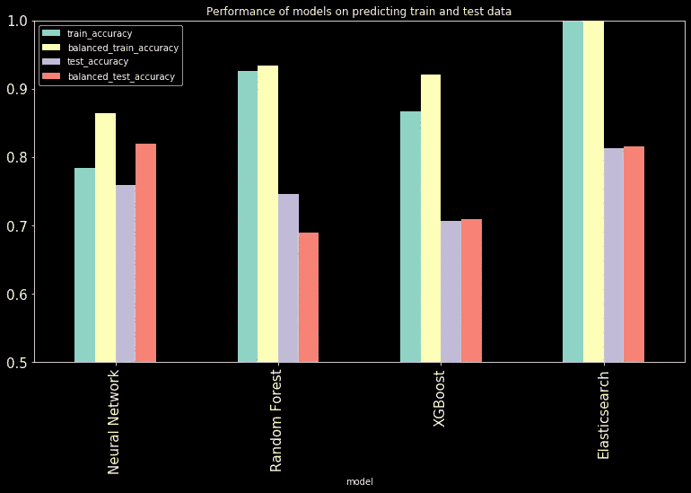
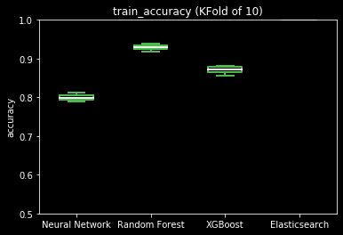
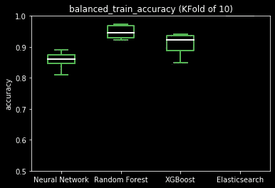
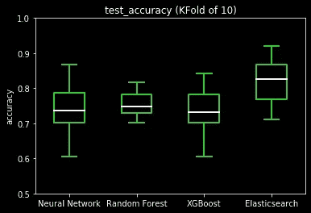
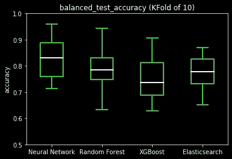

# 分类短文本描述:机器学习与否？

> 原文：<https://towardsdatascience.com/categorising-short-text-descriptions-machine-learning-or-not-d3ec8de8c40>

## 我如何自动跟踪我的开支

费用明细示例(来源:作者)

# 记录零花钱

当我年轻的时候，我喜欢记录我是如何花掉我的零花钱的。我过去常常保留收据，在电子表格上登记交易的金额和类别，并且偶尔我可以生成一个饼图(见下图)来查看我的零花钱的明细，并查看如果我需要为更大的采购节省更多的钱，我应该在哪个费用类别上花费更少。

## 每月支出明细样本

当我从保留收据转移到获取包括每笔交易的金额和描述等信息的数字报表(例如 csv)时，事情变得更容易了。手动对交易进行分类很无聊，所以我编写了一个 python 脚本来自动化这个过程，它完成了以下工作:

*   获取所有已分配类别的事务(训练数据)
*   使用训练数据训练机器学习(ML)模型(由一个[单词包](https://en.wikipedia.org/wiki/Bag-of-words_model) + [随机森林](https://en.wikipedia.org/wiki/Random_forest)组成)，以类别为目标进行预测
*   将模型应用于新的事务，以获得预测的类别并保存数据

然后我会去分析那批交易。但是，我没有处理所有的交易，而是主要关注交易金额最高或出现频率最高的交易，确保它们的分配类别是正确的(修改不正确的类别)，并将它们添加到训练数据堆中，以提高对下一批新交易的预测。这样一来，虽然我没有把所有的交易正确分类，但每一类的大致情况都足以让我清楚地知道我想知道我的支出。

所有这些都是几年前完成的，在金融机构开始提供账户交易和消费习惯分析之前。所以我不再经常使用我的脚本了。也就是说，我总是喜欢在事后想到如何以不同的方式做事情，这有助于我不断学习和改进。

# 非 ML 溶液？

有很多方法可以解决这个挑战，这是一个针对短文本描述的一般[多类分类问题](https://en.wikipedia.org/wiki/Multiclass_classification)。如果你把这当成一个 ML 问题，你可以把所有的数据科学工具都扔给它，用更好的方法处理和表示数据，而不是用[单词袋](https://en.wikipedia.org/wiki/Bag-of-words_model)模型，或者用不同的算法对[随机森林](https://en.wikipedia.org/wiki/Random_forest)进行更好的[超参数优化](https://en.wikipedia.org/wiki/Hyperparameter_optimization)。

但是退一步说，ML 是最好的也是唯一的方法吗(对于数据科学家来说，回答这个问题可能不容易)？在玩了 [elasticsearch](https://www.elastic.co/) 之后，我一直在思考这个问题，我偶然发现了它的[模糊查询](https://www.elastic.co/guide/en/elasticsearch/reference/current/query-dsl-fuzzy-query.html)函数，并认为这个函数本身就可以完成这个任务。

elasticsearch 中的模糊匹配功能使用 [Levenshtein 距离](https://en.wikipedia.org/wiki/Levenshtein_distance)(测量两个字符串序列之间的差异)来获得最接近的匹配条目。例如，给定一个新条目“HONEST BURGER ”,它需要更少的步骤来改变文本以匹配像“BURGER KING”这样的“EAT OUT”条目，而不是像“GATWICK EXPRESS”这样的“PUBLIC TRANSPORT”条目。因此，我们期望这种方法应该具有某种程度的可预测性，可能与 ML 方法的性能相当。

我写了一个简单的 elasticsearch python 客户端(这里是 [github repo](https://www.github.com/chilledgeek/elasticsearch-simple-client) )来看看这个非 ML 解决方案有多可行。策略是:

*   不用通过任何[单词袋](https://en.wikipedia.org/wiki/Bag-of-words_model)或其他预处理方法输入训练数据，只需将训练数据上传到 [elasticsearch](https://www.elastic.co/) 服务器(可以使用 dockerhub 上的 [elasticsearch 图像轻松设置)](https://hub.docker.com/_/elasticsearch/)
*   在预测新事务时，进行模糊查询，在 [elasticsearch](https://www.elastic.co/) 服务器上找到最近的事务，并为新事务分配相应的类别

# 试车

为了测试这个非 ML 解决方案，我做了一些粗略的分析，将它与一些 ML 方法进行了比较，如[神经网络](https://en.wikipedia.org/wiki/Neural_network)、 [XGBoost](https://en.wikipedia.org/wiki/XGBoost) 和[随机森林](https://en.wikipedia.org/wiki/Random_forest)，只是挑选几个。我在 github 上的[示例 jupyter 笔记本](https://github.com/chilledgeek/elasticsearch-simple-client/blob/master/example/Categorisation%20of%20short%20text%20descriptions.ipynb)包含使用[示例数据集](https://www.github.com/chilledgeek/elasticsearch-simple-client/blob/master/example/descriptions_with_categories.csv)(我的银行交易描述的匿名示例，带有注释类别)生成如下所示结果的探索代码。

在我继续讨论结果之前，这里有一些值得一提的假设和警告:

*   该数据集很小，只有大约 450 个条目，并被分配到 10 多个类别中(见下图)。因此，预计在每个模型的性能评估中会有相当大的波动，即使有交叉验证
*   总会有改进模型的空间(非 ML 解决方案也是如此)。我们的目的是对不同的技术进行粗略的比较，而不是去竞争和寻找表现最好的技术！因此，所有模型都使用基本默认参数进行训练(即不考虑超参数优化)
*   对于像这样的多类分类问题，有许多不同的度量可供选择。关于哪一个是最好的，有很多争论，但在这种情况下，我只是坚持准确性和平衡准确性(试图说明类的不平衡)，因为这些是简单的度量标准，允许我知道我从所有数据中得到多少正确的预测

训练和测试集中的类别出现分布(随机分割)(来源:作者)

# 结果

下图显示了应用于训练集和测试集时，经过训练的模型(使用 80%的数据)的性能。以下是值得强调的几点:

*   此图基于仅将数据分割为一次训练和测试(即，未交叉验证)，因此我们需要小心不要过度解读精确的数字(预计这些数字会在小数据集的不同分割中波动)。也就是说，我们仍然可以获得一些高层次的见解
*   由于加载了所有训练数据，因此保证了通过非 ML 方法(elasticsearch)对训练数据的分类是 100%准确的。
*   弹性搜索方法的测试性能与其他 ML 技术相当，尽管它在训练数据上完全“过度拟合”

ML 模型和非 ML (elasticsearch)性能的快照比较(来源:作者)

为了更公平地比较预测，应用了[k 折叠交叉验证](https://en.wikipedia.org/wiki/Cross-validation_(statistics)#k-fold_cross-validation_with_validation_and_test_set) (CV) (n = 10)，准确度和平衡准确度的结果如下图所示。我们可以看到的是:

*   同样，使用 elasticsearch 预测训练数据的预测是 100%准确的，没有任何扩展，因此在图表上不可见(1.0 处的一条橙色线)
*   给定一个小的数据集(带有 CV ),测试集上的性能分布是可以预料的
*   虽然我们不应该过度解读确切的数字，但这个图表表明，elasticsearch 方法的测试性能实际上与其他 ML 方法相当

对训练数据的预测性能(来源:作者)

测试数据的预测性能(来源:作者)

# 思想

虽然人们可能会争论如何通过更复杂的特征生成、超参数优化或更多层的神经网络来使 ML 方法更加优越(一个相反的论点是，你也可以微调模糊匹配！)，我喜欢的非 ML 弹性搜索方法是:

*   它的简单性(至少后台的数据索引已经由 [elasticsearch](https://www.elastic.co/) 为您处理了，这很棒！).
*   不需要担心重塑 ML 模型要消费的数据
*   不需要关心微调任何模型或担心“过度拟合”
*   预测能力相当好(即使有“过拟合”)
*   虽然其他 ML 方法不能保证预测训练数据的正确类别，但这种非 ML 方法可以保证 100%，因为它只是“记录”训练数据，而不需要“学习”和概括

虽然 ML 方法很神奇，可以解决很多问题，但有时很容易忽略更简单的解决方案，它们也可以优雅地解决手头的问题。此外，如果你卖的产品包含“机器学习”或“人工智能”的流行语，它肯定会比“查找与你的记录最匹配的”卖得更好！

我真的只是触及了弹性搜索的皮毛，并且已经爱上了它。 [Elasticsearch](https://www.elastic.co/) 还有 [ML 功能](https://www.elastic.co/what-is/elasticsearch-machine-learning)，我会在以后进一步探索！

# 链接:

*   我写的 elasticsearch python 客户端的 Github repo
*   [repo 中的示例 jupyter 笔记本](https://github.com/chilledgeek/elasticsearch-simple-client/blob/master/example/Categorisation%20of%20short%20text%20descriptions.ipynb)捕获了我在此博客中显示的探索代码结果

# 注意:

*   文章最初发布在[blog.chilledgeek.com](https://www.blog.chilledgeek.com/)
*   免责声明:本文表达的内容和观点完全是我自己的，不代表我现在或过去的雇主的观点或意见