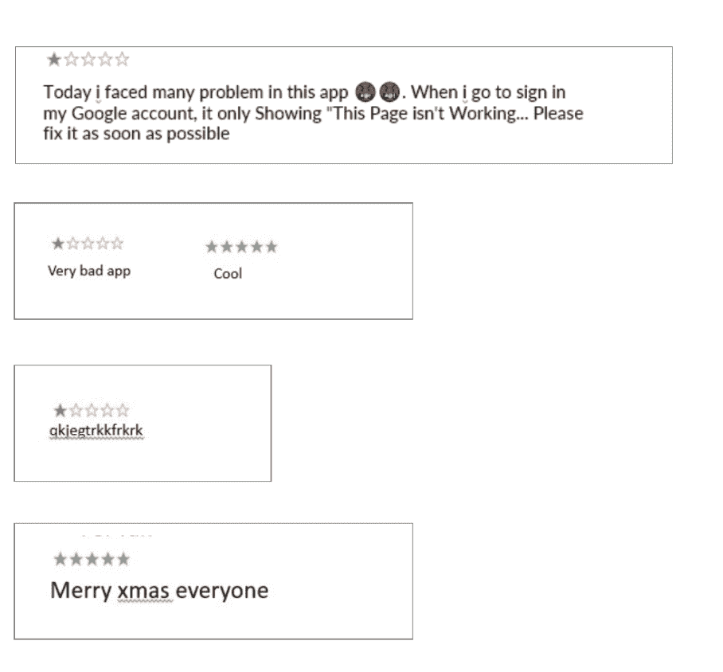
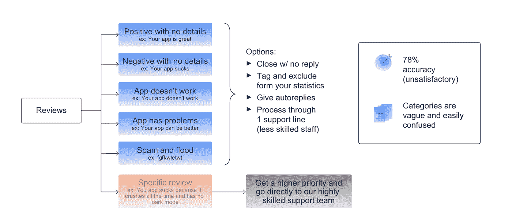
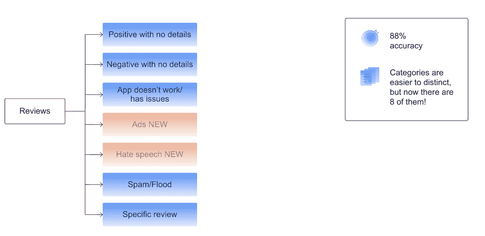
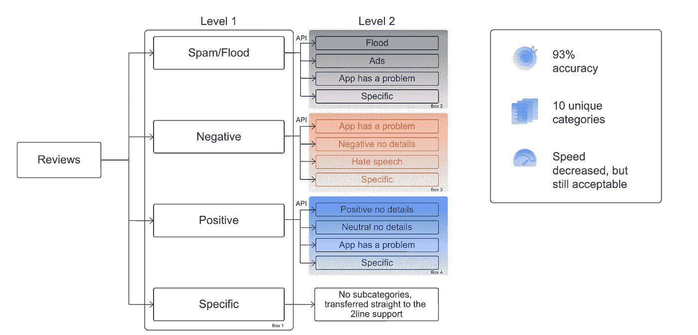
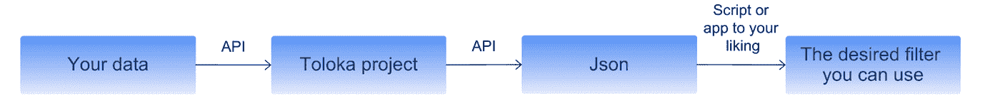

# 分类客户支持请求

> 原文：<https://towardsdatascience.com/categorizing-customer-support-requests-7c285a9cf974>

## 以及如何通过众包来实现

图片由[at ree23](https://pixabay.com/users/athree23-6195572/?utm_source=link-attribution&utm_medium=referral&utm_campaign=image&utm_content=3700116)来自 [Pixabay](https://pixabay.com/?utm_source=link-attribution&utm_medium=referral&utm_campaign=image&utm_content=3700116)

**简介**

如果你创造了一个成功的应用或产品，恭喜你！没几个人能走那么远。

现在是时候支持您的客户了。他们对你的产品有什么看法？他们是否报告了任何问题或错误？

你需要阅读每一篇评论来了解客户的需求吗？你是怎么看完一堆的呢？

在本文中，您将通过了解世界上最大的浏览器之一是如何做的，来学习如何使用众包来对客户支持请求进行分类。

**查看分类**

想象一下，一个月收到 15，000 条评论，并试图全部看完。最显而易见的解决方案是雇佣一个内部支持团队来阅读所有的邮件并尝试回复。但是这绝对不是最具成本效益的方法，也可能不是对支持团队时间的最佳利用。

作者照片

事实上，网上遇到的大约一半的评论并不需要你的团队的全部注意力，因为他们没有报告错误或者要求新的特性。

这意味着你可以将你的评论分为两类:非特定的和特定的。

非特异性评论通常表达情绪，但不会告诉你情绪背后的原因。一个例子是*“我不喜欢你的应用”。*

另一方面，具体的评论可能包含情绪，但最重要的是，它们给出了为什么会有这种感觉的具体原因。例如“*我不喜欢你的应用，它没有夜间模式”*。这些类型的评论值得转发给你的支持团队。

**初始解决方案**

那么，如何有效地过滤这两种类型的评论呢？你可以让另一个低层次的内部支持团队手动完成这项工作，或者用 ML 算法对评论进行自动分类。

在这种情况下，浏览器团队对他们的产品评论进行了实验，发现这两种解决方案仍然非常昂贵。第一个需要维持另一个内部团队，第二个需要大量数据来训练模型。

该团队最终决定尝试众包和 Toloka 的[现成解决方案](https://toloka.ai/ready-to-go/)。这是获得高质量标签数据的最简单方法，无需设计和维护实际的数据标签管道。这个过程包括上传数据，给出简单的指令，定义类，并为它们提供例子。

最初的方法是将审核分为六个不同的类别，其中只有一个类别涉及需要 rso 或支持团队进一步关注的特定审核。

其他五个类别旨在捕捉不同类型的非特定评论，例如

*   没有细节的正面评论
*   没有细节的负面评论
*   “应用程序不工作”评论
*   “应用程序有问题”评论
*   垃圾邮件

以这种方式分类的非特定评论可以收到专门为此评论类型设计的自动响应。

您可以在下图中看到该管道的示例。

第一条管道，作者照片

与以前的解决方案相比，最初的设计节省了资金，但没有产生预期的结果。标签的准确率只有 78%,而且分类模糊，容易混淆。

**第二条管道**

由于第一个管道的结果不令人满意，团队决定增加两个新类别:广告和仇恨言论。这是生成的管道的样子:

第二条管道，作者照片

添加两个新的类别将准确率从 78%提高到 88%,并且类别更容易区分。尽管第二条管道的结果令人满意，但该公司决定进一步改善结果。

**第三条管道**

第三条管道设计有两个等级。在第一阶段，群体注释者将评论标记为*正面、负面、垃圾或特定的*。具体的评论被直接传递给支持团队，所有其他评论被传递给下一个分类级别的人群。

如下图所示，每个类别在第二层都有自己的子类别。这导致整个管道中有四个不同的标签项目:一个项目在第一层，三个项目在第二层。

第三条管道，作者照片

第三种流水线设计导致了较慢的审查速度，但准确率显著提高，达到 93%。在这一阶段，解决方案是可以接受的，这是项目目前使用的最终管道。

**你的项目**

如果你想复制这个项目，以满足自己的需求，这是很容易做到的。

注释管道，作者照片

如前所述，您可以使用 Toloka 中的[现成解决方案](https://toloka.ai/ready-to-go/)来设置您的项目。然后你可以通过 [API](https://toloka.ai/docs/toloka-apps/api/concepts/quickstart-api.html) 上传数据。结果将以 JSON 文件的形式返回给您。

这种数据格式很容易用自动脚本来分析。例如，您可以使用脚本收集特定类别的所有评论，并向所有评论发送自动回复。

**总结**

在本文中，我们已经了解了如何使用众包来对产品评论进行分类。您已经看到了一些在浏览器评论分类环境中用于实验的管道。希望对你设计自己的类似项目的管道有所帮助。

如果你想了解这个项目的更多细节，请观看 Natasha 的这个[演示](https://www.youtube.com/watch?v=dlloWgAAjIA&t=43s)。如果你想了解更多关于数据标注管道的信息，请加入这个数据赋能社区

*PS:我正在 Medium 和*[***aboutdatablog.com***](https://www.aboutdatablog.com/)*上撰写深入浅出地解释基本数据科学概念的文章。你可以订阅我的* [***邮件列表***](https://medium.com/subscribe/@konkiewicz.m) *以便在我每次写新文章时得到通知。如果你还不是中等会员，你可以在这里加入***。**

*下面还有一些你可能喜欢的帖子*

* [## 用户生成内容的审核渠道

### 欧洲科技巨头如何利用 Toloka 的人群来调节其内容

towardsdatascience.com](/moderation-pipeline-for-user-generated-content-59e7f3c320e0)  [## 机器翻译系统中的人在回路

### 使用众包评估机器翻译质量

towardsdatascience.com](/human-in-the-loop-in-machine-translation-systems-bdf3fe82bfa3)  [## 如何成功将大型数据集添加到 Google Drive

### 并在谷歌实验室中使用它们…

towardsdatascience.com](/how-to-successfully-add-large-data-sets-to-google-drive-130beb320f1a)*