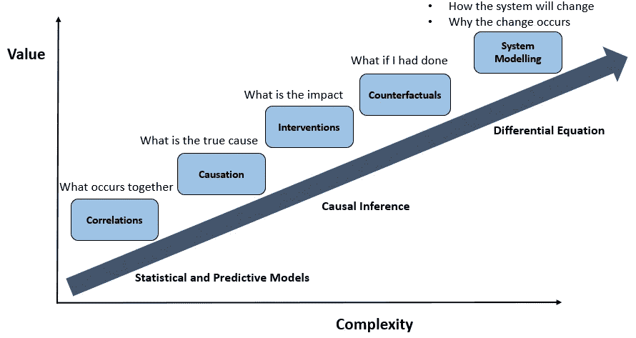
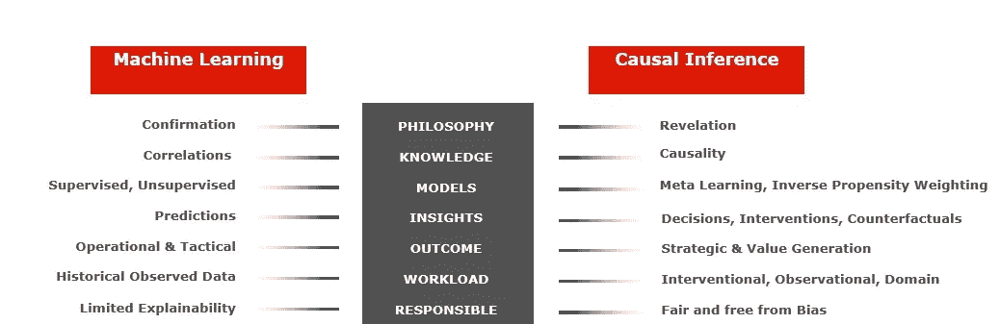
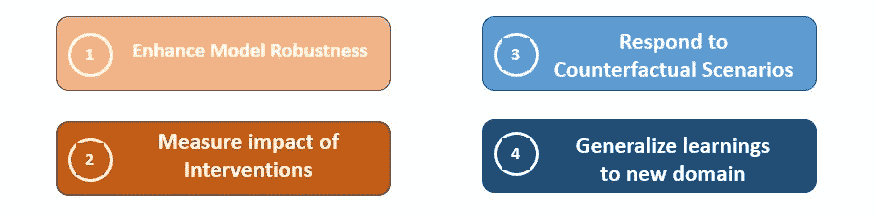
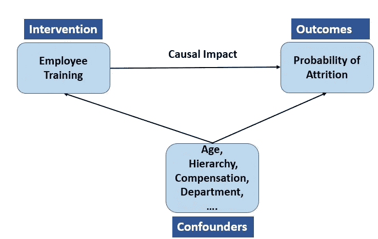
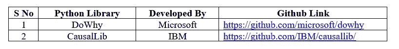

# 因果人工智能——支持数据驱动的决策

> 原文：<https://towardsdatascience.com/causal-ai-enabling-data-driven-decisions-d162f2a2f15e>

理解因果人工智能框架和算法如何支持决策任务，如估计干预的影响，反事实推理和重新利用以前在其他领域获得的知识。

来源:[https://pix abay . com/illustrations/ai-人工智能-sci-fi-7111802/](https://pixabay.com/illustrations/ai-artificial-intelligence-sci-fi-7111802/)

# 1.介绍

人工智能和机器学习解决方案在过去十年中取得了长足的进步，它们越来越依赖于根据历史数据生成预测。然而，在需要理解结果背后的实际原因、量化不同干预对最终结果的影响并做出政策决定、对尚未发生的情况进行假设分析和推理等任务上，它们未达到预期。

让我们考虑一个实际场景，以了解企业面临的决策挑战，以及当前的人工智能解决方案如何帮助解决这些挑战:

*   假设一家公司投资建立了一个员工流失模型，预测员工的离职倾向。在其他因素中，定期的业务培训、不断增加的沟通、员工认可被模型确定为影响最终结果的因素。

虽然生成模型预测和解释影响结果的关键特征是有帮助的，但它不允许做出决策。

为了便于决定减少流失所需的正确干预措施，我们需要回答以下问题:

*   如果公司决定进行干预并为员工组织定期的季度培训，对最终结果有什么影响？
*   我们如何比较不同的竞争性干预措施的影响，比如组织季度培训和安排定期的高层领导联系？

在这种情况下，后知后觉地理解不同行为的后果也会有很大的帮助。

*   “如果在过去 1 年中提供季度培训，离职倾向会是什么样的？

以上是一个反事实问题的例子，并且比估计干预更困难，因为要回答的数据没有被观察和记录。

更复杂决策的下一个层次需要理解系统将如何对外部刺激做出反应，以及为什么会发生变化。

来源:图片来自作者

企业如何获得上述问题的答案，从而做出真正的决策？

重要的是要认识到决策会对下游产生深远的影响，因此不仅需要了解系统为什么做出决策，还需要了解决策的影响，以及如何改进决策以实现更理想的结果。

# 2.通过现有方法进行决策

让我们探索一下，我们是否能够从监督机器学习和其他传统方法中获得上述问题的答案

## 2.1 有监督的机器学习有帮助吗？

我们的第一直觉可能是采用机器学习方法，从一组特征中预测结果，包括过去接受的培训、参加的会议等。。然而，这里有一个陷阱！

我们需要考虑到干预会改变观测数据中感兴趣变量的统计分布，并使建立模型所依据的基本假设无效。因此，由此产生的预测是不可靠的。

回答反事实问题可能比使用传统的 ML 回答干预性问题更加困难。这里的基本问题是模型从训练数据中学习，在这种情况下，回答反事实问题的数据没有被观察和测量。

## ***2.2 随机对照试验呢？***

你能想到的另一种方法是进行随机对照试验(也称为 A/B 测试)。长期以来，这些一直是衡量干预影响的黄金标准。

然而，在使用它们时会遇到一些实际挑战:

*   确保对照组和治疗组之间的随机分配并不总是可行的，并且组之间的系统差异会使结果产生偏差。
*   随机对照试验既昂贵又耗时
*   在许多情况下进行随机试验会产生伦理问题——让人们接受潜在有害的治疗是否道德？

## ***2.3 因果 AI 如何帮助解决挑战***

上述问题都是因果问题，与许多传统的机器学习任务不同，不能仅使用被动观察的数据和传统的机器学习算法来回答。基于因果推理原理的机器学习新方法为我们提供了一条充满希望的前进道路。

因果推断弥合了预测和决策之间的差距，并允许研究人员和程序设计人员模拟干预，并根据现有数据推断因果关系。

下图强调了机器学习和因果推理之间的主要区别。

来源:图片来自作者

***为什么因果艾***

与统计和传统的监督学习方法相比，因果人工智能具有明显的优势。

一些主要优势概述如下:

来源:图片来自作者

*   当基础数据发生变化时，因果模型仍然保持稳健，因此可以帮助将解决方案推广到看不见的数据
*   因果人工智能有助于衡量干预的影响，并且是非常有用的决策工具
*   因果模型还允许我们对我们以前没有见过的情况做出反应，并使解决方案能够计划不可预见的反事实情况
*   因果模型还允许人类将以前获得的知识推广到看不见的和不同的挑战

# 3.因果人工智能—快速概述

## ***3.1 基本概念***

因果推断能够在保持所有其他变量不变的情况下，从现实世界的观察数据中估计干预对某些结果的因果影响。

回到我们最初的场景，公司决定衡量干预的影响，比如投资员工的季度培训。雇员基础被分成两个治疗组；第 1 组是那些接受过培训的人，第 2 组由没有接受过任何培训的员工组成。

现在，在这种情况下，因果效应估计需要计算员工参加培训和不参加培训时的结果差异，保持其他变量不变。我们需要意识到只有一种结果是可能的，即员工是否参加培训。未被观察到的结果是反事实的。*因果推断方法采用各种假设，让我们估计不可观察的反事实结果*。

使因果推断问题具有挑战性的一些因素讨论如下:

*   混杂因素:混杂因素是一个影响治疗和结果的变量。从根本上说，如果治疗组和对照组之间除了治疗之外的其他方面有所不同，我们不能肯定地说在结果中观察到的任何差异仅仅是由于治疗。
*   **选择偏差**:当被观察群体的分布不代表该群体时发生，我们对计算因果效应感兴趣。如果我们在不处理选择偏差的情况下直接训练数据上的因果模型，则训练的模型在估计另一组中的单元的结果时效果不佳。
*   **测量治疗效果**:可以在人群(平均治疗效果)、治疗组、亚组(条件平均治疗效果(CATE))和个体水平(个体治疗效果(ITE))测量治疗效果。

来源:图片来自作者

## ***3.2 因果推理的方法***

因果推理有两种基本方法:

**I .潜在结果框架:**将已接受培训的个人的结果与未接受培训的情景进行比较。因此，对于每个接受过培训的员工，因果人工智能算法将在数据集中找到一个没有接受过培训但在其他重要方面(如年龄、经验、层级、部门、教育等)相同的个人。这种方法的局限性在于，它一次只能测试一种干预措施的影响

**二。因果图模型:**这种方法帮助我们将不同的因果路径映射到感兴趣的结果，并显示不同的变量如何相互关联。*一种广泛使用的方法是结构方程模型*，其中我们指定了可能相互作用的变量，它们可能如何相互作用，然后模型分析数据以揭示它们是否确实相互作用。这种模型的局限性在于它只测试特定变量之间的联系。*另一种因果图方法是因果贝叶斯网络*，它估计数据集中所有变量之间的关系。

这两种方法都使得用真实世界的数据来测试潜在干预的效果成为可能。使它们成为人工智能的是用于揭示大型数据集中因果模式的强大底层算法。

## ***3.3 因果推理算法***

因果推断由一系列方法组成，其核心是两种类型的估计方法:

*   **无混杂情况下的估计方法:**这里做的假设是我们在测量观察数据中的所有混杂变量。如果不是这样，那么结果会有一些偏差。匹配法和重新加权法是两种常用的估计方法。实施的关键主题是创建一个“伪群体”来解决由于治疗组和对照组的不同分布而带来的挑战。这是通过使用距离度量(匹配方法)找到最接近的匹配，对样本进行加权(反向倾向加权)来实现的。除此之外，其他估计方法包括元学习器、基于森林的估计器(非线性模型)等。
*   **准实验的估计方法:**在准实验中，预先存在的组已经接受了不同的处理，并且在组的创建中缺乏随机性。常用的方法包括简单的自然实验、工具变量(IV)和回归-不连续模型。

# **4。实际实施**

## ***4.1*** 开源 ***Python 库进行因果推断***

因果人工智能正在获得很大的吸引力，下面是我发现在进行因果分析时非常有帮助的两个 Python 库:

来源:图片来自作者

*   ***DoWhy —*** 是来自微软的 Python *l* 库，旨在激发因果思考和分析。它为因果推断提供了一个原则性的四步接口，重点是显式建模因果假设并尽可能地验证它们。更多关于图书馆的细节可以在 https://github.com/microsoft/dowhy[找到](https://github.com/microsoft/dowhy)
*   ***Causallib—***IBM 的库在统一的 scikit-learn 启发的 API 下提供了一套因果方法。它实现了元算法，允许插入任意复杂的机器学习模型。这种模块化方法支持高度灵活的因果建模。更多关于图书馆的细节可以在 https://github.com/IBM/causallib/[找到](https://github.com/IBM/causallib/)

## ***4.2 解决岗位培训干预挑战***

在研究论文[用实验数据评估培训项目的计量经济学评估](http://people.hbs.edu/nashraf/LaLonde_1986.pdf)中，讨论了测量工作培训对收入增长的因果影响的相关挑战。

*   使用 DoWhy 库解决上述问题:[https://Microsoft . github . io/DoWhy/example _ notebooks/DoWhy _ la londe _ example . html](https://microsoft.github.io/dowhy/example_notebooks/dowhy_lalonde_example.html)
*   使用 IBM Causallib 库的解决方案:[https://nb viewer . org/github/IBM/Causallib/blob/master/examples/la londe . ipynb](https://nbviewer.org/github/IBM/causallib/blob/master/examples/lalonde.ipynb)

# 5.前方道路

*   ***因果学习与机器学习的集成:*** 缺乏因果理解使得传统的机器学习解决方案很难对看不见的数据或当对环境进行干预时进行归纳。当从更少的数据中学习时，因果学习是有效的，对环境的任何变化都更鲁棒，并对没有观察到的数据的反事实场景做出响应。*目前正在进行大量结合机器学习机制和结构因果模型的研究工作。*
*   ***促进伦理和社会责任的 AI:*** *因果学习是其中一个关键的方法，研究人员正在利用它来开发社会责任的 AI。*它在指定社会类别干预的性质和时机、理解明确的因果假设、因果发现、中介分析和公平评估技术的含义方面发挥着关键作用。
*   ***下一代人工智能解决方案的开发:*** *因果模型正被用于重新利用以前获得的知识，以产生对新领域的洞察力*。一些前沿工作包括学习实时策略和应用学到的知识来概括不同的领域。*因果模型可以在加强防御敌对攻击方面发挥至关重要的作用*。*因果学习技术也正被用来帮助强化学习*的培训更有效，让他们从培训开始就做出明智的决定，而不是采取随机和不合理的行动。

# 6.参考

*   走向因果表征学习，[https://arxiv.org/pdf/2102.11107.pdf](https://arxiv.org/pdf/2102.11107.pdf)
*   机器学习的因果关系，[https://arxiv.org/abs/1911.10500](https://arxiv.org/abs/1911.10500)
*   因果推理，[https://medium . com/data-science-at-Microsoft/causal-Inference-part-2-of-3-understanding-the-fundamentals-816 f 4723 e54a](https://medium.com/data-science-at-microsoft/causal-inference-part-2-of-3-understanding-the-fundamentals-816f4723e54a)
*   道伊，[https://microsoft.github.io/dowhy/](https://microsoft.github.io/dowhy/)
*   https://github.com/IBM/causallib/

*免责声明:本文分享的观点是我个人的观点，不一定代表富达国际或任何关联方的观点。*