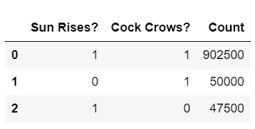
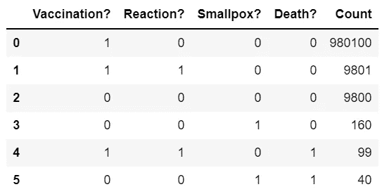
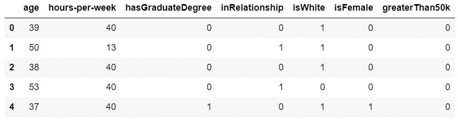
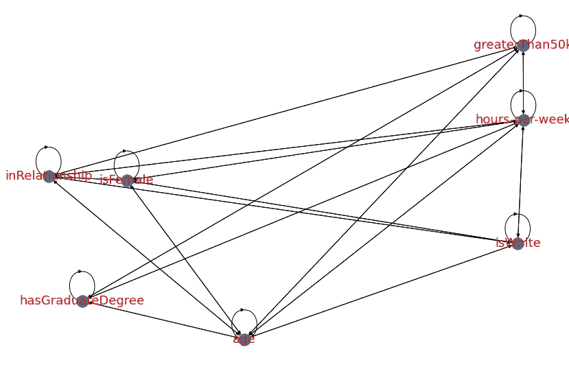
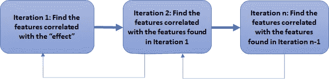
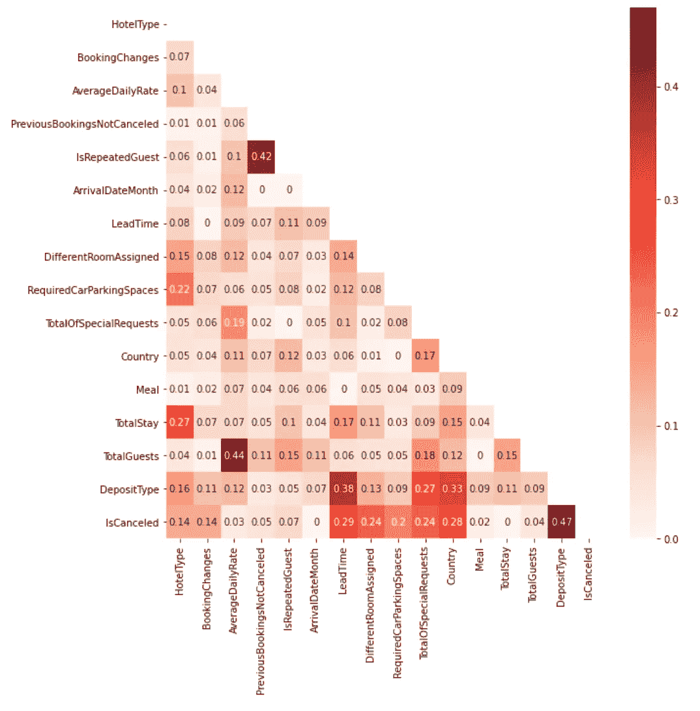
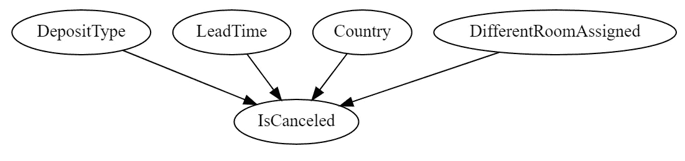
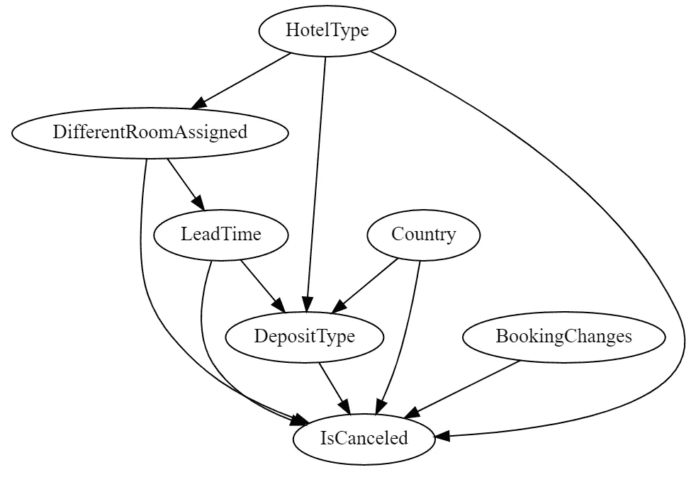
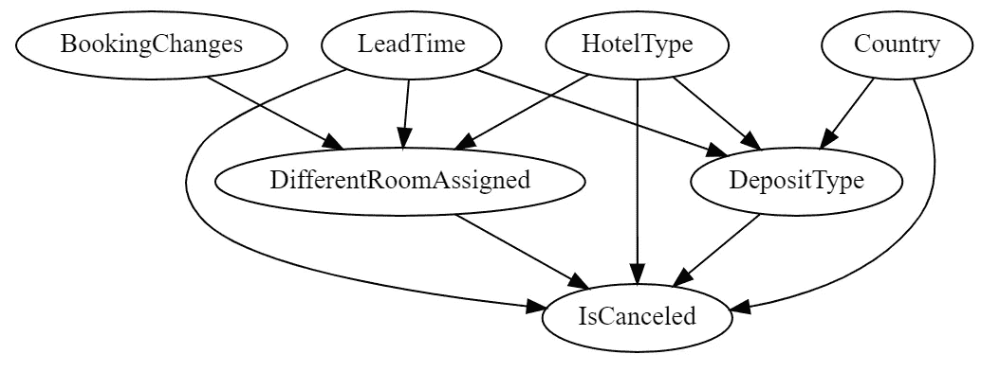
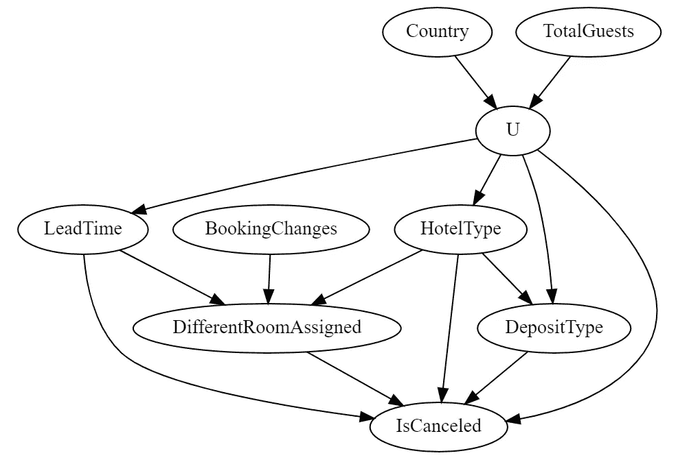

# 因果发现:小公鸡的啼叫会导致太阳升起吗？

> 原文：<https://towardsdatascience.com/causal-discovery-does-the-cockerel-crowing-cause-the-sun-to-rise-f4308453ecfa>

## 10 行 Python 代码来自动发现因果关系，你一定要看看


照片由[叶戈尔·迈兹尼克](https://unsplash.com/@vonshnauzer?utm_source=unsplash&utm_medium=referral&utm_content=creditCopyText)在 [Unsplash](https://unsplash.com/images/animals/chicken?utm_source=unsplash&utm_medium=referral&utm_content=creditCopyText) 上拍摄

# 介绍

我最近的研究重点是**因果推理**，这是由我收到的越来越多的客户要求我超越机器学习预测，回答“如果?”键入问题以推动影响和结果。

最初引起我兴趣的事情之一是——“因果图是如何构建的？”。在许多网上的例子中，它们似乎是在没有解释节点和链接是如何被识别的情况下完全形成的。

这让我读了朱迪亚·珀尔和达纳·麦肯齐的《为什么之书》(读了好几遍！)并且表达的一种观点是，你不能仅从数据逆向工程因果图，也称为有向无环图(DAG)。

数据可以揭示相关性，但不能揭示因果关系，那么怎么可能“发现”因果关系呢？

***注意:本文中的所有数据集都获得了公开使用的许可，有关所有来源和参考资料，请参见文章末尾的参考资料部分。***

**在我们深入因果发现之前，请考虑…**

[通过我的推荐链接](https://grahamharrison-86487.medium.com/membership)加入 Medium(如果你使用此链接注册，我将收取一定比例的费用)。

每当我发表新故事时，订阅一封免费电子邮件。

[快速浏览我之前的文章](https://grahamharrison-86487.medium.com/)。

[下载我的免费战略数据驱动决策框架](https://relentless-originator-3199.ck.page/5f4857fd12)。

访问我的数据科学网站— [数据博客](https://www.the-data-blog.co.uk/)。

# 从数据中可以建立因果关系吗？

考虑以下二进制数据集中的值计数…

***注:日出/小公鸡数据集是作者创作的合成数据，完整来源和参考详情请见文末参考资料部分。***



作者图片

我们可以看到，在 90.25%的观察中，公鸡在太阳升起时啼叫，但仅凭数据，我们如何知道是太阳升起导致公鸡啼叫，还是公鸡啼叫导致太阳升起？

当太阳没升起时小公鸡啼叫的次数和当太阳升起时小公鸡保持沉默的次数实际上是相同的(50，000 次对 47，500 次),所以通过比较相对数量的数据无法找到因果答案。

一种方法可以是着眼于时间方面。如果太阳总是在小公鸡打鸣之前升起，这将是一个很好的因果关系指示器，但是如果我们的小公鸡是一个早起的人呢？

答案是咨询领域专家。如果我们能召集一个由占星家、物理学家和家禽饲养者组成的团队，他们会得出结论:是太阳导致了公鸡啼叫，而不是相反！


费德里科·雷斯皮尼在 [Unsplash](https://unsplash.com/s/photos/sunrise?utm_source=unsplash&utm_medium=referral&utm_content=creditCopyText) 上的照片

# 那么图书馆能做些什么呢？

我没有被太阳升起和公鸡啼叫所吓倒，而是出发去寻找某种已经存在的东西，这种东西也许能够在数据的基础上发挥因果发现的魔力。

有一个叫“NOTEARS”的算法，确实号称可以实现因果发现，那我们就来试一试，看看它能做什么……

***注:天花数据集是作者创建的合成数据，完整来源和参考资料详情请见文末参考资料部分。***



作者图片

这个数据集正在模拟天花疫苗接种中的因果关系。让我们对它运行 NOTEARS 算法，看看它能做什么…

```
[('Reaction?', 'Vaccination?'),
 ('Smallpox?', 'Reaction?'),
 ('Death?', 'Reaction?'),
 ('Death?', 'Smallpox?')]
```

如果我们设想由 NOTEARS 产生的结果，它看起来会是这样的…


作者图片

看起来不太好，是吗？根据诺埃尔的说法，死亡会导致天花。时间相位告诉我们天花是最先出现的，所以它不可能是由死亡引起的。天花也不能引起反应(疫苗引起反应),反应当然不能引起疫苗接种。

利用领域专家的知识，我们可以很容易地确定疫苗接种对患者是否有反应以及他们是否继续发展疾病有因果关系，并且反应和天花都与死亡有因果联系…


作者图片

因此，我们已经确定，即使在非常简单的因果模型中，NOTEARS 因果发现算法也不会产生正确的结果。此外，我以前的一篇文章的读者指出，NOTEARS 在 Python 3.9 中不工作，当我准备升级时，这是另一个大问题。

如果你想了解更多关于笔记不适合因果关系的内容，这里有一篇优秀的学术论文——https://arxiv.org/pdf/2104.05441.pdf(Marcus Kaiser)和马克西姆·希波什(Andrew Smith)。

在我们放弃全自动因果发现之前，让我们来看看 NOTEARS 的一个替代方案，即“套索”算法

***注:人口普查收入/毕业生收入数据集被授权公开使用，请参见文章末尾的参考资料部分，了解完整的来源和参考资料详情。***



作者图片



作者图片

哦，亲爱的，套索是一场灾难！它已经预测到一切事物会引发其他事物，节点也会引发它们自己！

我最后的尝试是尝试 GES，GIES 和 LINGAM 算法，但这些都需要 R 库。我不使用 R，即使我成功地进行了正确的配置，我也永远无法创建其他数据科学家可以使用的可移植代码。

可用的因果发现库和算法不起作用，这强化了“为什么之书”中表达的观点，即因果关系不能仅从数据进行逆向工程。

这个结论促使我开发了自己的方法…


照片由[阿曼达·琼斯](https://unsplash.com/@amandagraphc?utm_source=unsplash&utm_medium=referral&utm_content=creditCopyText)在 [Unsplash](https://unsplash.com/s/photos/card-game?utm_source=unsplash&utm_medium=referral&utm_content=creditCopyText) 拍摄

坦白说，我还没有写因果发现算法。更确切地说，我的算法实现了一个扭曲的相关发现(没有双关语的意思！).

当我放弃因果发现库时，我仍然需要一种方法来可视化因果关系，作为与领域专家对话的起点。

我推断我可以很容易地计算特征/节点之间的相关性，这至少是一个好的起点。

我的想法如下——在因果发现模型中，我们通常识别“效果”,即我们感兴趣的数据特征(就像机器学习预测中的“目标”)。在天花的例子中，这是“死亡？”，在毕业生收入示例中是收入“大于 5 万”。

因此，如果任何特征和“效果”之间存在相关性，因果方向必须是从其他特征到效果，因为它在“线的末端”。

我的下一步是开发一个递归算法，可以如下所示…



作者图片

必须强制排除重复和双向链接。我还希望能够明确地包含或排除连接(边)以及明确地排除特征(节点)。

> 这是我实现因果发现的 10 行递归 Python 代码

# 行动中的解决方案

为了展示这个解决方案是如何工作的，我选择了一些关于酒店预订取消的数据。

让我们从读取数据开始，看一看相关性…

****



作者图片

发现算法的第一次运行涉及将迭代次数保持在 1，因此我们只是查看与“效果”的相关性(应该是因果关系),即酒店预订是否被取消…



作者图片

好了，这是一个不错的开始，让我们将迭代/递归/层数增加到 3，稍微调整一下相关阈值，看看我们会得到什么…


作者图片

好的，也不太坏，但是有点“忙”，所以下一步是排除一些我们怀疑可能会引起一些噪音的节点(注意:在真实的业务案例中，我们将在这个阶段与我们的领域专家交谈)。



作者图片

这开始变得更好看了。请记住，我的算法确信“被取消”的链接是因果的，因为它是“结果”，因此没有什么在它之后。

虽然树的其他层只是相关的，但箭头的方向是简单地根据算法发现它们的顺序添加的。

与领域专家合作(或者我自己在酒店预订方面的经验！)我注意到以下几点——

*   从“不同的预订”到“提前期”的链接方向是错误的，因为较长的预订提前期增加了客房预订发生变化的可能性，而不是相反。
*   “登记变更”和“不同的未分配”之间的相关性低于阈值，但它可能是一个重要的因果关系，因此需要包括在内。

下一次尝试指示算法进行这些修正-



作者图片

# 最后一次迭代:考虑“未观察到的混杂因素”

“未观察到的混杂因素”是我们认为通过提供一些节点之间的联系而影响我们的因果模型的一个因素，但尚未测量，因此未包括在图表中。

我去酒店的经历和我对酒店数据集的了解使我怀疑有一个“未观察到的混杂因素”影响着酒店数据。

数据中有两家酒店——一家“城市”酒店和一家“度假”酒店。这让我假设这个因果模型中未被观察到的混杂因素是**“住酒店的原因”**。

我的假设是，度假者主要住在度假酒店，商务人士和城市游客主要住在城市酒店。

此外，我假设这两组有不同的行为，这是“未观察到的混杂因素”(未观察到，因为数据没有捕捉到“停留的原因”)。

NOTEARS 和其他类似的算法不能解释“未观察到的混杂因素”,但是我开发的算法可以将它们考虑在内，方法是将它们明确地包括在内，如下所示…



作者图片

最终迭代的结果是酒店数据中的因果关系的一个可信的、可读的和可理解的可视化，我有信心与领域专家一起探索和提炼。这些都是重点…

*   有一个“未被观察到的混杂因素”是停留的主要原因(度假与商务/城市休息)。
*   “国家”对未被观察到的混杂因素有因果影响——那些从一些国家旅行的人更有可能是在度假。
*   这同样适用于“全部来宾”。大型聚会更有可能是度假，单身人士更有可能是商务旅行，单身人士更有可能是城市度假。
*   未观察到的“停留原因”对“交付周期”、“酒店类型”和“存款类型”有因果影响。
*   “交付时间”、“不同的订单”、“酒店类型”、“存款类型”和“停留原因”(U)都对“取消”有因果关系。

# 结论

**因果发现**是超越相关链接发现因果链接的过程(即箭头属于相关线的哪一端？).用像 NOTEARS 这样的算法来实现自动化是不可能的，或者至少是极其困难的，因为答案不仅仅存在于数据中。

然而，仍然迫切需要将因果关系可视化，以便领域专家可以对其进行探索，从而构建因果图(也称为有向无环图或 DAG)。

在这篇文章中，提出了一种基于增强关联发现的算法，该算法仅使用了 10 行 Python 代码，领域专家可以使用该代码来重复地改进敏感度(阈值)以及校正、添加或移除链接(箭头)并排除不相关的节点。

在未来的文章中，这些因果图将用于建立一个成熟的因果机器学习模型，可以回答复杂的“如果会怎样？”键入客户和企业领导的问题。

如果你喜欢这篇文章，请考虑…

[通过我的推荐链接](https://grahamharrison-86487.medium.com/membership)加入媒体(如果你使用这个链接注册，我将收取一定比例的费用)。

<https://grahamharrison-86487.medium.com/membership>  

[每当我发表一个新故事时，订阅一封免费电子邮件](https://grahamharrison-86487.medium.com/subscribe)。

[快速浏览我以前的文章](https://grahamharrison-86487.medium.com/)。

[下载我的免费战略数据驱动决策框架](https://relentless-originator-3199.ck.page/5f4857fd12)。

访问我的数据科学网站— [数据博客](https://www.the-data-blog.co.uk/)。

# 参考

## 日出/公鸡打鸣数据

*   来源:作者创建的综合数据
*   参考:[https://towardsdatascience . com/how-to-generate-synthetic-data-for-any-causal-inference-project-in-less-10-line of-code-158688 a 89349](/how-to-generate-synthetic-data-for-any-causal-inference-project-in-less-than-10-lines-of-code-158688a89349)
*   执照:[https://creativecommons.org/licenses/by/4.0/](https://creativecommons.org/licenses/by/4.0/)

## 天花数据

*   来源:作者创建的综合数据
*   参考:[https://towardsdatascience . com/how-to-generate-synthetic-data-for-any-causal-inference-project-in-less-10-line of-code-158688 a 89349](/how-to-generate-synthetic-data-for-any-causal-inference-project-in-less-than-10-lines-of-code-158688a89349)
*   执照:[https://creativecommons.org/licenses/by/4.0/](https://creativecommons.org/licenses/by/4.0/)

## 毕业生收入/人口普查收入数据

*   资料来源:https://archive.ics.uci.edu/ml/datasets/census+income
*   参考资料:Dua，d .和 Graff，C. (2019)。http://archive.ics.uci.edu/ml 的 UCI 机器学习库。加州欧文:加州大学信息与计算机科学学院。
*   许可:公共使用-[https://archive.ics.uci.edu/ml/citation_policy.html](https://archive.ics.uci.edu/ml/citation_policy.html)

## 酒店预订数据

*   来源:[https://www . science direct . com/science/article/pii/s 2352340918315191](https://www.sciencedirect.com/science/article/pii/S2352340918315191)
*   参考:安东尼奥，阿尔梅达和努内斯，2019
*   许可:在知识共享许可下的开放获取([https://creativecommons.org/licenses/by/4.0/](https://creativecommons.org/licenses/by/4.0/)