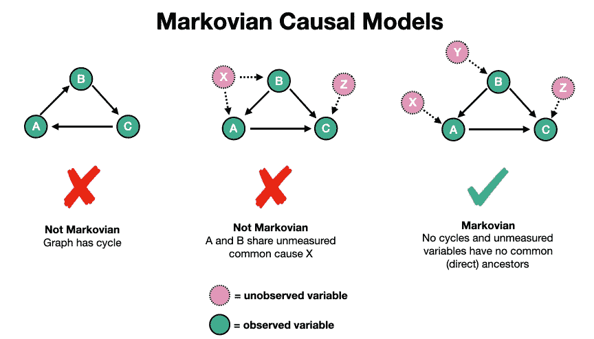
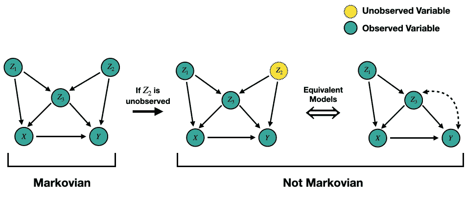
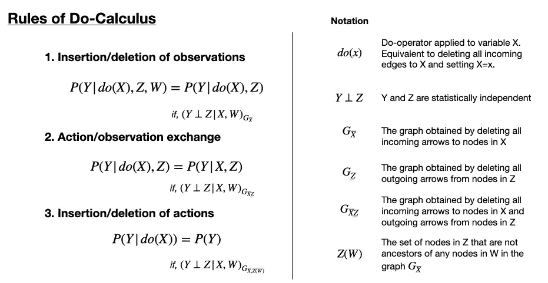
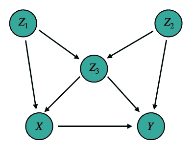
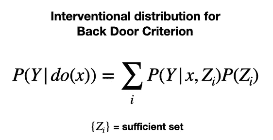
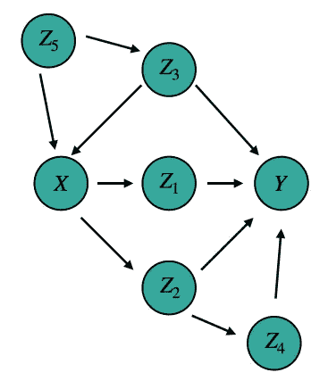
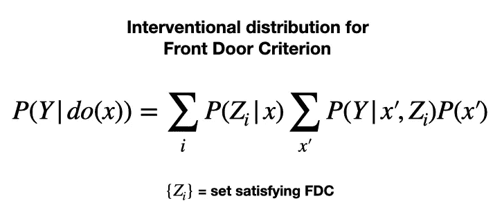
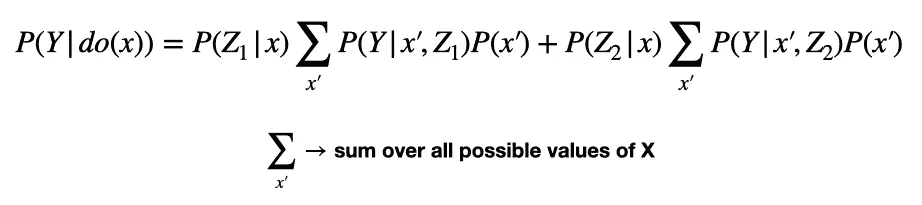

# 通过 Dag 的因果效应

> 原文：<https://towardsdatascience.com/causal-effects-via-dags-801df31da794>

## 打破后门和前门标准

这是关于[因果关系](https://shawhin.medium.com/understanding-causal-effects-37a054b2ec3b)系列的第四篇文章。在本系列的[上篇](https://medium.com/towards-data-science/causal-effects-via-the-do-operator-5415aefc834a)中，我们探讨了**可识别性**的问题。换句话说，*是否可以从给定的数据中评估因果关系？*在这里，我们看到了一个系统的三步过程，在一个观察到所有变量的因果模型中，表达任何因果效应。然而，当我们有了**不可测量的混杂因素**时，问题就变得有趣多了。在这篇文章中，我讨论了两个快速简单的评估因果关系的图形标准。

# **可识别性**

可识别性是因果分析中的一个中心问题，即*能否从给定的数据中评估因果效应？*在[之前的博客](https://medium.com/towards-data-science/causal-effects-via-the-do-operator-5415aefc834a) ***，*** 中，我们看到了一个系统的三步过程来回答这个所谓**马尔可夫因果模型**的问题。这些因果模型满足两个条件:1)没有循环，2)没有同时引起两个或更多变量的不可测量的噪声项。这类模型可以用一个**有向循环图**即 **DAG** 来表示。马尔可夫和非马尔可夫 Dag 的例子如下所示。

非马尔可夫和马尔可夫 Dag 的简单例子。图片作者。

马尔可夫条件很重要，因为它保证了可识别性。换句话说，**如果我们的因果模型是马尔可夫的，那么因果总是可识别的** [ [1](https://ftp.cs.ucla.edu/pub/stat_ser/R290-A.pdf) ， [2](https://www.ncbi.nlm.nih.gov/pmc/articles/PMC2836213/pdf/ijb1203.pdf) 。虽然这是一个强大的洞察力，但它也有局限性，因为我们可能对非马尔可夫的因果模型感兴趣。

例如，如果存在不可测量的混杂因素，马尔可夫模型可能变成非马尔可夫模型。我们在[之前的博客](https://medium.com/towards-data-science/causal-effects-via-the-do-operator-5415aefc834a)中看到了这样的例子。下图显示了相同的示例。

马尔可夫模型如何变成非马尔可夫模型的例子？图片作者。

我们从最左边的马尔可夫模型开始。然后假设吉米忘记打开 Z2 传感器，所以我们没有变量 Z2 的观测值。中间的模型描绘了这种情况。这里我们有一个未观察到的变量(Z2)和两个孩子(Z3 和 Y)。

我们可以通过从 DAG 中移除未观察到的变量并用双向边[ [1](https://ftp.cs.ucla.edu/pub/stat_ser/R290-A.pdf) ]连接它的两个子节点来等效地表示这种情况。直观上，双向边表示 Z3 和 Y 之间经由 Z2 的统计相关性，但是如果没有 Z2 的观察，这将在我们的数据中表现为两者之间的虚假关联。

注意，最右边的两个因果模型不是马尔可夫的。中间的一个有一个不可测量的噪声项，同时引起两个变量，最右边的一个有一个周期。**虽然这些模型不是马尔可夫模型，但是 X 对 Y 的因果关系确实是可以识别的**(稍后会详细介绍)。

  

# **微积分 3 法则**

在一般情况下，可识别性问题总是可以用 Do-Calculus 的**规则** [ [3](https://faculty.sites.iastate.edu/jtian/files/inline-files/tian-shpitser-2009.pdf) ， [4](http://arxiv.org/abs/1210.4852) 来回答。这些是我们可以用来操纵介入分布的 **3 条规则**——换句话说，用不包含 do 运算符的概率来表达包含 do 运算符的概率。

关键的一点是**这套规则是完整的**，也就是说如果不能用这 3 条规则建立可识别性，那么**因果关系是不可识别的**。

**Do 演算的规则** —给定 X、Y、Z 和 W 是因果模型 G 中任意不相交的变量集，Do 演算的规则如下所示。

Do-Calculus 的 3 个规则[ [4](http://arxiv.org/abs/1210.4852) ]。图片作者。

虽然这些规则简洁而完整，但这里有很多值得推敲的地方。例如，看规则 1，只有当 Y 和 Z 在通过删除所有到 x 中的节点的输入箭头而获得的图中条件独立时，我们才能忽略变量 W 的集合。

如果没有对这些规则和相关概念的强烈直觉，将它们应用到问题中可能会很慢并且很有挑战性。这就是两个快速简单的可识别性测试有所帮助的地方。

# **2 快速简单的图形标准**

虽然 Do-Calculus 的规则为我们提供了一套完整的评估因果效应的操作，但对于复杂的 Dag 来说，在实践中使用它们可能很困难。为了帮助解决这个困难，我们可以求助于两个评估可识别性的实用图形标准:后门标准(BDC)和前门标准(FDC)。

与 do-calculus 的规则不同，这些标准并不完整。这意味着即使他们不满意，因果关系仍然可以识别。然而，它们的关键用途是，在诉诸微积分规则之前，它们可以作为我们可以用来回答因果问题的实用测试。

## **1)后门准则**

后门标准(BDC)是一种相对快速和简单的测试，用于评估一组节点是否足以回答可识别性问题。换句话说，它告诉我们需要测量哪些变量来计算特定的因果效应。

在定义 BDC 之前，我们首先必须用两个关键概念武装自己:一个**后门路径**和**阻塞。**

两个节点(比如 X 和 Y)之间的**后门路径**是从指向 X 的箭头开始并在 Y[3](https://faculty.sites.iastate.edu/jtian/files/inline-files/tian-shpitser-2009.pdf)处终止的**任何路径。例如，下图中的这些都是后门路径。**

*   **X**-Z1->Z3->Y
*   **X**-Z1->Z3<-Z2->Y
*   **X**-Z3->Y
*   **X**-Z3<-Z2->Y

评估后门标准的 DAG 示例。图片作者。

注意，我们在构造后门路径时忽略了箭头(当然，指向 X 的除外)。后门路径背后的直觉是它们在两个变量[ [2](https://www.ncbi.nlm.nih.gov/pmc/articles/PMC2836213/pdf/ijb1203.pdf) ]之间进行虚假关联。

这里的第二个关键概念是**阻塞** [ [3](https://faculty.sites.iastate.edu/jtian/files/inline-files/tian-shpitser-2009.pdf) ]。当且仅当路径 p 被一组节点{Z_i}阻塞时，

1.  p 包含一个链 A -> B -> C 或者一个叉 A C，使得 B 是{Z_i} — *中的一个元素这就是我们可能直观地认为是阻塞的*
2.  p 包含一个对撞机(即一个倒叉)A-> B—{ Z _ I }中没有一个节点产生虚假的统计关联(伯克森悖论)

我们现在可以结合这些概念来定义后门标准[ [3](https://faculty.sites.iastate.edu/jtian/files/inline-files/tian-shpitser-2009.pdf) ]。

**后门准则—** 一组节点{Z_i}满足相对于(X，Y)的 BDC 如果

1.  没有节点是 X 的后代(即{Z_i}专门位于后门路径中)
2.  {Z_i}阻塞 X 和 Y 之间的所有后门路径

将 BDC 应用于上图，我们可以看到三组节点满足这个标准[ [2](https://www.ncbi.nlm.nih.gov/pmc/articles/PMC2836213/pdf/ijb1203.pdf) ]。

*   {Z1，Z3}
*   {Z2，Z3}
*   {Z1，Z2，Z3}

注意集合 **{Z3}不满足 BDC** ，因为它是一个碰撞器，因此不满足我们之前对阻塞的定义。

集合{Z1，Z3}、{Z2，Z3}和{Z1，Z2，Z3}称为**充分集合**(也是容许集合)。它们**告诉我们测量哪些变量**来计算 X 和 y 之间的无偏因果关系。只要满足 BDC，我们就可以使用以下等式来表示干预分布。

当满足后门标准时，用观察分布表示的介入分布。图片作者。

## **倾向评分方法说明**

我们在[早期博客](https://medium.com/towards-data-science/propensity-score-5c29c480130c)中看到的将后门标准与倾向得分(PS)方法联系起来的一个关键点是**当后门标准不满足** [ [2](https://www.ncbi.nlm.nih.gov/pmc/articles/PMC2836213/pdf/ijb1203.pdf) 时，倾向得分方法会失败。换句话说，如果用于得出倾向得分的变量不能构成一个足够的集合，它们可能会在因果效应估计中引入偏差。

虽然有人可能(天真地)认为 PS 模型中使用的变量越多越好，但这可能会适得其反。在某些情况下，如上述 DAG 中的变量 Z3，包含特定变量可能会增加倾向得分匹配偏差[ [2](https://www.ncbi.nlm.nih.gov/pmc/articles/PMC2836213/pdf/ijb1203.pdf) ]。

  

## **2)前门标准**

我们可以用来评估可识别性的另一个快速简单的测试是**前门标准****(FDC)**[3](https://faculty.sites.iastate.edu/jtian/files/inline-files/tian-shpitser-2009.pdf)。一组节点{Z_i}满足相对于(X，Y)的 FDC，如果

1.  {Z_i}截取从 X 到 Y 的所有有向路径
2.  从 X 到{Z_i}的所有后门路径都被空集阻塞
3.  从{Z_i}到 Y 的所有后门路径都被 X 阻塞

让我们看另一个例子。考虑下面的 DAG。

评估前门标准的 DAG 示例。图片作者。

我们可以先求一组满足**条件 1** 的变量。为此，我们列举了从 X 和 y 开始的所有有向路径。

*   X -> Z1 -> Y
*   X -> Z2 -> Y
*   X -> Z2 -> Y

由此，我们可以看到{Z1，Z2}满足条件 1。但是我们还没有完成。我们需要通过对照条件 2 和 3 来检查这个集合是否满足 FDC。

为了检查**条件 2，**我们需要查看从 X 到{Z1，Z2}中每个节点的所有后门路径。

**X 和 Z1**

*   X Y
*   X Z3 -> Y

**X 和 Z2**

*   xY
*   X Z3-> Y
*   X Z3-> Y

We can see that all **这些路径被阻塞**因为它们包含一个碰撞器 Y。

最后，我们通过查看{Z1，Z2}和 y 中每个变量之间的所有后门路径来检查**条件 3**

**Z1 和 Y**

*   Z1 Y
*   Z1 Z3 -> Y
*   Z1 Z2 -> Y
*   Z1 Z2 Y

**Z2 和 Y**

*   Z2 Y
*   Z2 Z3 -> Y
*   Z2 Z1 -> Y

事实上，我们看到所有这些路径都被 X 阻挡。因此，我们得出结论，为了估计 X 和 Y 的因果关系，我们只需要测量变量 X、Y、Z1 和 Z2。我们可以使用下面的等式来做到这一点，该等式根据观察分布(包括 X、Y、Z1 和 Z2)来表达介入分布 P(Y|do(x))

当满足前门标准时，用观察分布表示的介入分布。图片作者。

注意，对于{Z_i}中的每个变量，我们对变量 x 的所有可能值求和。

上面给出的 FDC 示例 DAG 的介入分布。图片作者。

# 关键点:

*   **可识别性**与回答以下问题有关:*能否从给定数据中评估因果关系？*
*   Do-Calculus 的 **3 规则**给了我们一套完整的运算来评估可识别性。
*   我们还可以通过两个快速简单的图形测试来评估可识别性:后门标准和前门标准。

## 下一步是什么？

    

# 资源

**更多关于因果关系** : [因果关系概述](https://shawhin.medium.com/understanding-causal-effects-37a054b2ec3b) | [因果关系:介绍](/causality-an-introduction-f8a3f6ac4c4a) | [因果推断](/causal-inference-962ae97cefda) | [因果发现](/causal-discovery-6858f9af6dcb)

**连接** : [我的网站](https://shawhint.github.io/) | [预定电话](https://calendly.com/shawhintalebi) | [邮件我](https://shawhint.github.io/connect.html)

**社交**:[YouTube](https://www.youtube.com/channel/UCa9gErQ9AE5jT2DZLjXBIdA)|[LinkedIn](https://www.linkedin.com/in/shawhintalebi/)|[Twitter](https://twitter.com/ShawhinT)

**支持** : [给我买杯咖啡](https://www.buymeacoffee.com/shawhint?source=about_page-------------------------------------) ☕️ | [成为会员](https://shawhin.medium.com/membership?source=about_page-------------------------------------) ⭐️

田，明珠(2002)。因果关系的一般识别条件。*第十八届全国人工智能会议论文集*。[www.aaai.org](http://www.aaai.org)

珀尔，J. (2010)。国际生物统计学杂志:因果推理导论。*《国际生物统计学杂志》*， *6* (2)，第 7 条。[https://doi.org/10.2202/1557-4679.1203](https://doi.org/10.2202/1557-4679.1203)

田，j .，&施皮瑟，I .(未注明)。*关于识别因果关系*。

珍珠杂志(2012)。重新审视微积分。*第二十八届人工智能不确定性会议论文集*，*8 月*，4–11 日。[http://arxiv.org/abs/1210.4852](http://arxiv.org/abs/1210.4852)

珀尔，J. (2009 年)。因果分析中的神话、困惑和科学。