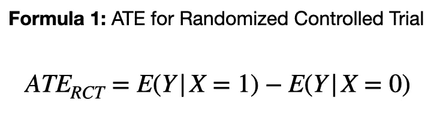
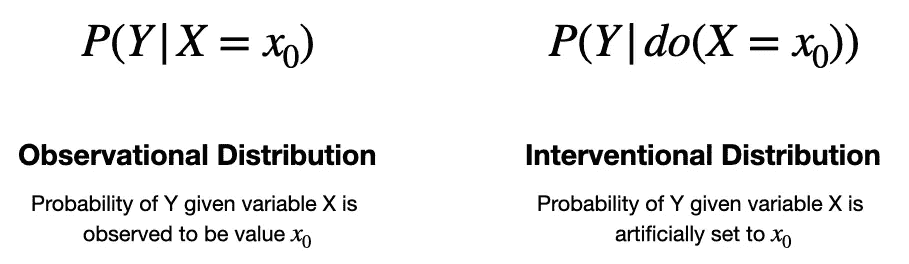
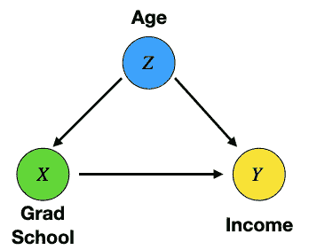
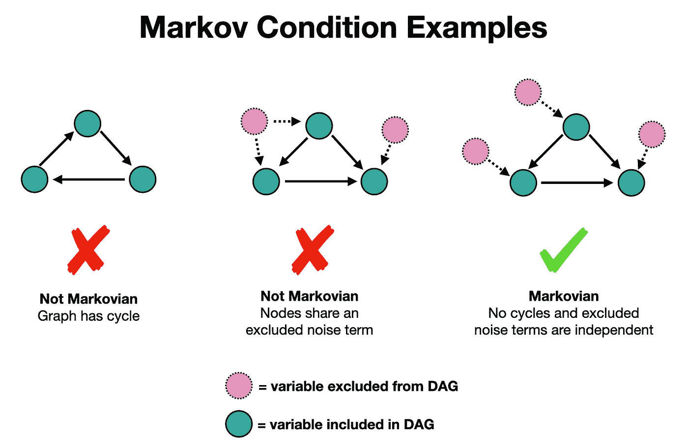
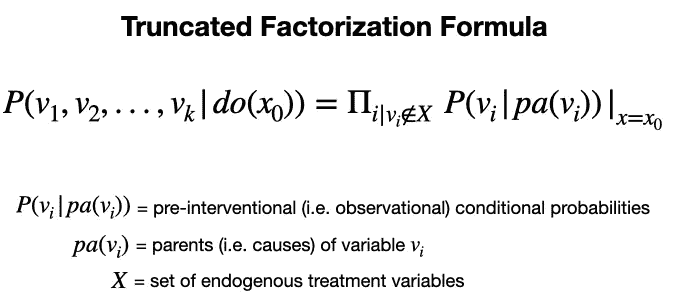
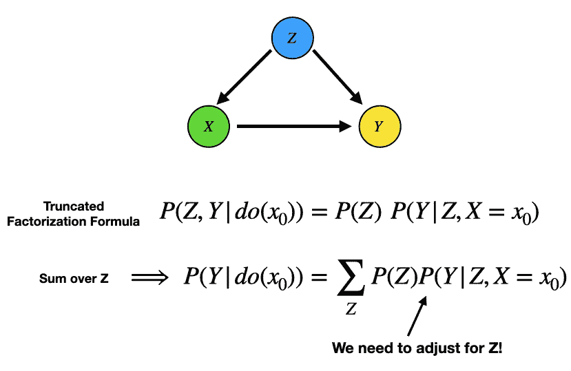
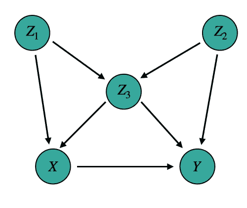
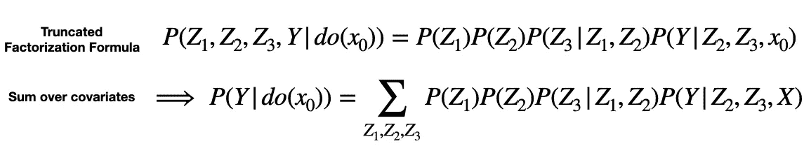
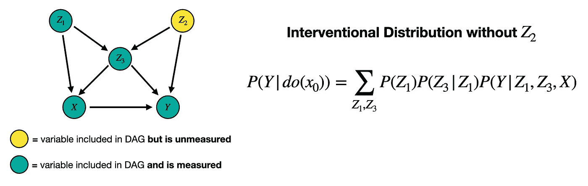
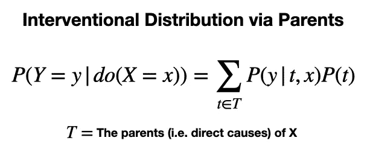

# 通过 Do 运算符的因果关系

> 原文：<https://towardsdatascience.com/causal-effects-via-the-do-operator-5415aefc834a>

## 将观察转化为干预

这是关于[因果关系](/causal-effects-f30f962ffff3)系列的第三篇文章。在[的上一篇文章](/propensity-score-5c29c480130c)中，我们回顾了一套通过倾向得分评估效果的实用方法。然而，这些方法的缺点是它们没有考虑到*不可测量的*混杂因素。在本文的结尾，我们将看到如何克服这个缺点。但是首先，我们需要后退一步，重新评估我们如何看待因果关系。

**要点:**

*   do 运算符是干预的数学表示
*   干预是对数据生成过程的有意操纵
*   使用珀尔的结构因果框架，我们可以使用观察数据来估计干预的效果

到目前为止，我们已经(在很大程度上)采用了一种经典的统计方法来计算因果关系。换句话说，我们将数据分成两个群体(如治疗组和对照组)并比较它们的平均值。然而，有一种更稳健的方式来思考问题。

因果关系大师朱迪亚·珀尔用他所谓的因果关系的**结构**方法来框定事物。这种方法的核心部分是所谓的 do 运算符。

我们首先在关于[因果推理](/causal-effects-f30f962ffff3)的文章中看到了 **do-operator** 。在那里，操作符被引入作为一个干预的**数学表示，使我们能够计算因果效应。在这里，我们将更详细地探讨这个概念。**

# **Do-Operator 的平均治疗效果**

在本系列的[第一篇](/causal-effects-f30f962ffff3)中，我们将随机对照试验的**平均治疗效果** **(ATE)定义为两个治疗水平之间预期结果的差异。换句话说，我们**根据治疗状态**(例如是否服药)比较结果变量**(例如是否头痛)**的期望值。这是最广泛使用的量化因果关系的方法之一。**

公式 1:随机对照试验的平均治疗效果[ [2](https://www.ncbi.nlm.nih.gov/pmc/articles/PMC3144483/) ]。图片作者。

或者，Pearl 公式中的**ATE**被定义为两个干预水平 [ [1](https://www.ncbi.nlm.nih.gov/pmc/articles/PMC2836213/pdf/ijb1203.pdf) 之间预期结果的**差异。这就是 do 运算符的用武之地。**

公式 2:根据 do 运算符[ [1](https://www.ncbi.nlm.nih.gov/pmc/articles/PMC2836213/pdf/ijb1203.pdf) ]的平均治疗效果。图片作者。

## **观察分布与干预分布**

P(Y | X=x))和 P(Y | do(X=x)) 之间的**关键区别在于，第一个具体说明了给定 X=x 的*被动* *观察*时 Y 的概率，而后者表示给定 X 的*干预*时 Y 的概率。**

这里，我将包含 do 算子的分布称为**介入分布**(例如 P(Y | do(X = 1))；而不包含 do 算子的分布称为**观察分布**。*注:这类似于* [*上一篇博客*](/propensity-score-5c29c480130c) *中对观察性研究和介入性研究的区分。*

观察分布与干预分布的比较。图片作者。

## **公式 1 对公式 2**

在随机对照试验(RCT)中，配方 1 和配方 2 是等效的。因为治疗任务是由实验者有意地(小心地)操纵的。然而，一旦我们将**移到 RCT** (或类似的东西)之外，**公式 1 不再有效，**，**但公式 2 有效。**

这样，**我们可以把公式 2 看成是公式 1** 的推广。这个新的公式为我们提供了一个更清晰的因果关系图。它有助于我们从特定环境下的特定等式转移到一个更通用(更强大)的框架。在下一节中，我们将看到这一公式在实践中的威力。

# **可识别性**

> **分三步连接观察和干预分布**

虽然理论和抽象可能会有所帮助，但在某些时候，我们需要将它们与现实(即我们的数据)联系起来。在因果关系的背景下，这提出了**可识别性**的问题。换句话说， ***能否从给定的数据中得出介入分布？****[1](https://www.ncbi.nlm.nih.gov/pmc/articles/PMC2836213/pdf/ijb1203.pdf)*

*正如我前面提到的，如果我们有来自介入性研究(例如 RCT)的数据，我们确实有介入性分布(这是我们精心测量的)。*但是如果我们只有观测数据呢？**

*幸运的是，这个问题已经被 Pearl 和他的同事解决了。该解决方案可以分解为 **3 个步骤**。*

## ***步骤 1——写下一个因果模型***

*因果模型在之前关于[因果关系](/causality-an-introduction-f8a3f6ac4c4a)的系列文章中介绍过。一个简单的因果模型可以用一个叫做**有向无环图(DAG)** 的东西来表示，其中**通过点和箭头**来描绘变量之间的因果联系，其中 A → B 表示 A 导致 B*

*我们在本系列的[最后一篇文章](/propensity-score-5c29c480130c)中看到了类似下图的 DAG 示例。注意，我们没有(或不需要)连接的细节(即变量之间的函数关系)，只有什么导致什么。*

**

*代表年龄、毕业学校和收入之间因果关系的 DAG 示例。图片作者。*

## ***步骤 2——评估马尔可夫条件***

*一旦我们有了 DAG，我们就可以评估保证可识别性的条件。这被称为**马尔可夫条件**，如果满足，因果关系是可以识别的。这意味着我们可以从观测数据中计算公式 2(不需要 RCT！).*

*马尔可夫条件有**两部分**。**一个**，图一定是无环的，所有 Dag 都是如此(那就是“A”代表的意思)。和**两个**，所有噪声项共同独立。这第二点的意思是没有从 DAG 中排除的变量同时引起任何两个变量。下面给出了满足/违反这一要求的一些例子。*

**

*满足和违反马尔可夫条件的简单例子。图片作者。*

## ***步骤 3——将**观察结果**转化为干预措施***

*如果我们确认我们的 DAG 是马尔可夫的(即满足马尔可夫条件)，我们可以使用下面给出的**截断因子分解公式**通过观察值来**表达任何介入分布。***

**

*截断因式分解公式[ [1](https://www.ncbi.nlm.nih.gov/pmc/articles/PMC2836213/pdf/ijb1203.pdf) ]。图片作者。*

*为了隔离 LHS 分布中的治疗和结果变量，我们可以对协变量(即所有其他变量)求和。例如，在来自[最后一篇博客](/propensity-score-5c29c480130c)的简单 DAG 中，过程如下。*

**

*通过截断因子分解公式根据观察数据表达介入分布 P(Y|do(x0))的简单示例。图片作者。*

*从上面的例子中我们可以看到，对于给定的 DAG，我们必须针对协变量 z 进行调整。这是我们在[因果推断](/causal-inference-962ae97cefda)的帖子中(直观地)所做的。然而，这里我们*从截断因式分解公式中推导出*这个结果，而不是依靠直觉。*

*这三个步骤为我们提供了一个从观察数据中计算因果关系的系统方法。使我们能够做到这一点的关键是一个满足马尔可夫条件的因果模型。我们可以把这个过程更进一步，用它来处理不可测量的混杂因素的问题。*

# ***应对不可测量的混杂因素***

*数据收集的一个问题是变量有时很难甚至不可能测量。这就提出了**不可测量的混杂因素**的问题，即**变量使我们对因果效应的估计产生偏差，而我们没有**的数据。再次幸运的是，这个结构性的因果框架对这个问题有一个解决方案。*

*我们通过珀尔[1](https://www.ncbi.nlm.nih.gov/pmc/articles/PMC2836213/pdf/ijb1203.pdf)引言中的一个例子来探讨不可测量混杂因素的问题。假设我们有下面的马尔可夫因果模型。*

**

*更复杂的马尔可夫因果模型来自[ [1](https://www.ncbi.nlm.nih.gov/pmc/articles/PMC2836213/pdf/ijb1203.pdf) ]。图片作者。*

*然后，正如我们之前所做的，我们可以通过截断因式分解公式和协变量求和来写下介入分布 P(Y | do(X=x0))。下图给出了代数。*

**

*经由截断因子分解公式[ [1](https://www.ncbi.nlm.nih.gov/pmc/articles/PMC2836213/pdf/ijb1203.pdf) ]根据观察数据表达介入分布 P(Y|do(x0))的更复杂的例子。图片作者。*

*但是现在**假设 Z_2 很难(或者不可能)测量**。*我们如何用我们的数据计算上面的估计值？*这确实是可能的，结果如下。*

**

*应对不可测混杂因素 Z_2 [ [1](https://www.ncbi.nlm.nih.gov/pmc/articles/PMC2836213/pdf/ijb1203.pdf) ]。图片作者。*

*虽然这最后一步看起来很神奇，但它来自下面的等式。*

**

*仅针对 X [ [1](https://www.ncbi.nlm.nih.gov/pmc/articles/PMC2836213/pdf/ijb1203.pdf) ]的直接原因进行调整的介入分布的表达式。图片作者。*

*这里的关键点是我们只需要测量 X 的双亲来估计它的因果效应。使该表达式有效的是马尔可夫条件，该条件要求任何变量(当以其父变量为条件时)独立于其非后代变量。*

*换句话说，通过对 Z_1 和 Z_3 进行调节，我们阻断了 X 和 Z_2 之间的统计相关性。在本系列的[下一篇博客](https://medium.com/towards-data-science/causal-effects-via-dags-801df31da794) 中，我们将探索截断因式分解公式的其他可能的简化。*

* [## 通过 Dag 的因果效应

### 估计因果效应的两个图形标准

towardsdatascience.com](/causal-effects-via-dags-801df31da794) 

## 如何使用倾向得分

回到本系列的[上一篇文章](/propensity-score-5c29c480130c)，我们可以利用我们在这里学到的知识**通过倾向得分**来改进我们对因果效应的估计。为了生成倾向评分，我们采用一组受试者特征(即协变量)，并使用它们通过例如逻辑回归[ [2](https://www.ncbi.nlm.nih.gov/pmc/articles/PMC3144483/) ]来预测治疗状态。然而，选择正确的协变量不是一个微不足道的步骤。

我们可以克服这个挑战的一个方法是**在倾向得分模型**中只包括 X 的父母。因此，如果我们花时间为我们的问题写下一个因果模型，我们就能以一种直接的方式挑选出协变量。例如，在上面的 DAG 中，我们将只在我们的倾向得分模型中包括 Z_1 和 Z_3，即使 Z_2 被测量。

 [## 通过倾向得分的因果效应

### 如何估计观测数据的影响

towardsdatascience.com](/propensity-score-5c29c480130c) 

## **替代协变量选择**

虽然只需要解释 X 的直接原因是一个强大的洞察力，*如果 X 的父母是不可测量的呢？*

这促使人们寻找替代的协变量来表达我们的介入分布。本系列的[下一篇文章](https://medium.com/towards-data-science/causal-effects-via-dags-801df31da794)将会这样做，并通过 DAGs 讨论**因果关系。**

# 资源

**更多关于因果关系** : [因果关系概述](https://shawhin.medium.com/understanding-causal-effects-37a054b2ec3b) | [因果关系:简介](/causality-an-introduction-f8a3f6ac4c4a) | [因果推断](/causal-inference-962ae97cefda) | [因果发现](/causal-discovery-6858f9af6dcb)

**连接** : [我的网站](https://shawhint.github.io/) | [预定电话](https://calendly.com/shawhintalebi) | [邮件我](https://shawhint.github.io/connect.html)

**社交**:[YouTube](https://www.youtube.com/channel/UCa9gErQ9AE5jT2DZLjXBIdA)|[LinkedIn](https://www.linkedin.com/in/shawhintalebi/)|[Twitter](https://twitter.com/ShawhinT)

**支持** : [给我买杯咖啡](https://www.buymeacoffee.com/shawhint?source=about_page-------------------------------------) ☕️ | [成为会员](https://shawhin.medium.com/membership?source=about_page-------------------------------------) ⭐️

 [## 通过我的推荐链接加入媒体——肖文·塔莱比

### ⭐️成为会员使用我的推荐链接，并获得充分的媒体上的每一篇文章。您的会员费直接…

shawhin.medium.com](https://shawhin.medium.com/membership) 

【1】[朱迪亚·珀尔](https://www.ncbi.nlm.nih.gov/pmc/articles/PMC2836213/pdf/ijb1203.pdf)因果推理导论

[2] [减少观察性研究中混杂效应的倾向评分方法简介](https://www.ncbi.nlm.nih.gov/pmc/articles/PMC3144483/)作者 Peter C. Austin*