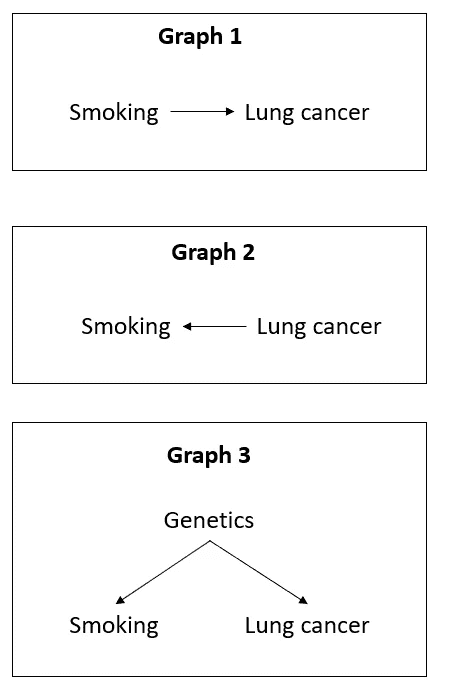
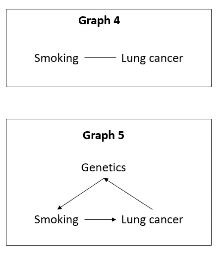
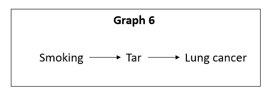
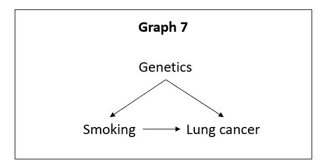
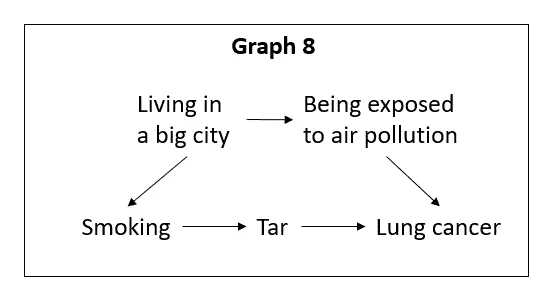

# 因果推理:综述

> 原文：<https://towardsdatascience.com/causal-inference-an-overview-736efdfe01c4>

劳拉·奥克尔在 [Unsplash](https://unsplash.com?utm_source=medium&utm_medium=referral) 上的照片

## 找出相关性实际上意味着因果关系的时候

# 因果关系比相关性更能提供信息

首先，我们为什么要费心研究因果关系？相关性不足以进行预测吗？难道机器学习没有让因果关系的研究变得毫无意义吗？不完全是。

很多时候，我们对这种关系感兴趣:“如果我**做 X** ，那么 Y 就会发生”，这和“如果 **X 发生**，那么 Y 就会发生”是不一样的。区别在于，在第一种情况下，我们实际上是在强迫 X 发生，而在第二种情况下，X 是自发发生的。这可能看起来很无聊，但却很重要。当我们想研究第一种关系时，因果关系是最重要的。

例如，在市场营销中，这将帮助我们隔离特定活动对目标客户的影响，消除任何潜在的选择偏差。

# 随机对照试验是衡量因果关系的黄金标准

推断因果关系的最佳方法是通过*随机对照试验* (RCTs)。在我们的营销活动示例中，这可以通过**随机**将我们的人口分成两组来实现:一组将接受活动(A 组)，另一组不接受(B 组)。这或多或少是新药测试的方式。

在一个理想的世界中，我们将总是使用 RCT，并从这些研究中获得许多有价值的见解。实际上，这并不总是可能的，原因有很多:RCT 可能太昂贵，太难执行，花费太多时间，甚至不道德。

以吸烟为例。你认为运行 RCT 来测试它是否真的导致肺癌有多容易？要做到这一点，你必须让一群人吸烟很多年。尽管至少从 1912 年就已经观察到了吸烟和肺癌之间的相关性，但直到 20 世纪 60 年代才确立了因果关系。烟草业当时花了很大力气来否认这种关系，声称可能正好相反(肺癌会让你渴望吸烟)或者可能有某种遗传因素使人们更容易患肺癌和吸烟。

证明他们是错的特别困难，因为 RCT 是不可能的，所以科学家们不得不使用其他的变通方法，而且我们今天所知道的因果推理在当时并没有得到很好的研究。

这就是为什么我们经常进行观察性研究:它们通常更容易进行，尽管以后更难利用。因果推断是一个最近的研究领域，还有很多正在开发中，但如果我们愿意做出一些假设，已经有足够的技术允许我们从那些观察性研究中推断因果关系。

在我们研究这些技术之前，让我们先了解一些有用的基本概念和定义。

# 有用的概念:为因果推理奠定基础

## 有向无环图

DAG 是一组**节点**，由方向**边**(箭头)链接，不形成**循环**。

让我们看几个 Dag 的例子(以及一些不是 Dag 的图):

作者图片

上图都是 Dag 的例子，箭头表示因果关系。在图表 1 中，我们说**吸烟导致肺癌**。在图表 2 中，我们说**肺癌导致吸烟**。在图 3 中，我们说**遗传导致了吸烟和肺癌**。

现在，让我们来看一些不是 Dag 的图形:

作者图片

图 4 不是 DAG，因为它不是**指向的**:我们无法判断**是什么导致了**什么。图 5 不是 DAG，因为它是循环的:3 个箭头在 3 个节点之间构成了一个循环的 T21。

这是因果推断需要掌握的最基本的概念，因为它将被用来直观地表示任何因果假设。

## 调解人

知道因果关系的存在只是成功的一半。真正重要的是确定为什么一件事会引起另一件事。

如果你能找出某种疾病是由某种东西引起的，那将使预防和找到治疗方法变得容易得多。

一个*中介*是一个变量，告诉我们为什么一个因素会导致一个特定的结果。

作者图片

上面的例子说明了这一点。不是说吸烟直接导致癌症，我们现在知道吸烟导致焦油在肺部积累，然后导致癌症。

## 混杂因素

混杂因素是既影响我们视为原因的变量，又影响我们视为结果的变量。

例如，图 3 中的基因会影响吸烟和肺癌。

控制混杂因素的一种方法是引入随机化，但正如我们前面看到的，随机化并不总是可行的。另一种方法是只比较各组中基因相似的人(吸烟者和非吸烟者)。

## 后门小路

后门路径是从可能的因果来源到结果的非因果路径。在下图中，假设是遗传导致了吸烟和肺癌。

作者图片

如果我们对吸烟对肺癌的因果影响感兴趣，我们只对它们之间的因果路径感兴趣。路径“吸烟”←“遗传”→“肺癌”是一条后门路径，在这个意义上，除了它们的因果关系之外，它还会在吸烟和肺癌之间产生相关性。通过控制遗传因素(我们将在后面看到如何控制)，这条路径可以被因果推理“阻断”。

## 对撞机

如果我们对**遗传和吸烟**之间的因果关系感兴趣，图 7 中的肺癌就是一个对撞机的例子:它是两者的原因，所以我们有两个来自两者的箭头。在这种情况下，该路径已经被“阻断”,因此，如果我们控制了肺癌，我们将“疏通”它。这就是为什么理解因果模型很重要，而不是仅仅控制每一个可能的变量。

## 向前切进

可以想象，前门路径是两个变量之间的因果路径。在图 7 中，这将是吸烟和肺癌之间的箭头。在图 6 中，是它们之间的完整路径，包括“Tar”。

## 工具变量

一个影响治疗的变量，但不通过治疗以外的任何其他方式影响结果。它可用于“两阶段最小二乘法”(见下文)。

## 总是接受者、顺从者、反抗者和从不接受者

如果我们将工具变量视为治疗的鼓励或阻碍，那么我们可以定义 4 类人:**总是接受者**将总是接受治疗，不管鼓励与否；**编者**会一直遵从鼓励(每次我们鼓励他们接受治疗，他们就接受)；挑衅者总是做与我们告诉他们的相反的事情；从不接受治疗的人永远不会接受治疗，不管我们是否鼓励他们。

# RCT 的替代品

## d-分离

到目前为止，我们一直在看简单的因果模型，只有几个变量。然而在现实中，事情通常会更复杂。将有多条路径连接 2 个变量，经过多个变量。以下面的例子为例(这个例子仍然很简单):

作者图片

我们看到，生活在大城市会让你更容易吸烟，但也会让你暴露在空气污染中，这可能会导致肺癌。由于我们对吸烟对肺癌的因果关系感兴趣，“生活在大城市”在这里是一个混杂因素。在这种情况下我们能做什么？我们可以“阻断”吸烟和肺癌之间通过“生活在大城市”的后门路径。

如果我们**控制路径上的非碰撞器**或者**不控制碰撞器**，则路径被阻塞。正如我们之前看到的，如果我们控制一个处于后门路径的对撞机，我们最终会“解锁”这条路径。

## 相称的

从观察数据中，我们通过找到最相似的匹配，将接受治疗的观察结果与未接受治疗的观察结果进行匹配。这将产生两组*治疗组*和*对照组*。根据您的匹配方式，这些组可以有不同的大小。

您可以评估匹配前后两组之间每个协变量的“**标准化均值差异**”(SMD)，以确保它们是相似的。你可以通过计算每组的每个独立变量的平均值，然后计算两组之间的差值，然后用该差值除以变量的标准偏差。这会给你显示两组有多大不同的比例数字。如果它们都低于 0.1 或 0.2，则匹配充分平衡。

一种匹配方式是使用**倾向得分匹配**:

1.  计算倾向得分(给定协变量，使用逻辑回归等模型，计算**治疗**的概率)
2.  通过一起绘制两组的两个评分分布，检查治疗组和未治疗组之间的倾向评分重叠。理想情况下，应该有很多重叠
3.  基于该分数匹配相似的观察结果。我们假设有相似治疗倾向的两个观察结果是相似的
4.  使用 SMD 检查协变量不平衡

一旦你有了两个匹配的组，你就可以对它们进行测试，例如使用 McNemar 测试。

几个能做到这一点的 R 包有: *matchit* (它做贪婪匹配，比较快，但不是最优的) *optmatch* 和 *rc balance* (最优，但慢)。

## 治疗加权的逆概率(IPTW)

给定我们想要控制的一组变量，通过获得他们实际获得的治疗(治疗或控制)的逆概率对个体进行加权。如何做:

1.  估计倾向得分(如上所示)
2.  创建权重:治疗受试者的 *1 /倾向得分*，未治疗受试者的*1/(1-倾向得分)*
3.  指定感兴趣的边际结构模型(MSM )(人口水平模型，独立于协变量 X)
4.  使用软件拟合广义线性模型
5.  使用渐近(三明治)方差估计器(或 bootstrapping)来说明伪总体可能大于样本量的事实(大多数软件会自动这样做)

## 两阶段最小二乘法

1.  在 Z(工具变量)和协变量 X 上回归 A(处理)
2.  在β(步骤 1 的结果)上回归 Y(结果)和协变量 X

在步骤 2 中获得的β的回归系数是估计的因果效应。

*ivreg* ，来自 *ivpack* (在 R 中)，在一个函数中完成这两个步骤。

**敏感性分析**可以在这里针对两个假设进行:

*   排除限制:如果 Z 直接影响 Y 一个量 *p* ，我的结论会改变吗？变化 *p* 。
*   单调性:如果违抗者的比例是 *i* ，我的结论会改变吗？

有关如何进行这些敏感性分析的更多细节，您可以查看生物统计学中的[本教程。](https://www.ncbi.nlm.nih.gov/pmc/articles/PMC4201653/#S32title)

# 更进一步

如果你真的对因果推断很认真，我推荐以下资源:

朱迪亚·珀尔(Judea Pearl)和达纳·麦肯齐(Dana Mackenzie)写的《为什么》这本书可能是一个很好的开始，它会给你一个关于 Dag 以及如何操纵它们进行因果推理的强烈直觉。

 [## 为什么之书:因果的新科学

### 诺特/5。原因之书:新的因果科学和股票市场上的数百万里弗…

www.amazon.fr](https://www.amazon.fr/Book-Why-Science-Cause-Effect/dp/046509760X) 

如果你对阅读这本书没有把握，我根据它写了一篇关于媒介的文章，那会让你对它的内容有个概念:

 [## 为什么的科学:简介

### 理解因果关系是如何工作的，以及如何处理它

medium.com](https://medium.com/@arthurmello_/the-science-of-why-a-brief-introduction-ed92060e6f0d) 

读完那本书后，还有一本更短的书，也是朱迪亚·珀尔写的，会给出更多的数学细节:

 [## 统计学中的因果推断:初级读本

### Noté /5:统计中的阿奇泰兹因果推理:一本入门读物

www.amazon.fr](https://www.amazon.fr/Causality-Primer-Judea-Pearl/dp/1119186846/ref=pd_lpo_3?pd_rd_i=1119186846&psc=1) 

最后，我推荐 Coursera 上的这个 MOOC:

 [## 因果关系速成班:从观察数据推断因果关系

### 我们都听说过“相关性不等于因果关系”这句话。那么，什么等同于因果关系呢？本课程旨在…

www.coursera.org](https://www.coursera.org/learn/crash-course-in-causality) 

不会太长，会让你很好的把理论和实践结合起来(用 R)。如果我要从这份清单中只推荐一样东西给你，由于它的实际内容，它可能会是这门课程。

如果你喜欢这篇文章，你可能也会喜欢这些:

 [## 假设检验

### 它是什么以及如何在 Python 中实现它

towardsdatascience.com](/hypothesis-testing-a23852264d09)  [## 机器学习的正则化

### 为什么它是最重要的技术之一，以及如何使用它

towardsdatascience.com](/regularization-for-machine-learning-67c37b132d61) 

> 如果你想进一步讨论，请随时通过 LinkedIn[联系我，这将是我的荣幸(老实说)。](https://www.linkedin.com/in/melloarthur/)