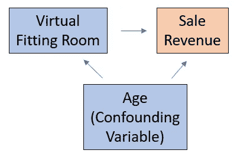
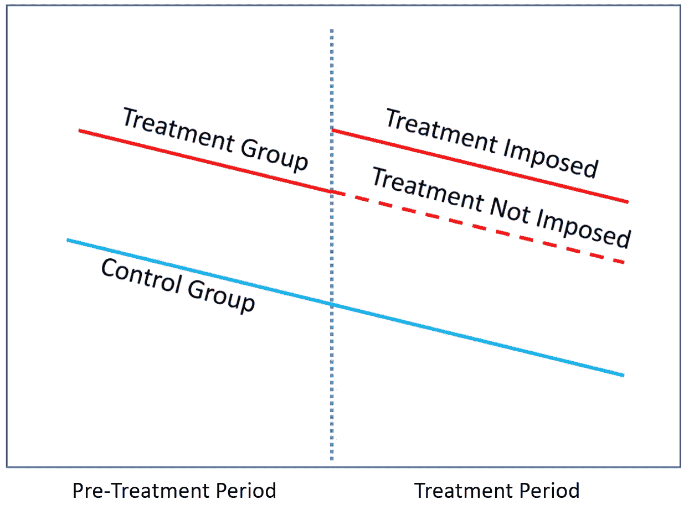
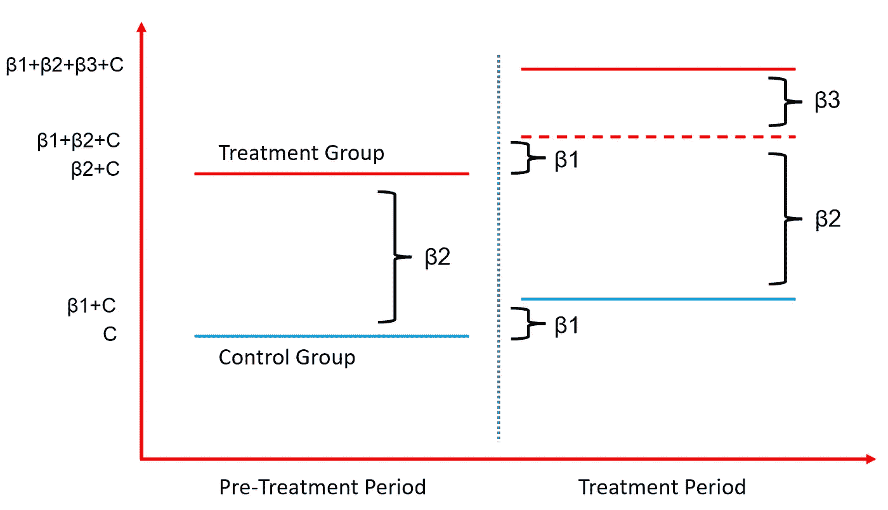
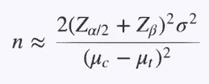

# 因果推断:计量经济模型与 A/B 检验

> 原文：<https://towardsdatascience.com/causal-inference-econometric-models-vs-a-b-testing-190781fe82c5>

## 观察研究、实验研究、回归模型、工具变量、差异中的差异模型、参数检验和非参数检验


班农·莫里西在 [Unsplash](https://unsplash.com?utm_source=medium&utm_medium=referral) 拍摄的照片

作为数据科学从业者，我们经常被问到“**X 驱动 Y 吗？**“Y 是我们在意的结果。x 可能是一项新功能、产品或药物。例如，一个网站所有者想问一个新的网页设计是否会带来更高的点击率或销售额。临床研究人员会问一种新药是否会促进健康。

不幸的是，**单单是 X 和 Y 之间的* ***而不是*** *足以帮助我们建立起**的因果关系。这里的复杂因素是一组影响 X 和 y 的其他特征，称为**混杂变量**，例如，游客地理位置、性别、年龄和兴趣等因素会影响新特征的使用和销售收入的结果。因此，我们需要在控制这些混淆变量的同时，隔离新网页设计(X)对销售收入(Y)的影响。**

# **第一部分:观察研究和实验研究**

**有两大类设计用于调查研究中两个或更多变量之间的关系:**观察**和**实验**。**

*   **在*观察性研究中，*我们观察并收集研究中相关的实际数据(如 X 和 Y ),而不会随意对某个群体进行任何处理或限制。**
*   **在*实验研究中，*我们随机对一组进行治疗，而另一组不接受治疗，这样我们可以调查治疗和结果变量之间的因果关系。*随机化设计和干预使实验研究不同于观察研究*。**

## **问题:这项研究是观察性的还是实验性的？**

**研究 1:一项研究将学生随机分为两组:**

*   **一组被要求遵循严格的锻炼时间表。**
*   **一组被禁止做任何运动。**

**研究人员观察了哪一组在学期结束时倾向于获得更高的 GPA。**

**研究 2:另一项研究随机抽取学生样本，调查他们的锻炼习惯。每个人被分为轻度、中度或重度锻炼者。研究人员观察了哪些小组倾向于在学期结束时获得更高的 GPA。**

**研究 1 是一项实验研究，而研究 2 是一项观察研究。因为研究 1 需要研究人员的干预，而研究 2 不需要。**

## ****观察研究与实验研究的区别:****

*   ****实验研究通常更昂贵**，因为它需要更多的资源来建立研究实验，而观察研究可以通过调查和数据收集来完成。研究人员不需要任何干预。**
*   ****实验研究通常比观察研究更短**，因为研究人员的干预使得为研究收集相关数据更加有效，而观察研究可能需要几年才能完成数据收集。**
*   **实验研究提供的证据被认为比观察研究更有力。观察性研究中变量之间的关系不是必然的因果关系，而在实验性研究中，随机化将确保*其他协变量(如年龄、性别、地理位置、消费习惯)在治疗组和对照组中均匀分布，并且我们的样本代表我们的总体*，以便我们可以更精确地调查治疗对我们关心的结果的因果影响。**

**听起来实验研究比观察研究更有优势。**然而，在一些研究中，实验研究并不是一个可行的选择。**例如，**

*   ****您根据历史数据**进行研究，这些数据在过去没有随机分配治疗。**
*   ****治疗只能观察，不能强加。**一些治疗效果(例如，性别、家庭收入水平、种族等)不能由研究人员操纵。**
*   **将治疗强加给一个群体被认为是不道德的。例如，我们想调查产品价格的变化将如何影响其销售收入。如果我们进行一项实验研究，在相同的地点和相同的时间范围内，向一组顾客收取比另一组更高的价格，这将是不道德的，也是一场公关灾难。在另一个例子中，我们想调查获得大学学位是否会影响收入。还是那句话，不能强制某些人“有大学学历”。这样做不仅是不可能的，也是不道德的。**

# **第二部分:计量经济学模型的观察研究**

## ****回归**模型**

**计量经济学模型(也称为受控回归)是一种流行的观察性研究方法，用于估计预测变量(如治疗 X 和其他协变量)的变化与反应变量(Y)的变化之间的关系。重要的是，*使用受控回归模型，我们可以隔离一个变量(如治疗 X)的影响，同时保持所有其他预测变量不变。***

**受控回归不仅能够控制**协变量**(影响反应变量)，还能够控制**混杂变量**，影响治疗 X 和反应变量 y**

**例如，一个电子商务网站想要调查他们网站上的虚拟试衣间功能是否会增加他们的销售收入。如果我们只是回归销售收入的网站功能，我们可以很容易地看到虚拟试衣间功能和销售收入之间的正相关关系。如果我们就此打住，特征的影响会有偏差(也称为**省略变量偏差**)，因为一个重要的混杂变量，年龄，没有包括在模型中。基于额外的数据分析，我们可以发现，年轻顾客倾向于更频繁地使用虚拟试衣间，年轻顾客倾向于在这个电子商务网站上花费更多。如果我们在受控回归中不包括年龄变量，该特征的效果可能会有**偏差**。**

****

**作者图片**

```
**Background: Age is positively related to both Virtual_Fitting_Room and Sale_Revenue.Controlled Model 1: β1 here is biased.
Sale_Revenue = β1 * Virtual_Fitting_Room + CControlled Model 2: β1 here is estimated more precisely and R-square is higher.
Sale_Revenue = β1 * Virtual_Fitting_Room + β2 * Age + C**
```

## ****检查受控模型中是否有遗漏变量偏差的提示****

*   **如果在回归模型中增加一个预测变量，将有意义地增加 R 平方，治疗效果也会发生显著变化。很可能之前的模型存在遗漏变量偏差。**
*   **如果在模型中包括额外的变量不会对治疗效果产生有意义的影响，那么我们更有信心估计的治疗效果是治疗和反应变量之间的真正因果关系。**

## **使用工具变量解决遗漏变量偏差**

**观察性研究的另一个问题是混淆变量在概念上存在，但无法测量或观察，因此治疗效果会受到遗漏变量偏倚的影响。在模型中包括**工具变量** (IV)是解决这个问题的一种流行方法。**

**让我们定义这个工具变量 Z:**

*   **z 与模型中的任何其他协变量(包括误差项)都不相关**
*   **z 与处理 X 有意义且强相关，因此通过 X 间接影响 Y**

**在实践中，工具变量可以分两步实现:**

*   **第一步:我们回归 x 上的工具变量。请记住，我们需要在 IV 和 x 之间有很强的相关性。否则，我们可能仍然对治疗效果有偏见**
*   **第二步:我们根据第一步预测的 X 和其他协变量回归 Y。所以我们更准确地估计治疗效果。**

## **工具变量的应用**

****案例研究**:一个社交媒体网站想要调查在同一个社交媒体网站上有更多的朋友是否会使用户更有可能回到该网站。**

**首先，一项实验研究是不可能的，因为我们不能随机分配人们比其他人拥有更多的朋友。其次，包括所有混杂变量是不可行的。使用工具变量似乎是一条更简单的途径。一个社交媒体网站应该有一个现有的策略来邀请更多的朋友来这个网站。例如，使用用户的朋友联系人向朋友发送邀请的功能。**

****

**作者图片**

```
**Background: This feature of Send_Invitations_to_friends is related to number_of_friends, but not related to any other covariates for Return.Step 1 of IV Model: β1 should suggest strong positive correlation between Send_Invitations_to_friends and Number_of_friends
Number_of_friends = β1 * Send_Invitations_to_friends + CStep 2 of IV Model: β2 can estimate effect of number of friends on Return more precisely.
Return_Flag = β2 * Predicted_Number_of_friends + C**
```

## **差异中的差异模型**

**当一个工具变量不可行时，我们需要一个替代方法来控制未观察到的混杂变量的影响。**差异中的差异** (DiD)模式可能是一个可行的选择。它比较了治疗组和对照组在治疗前和治疗期间的结果。DiD 模型所需的关键假设是:**

*   **如果不进行治疗，治疗组和对照组的结果变量将遵循**平行趋势**。**
*   **任何协变量(包括省略的变量)都会以同样的方式影响治疗组和对照组的结果变量。**

****

**作者图片**

## **差异中的差异模型的应用**

****案例分析**:一家零售店想要调查一种产品的涨价是否会带来更多的销售收入。**

**首先，实验研究是不可能的，因为在同一地点随机对不同价格的产品收费被认为是不道德的。其次，构建混杂变量和工具变量本身就是一项艰巨的任务。在这种情况下，差异中的差异模型是更好的选择。**

**我们可以从不同的城市挑选两家零售店，这两个城市在人口、收入水平和产品需求方面也具有可比性(**平行趋势假设**)。**

**城市 1 的商店(**治疗组**)在治疗期间向顾客收取的价格(**治疗效果**)高于对照期间，而城市 2 的商店(**对照组**)在两个期间向顾客收取的价格相同。**

**我们可以使用 DiD 模型比较两个城市在价格上涨后的收入变化。**

```
**Background: Trends of sale revenue from both cities are **parallel** in both the pre-treatment periodandtreatment period (if the price change is not imposed.)**DiD Model**: "Treatment_period" is an indicator of the timing that a price increase is imposed (treatment period: 1; Pre-treatment period: 0). "Treatment_Group" is an indicator of the treatment and control groups (City_1: 1; City_2: 0). The effect of the Interaction term between "Treatment_period" and "Treatment_group"(β3) estimates the pure effect of price increase on sale revenue.Sale_Revenue = β1 * Treatment_period + β2 * Treatment_group + β3 * Treatment_period * Treatment_Group + C**
```

*   **β1:估计治疗期间除我们的治疗以外的因素对反应变量的影响。**
*   **β2:估计治疗组和对照组之间的平均差异**
*   **β3:估计对反应变量的纯治疗效果。**

****

**作者图片**

# **第三部分:A/B 测试的实验研究**

**在这一节，我们来谈谈因果推断的另一个有力工具， **A/B 测试**。**

**A/B 测试(又名随机对照试验)也许是调查**因果关系最准确的工具。**通过不断确定转化率和参与度指标方面的新目标，并测试新功能，网站可以提高绩效，应用可以吸引和留住更多用户。因此，A/B 测试近年来在技术行业中普遍使用。**

**A/B 检验通常通过一些必要的步骤来实现:形成**假设**、**样本容量**计算**、随机化**设计、后验**分析。****

## **假设**

**形成假设是每个 A/B 测试的第一步。假设描述你想要调查的因果关系的陈述。让我们举一个假设的例子。**

```
**Null hypothesis (H0): ABC e-commerce site visitors who receive email coupons will **NOT** have higher purchase conversion rate compared to visitors who don’t receive email coupons. Alternative hypothesis (H1): ABC e-commerce site visitors who receive email coupons will have higher purchase conversion rate compared to visitors who don’t receive email coupons.**
```

**每个假设都由关键部分组成:**人群**，**治疗**，**评价指标**，**无效&替代假设****

**人口 **:** 我们需要定义哪些受试者有资格参加实验(例如，所有用户，或来自某个位置的用户)，以及如何确定单个受试者(又名转移单位)。在上面的例子中，受欢迎的是来自 ABC 电子商务网站的所有访问者，分流的单位是用户 ID。**

**处理(干预):一个处理可以是一个新特性或者新设计。在上面的例子中，处理将是接收电子邮件优惠券。请记住，治疗通常只能进行一次干预。我们不能在一个组中强加多种变化。例如，如果我们为实验同时发送电子邮件优惠券和邮件优惠券，我们无法区分两种干预的效果。**

**治疗和对照组:通过治疗施加的任何受试者将属于治疗组。任何未受治疗影响的受试者都属于对照组。**

**评估指标(结果变量):评估指标是我们关心的结果，将被调查。在上面的例子中，评估指标是购买转化率，它被定义为在实验中进行购买的访问者数量与总访问者数量之间的比率。**

**有不同类型的评估指标。举个例子，**

*   **计数:参与度指标，如日活跃用户(DAU)、周活跃用户(WAU)、月活跃用户(毛)和用户粘性(DAU/毛)是常见的评估指标**
*   **分布(例如，平均值、百分位数):评估度量可以是分布。例如，网站的平均会话时间或转换前的平均点击次数。**
*   **概率和比率:评估指标也可以是一个比率。例如，转化率，其由在实验中采取期望的行动(例如，点击底部，进行购买)的受试者的数量与受试者总数之比来定义。留存率，衡量用户在一段时间内返回你的网站或应用的百分比。通过跟踪转化率和保留率，您可以监控网站的表现，并确定需要改进的地方。**

**无效和替代假设:无效假设表示治疗组和对照组之间的结果变量没有差异。换句话说，治疗不会影响结果。另一个假设是两组之间的结果有统计学差异。**

## **样本量计算**

**下一步是计算实验的样本量。在计算之前，我们需要确定几件事。**

*   **效果大小:这是治疗组和对照组之间结果变量(如转化率的变化)的差异。请记住，有了足够的样本量，即使是实验中微小的变化也会被发现具有统计学意义。所以你需要考虑这些变化的商业影响以及**的实际重要性**。你需要问*“为了值得发动干预，对结果的最小影响是什么？”*同时考虑开发和机会成本。另外*效果尺寸越小，需要的数据就越多，测试持续的时间就越长*。**
*   **统计显著性水平和功效:通常显著性水平设置为 0.05，功效设置为 0.8。**显著性水平**(又称为 I 型误差)是当不存在影响时错误检测影响的可接受可能性。因此*显著性水平越小，测试越好，需要的数据越多*。**功效**是指当一个效应存在时，测试检测到该效应的可能性。因此*功率越高，测试越好，需要的数据也越多*。**
*   **标准差:这是结果变量的**方差**。当很难获得时，我们可以依靠历史数据或领域专家的知识来估计。*标准差越高，我们需要的数据就越多***
*   **样本量计算:一旦你有了上面提到的信息，下面的公式可以计算样本量。Z 值是关于显著性水平和功效值的标准分数。σ值是标准差。c- t 是效应大小。**

****

**作者图片**

## **随机选择**

**一旦我们有了一个假设和样本量，我们就可以将受试者随机分配到治疗组和对照组。随机化是**无偏** A/B 测试成功的关键。它需要满足以下要求:**

*   **需要确保测试中的样本是总体的**代表**。以便从样本中得出的结论可以应用于总体。**
*   **需要确保**协变量**在治疗组和对照组之间均匀分布。任何可能影响结果变量的因素(如性别、收入水平、位置、设备类型)都需要均匀分布。这样我们就可以在保持其他协变量可比性的同时，分离出对治疗的影响。**

## ****测试后分析****

**在我们分析治疗如何影响实验中的结果变量之前。我们需要在实验中进行**健全性检查**。我们用于健全性检查的度量被称为**不变度量**(例如，cookies 的数量)，它不应该受到实验的影响。因此，对照组和治疗组之间的不变指标不应该有变化。否则，实验装置就有缺陷。**

**一旦通过健全性检查，我们就可以分析我们关心的实际数据。我们可以使用许多方法来研究对照组和治疗组之间的结果变量是否不同。**

****参数检验:**当结果变量相对**正态分布**时，参数检验工作良好。以下是一些流行的参数测试:**

*   **学生的 t 检验:我们假设控制组和治疗组之间结果变量的方差相同。**
*   **韦尔奇的 t 检验:当样本大小或方差不可比时，韦尔奇的 t 检验会优于学生的 t 检验**
*   **方差分析检验:有时有多个治疗组。在我们运行多个 t 检验之前，我们可以首先运行 ANOVA 检验，它使用 f 检验来确定三个或更多组的均值是否不同。如果 f 检验的 p 值很小，我们知道至少有一组与其他组不同。然后我们可以花时间进行成对 t 检验，找出哪一组是不同的。请记住，当运行**多重测试**时，我们需要**使用 **Bonferroni 校正**或**错误发现率** (FDR)来校正 P 值**。**

****非参数检验:**非参数检验不对底层数据的分布做出假设。当连续结果变量不是正态分布或者有两个或更多分类结果时，它们是可行的选择。以下是一些流行的非参数测试:**

*   **卡方检验:这是一个独立性检验，允许您检验治疗和结果变量之间是否有统计学上的显著关联。它可以处理具有两个或更多结果值的分类数据，而 t 检验只能处理具有两个结果值的分类数据。**
*   **费雪精确检验:卡方检验只有在样本量相对较大(即 n>1000)时才可靠。如果没有达到这个阈值，可以使用费希尔的精确测试来代替。**
*   **曼惠特尼 U 检验(Wilcoxon 秩和检验):这种检验将使用等级而不是实际值。当比较非正态分布的连续变量或样本量很小时，Wilcoxon 秩和检验将是一个很好的选择。**

# **A/B 测试中的问题及解决方案**

*   ****过早停止 A/B 测试:**在我们计算样本量之后，我们将通过除以平均日流量来知道运行测试的天数。如果数量少于一周，我们应该继续运行测试至少 2 周。如果可能，1-2 个商业周期会更好。人们每天都有不同的行为(例如工作日与周末)，并受到外部事件的影响(例如节假日、纳税季、夏季与冬季)。通过扩展测试，我们可以得到更稳健的结果。**
*   ****网络效应**:在社交媒体平台中，用户的行为很可能受到其社交圈中的人的影响，因此，关于用户的独立性假设不成立。当将每个用户随机分配到对照组和治疗组时，*测试的治疗效果通常被低估*，因为治疗效果可能会通过治疗组的社交圈溢出到对照组。为了解决这个问题，我们可以使用**集群随机化，**将用户放在同一个社交圈的同一个组中。**
*   **新奇效应&首因效应:人们会对产品的新变化/新特点做出不同的反应。有些人可能会对任何新的变化感到兴奋，并愿意为了尝试新事物而进行实验。这种行为被称为**新奇效应**。另一方面，有些人可能会抵制对产品的任何改变。这被称为**首因效应**或**变化厌恶**。如果你观察到一个或大或小的初始效应，这可能是由于新奇感或首因效应。为了解决这个问题，我们可以延长测试的持续时间，因为这些影响最终会消失。或者，我们可以对新用户进行 A/B 测试，因为新用户会有一个全新的视角，不应该受到这些影响。**
*   ****矛盾的结果**:有时，我们会看到来自多个评估指标的矛盾结果(例如，转化率上升，但留存率下降)。为了解决这个问题，我们可以提出一个 OEC ( **总体评估标准**)，它同时考虑了短期和长期目标，以及不同指标之间的权衡。然而，你应该能够量化积极和消极影响，并确保消极影响是可以接受的。**

# **最终注释**

**如果你对**线性回归**和**因果推断**感兴趣，这里有一些相关的帖子可以浏览。**

*   **[**因果推断:计量经济模型 vs. A/B 检验**](/causal-inference-econometric-models-vs-a-b-testing-190781fe82c5)**
*   **[**线性回归与逻辑回归:OLS、最大似然估计、梯度下降**](/linear-regression-vs-logistic-regression-ols-maximum-likelihood-estimation-gradient-descent-bcfac2c7b8e4)**
*   **[**OLS 线性回归:无偏、一致、蓝色、最佳(有效)估计量**](/linear-regression-with-ols-unbiased-consistent-blue-best-efficient-estimator-359a859f757e)**
*   **[**线性回归因果推断:省略变量和无关变量**](/understand-bias-and-variance-in-causal-inference-with-linear-regression-a02e0a9622bc)**
*   **[**线性回归因果推断:内生性**](/causal-inference-with-linear-regression-endogeneity-9d9492663bac)**
*   **[**与 OLS 的线性回归:异方差和自相关**](/linear-regression-with-ols-heteroskedasticity-and-autocorrelation-c12f1f65c13)**

# **感谢您的阅读！！！**

**如果你喜欢这篇文章，并且想**请我喝杯咖啡，**请[点击这里](https://ko-fi.com/aaronzhu)。**

**您可以注册一个 [**会员**](https://aaron-zhu.medium.com/membership) 来解锁我的文章的全部访问权限，并且可以无限制地访问介质上的所有内容。如果你想在我发表新文章时收到电子邮件通知，请订阅。**