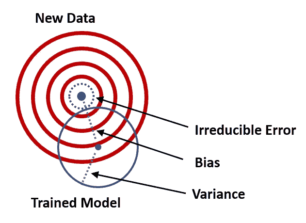
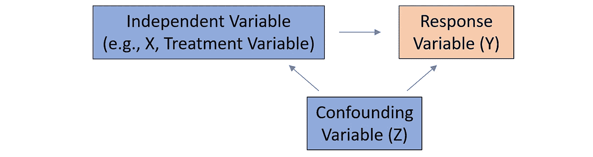
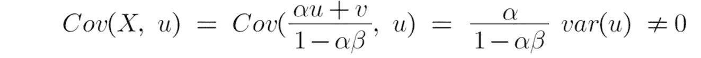
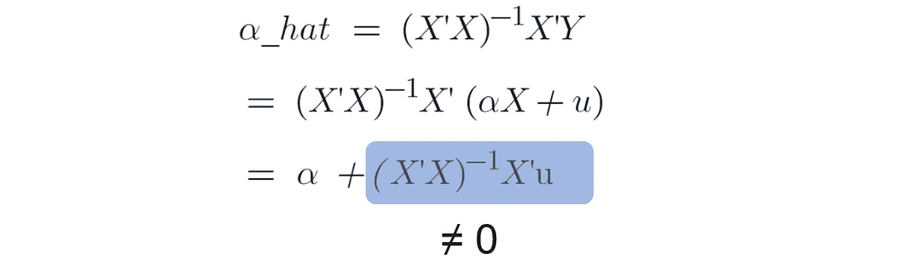
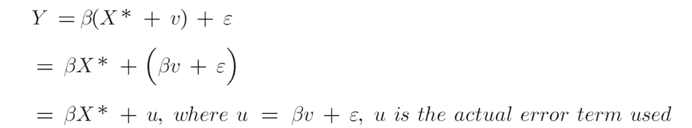
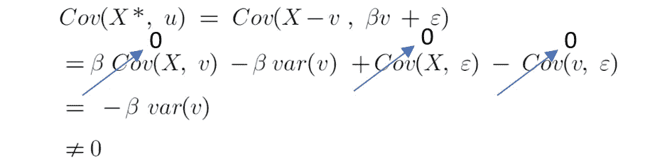
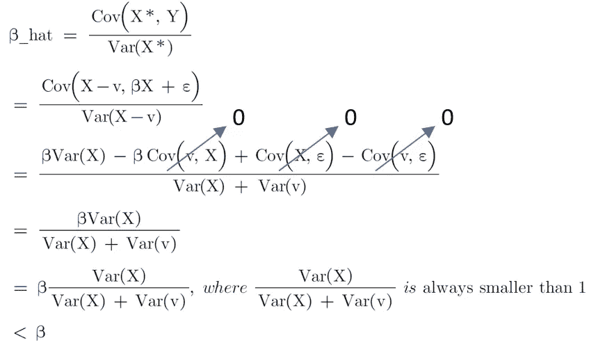
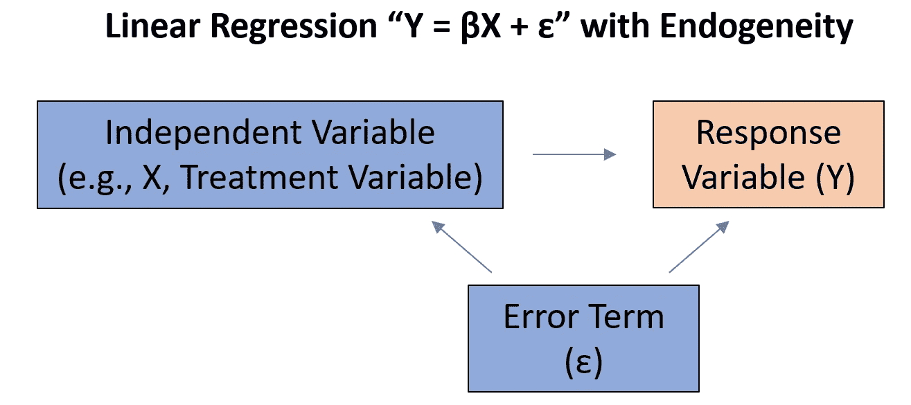
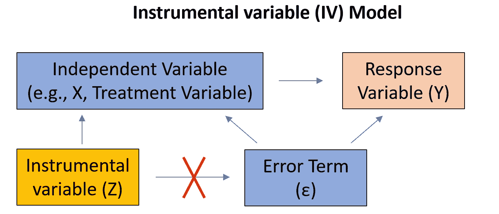
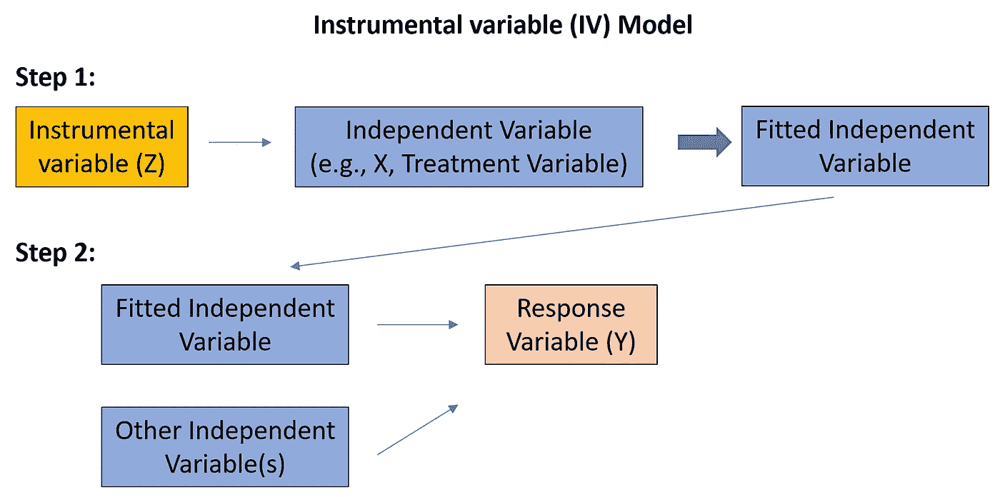

# 线性回归因果推断:内生性

> 原文：<https://towardsdatascience.com/causal-inference-with-linear-regression-endogeneity-9d9492663bac>

## 关于外生变量、**外生变量、遗漏变量、测量误差和**同时偏差的讨论

作者图片

在我的[上一篇文章](/understand-bias-and-variance-in-causal-inference-with-linear-regression-a02e0a9622bc)中，我们讨论了设计线性回归时的一些常见问题——**省略重要变量**和**包括无关变量。**在本文中，我们将讨论线性回归模型中的**内生性**，尤其是在**因果推断**的背景下。

线性回归模型是一种常用工具，用于绘制反应变量(Y)和治疗变量(即 T)之间的因果关系，同时控制其他协变量(如 X)，如下所示。治疗效果(即α)的偏差(准确度)和方差(精确度)是此类研究的重点。

## 什么是**内生性？**

> **内生性**是指线性回归模型中的预测因子(如治疗变量)**与误差项**相关的情况。

你称这样的预测器为**内生变量。**内生变量的系数估计**不再蓝**(最佳线性无偏估计量)因为内生性违背了线性回归的经典假设之一——*所有的自变量都与误差项不相关。*

另一方面，如果一个变量没有被模型中的其他变量(例如，响应变量、其他解释变量和误差项)解释，则该变量被称为**外生变量**。外生变量由模型之外的因素决定。

## 内生性的来源有哪些？

内生性有多种来源。内生性的常见来源可分为:省略变量、同时性和测量误差。

## **来源 1:省略变量**

如果变量 Z 与响应变量和预测变量都相关，我们称这样的变量为**混杂变量。**

图 1(作者图片)

> 如果一个混杂变量 Z 在线性回归模型中被**省略**，那么受影响的预测因子(如治疗变量)将成为**内生的**，因为在这种情况下，*“无法解释的”变量 Z 漏入误差项，那么受影响的预测因子将是* ***与误差项*相关的** *。*

如果由于省略变量而存在内生性，[对受影响变量(如治疗变量)的估计会变得有偏差(即**省略变量偏差**)。](/understand-bias-and-variance-in-causal-inference-with-linear-regression-a02e0a9622bc)见证明[此处](/understand-bias-and-variance-in-causal-inference-with-linear-regression-a02e0a9622bc)。这意味着我们有一个**不准确的**因果效应。

如果混杂变量 Z 在线性回归模型中添加了**和**，那么受影响的预测因子(如治疗变量)将不再是内源性的**。因此，对治疗效果的系数估计将不再有偏差。**

## 来源 2: S **不一致性**

同时性是内生性的另一个常见原因。当一个或多个预测因子(如治疗变量)由反应变量(Y)决定时，同时性出现。简单来说，X 导致 Y，Y 导致 X，例如，我们可以用教育水平来解释家庭收入，因为受过高等教育的人往往挣得更多。同时，我们知道收入较高的人更容易负担得起高等教育。

通常这种关系可以通过**联立方程**(也称为**结构方程**)来解释。

图 2(作者图片)

通过求解上面的两个方程，我们得到了模型的简化形式

图 3(作者图片)

在因果推断的背景下，如果治疗效果 X 由响应变量决定，那么很容易看出治疗效果与图 2 中的误差项 u 相关联。

图 4(作者图片)

因此，如果我们应用图 2 中的 OLS，治疗效果和反应变量都是内生变量。这会导致对治疗效果的估计有偏差(即**同时偏差**)。所以治疗效果永远不可能是真正的效果。

图 5(作者图片)

## 来源 3:测量误差

在线性回归模型中，假设观测值被正确测量，没有任何误差。在许多情况下，这种假设是违反的。一些变量(例如，人们锻炼的能力和意愿)可能无法衡量，那么我们使用**代理变量**(例如，人们的智商得分和在健身房的小时数)来衡量效果。有时候，很难做出正确的观察。例如，年龄变量通常以整数记录，而月和日通常被忽略。在这些情况下，变量的真实值不包括在模型中。*变量的观测值与真值之差称为* ***测量误差*** *。*

**情景一**:当测量误差在**因变量 Y** 中时，它**不会引起内生性**，因为在这种情况下，无法解释的测量误差是外生变量，与包含的解释变量无关。因此，即使无法解释的测量误差泄漏到误差项，解释变量也不会与误差项相关联。

**情景二**:相比之下，当测量误差在**解释变量**中时，内生性的问题就产生了。

假设 **X*** 是观察到的解释变量，而 **X** 是变量的真实值。X*和 X 之间的关系可以解释如下，

图 6(作者图片)

我们照常建立线性回归，不包括测量误差项 v，因为它是不可测量的。

图 7(作者图片)

那么我们实际估算的模型是

图 8(作者图片)

通过一些数学，我们可以发现 X*与实际误差项 u 相关，然后内生性发生。

图 9(作者图片)

在图 9 中，Cov(X，v)为 0，因为测量误差与自变量 X 无关，Cov(X，ε)和 Cov(v，ε)都为 0，因为ε与 X 无关，而ε与测量误差不太相关。

> 那么在有测量误差的线性回归中，OLS 估计量β_hat 不再是无偏的。此外，估计器将总是被低估(例如**衰减偏差**)。

图 10(作者图片)

## **内生性**的补救方法是什么**？**

在线性回归模型中处理内生性的一种流行方法是通过**两阶段最小二乘法(2SLS)** 引入一个或多个**工具变量**。

让我们定义这个工具变量 Z:

*   z 与模型中的任何其他协变量(包括误差项)都不相关
*   z 与受影响的预测因子(如治疗变量)有意义且强相关，因此通过 X 间接影响 Y

图 11(作者图片)

图 12(作者图片)

在实践中，工具变量(IV)模型可以分两步实施(2sl):

*   步骤 1:我们回归受影响的预测因子 x 的工具变量。请记住，我们需要 IV 和 x 之间有很强的相关性。否则，我们可能仍然对受影响的预测因子有偏差。
*   第二步:我们在第一步拟合的 X 和其他协变量上回归 Y。我们从步骤 2 中得到的估计值将比图 11 中的估计值更加准确和一致。

图 13(作者图片)

## 最终注释

当使用线性回归模型进行因果推断时，内生性是我们需要解决的问题，否则，我们会由于遗漏变量、同时性或测量误差而得到有偏差的处理效果。

如果你对**线性回归**和**因果推断**感兴趣，这里有一些相关的帖子可以浏览。

*   [**因果推断:计量经济模型 vs. A/B 检验**](/causal-inference-econometric-models-vs-a-b-testing-190781fe82c5)
*   [**线性回归与逻辑回归:OLS、最大似然估计、梯度下降**](/linear-regression-vs-logistic-regression-ols-maximum-likelihood-estimation-gradient-descent-bcfac2c7b8e4)
*   [**OLS 线性回归:无偏、一致、蓝色、最佳(有效)估计量**](/linear-regression-with-ols-unbiased-consistent-blue-best-efficient-estimator-359a859f757e)
*   [**线性回归因果推断:省略变量和无关变量**](/understand-bias-and-variance-in-causal-inference-with-linear-regression-a02e0a9622bc)
*   [**用线性回归进行因果推断:内生性**](/causal-inference-with-linear-regression-endogeneity-9d9492663bac)
*   [**与 OLS 的线性回归:异方差和自相关**](/linear-regression-with-ols-heteroskedasticity-and-autocorrelation-c12f1f65c13)

# 感谢您的阅读！！！

如果你喜欢这篇文章，并且想**请我喝杯咖啡，请[点击这里](https://ko-fi.com/aaronzhu)。**

您可以注册一个 [**会员**](https://aaron-zhu.medium.com/membership) 来解锁我的文章的全部访问权限，并且可以无限制地访问介质上的所有内容。如果你想在我发表新文章时收到电子邮件通知，请 [**订阅**](https://aaron-zhu.medium.com/subscribe) 。