# 使用 Python 和 SparseSC 的综合控制的因果推理

> 原文：<https://towardsdatascience.com/causal-inference-with-synthetic-control-using-python-and-sparsesc-9f1c58d906e6>

## 了解合成控制并使用微软的 SparceSC 包在大型数据集上运行合成控制

# 什么是合成控制法？

我将尽量缩短这一部分，更多地关注为什么数据科学家应该关注这些方法，以及如何根据使用 [SparseSC 包](https://github.com/microsoft/SparseSC)的实践经验在更大的数据集上使用它们。

综合控制(SC)方法是一种统计方法，用于估计二元处理对观察面板(纵向)数据的因果影响。这种方法被称为[“过去几年政策评估文献中最重要的创新”](https://www.aeaweb.org/articles?id=10.1257/jep.31.2.3)得到了广泛的报道，并在[华盛顿邮报上发表了一篇文章——说真的，这里有一个惊人的数学技巧来学习不为人知的东西](https://www.washingtonpost.com/news/wonk/wp/2015/10/30/how-to-measure-things-in-a-world-of-competing-claims/)。“SC 是一种通过对未处理单位进行加权平均来创建人工对照组的技术，其方法是再现干预(处理)前处理单位的特征。SC 作为一个治疗单位的反事实，治疗效果的估计是治疗后观察结果和 SC 结果之间的差异。”[1]

“一种看待 SC 的方式是将其视为对[差分(DiD)估计](https://en.wikipedia.org/wiki/Difference_in_differences)的改进。典型的 DiD 将处理单位与对照单位的平均值进行比较。但通常处理过的单位看起来不像典型的对照(例如，它可能具有不同的生长率)，在这种情况下，DiD 的“平行趋势”假设无效。SC 通过选择一个更智能的线性组合而不是简单的平均来补救这一点，以对更相似的单元进行更重的加权。SC 的假设是，如果有影响治疗和未来结果的内源性因素，那么你应该能够通过匹配过去的结果来控制它们。因此，SC 提供的匹配可以处理 DiD 无法处理的一些估计问题。”[1]

这是因果推理书的链接，我发现这本书对理解 Matheus Facure 的《勇敢者和真理的因果推理》第 15 章背后的数学非常有用。

# 为什么数据科学家要关心这种方法？

作为一名数据科学家，您经常会遇到以下情况，运行 A/B 测试是不可行的，因为-

1.  缺乏基础设施
2.  缺少运行 A/B 测试的类似组(在评估州政策的情况下，因为没有与其他州等效的州)
3.  给一个群体提供不必要的优势。有时进行 A/B 测试会带来不公平的优势，并导致您进入反垄断领域。例如，如果亚马逊试图对不同的客户收取不同的价格，或者对相同的产品对其卖家适用不同的利润，该怎么办？

作为一名数据科学家，利益相关者可能仍然会要求您评估某些变化/处理的影响，在这种情况下，合成控制可以提供帮助。出于这个原因，它是一个有价值的工具，可以放在你的算法工具箱里。

# 问题概述

我们将使用 [Proposition 99 data](https://rdrr.io/github/synth-inference/synthdid/man/california_prop99.html) 来解释这种方法的用例，以及如何使用 SparceSC 库及其关键特性。1988 年，加州通过了一项著名的烟草税和健康保护法案，即众所周知的 99 号提案。它的主要作用是对加州境内的烟草销售征收每包 25%的州消费税，对其他商业烟草产品，如雪茄和嚼烟的零售征收大致相同的消费税。对烟草销售的额外限制包括禁止在青少年可以进入的公共场所出售香烟自动售货机，以及禁止单支香烟的单独销售。该法案产生的收入被指定用于各种环境和卫生保健项目，以及反烟草广告。为了评估其效果，我们可以从多个州收集多年的香烟销售数据。在我们的案例中，我们从 39 个州获得了从 1970 年到 2000 年的数据。”[2]

```
**Note —** *To render the blog with both code and content correctly, you can read the same on my quarto powered blog —* [*Link*](https://aayushmnit.github.io/posts/2022-09-19-SyntheticControl/2022-09-19_SyntheticControl.html)*, if you are interested in replicating the results, here is a kaggle notebook you can run to follow along —* [*Kaggle Link*](https://www.kaggle.com/code/aayushmnit/causal-inference-with-synthetic-control-using-pyth)
```

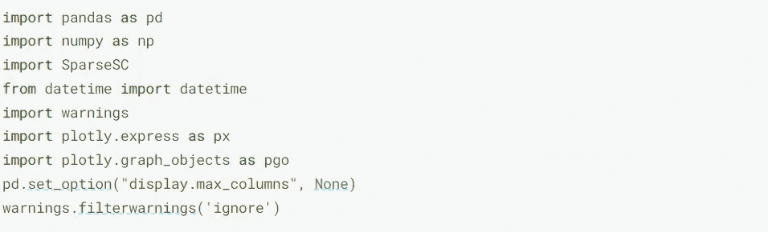

## 让我们看看数据

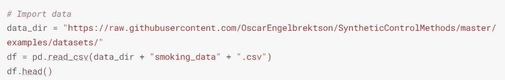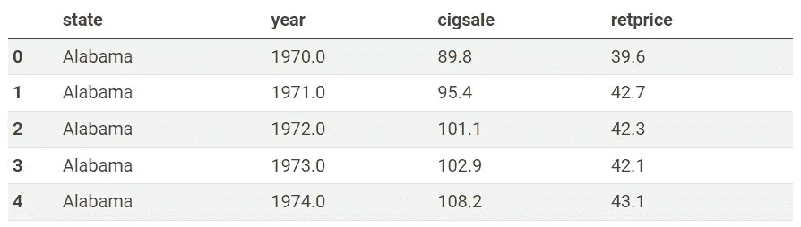

图 1—数据快照

我们有以`state`为处理单位的数据，以及每年(`year`列)人均香烟包装销售额(`cigsale`列)和香烟零售价格(`retprice`列)。我们将旋转这些数据，以便每行是一个治疗单位(`state`)，列代表每年的`cigsale`值。

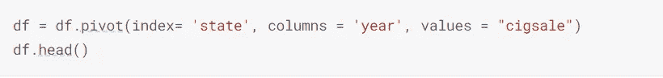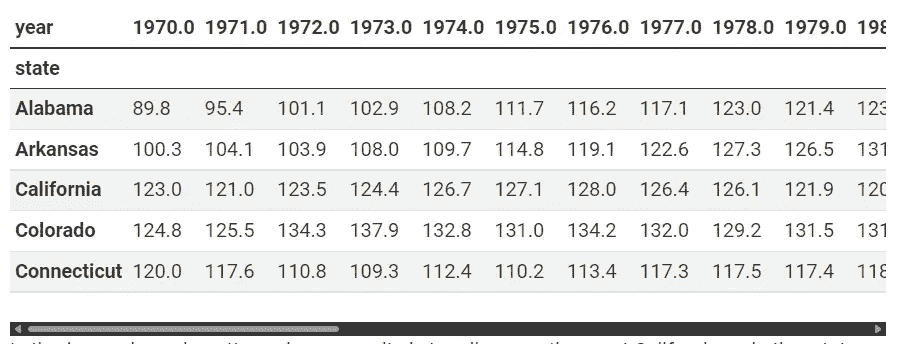

图 2—转换数据的快照

让我们来观察一下加州和其他州的人均卷烟销售趋势。

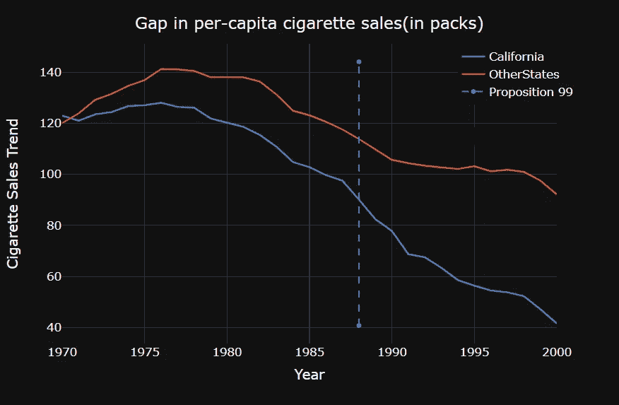

图 3-加州和其他州的卷烟销售对比

从上面的图表中我们可以看出，20 世纪 80 年代以后，卷烟销售普遍下降，随着 99 号提案的出台，加利福尼亚州的下降趋势加快了。我们不能肯定地说这种情况是否有任何统计学意义，这只是我们通过检查上面的图表观察到的一些情况。

为了回答 99 号提案是否影响了卷烟消费的问题，我们将利用干预前时期(1970-1988 年)建立一个模拟加州卷烟销售趋势的合成对照组。然后，我们将看到这个合成控制在干预后的表现。

# 用 SparseSC 软件包拟合综合控制

在高层次上，`SparseSC`包提供了两个用于拟合综合控制的功能，即`fit()`方法和`fit_fast()`方法。在高水平上-

*   `fit()` -该方法尝试联合计算权重，并得出“最优”的 sc。这是我发现的大多数代码/库中最常用的方法，但是计算量很大，需要很长时间才能运行。因此，无法扩展到更大的数据集。
*   `fit_fast()` -该方法试图通过执行一些非匹配分析来分别计算权重。这种解决方案要快得多，并且通常是处理较大数据集的唯一可行方法。这个软件包的作者推荐从`fit_fast`方法开始，并且只在需要的时候才转向`fit`方法。

`[SparseSC.fit_fast()](https://sparsesc.readthedocs.io/en/latest/api_ref.html#fit-a-synthetic-controls-model-fast-separate)`方法需要至少三个参数-

1.  **特征** —这是 I/p 变量的 NumPy 矩阵，其中每一行代表一个治疗/控制单元(在我们的例子中是状态)，每一列是从治疗前(1970-1988)的时期，矩阵中的值是感兴趣的度量(在这种情况下是`cigsale`值)
2.  **目标** —这是 I/p 变量的 NumPy 矩阵，其中每一行代表一个处理/控制单元(在我们的例子中为状态)，每一列是从处理后的时期(1999-2000)，矩阵中的值是感兴趣的度量(在这种情况下是`cigsale`值)
3.  **treatment_units** —这是包含已处理单元的行索引值的整数列表

**注:**治疗单元可以是多个治疗指标的列表。想想同样的处理方法应用于多个组的情况，例如，如果 99 号提案在加利福尼亚州和明尼苏达州都滚动了，在这种情况下，treatment_units 将得到[2，15]，这是这些州各自的索引。

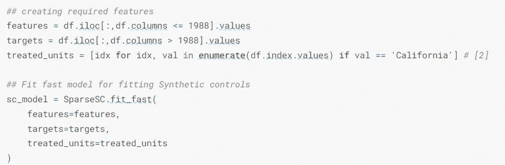

现在我们已经拟合了模型，让我们通过使用`predict()`函数来获得综合控制输出。

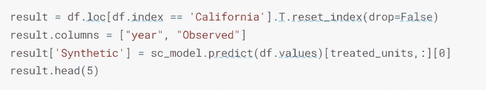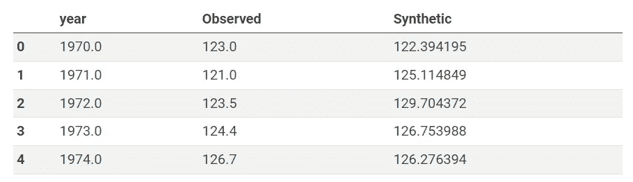

图 4 —样本结果

现在我们有了合成控制，我们可以用加利福尼亚州的结果变量来绘制它。

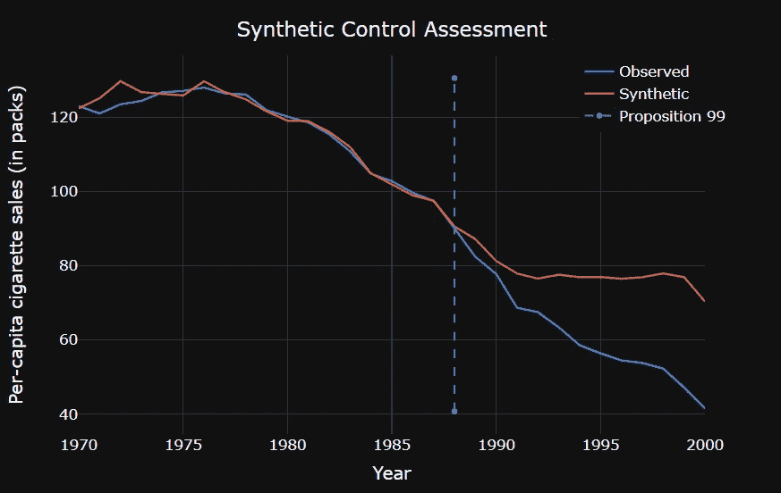

图 5——使用综合控制对加利福尼亚州 99 号提案的评估

**注:**在干预前期，合成对照并不精确地再现处理，而是紧密地遵循曲线。这是一个好迹象，因为它表明我们没有过度适应。此外，请注意，在 1988 年之后的干预(引入 99 号提案)之后，我们确实看到了分歧。

有了合成对照组，我们可以用治疗结果和合成对照组结果之间的差距来估计治疗效果。

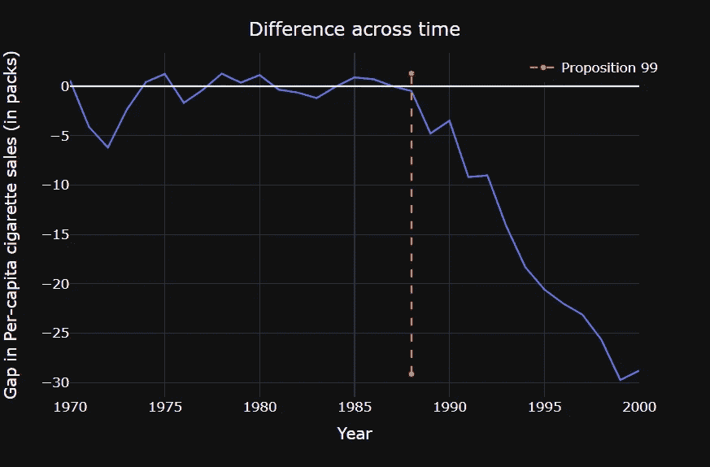

图 6——加州 w.r.t .合成控制人均卷烟销售的差距

看上面的图表，我们可以观察到，到 2000 年，99 号提案已经减少了大约 29 包香烟的销售。现在我们将弄清楚这是否有统计学意义。

# 做出推论

在合成对照中，为了发现我们观察到的效果是否显著，我们进行了安慰剂试验。安慰剂试验是随机选取一个未经处理的单元，假装所有其他单元都在控制中，并在这个随机选择的未经处理的单元上拟合合成控制，以估计效果。一旦我们多次重复这种安慰剂试验，我们就可以估计这种随机观察到的效应的分布，并观察观察到的效应是否与安慰剂观察到的效应显著不同。在`SparceSC`包中，我们可以使用`estimate_effects`方法为我们自动完成这项工作。估计效果方法最少需要两个参数-

1.  **结果** —这是 I/p 变量的 NumPy 矩阵，其中每一行代表一个治疗/控制单元(在我们的情况下是状态)，每一列是治疗前和治疗后的时间段，矩阵中的值是感兴趣的度量(在这种情况下是`cigsale`值)
2.  **unit _ treatment _ periods**—每个单元的治疗周期的向量，(如果一个单元从未被治疗，则使用 np。NaN(如果向量通过数字索引引用周期)

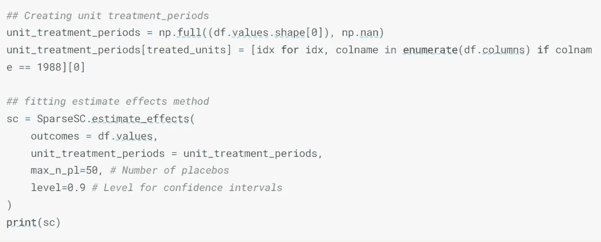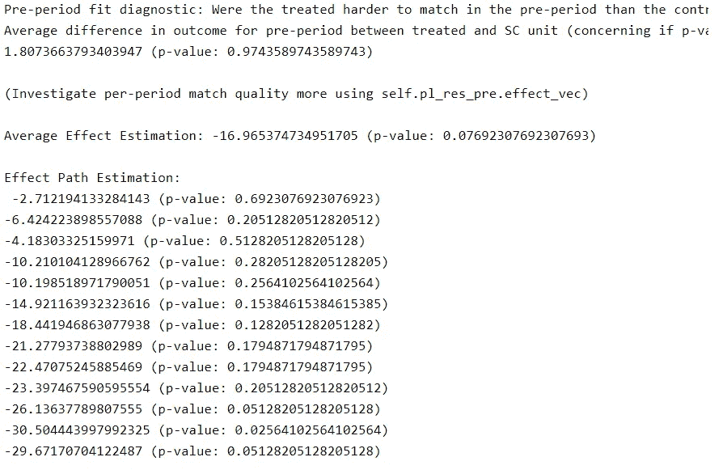

图 7—评估效果的输出

`estimate_effects`方法返回一个对象，该对象将打印每个治疗后年份的治疗效果，并估计观察到的差异的显著性。打印的信息也可以在返回对象的`pl_res_pre`函数中找到。由于介词 99，加利福尼亚州 2000 年销售额的估计影响为-30.0，p 值为 0.05。

# 结论

以下是一些关键要点-

1.  综合控制允许我们将多个控制单元组合起来，使它们类似于被处理的单元。有了合成控制，我们可以估计在没有治疗的情况下我们的治疗单位会发生什么。
2.  微软 SparseSC 库提供了一个快速易用的 API 来运行合成对照组，并允许我们运行安慰剂测试来估计观察到的效果的显著性。

# 参考

1.  [Sparce SC 文档](https://sparsesc.readthedocs.io/en/latest/overview.html#)
2.  [马修·法库《勇敢和真实的因果推理》——第 15 章](https://matheusfacure.github.io/python-causality-handbook/15-Synthetic-Control.html)
3.  数据来源— [人均卷烟消费量(包)。资料来源:Orzechowski 和 Walker (2005)](https://chronicdata.cdc.gov/Policy/The-Tax-Burden-on-Tobacco-Glossary-and-Methodology/fip8-rcng) 、[获取&使用信息——公开](https://catalog.data.gov/dataset/the-tax-burden-on-tobacco-1970-2018)

我希望你喜欢阅读，并随时使用我在 [Kaggle](https://www.kaggle.com/code/aayushmnit/synthetic-control-using-python-and-sparsesc) 上的代码来为你的目的进行测试。此外，如果对代码或博客文章有任何反馈，请随时联系 LinkedIn 或给我发电子邮件，地址是 aayushmnit@gmail.com。您也可以在 Medium 和 Github 上关注我，了解我将来可能会写的博客文章和探索项目代码。