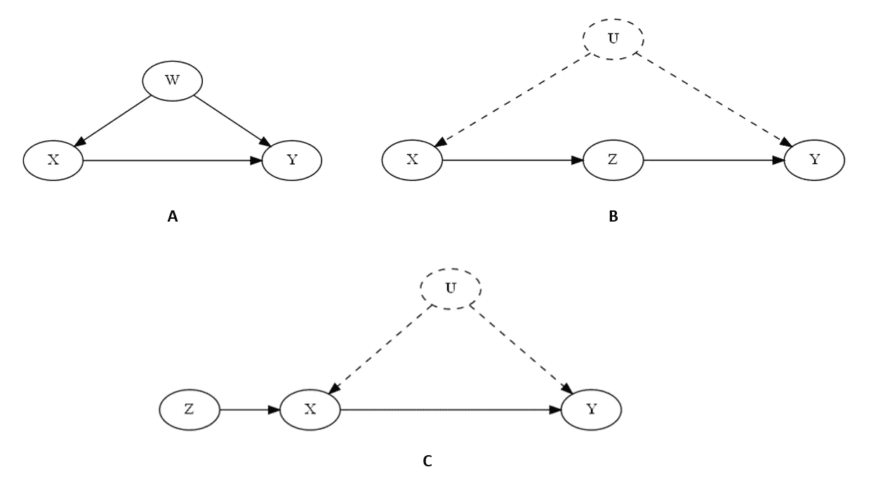
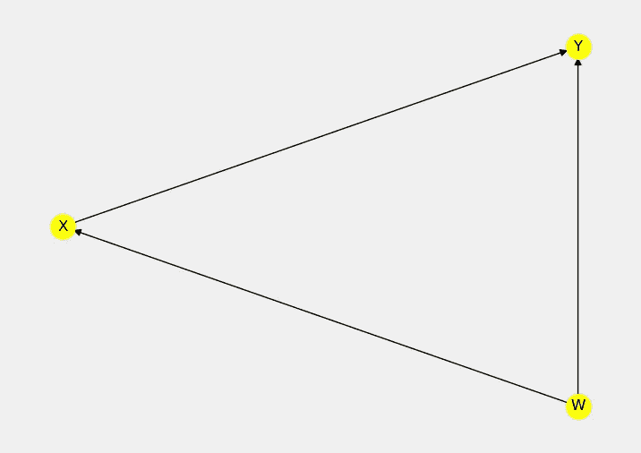

# 因果 Python——3 个简单的技术，今天就开始你的因果推理之旅

> 原文：<https://towardsdatascience.com/causal-kung-fu-in-python-3-basic-techniques-to-jump-start-your-causal-inference-journey-tonight-ae09181704f7>

## 学习 3 种识别因果关系的技术，并在 Python 中实现它们，而不会损失几个月、几周或几天的研究时间

图片由 pexels.com 的维尔罗伊·费尔南德斯拍摄

如果你正在读这篇文章，你可能已经在数据科学领域工作了 2-5 年。你以前很可能听说过**因果关系**，甚至可能读过一两本关于这个主题的书，但是如果你不自信或者你不清楚如何抓住这些概念并让它们在实践中为你工作而不损失几周甚至几个月的研究时间，这篇文章是给你的。

我也去过类似的地方！在某个时候，我读了差不多 1000 多页关于因果关系的书，包括书籍和研究论文，但我仍然不清楚如何在实践中应用这些概念，除非花几周时间去实现！

这篇博文旨在帮助你今晚**开始你的因果推理之旅**。

开始吧！

> 【链接到**笔记本**和**康达环境**文件**在**下面】

# 因果推理 101

在这篇文章中，我们关注**因果推理**。出于本文的目的，我们将因果推理理解为从**观察数据**中估计一个变量对另一个变量的**因果影响**的过程。

因果效应估计旨在当我们将治疗值修改一个单位时，捕捉结果变量中(预期)变化的强度。

在实践中，几乎任何机器学习算法都可以用于此目的，然而在大多数情况下，我们需要以不同于经典机器学习流程的方式来使用这些算法。

图片由[castor ly Stock](https://www.pexels.com/@castorlystock/)@ pexels.com 提供

# 混淆公司。

从观测数据中估计因果关系的主要挑战(但不是唯一的挑战)来自于**混淆**。**混杂因素**是感兴趣系统中的一个变量，它在治疗和结果之间产生一种**虚假关系**。虚假的关系是一种错觉。有趣的是，你不仅可以在记录的数据中观察到虚假的关系，在现实世界中也是如此。它们为许多刻板印象和认知偏见奠定了坚实的基础(但那是另一篇文章)。

# 去混杂

为了获得因果效应的无偏估计，我们需要排除混杂因素。同时，我们需要小心 ***不要引入混淆自己的*** ！这通常归结为在您的分析中控制变量的正确子集。不要太小，不要太大。选择正确控件的艺术和科学本身就是一个话题。

很好地理解它可能会受到这样一个事实的阻碍，即关于这个主题有许多令人困惑和不准确的信息来自各种来源，甚至包括高影响力的同行评审期刊(*原文如此！*)。如果这听起来让你感兴趣，我将在我即将出版的关于 Python 中因果推理和发现的[书中更深入地探讨这个主题。](https://causalpython.io)

> **对 Python 中的因果关系和因果机器学习感兴趣？**
> 
> 订阅邮件列表获取**关于因果关系的独家免费内容**和我的因果书更新:[**https://causal python . io**](https://causalpython.io)

# 三骑士

好消息是，在某些情况下，我们可以自动选择正确的变量作为控制。在本帖中，我们将演示如何使用三种不同的方法来识别图表中的因果关系:

1.  **后门标准**
2.  **前门标准**
3.  **工具变量(四)**

前两种方法可以从由 [Judea Pearl](https://twitter.com/yudapearl) 及其同事(例如 [Pearl，2009](https://amzn.to/3znv0BK) )制定的一套更通用的识别规则中导出，该规则称为 ***do* -calculus** 。

后者(IV)是计量经济学中非常流行的一系列方法。根据 Scott Cunningham([Cunningham，2021](https://amzn.to/3TOCTbl) )工具变量估计器早在 1928 年就由 Philip Wright (Wright，1928)首次提出。如果你想知道挑选什么资源来学习更多关于 IVs 和其他标准的知识，请查看[这篇文章](https://aleksander-molak.medium.com/yes-six-causality-books-that-will-get-you-from-zero-to-advanced-2023-f4d08718a2dd)。

图片来自[卡罗琳娜·格拉博斯卡](https://www.pexels.com/@karolina-grabowska/)@ pexels.com

# 假设

澳大利亚推理方法要求满足特定的假设。我们在这里没有足够的空间来讨论所有的问题，但是我们将简要回顾一下最重要的问题。

## **因果图**

我们在这里理解的因果推理的第一个一般假设是，我们有一个因果图来编码变量之间的关系。变量被编码为节点，它们之间的关系被编码为有向边。边的方向表示因果影响的方向。

一些方法要求测量所有相关变量，一些方法允许各种配置中的不可测量变量。

> 如何找到一个**因果图**当**不知道**的时候呢？

  

## **后门标准**

后门标准要求在我们的数据中没有 ***隐藏的混杂因素*** ，即没有影响治疗和结果并且同时**未观察到**的变量。这种假设在一些现实世界的场景中可能很难满足，因为可能很难确定没有我们不知道的隐藏变量影响治疗和结果。对于非常复杂的系统(例如，社会、生物或医学环境)，尤其如此。

## **前门标准**

前门标准**允许治疗和结果之间的隐藏混杂**，但要求治疗对结果的影响完全由另一个不受隐藏混杂影响的变量介导。那是满嘴的！请随意先睹为快，看看下面的**图 1(B)** ，获得一些视觉直觉。

## **工具变量**

工具变量也允许**在治疗和结果之间隐藏混杂**，然而它们要求有另一个变量与治疗相关，但与结果无关(既不是直接相关，也不是通过共同原因；埃尔南&罗宾斯，2020)。

让我们看一下**图 1** 来为我们上面讨论的假设提供一些视觉直觉。

**图一。**可使用**后门**(A)**前门** (B)和**工具变量** (C)方法识别的图表示例。真实的你的形象。虚线表示**未观察变量**。

# DoWhy 的力量

D[**oWhy**](https://py-why.github.io/dowhy/v0.8/)**(Sharma&ki ciman，2020)是一个因果推理库，它最初是作为微软的开源项目开始的，最近被转移到一个名为 py-why 的新项目中。它由一个经验丰富的研究人员和开发人员团队开发，提供了所有 Python 因果库中最全面的功能集。**

****DoWhy** 有几个不同的 API，包括主要的面向对象的`CausalModel` API、高级的 Pandas API 和新的实验 GCM API。在这篇文章中，我们将使用第一个。**

**DoWhy 的承诺是，它将自动识别图中的因果关系(假设使用我们上面讨论的三种方法之一可以识别它们)。这意味着您不必查看因果图并自己决定应该使用哪种方法(对于较大的图，这可能会变得更加困难)。**

> **寻找**推荐**关于**因果关系的书籍**阅读？**

** ** 

# **让我们得到数据**

**为了这篇文章，我们将生成三个简单的合成数据集。为什么是合成数据？让你非常清楚发生了什么。**

**在每个阶段，你都可以回到数据生成过程，亲眼看看数据集的真正结构是什么。**

**我们开始吧！**

****代码块 1。**生成数据。**

**首先，我们导入`numpy`和`pandas`。DoWhy 对 Pandas 数据框进行本地操作，这很方便，因为在构建模型和分析结果时，它可以很容易地识别您的变量。**

**接下来，我们生成三个不同的数据集。请注意，在结构上，这些数据集遵循图 1 中的对应数据集。一个**需要注意的重要事情**是，在数据集 2 和 3 的情况下(它们在图 1 中的对应部分是 B 和 C ),我们没有将变量*包含在数据帧中，尽管它被用于数据生成过程。这是故意的，因为我们在模拟*未被观察到的场景。****

# ****因果推理的 4 个步骤****

****oWhy 的主 API 提供了一种伟大而直观的方法来执行因果推理。****

****它包括四个步骤:****

1.  ****对问题建模****
2.  ****找到需求****
3.  ****估计效果****
4.  ****反驳模型****

****在本文中，我们将重点关注前三个步骤，并针对三个数据集分别运行所有步骤。****

# ****因果，我们来了！****

****让我们从必要的导入开始，然后跳到第一个数据集。****

******代码块 2。**导入 DoWhy 组件。****

## ****数据集 1 —后门标准****

****让我们从数据集 1 开始。****

******第一步:对问题建模******

****步骤 1 有两个子步骤:****

*   ****创建一个 DoWhy 可以阅读的格式的图表****
*   ****实例化`CausalModel`对象****

****在我们的例子中，我们将使用名为[***【GML】***](https://github.com/GunterMueller/UNI_PASSAU_FMI_Graph_Drawing/blob/master/GML/gml-technical-report.pdf)*的图形语言来定义数据集的图形结构。开始吧！*****

*******代码块 3。**数据集 1 的 GML 图定义。*****

*****GML 语法相当简单(至少对于简单的图形是这样)。如果你想更多地了解 GML，你可以在这里做。*****

*****现在，让我们实例化我们的模型对象。*****

*******代码块 4。**实例化数据集 1 的“CausalModel”对象。*****

*****我们将数据集和图表以及治疗和结果变量名传递给构造函数。这就是我们所需要的！*****

*****让我们将模型可视化，以检查图表是否如我们所期望的那样。用`model_1.view_model()`就可以了。*****

**********

*******图二。**通过调用` model_1.view_model()`得到的模型 1 的图形*****

*****图表看起来不错！在**图 2** 中，我们有与**图 1A** 中完全相同的一组节点和边。*****

*****第二步:找到需求*****

*******估算需求**表示我们想要估算的数量，并且 ***与*** ***和*** 不一样。你可以把因果估计看作是调整后的公式，它只包含我们想要控制的变量，以便获得无偏的因果估计。Estimand 既不是一个值，也不是一种估计方法，它是一个要估计的量。*****

******代码块 5。**获得模型 1 的估计值。****

****请注意，DoWhy 只为数据集 1 找到了一个 estimand 后门。这是有意义的，因为我们在数据中没有任何隐藏的混杂因素，治疗的效果也没有被调节。****

****让我们估计一下因果效应，并检查它是否是我们所期望的。****

******第三步:评估效果******

******代码块 6。**估算模型 1 的因果效应。****

****我们在模型对象上调用了`.estimate_effect()`方法，并将上一步中的 estimand 命令作为参数传递给我们想要使用的 estimator 方法名称。DoWhy 提供了许多不同的估值器。对于我们的目的，线性回归已经足够好了。****

****结果如何？这个估计与真实情况非常接近。在**代码块 1** 中可以看到， ***X*** 的真实系数为 **0.87** ，模型返回 **~0.88** 。****

******第四步:反驳测试******

****反驳测试是实现卡尔·波普尔的 ***可证伪性逻辑*** (波普尔 1935；1959)中的因果推理过程。这一步超出了本文的范围。如果你想很快看到它的作用，你可以查看这个[笔记本](https://github.com/AlxndrMlk/talks-and-workshops/blob/main/2022-07--ki-fabrigk-wikoin-ingolstadt/01%20-%20DoWhy%20%2B%20EconML%20-%20Process%20example.ipynb)，在【为什么查看这个[页面](https://py-why.github.io/dowhy/v0.8/example_notebooks/dowhy_simple_example.html#Refuting-the-estimate)中可以找到最新的反驳测试列表。****

## ****数据集 2 —前门标准****

****让我们用数据集 2 重复整个过程。****

******第一步:对问题建模******

****手动创建 GML 图可能会令人望而生畏。让我们把它变得更简单。我们将定义一个节点列表和一个边列表，并让两个 for 循环为我们完成这项工作。****

******代码块 7。**使用 for 循环生成数据集 2 的图形。****

****太美了。让我们实例化模型。****

******代码块 8。**实例化数据集 2 的“CausalModel”对象。****

****我鼓励你使用`model_2.view_model()`来检查你的图表是否符合预期。您可以在本文附带的笔记本中看到它的实际应用(下面的链接)。****

******第二步:找到需求******

****我们现在已经准备好寻找目标了。****

******代码块 9。**获取模型 2 的估计需求。****

****DoWhy 发现的唯一需求是前门。这是我们提供的图表所预期的。让我们检查一下估计的效果。****

******第三步:评估效果******

****这个过程实际上和我们之前看到的一样。请注意，我们已经将`method_name`改为`frontdoor.two_stage_regression`。****

******代码块 10。**获取模型 2 的估计值。****

****我们看到估计的效果是 **~0.66** 。预期的真实效果是怎样的？我们能计算出它多亏了休厄尔·赖特，菲利普·赖特的儿子(*原文如此！*)我们之前在工具变量的上下文中提到过。根据 Judea Pearl (Pearl，2019)，Sewall Wright 是第一个引入 ***路径分析***——一种评估线性系统中因果效应强度的方法(Wright，1920)。为了得到一个真正的因果系数，我们需要将治疗和结果之间的所有系数相乘。****

****在我们这里，因果影响是这样的: ***X → Z → Y*** 。我们取*公式中的系数 ***X*** 和*公式中的系数 ***Z*** 并相乘。所以真正的因果关系是 **0.78 x 0.87 = 0.6786** 。道为什么做得很好！******

## ******数据集 3 —工具变量******

****快到说再见的时候了。在我们这样做之前，让我们最后一次经历整个 4 步过程，看看工具变量技术的作用！****

******第一步:对问题建模******

****这次我们还将使用 for-loops 来自动创建 GML 图定义。****

******代码块 11。**为模型 3 生成 GML 图。****

****让我们实例化`CausalModel`对象。****

******代码块 12。**实例化模型 3 的“CausalModel”对象。****

****我再次鼓励你使用`model_3.view_model()`。有时在你的图表中很容易出错，其结果通常会对你的估计不利。****

******第二步:找到需求******

******代号布洛克 13。**获得模型 3 的估计值。****

****DoWhy 正确地认识到数据集 3 的因果关系可以使用 ***工具变量*** 技术来识别。我们来估计一下效果吧！****

******第三步:评估效果******

****估计效果是 **~0.90** 。真实是 **0.87** 。挺近的！****

****如果你想了解工具变量是如何工作的，哪些因素会影响估计误差，你可以查看 Lousdal (2018)，Cunningham (2021)，或者在下面的评论中告诉我，如果你想让我就这个主题写一篇文章。****

# ****结束了！****

****在这篇文章中，我们介绍了因果关系识别的三种方法:**后门判据**、**前门判据**和**工具变量** **技术**，并使用 **DoWhy** 演示了如何在实践中使用它们。虽然我们在例子中只使用了非常简单的图形，但是我们学到的所有东西都可以推广到更大和/或更复杂的图形。****

****如果你是一个对因果关系感兴趣的 **Python 人**，在这里注册我的电子邮件列表来增长你的知识:[https://causal Python . io](https://causalpython.io)****

****你将在收件箱里获得**免费独家内容**和我即将出版的**因果推理&发现书**的更新！****

# ****代码和环境****

> ****本文的**笔记本**和**环境文件**在这里:****

****  

# 脚注

请注意，我们没有冻结随机种子，所以您的数字可能会略有不同。

我们的数据生成过程非常嘈杂。结果有点偏差这个事实是意料之中的。估计的不确定性应该随着样本量的增加而下降。有关不确定性估计以及哪些因素有助于减少不确定性的更多详情，请查看此[**系列**](https://medium.com/towards-data-science/modeling-uncertainty-in-neural-networks-with-tensorflow-probability-part-1-an-introduction-2bb564c67d6) 。

# 参考

坎宁安，S. (2021)。因果推理:混音带。耶鲁大学出版社。

埃尔南文学硕士，罗宾斯法学硕士(2020)。*因果推断:如果*会怎样。博卡拉顿:查普曼&霍尔/CRC。

法学硕士卢斯达尔(2018)。工具变量假设、验证和估计导论。*流行病学的新兴主题 15* (1)。

珀尔，J. (2009 年)。*因果关系* 。剑桥大学出版社。

[珀尔，J. (2019)。*原因之书*。](https://amzn.to/3SKCzcn)企鹅。

波普，K. (1935)。*逻辑推理。*施普林格。

波普，K. (1959)。*科学发现的逻辑*。基础书籍。

Sharma，a .，& Kiciman，E. (2020 年)。DoWhy:一个用于因果推理的端到端库。 *arXiv 预印本*。ArXiv:2011.04216。

赖特，P. (1928)。动植物油关税。麦克米利安。

赖特(1920 年)。遗传和环境在决定豚鼠花斑类型中的相对重要性。*美国国家科学院院刊，6，*320–333。

________________

❤️ *对获取更多这样的内容感兴趣吗？使用此链接加入:*

  

> 这篇文章中的一些书籍链接是亚马逊会员链接，通过使用这些链接购买，你将支持作者(或他们的家庭)和我的写作(我将从你的每一笔购买中获得一小笔费用)。谢谢大家！****