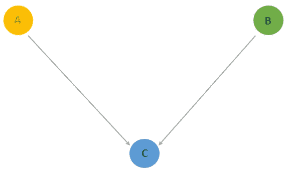
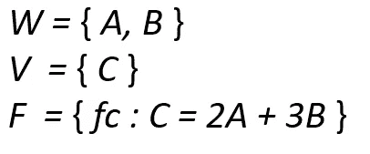

# 因果关系，而非相关性——因果推理的本质

> 原文：<https://towardsdatascience.com/causation-not-correlation-the-nature-of-causal-inference-49dd1a2e5188>

## 结构因果模型的因果建模方法

[来源](https://pixabay.com/illustrations/dominoes-game-play-stone-row-2364492/)

# **1。因果推断**

## **1.1。因果关系**

检测真正因果关系的能力对于在不同类型的领域(如健康、金融、银行等)产生有效的警告是至关重要的。当解释一个系统的元素之间的关系时，因果性这个术语本身不同于相关性，因为它有数学和统计学的基础[1]。

作为文字描述，一个特征 *f1* 可以作为一个例外导致另一个特征 *f2* ，在所有混杂因素都适应的情况下， *f1* 的中断返回 *f2* 的移位；然而， *f2* 中的干扰可能不会输出 *f1* 中的变化。这种情况可以被认为是相关性性质的矛盾事件，当 *f1* 与 *f2* 关联， *f2* 与 f1 关联，而如果 *f1* 导致 *f2* ， *f2* 可能不会导致 *f1* 时，这种相关性在本质上是成比例的。

f1 引起 f2 引起 Z；但是，f2 不会导致 f1(归作者所有)

在没有随机对照的初步研究的情况下，完全依靠观察信息来完成因果联系通常是很重要的。在这种情况下，一段关系不包含因果关系这一可证实的事实就变成了现实。随后，至关重要的是要认识到有特定结果的场合和有关联的场合。

对各种因素之间关系的一个可能的解释是，存在一个令人困惑的变量，它既影响目标，也影响目标背后的主旨，而两者互不因果。看不见的混杂因素代表了从注意到的信息中收集因果关系的真正危险[2]。

考区已做出重要承诺，要改进这类调查的策略和方法。惰性结果设计、倾向分数协调和主要因果模型可能是最著名的观察因果推测系统。

## 1.2.结构因果模型(SCMs)

这种类型的因果模型利用图形模型来处理因果条件，图形模型通过将因素处理为图中的枢纽并将因素之间的连接处理为图中的边来给出直觉感知。SCMs 填补了一个完整的系统，汇集了图形模型，潜在的条件，反事实和干预的基本原理[3]。

每个结构模型可以作为 DAG 来寻址，其中因子作为因子之间的连接来寻址，因子作为边来寻址。推测的因果关系之间的结果和说明性因素是由强大的螺栓解决因果关系。

带有单个链接的因果图形表示示例(归作者所有)

图形模型作为一种组织和想象世界信息的语言，可以融合信息驱动和人类数据源。

反事实赋予了渴望了解的事物解释的能力，而基本条件有效地整合了这两者。SCMs 极大地影响了许多学科，以图解和数学结构授权当前信息的编码，从而利用信息来衡量干预和反事实调查的解决方案。

每个结构模型都可以与一个图形模型相关联，这个图形模型也可以定义为有向无环图(DAG) [4]。每条边都与下面的因果假设相比较。

> 在特征 B 是特征 A 的后代的事件中，我们说 B 是由 A 带来的，或者 A 是 B 的直接原因。
> 
> 如果变量 B 是特征 A 的亲戚，我们说 B 可能是由 A 引起的，或者 A 可能是 B 的原因。

SCM 的图形表示(归作者所有)

从这个描述中，我们可以消除供应链管理模型的许多微妙之处:

*   a 和 B 没有接近边，所以它们是外生变量
*   c 有两个接近的边，所以它是一个内生变量
*   C 有 An 和 B 两个直接原因，或者它倾向于被阐明为 C 的价值依赖于 An 和 B 的上侧并且 *fc=f(A，B)* 。

SCM 图形版本的制定(归作者所有)

## 1.2.1.何时应用结构因果模型

SCM 是两种情况下的最佳决策:

*   *互动场合发生在总的层面，如地区、州、领地。*
*   *单个治疗病例和几个对照病例。*

## 1.3.结构因果模型的好处

使用供应链管理有以下三个好处。

*   *它在 0 和 1 之间分配重要性权重，从而防止外推。外推法意味着我们没有将载荷限制在 0 到 1 的范围内，然而假设重量保持在 100%之外似乎是不合理的。*
*   *它铺开了选择规则，明确了每个给予者的普遍意义。*
*   *工程控制案例看起来与处理案例非常相似，实际上相当。*

# **结论**

因果图，SCMs 基于图表的伙伴对专家也有帮助；他们利用感知以及图表假设的使用来进行因果推断。

每当一个任意的指定在审查中没有被使用，单元可能被有意地分配给条件。总的来说，在两次聚会之间直接检查正常分数可能无法公正地衡量治疗效果。

非常感谢您的提问和评论！

# 参考

1.  [理解和误解随机对照试验](https://www.sciencedirect.com/science/article/pii/S0277953617307359)
2.  [相关性并不意味着因果关系](https://en.wikipedia.org/wiki/Correlation_does_not_imply_causation)
3.  [因果推理导论](https://www.ncbi.nlm.nih.gov/pmc/articles/PMC2836213/)
4.  [有向无环图](https://mixtape.scunning.com/dag.html)
5.  [时间的方向，赖欣巴哈](https://philpapers.org/rec/REITDO-2)