# CFA 论文综述:基于耦合超球的特征适应用于面向目标的异常定位

> 原文：<https://towardsdatascience.com/cfa-paper-review-coupled-hypersphere-based-feature-adaptation-for-target-oriented-anomaly-c3b46316266b>

## 一种新颖的异常定位方法，产生适应于目标数据集的特征并采用迁移学习

妮可·阿瓦里亚诺在 [Unsplash](https://unsplash.com/photos/TeLjs2pL5fA) 上的照片

本文是故事【T4 论文综述:通过修复进行视觉异常检测的重建和 [GANomaly 论文综述:通过对抗训练进行半监督异常检测](https://medium.com/towards-data-science/ganomaly-paper-review-semi-supervised-anomaly-detection-via-adversarial-training-a6f7a64a265f)的延续。在之前的文章中，我介绍了基于重建的方法来识别图像中的异常。诸如自动编码器和生成对抗网络的模型可以用于检测图像中的异常。它们是如何工作的？

它们在训练期间只编码和重建正常图像。在评估中，假设这些模型不应该很好地重建异常图像，因为它们在训练期间没有被馈送，然后，缺陷图像应该比无缺陷图像具有更高的异常分数。然而，这项任务对于复杂的数据集来说是具有挑战性的，并且有时这些类型的方法可以对异常图像产生良好的重建结果，从而导致无法区分异常图像和正常图像。

出于这个原因，我研究了其他类型的异常检测方法，并发现了一种新的方法，称为**基于耦合超球的特征适应** (CFA)。这种方法背后有两个主要思想:

*   它利用预先训练好的 CNN 来提取斑块的特征
*   它采用迁移学习来使特征适应目标数据集，因此，异常特征可以与正常特征清楚地区分。

在这篇文章中，我将回顾介绍这种新颖的异常检测模型的文章。

## 概述

1.  [**要求**](#dec9)
2.  [**CFA 概述**](#edf8)
3.  [**实验设置**](#c96c)
4.  [**量化结果**](#26a4)
5.  [**定性结果**](#63ce)

## 1.要求

当你阅读一篇论文时，总有一些概念是想当然的，是深入理解作品所必需的。如果您不知道这些术语中的某一个，我建议您看看这一部分:

*   **铲子**
*   **转移学习**
*   **视觉异常检测**

## 铲

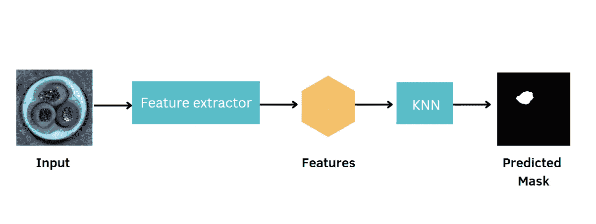

黑桃的例子。在评估过程中，SPADE 提取测试图像在每个像素位置的特征，通过 K 个最近邻找到测试图像与正常图像之间的差异，并返回预测的掩模。

语义金字塔异常检测(SPADE)是一种异常检测方法，它使用预训练的 CNN，如 ResNet-18 和 Wide ResNet-50，来提取有意义的特征[2]。与 CFA 不同，这种方法利用 ImageNet 上的预训练 CNN，而无需学习目标数据集，目标数据集可以具有与馈送给预训练 CNN 的数据集完全不同的分布。

SPADE 包含 3 个不同的阶段来解决异常检测任务:

1.  **预训练的 CNN** 从目标数据集中提取特征。
2.  第二阶段使用 KNN**从每个测试图像的训练集中检索** **K 个最近的正常图像**。使用从训练数据集中提取的表示正态性的特征和测试图像的提取特征之间的欧几里德度量来计算距离。
3.  第三阶段找到目标和正常图像之间密集的像素级对应关系。如果目标图像区域不存在与第二阶段中检索的正常图像的近似匹配，则标记为异常。

## 迁移学习

迁移学习是一个深度学习研究领域，专注于应用以前在一个领域获得的知识来解决一个不同但相关的任务。例如，您可以使用预先训练的 CNN，如之前在 ImageNet 上训练的 ResNet，将图像分类到猫和狗的类别中。

## **视觉异常检测**

视觉异常检测是结合了计算机视觉和异常检测的机器学习领域中的一个重要问题[3]。它可以进一步分为两个不同的类别:

*   **图像级异常检测**仅尝试了解整幅图像是异常还是正常。
*   **像素级异常检测**定位图像内的异常区域。由于这个原因，它通常被称为异常定位。

## **2。CFA 概述**

基于耦合超球的特征自适应(CFA)是一种结合特征提取器和迁移学习的异常定位方法。事实上，它利用迁移学习的原理来创建更健壮和概括的特征，这些特征允许确定目标数据集的输入图像是否异常。

以前的工作只使用预训练的 CNN 而不使用迁移学习，如 SPADE，Padim 和 PatchCore，使用大型数据集，如 ImageNet，取得了非常好的性能。然而，当目标数据集与 ImageNet 完全不同，并且中间层中生成的要素因此有偏差时，这可能是一个挑战。这种方法还有另外两个主要贡献:

*   基于软边界回归，提出了一种新的损失函数,它搜索具有最小半径的超球来聚类正常特征。因此，它允许片描述符提取区别特征，然后，异常特征可以与正常特征清楚地区分。
*   **可扩展** **存储体**的压缩与目标数据集的大小无关。它提供了三个好处:减轻了异常特征被高估的正态性的风险，实现了空间复杂性的效率。

## 基于耦合超球的特征自适应

通过结合基于超球的损失函数和记忆库，解决了预训练 CNN 的偏差问题。它尝试使用 K-means 算法提取**聚类特征** φ(pt ),因为正常特征对于区分异常特征很重要。

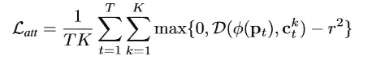

Att Loss [1]。

其中 K 是与面向目标的特征匹配的最近邻的数量，D 是距离度量。因此，CFA 允许通过优化面向目标的特征φ(pt)的参数来进行特征自适应，以通过迁移学习来最小化损失 L_{att}。

为了避免高估异常特征的正态性，定义了附加损失。为了解决这个问题，**硬否定特征**被用于执行对比监督，导致更具判别力的φ(pt)。硬负特征被定义为 pt 的第 K+j 个最近邻 ct^j。损失 L_{rep}对比监督φ()，使得以 ct^j 为中心创建的超球面排斥 pt。

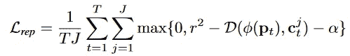

代表损失[1]。

其中 J 是用于对比监督的硬负面特征的总数，α是控制这两个损失 L_{att}和 L_{rep}之间平衡的超参数。因此，这两个损失合并成一个独特的损失:

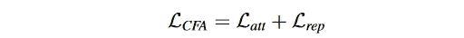

将前面两个损失合并成一个唯一的损失[1]。

## 存储体压缩

目标是构建一个有效的记忆库。首先，通过将 K-means 聚类应用于从训练集 x 的第一个正常样本 x0 获得的所有特征来构建初始记忆库 C0。

*   推断第**个正常样本**并从先前的存储体 C_{i-1}中搜索最近的面片特征集合
*   通过 Ci^{NN}和 C_{i-1}的指数移动平均(EMA)来计算下一状态 Ci 的第**个存储体**

通过对训练集的所有正常样本重复上述过程|X|次，获得最终的记忆库 C。

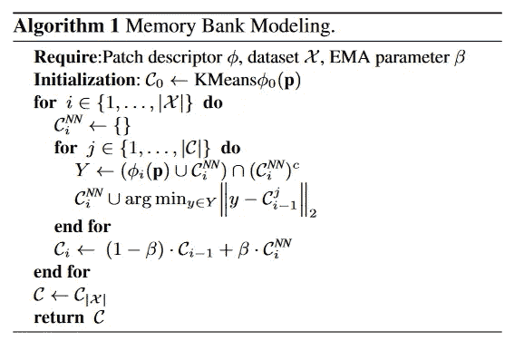

算法与内存条的压缩过程[1]。

我们可以注意到，与其他基于特征提取器而没有迁移学习的方法相比，空间复杂度降低了。特别是，它不依赖于目标数据集|X|的大小。

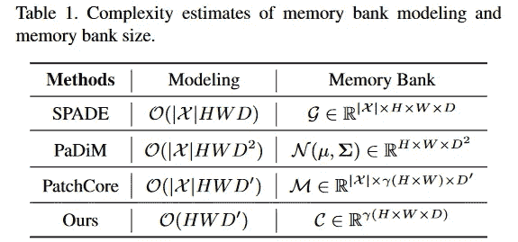

记忆库建模和记忆库大小的空间复杂度估计[1]。

## 评分功能

使用面向目标的特征φ(pt)和记忆的特征之间的最小距离来定义异常分数。

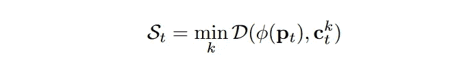

异常分数的定义[1]。

然而，正常特征的聚类之间的边界并不清楚，并且很难用朴素异常分数精确地区分异常特征。为此，提出了一种新的评分函数来考虑φ(pt)的确定性。φ(pt)匹配得越多，与其他记忆特征相比，到特定记忆特征的距离就越短。Softmin 用于衡量最近的 c 与另一个 c 相比有多接近。

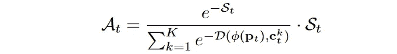

新颖的评分函数[1]。

在评估新方法 CFA 的过程中，我们可以获得异常得分图，该异常得分图构成了异常定位的最终输出。

## 3.实验设置

有两个数据集被认为是评估新方法的基准:MVTec AD 和 RD-MVTec 数据集。虽然 MVTec AD 是一个新颖而全面的工业数据集，包含 5354 幅高分辨率图像，分为 15 个类别，但 RD-MVTec 只是 MVTec AD 的一个副本，样本未经比对。RD-MVTec 的图像在+/-10 度范围内随机旋转。转换后，样本大小调整为 256x256，并随机裁剪为 224x224。

使用受试者操作曲线下面积(AU-ROC)作为度量来评估性能。**图像级 AUROC** 用于评估模型异常检测的性能，而**像素级 AUCROC** 用于评估异常定位的性能。

使用 ImageNet 上所有预训练的 CNN 执行实验，其中从每个预训练的 CNN 的中间层{C2、C3、C4}提取特征图。1x1 CoordConv 被认为是补丁描述符，它被训练 30 个时期。

## 4.定量结果

表 1 和表 2 分别显示了不同异常定位方法在 MVTec AD 数据集和 RD-MVTec AD 数据集上的性能。

*   当考虑 MVTec AD 数据集上的所有类时，CFA++呈现比 CFLOW 稍低的像素级 AUROC 分数。但是应该注意，它利用具有较小空间复杂度的存储体获得了良好的性能。
*   在 RD-MVTec AD 数据集上，异常定位方法的性能低于 MVTec AD 数据集的性能。特别是，SPADE 似乎对图像的旋转更敏感，这大大降低了它的 AUROC 分数。

表 MVTec AD 数据集上不同异常定位方法的图像级 AUROC 和像素级 au pro[1]。

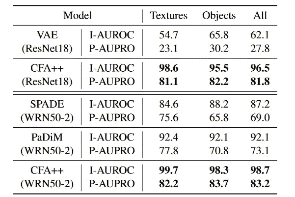

表 2:RD-mv tec AD 数据集上不同异常定位方法的图像级 AUROC 和像素级 au pro[1]。

在表 3 中，通过在 MVTec AD 数据集上可视化每个类别的图像级 ROCAUC 得分，CFA++的性能更加出色。值得注意的是，由于特性适应目标数据集的影响，CFA++在类级别上的性能优于所有其他方法，而在一次处理一个类时，CFLOW 的性能低于 CFA++。

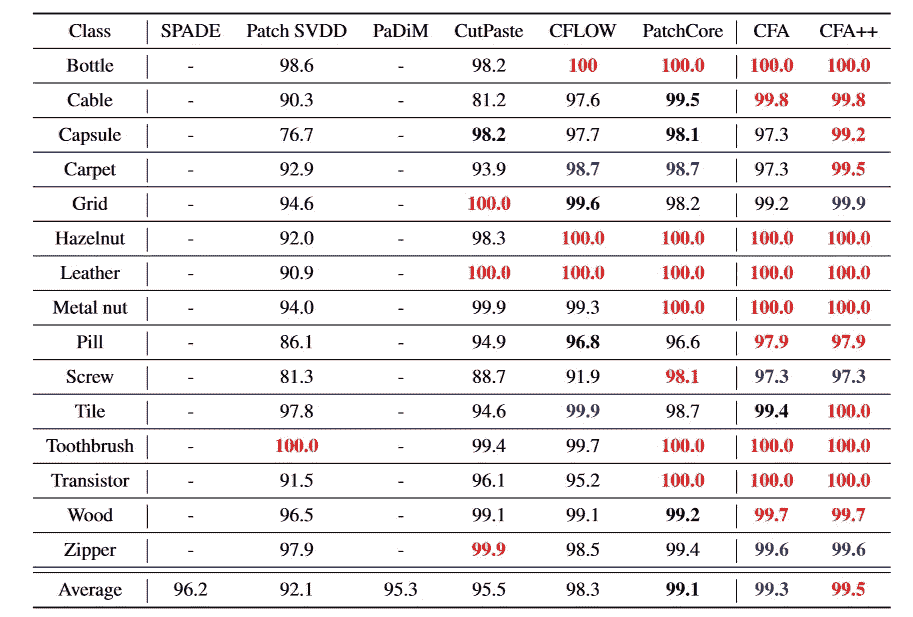

表 MVTec AD 数据集上每个类的图像级 AUROC。

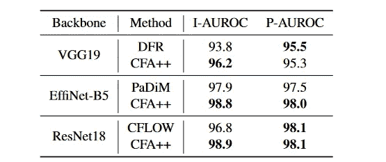

表 MVTec AD 数据集上不同预训练 CNN 的图像级/像素级 ROCAUC 得分[1]。

表 4 允许将异常检测/定位的性能与预训练的 CNN 进行比较。当使用 eff net-B5 和 ResNet18 作为特征提取器时，CFA++获得了最高的性能。

## 5.定性结果

定性结果对于解释由 CFA 产生的特征是否能够区分正常图像和异常图像是重要的。下图显示了两个示例的补片特征的异常分数，一个是容易识别缺陷的瓶子，另一个是具有更具挑战性异常的电缆。

在异常分值中，红色代表异常分值。该可视化想要强调在提取的特征上应用或不应用迁移学习时的差异:

*   当在没有迁移学习的情况下获得特征**时，正常特征的正态性被低估，并且具有与异常特征相似的分数。然后，很难识别两个特征之间的差异，因为基于异常分数的边界是模糊的，不是很清楚*(第二列—有偏差)*。**
*   当在**之后使用迁移学习**获得面向目标的特征时，它们被很好地聚类，如图 1 的第三列所示。然而，单独的聚类不足以精确地对疑难病例的不确定异常特征进行评分。本文提出的评分函数通过考虑确定性来计算异常得分。通过这种方式，我们能够在困难的情况下将异常特征与正常特征区分开来。

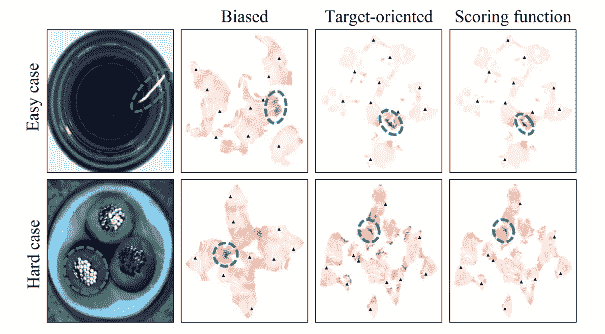

图 1:每个斑块特征的异常分数的 2D 可视化，其中三角形表示记忆的特征，虚线圆圈表示异常特征的区域[1]。

下面是异常定位结果，显示由 CFA 识别的异常区域。

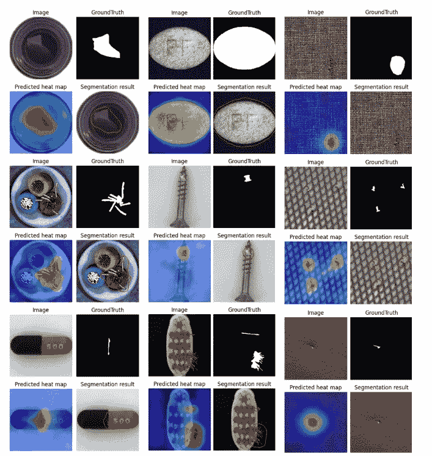

图 2:原始图像 VS 地面实况 VS 预测热图 VS 分割结果[1]。

## 外卖食品

我希望你喜欢 CFA 的这篇评论。正如我不厌其烦地重复的那样，异常检测是一个需要解决的具有挑战性的问题，需要对这些方法进行概述，以了解哪种方法最适合特定的环境。

在上一篇文章中，我建议你看一下解释 [**Skip-GANomaly**](https://arxiv.org/abs/1901.08954) 和 [**AnoGAN**](https://arxiv.org/abs/1703.05921) 的论文。在这篇文章中，我建议你阅读关于**[**PaDiM**](https://arxiv.org/abs/2011.08785)[**cf flow**](https://arxiv.org/abs/2107.12571)和 [**FastFlow**](https://arxiv.org/abs/2111.07677) 的论文。所有这些方法的共同点在于，它们利用预先训练的 CNN 来检测和定位异常。如果你有其他关于阅读的建议，请告诉我，分享知识是提高的最好方法。感谢阅读。祝您愉快！**

## **参考资料:**

**[1] [CFA:基于耦合超球的特征适应用于面向目标的异常定位](https://arxiv.org/pdf/2206.04325.pdf)，S. Lee，S. Lee 和 B. Cheol Song，(2022)**

**[2] [具有深金字塔对应关系的子图像异常检测](https://arxiv.org/pdf/2005.02357v3.pdf)，N. Cohen 和 Y. Hoshen，(2021)**

**[3] [图像的视觉异常检测:一个系统的综述](https://www.sciencedirect.com/science/article/pii/S1877050922000576)，杨军，徐，齐，石，(2022)**

## **GitHub 知识库**

** [## GitHub-sung wool/CFA _ for _ anomaly _ localization

### 通过在 GitHub 上创建帐户，为 sung wool/CFA _ for _ anomaly _ localization 开发做出贡献。

github.com](https://github.com/sungwool/CFA_for_anomaly_localization)** 

**你喜欢我的文章吗？ [*成为会员*](https://eugenia-anello.medium.com/membership) *每天无限获取数据科学新帖！这是一种间接的支持我的方式，不会给你带来任何额外的费用。如果您已经是会员，* [*订阅*](https://eugenia-anello.medium.com/subscribe) *每当我发布新的数据科学和 python 指南时，您都会收到电子邮件！***