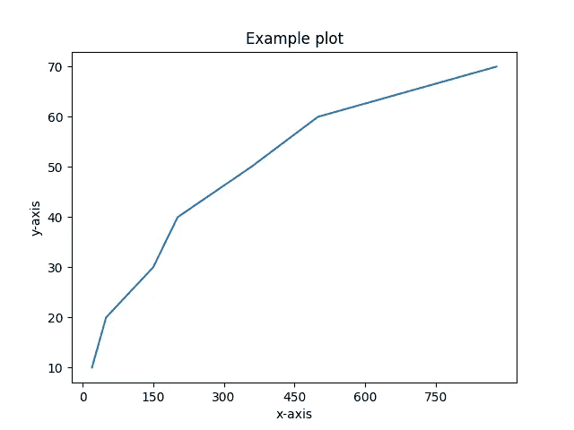
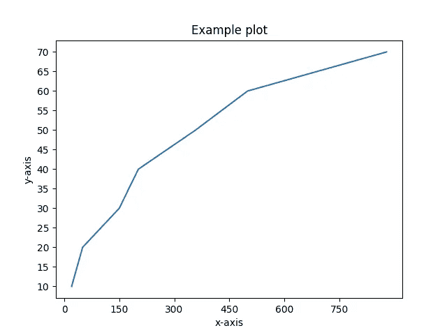

# 如何更改 Matplotlib 轴上的刻度频率

> 原文：<https://towardsdatascience.com/change-tick-frequency-matplotlib-axis-6af2c6bce1ea>

## 在 Python 中更改 Matplotlib 图的 x 轴和 y 轴的刻度频率值


照片由[艾萨克·史密斯](https://unsplash.com/@isaacmsmith?utm_source=medium&utm_medium=referral)在 [Unsplash](https://unsplash.com?utm_source=medium&utm_medium=referral) 上拍摄

在我看来，数据可视化是讲述故事最重要的方面。数据团队通常会投入大量的精力来构建可扩展的数据管道，执行复杂的分析并构建机器学习模型，但最终这一切都归结于交流和讲述故事。换句话说，你如何让非技术人员获得和理解这些发现？

Matplotlib 是 Python 中用于可视化数据点的事实上的库。在今天的简短教程中，我们将演示几种不同的方法，帮助您调整图中 X 轴和/或 Y 轴上的刻度频率。这个频率通常会控制数据点在图表中的显示方式，因此正确设置它非常重要。

首先，让我们用一些虚拟数据点用`matplotlib`和 Python 创建一个示例图:

```
**import** matplotlib.pyplot **as** pltx = [20, 50, 150, 202, 358, 500, 879]
y = [10, 20, 30, 40, 50, 60, 70]plt.plot(x, y)
plt.ylabel('y-axis')
plt.xlabel('x-axis')
plt.title('Example plot')
plt.show()
```

上述代码片段将生成如下所示的图:


示例情节—来源:作者

## 调整 matplotlib 图中轴的刻度频率

我们可以通过调用接受特定 x 轴刻度位置列表的`[matplotlib.pyplot.xticks](https://matplotlib.org/stable/api/_as_gen/matplotlib.pyplot.xticks.html)`方法来明确指定 x 轴上的刻度频率。

因此，我们首先需要准备一个列表，指出 x 轴上记号可见的具体位置。为此，我们可以使用`[numpy.arange](https://numpy.org/doc/stable/reference/generated/numpy.arange.html)`方法，该方法可用于*返回给定区间*内均匀分布的值。

在我们的示例中，假设我们希望看到 x 轴上从值`0`开始到值`900`的刻度，步长为`150`。这将被翻译成

```
plt.xticks(np.arange(0, 900, 150))
```

完整的代码将变成:

```
import matplotlib.pyplot as plt
import numpy as npx = [20, 50, 150, 202, 358, 500, 879]
y = [10, 20, 30, 40, 50, 60, 70]plt.plot(x, y)
plt.ylabel('y-axis')
plt.xlabel('x-axis')
plt.title('Example plot')
plt.xticks(np.arange(0, 900, 150))
plt.show()
```

由此产生的图分享如下:



用 x 轴上更新的分笔成交点频率绘图—来源:作者

同样，我们可以调用`plt.yticks()`方法来相应地调整 y 轴的节拍频率。假设我们希望看到从 y 值的最小值到最大值的分笔成交点，步进频率为`5`。下面的表达式可以解决这个问题:

```
plt.yticks(np.arange(min(y), max(y) + 5, 5))
```

截取的完整代码将变成

```
import matplotlib.pyplot as plt
import numpy as npx = [20, 50, 150, 202, 358, 500, 879]
y = [10, 20, 30, 40, 50, 60, 70]plt.plot(x, y)
plt.ylabel('y-axis')
plt.xlabel('x-axis')
plt.title('Example plot')
plt.xticks(np.arange(0, 900, 150))
plt.yticks(np.arange(min(y), max(y) + 5, 5))
plt.show()
```

由此产生的图分享如下:



更新了图中 y 轴上的刻度频率—来源:作者

## 最后的想法

最终，一切都归结于数据可视化和故事讲述。你可以建立最好的数据管道，应用最佳实践，进行出色的分析——但如果你不能可视化并恰当地传达发现，那么这些都不重要。

因此，作为这一过程的一部分，重要的是要确保你能够正确地将数据可视化，并将其转化为有意义的图表，供想要了解任何见解的读者使用。

在今天的简短教程中，我们演示了几种不同的方法，它们将帮助您在使用 Python 创建的 matplotlib 图和绘图上调整 X 轴和 Y 轴上的刻度频率。正如我们在一些实际例子中看到的，这种配置可以帮助你根据你想要可视化的内容来放大或缩小你的图形。

[**成为会员**](https://gmyrianthous.medium.com/membership) **阅读介质上的每一个故事。你的会员费直接支持我和你看的其他作家。你也可以在媒体上看到所有的故事。**

<https://gmyrianthous.medium.com/membership>  

**相关文章你可能也喜欢**

</legend-outside-the-plot-matplotlib-5d9c1caa9d31>  </plot-logarithmic-axes-matplotlib-python-bb8533f430c0>  </save-plots-matplotlib-1a16b3432d8a> 