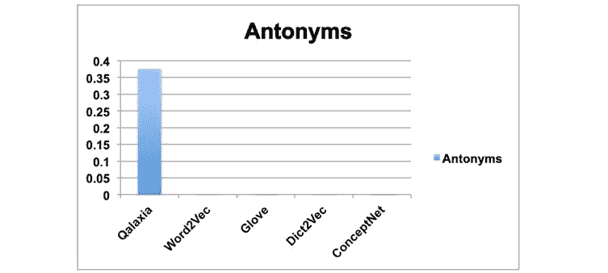

# 单词嵌入的特征

> 原文：<https://towardsdatascience.com/characteristics-of-word-embeddings-59d8978b5c02>

## [单词嵌入入门](https://towardsdatascience.com/tagged/word-embeddings-primer)

## 反义词的问题

照片由[精心设计](https://unsplash.com/@conscious_design)在 [Unsplash](https://unsplash.com/?utm_source=medium&utm_medium=referral) 上拍摄

本文是 6ᵗʰ系列文章**中关于单词嵌入的入门:** 1。[word 2 vec 后面有什么](https://medium.com/@jongim/a-primer-on-word-embeddings-95e3326a833a) | 2。[单词成向量](https://medium.com/@jongim/words-into-vectors-a7ba23acaf3d) |
3。[统计学习理论](https://medium.com/@jongim/statistical-learning-theory-26753bdee66e) | 4。[word 2 vec 分类器](https://medium.com/@jongim/the-word2vec-classifier-5656b04143da) |
5。[word 2 vec 超参数](https://medium.com/@jongim/the-word2vec-hyperparameters-e7b3be0d0c74) | 6。**单词嵌入的特征**

在上一篇文章[**Word2vec 超参数**](https://medium.com/@jongim/the-word2vec-hyperparameters-e7b3be0d0c74) 中，我们通过了解 word 2 vec 算法的文本预处理建议、重新加权技术和优化设置，完成了对它的研究。

在本文中，我们将评估典型单词嵌入的优缺点，特别是来自 Word2vec 的那些。

# 词义和词义消歧

Manning 和 Schütze 的名为*自然语言处理统计基础*的书专门用了 36 页的章节来讨论词义消歧(Manning 和 Schütze，1999)。这是因为多义词，即具有多个含义的词的处理长期以来被认为是 NLP 中的一个重要问题。

1998 年，斯特蒂娜和高娜通过 WordNet 使用语义标记计算了当今美国英语布朗大学标准语料库([布朗语料库](https://en.wikipedia.org/wiki/Brown_Corpus))中每个单词的平均词义数量，从而量化了这个问题的程度。他们发现每个单词平均有 5.8 个意思。他们还量化了语料库中具有多种含义的单词的百分比，如下所示:

> 虽然词典中的大多数单词都是单义的，但在演讲和文章中出现频率最高的却是多义词。例如，WordNet 中超过 80%的单词是单义的，但是在测试的语料库中几乎 78%的实词有不止一个义项。*(斯特蒂娜和高娜，1998)*

然而，由 Word2vec 产生的单词嵌入即使对于多义词也能很好地运行。正如 Neelakantan 等人(2014 年)所解释的，原因是“在适度高维空间中，一个向量可以一次相对‘接近’多个区域。”然而，由和 Mooney 在 2010 年以及黄等人在 2012 年发表的早期论文证明了当在单个词嵌入上使用聚类技术开发多个向量原型时对词向量表示的改进。

根据 Ruas 等人在 2019 年发表的一篇论文，该论文对多义词嵌入的历史发展进行了广泛的回顾，关于 Word2vec 的多协议类型嵌入的论文数量很少。事实上，只有两篇论文使用了 Skip-gram，这两篇论文都发表于 2014 年，第一篇由 Tian 等人发表，第二篇由 Neelakantan 等人发表。Tian 等人(2014 年)设计了一种使用 Skip-gram 和分层 softmax 的期望最大化算法，Neelakantan 等人(2014 年)提出了一种 Skip-gram 的扩展，该扩展使用上下文词平均在 SGNS 训练期间区分多个义项。两种方法都显示出有希望的结果。

Ruas 等人还讨论了其他研究人员的工作，这些工作整合了结构化信息，如来自词汇数据库的词性，如 [WordNet](https://wordnet.princeton.edu) 以帮助每个词向量的意义表示。Ruas 等人(2019)将其他研究人员的这些发现与他们自己使用词汇数据库为每个词义创建单独向量的方法进行了对比。

2015 年，李和朱拉夫斯基断言，“为一个歧义词的每一个意义获得一个不同的表示可以导致更强大和更细粒度的向量空间表示模型。”然而，在他们自己的关于何时证明多义词嵌入合理的模型的结论中，他们指出:“我们的结果表明，简单地增加基线跳格嵌入的维度有时足以实现与使用多义嵌入相同的性能优势”(李和 Jurafsky，2015)。尽管如此，Gladkova 和 Drozd 在他们 2016 年关于评估单词嵌入的论文中，假设一词多义如此重要，以至于它是“房间里的大象”(Gladkova 和 Drozd，2016)。

事实上，对多协议类型嵌入需求的一些模糊性来自于对如何衡量成功缺乏共识。Dubossarsky 等人在 2018 年反对一般意义上的特定向量，因为它们的好处通常是使用单词相似性任务来衡量的，这可能导致假阳性结论(Dubossarsky 等人，2018)。

# 单词嵌入向量的结构

Word2vec 的训练算法涉及一个对数线性函数，我们在本系列的第四篇文章 [**中介绍过 Word2vec 分类器**](https://medium.com/@jongim/the-word2vec-classifier-5656b04143da) 。虽然目标函数的最小值是非凸的，因为目标和上下文单词的表示 *t* 和 *c* 是共同学习的(Goldberg 和 Levy，2014)，但是在嵌入中观察到线性关系。这些线性关系是 Arora 等人 2018 年论文的主题，该论文考虑了词嵌入中词义的线性代数结构。Arora 等人提供了理论和实验结果，表明一个多义词的向量本质上是独立意义向量的加权平均值(Arora 等人，2018)。这一发现可能与本系列第一篇文章中介绍的向量数学有关，并以*国王男人+女人≈王后*为例进行了说明。

单词嵌入的线性关系也支持从向量中归纳单词含义的能力(Arora 等人，2018；穆等，2016)。它们还可能有助于尝试找到一种统计测试，以确定何时需要多义词嵌入的临界值(Oomoto 等人，2017 年)。

多义词向量的另一个特征是它们的大小。在本系列的第二篇文章中， [**单词成向量**](https://medium.com/@jongim/words-into-vectors-a7ba23acaf3d) ，当描述为什么*同相似度*优于其他距离度量时，我们注意到更频繁的单词往往具有更大幅度的向量，或 *L* 范数。这种趋势在向量空间模型中通常是真实的，但是当应用有限的上下文窗口(如 Word2vec 所使用的)时，还有其他因素。

Schakel 和 Wilson 在 2015 年的论文中证明，对于固定的上下文窗口，向量大小实际上随着频率而增加，但对于出现在多个上下文中的单词，向量大小往往会缩小，因为多义性将向量值拉向多个方向。基于这一观察，Schakel 和 Wilson 讨论了一个单词的“重要性”，他们使用向量幅度与单词频率的比率来衡量与其他以相同频率出现的单词的关系。一般来说，多义词往往有较小的向量幅度，给定其整体词频(Schakel 和 Wilson，2015)。

# 反义词和单词嵌入

即使单词嵌入相当好地完成了单词相似性任务和类似于*国王男人+女人≈王后*的类比，它们也有缺点。对于同义词，单词嵌入通常执行正确，但是对于多义词，执行不太好。

此外，单词嵌入不区分反义词。他们对待反义词更像同义词，因为反义词往往出现在相同的语境中，因为他们的对立面(雷辛格和穆尼，2010；Turney 和 Pantel，2010 年)。例如，以下对立短语通常在附近文本的内容中差别很小:

*何***确认** *预约。
何* ***取消了*** *的预订。*

大多数区分反义词的方法依赖于词汇数据库。然而，一些研究者，最著名的是 Samenko 等人，已经找到了在标准单词嵌入本身中寻找反义词信息痕迹的方法。

克服单词嵌入中的反义词的挑战的技术在继续发展。例如，2021 年由 [Qalaxia](https://www.qalaxia.com/) 发布的下图显示了一个扩展的更大的类比测试集( [BATS](https://vecto.space/projects/BATS/) )反义词测试集的令人印象深刻的结果:

**反义词在扩展蝙蝠反义词测试集**
上的表现(作者[卡拉夏](https://www.linkedin.com/posts/qalaxia_nlp-ai4good-innovation-activity-6827121691450318848-v154)，2021，经许可转载)

Samenko 等人对反义词这一主题进行了综述(Samenko 等人，2020)。

# 超越 Word2vec

自 2013 年 Word2vec 发布以来，研究人员积极地继续开发其他算法来改善单词嵌入。像 Word2vec 一样“肤浅”且值得更详细讨论的两个重要算法是 GloVe 和 fastText。

手套是由斯坦福大学的一组研究人员在 2014 年发明的。GloVe 代表“全局向量”，它基于全局单词-单词共现统计，使用类似于本系列第二篇文章中讨论的降维技术的技术， [**单词到向量**](https://medium.com/@jongim/words-into-vectors-a7ba23acaf3d) ，其中数据被收集，然后降维。GloVe 的技术产生的单词嵌入具有与 Word2vec 的嵌入类似的属性，并且在测试时，它产生的结果略好于 word 2 vec(Pennington 等人，2014)。

继 GloVe 之后， [fastText](https://fasttext.cc) 于 2016 年在 Word2vec 的创作者 Mikolov 和脸书的 AI 研究团队(Bojanowski 等人，2016；Joulin 等人，2016)。fastText 不仅将 Word2vec 的训练扩展到单词，还扩展到字母组(称为*字符 n-grams* )，这允许对训练词汇中不存在的单词进行更准确的建模。

Word2vec、GloVe 和 fastText 是用于创建单词嵌入的三种主要的浅层神经网络算法。

在 GloVe 和 fastText 的开发之后，使用上下文化单词表示的深度学习系统的研究取得了进展。目前，AllenNLP [ELMo](http://allennlp.org/elmo) 、OpenAI 的 [GPT](http://arxiv.org/abs/2005.14165) 和 Google 的 [BERT](http://arxiv.org/abs/1810.04805) 是三个使用*上下文嵌入*的流行深度学习系统(Ethayarajh，2019；Ethayarajh，2020)。在这些系统中，单词嵌入是基于上下文动态更新的，例如周围的句子和其他上下文线索。为了完成他们的 NLP 任务，这三个系统使用深度学习技术，如一种称为长短期记忆(LSTM)的递归神经网络(RNN)和变形金刚( [Ghati，2020](https://medium.com/@gauravghati/comparison-between-bert-gpt-2-and-elmo-9ad140cd1cda) )。

随着时间的推移，埃尔莫，GPT 和伯特已经变得非常准确，并导致了重大的自然语言处理应用程序的改进。然而，因为它们是深度神经网络，所以它们是计算密集型的。

# 摘要

在本文中，我们回顾了由浅层神经网络算法(如 Word2vec、GloVe 和 fastText)生成的单词嵌入的一些特征。这些算法通常工作良好，但受到多义词和反义词的挑战，改进浅层神经网络的研究正在进行中。我们还了解了三个更受欢迎的使用上下文嵌入的深度学习系统，以及它们的优点和缺点。

在这个系列文章中，**关于单词嵌入的初级读本**，我们研究了单词嵌入是如何包含单词在实际使用时的关系信息的，以及这些关系是如何用数学方法表达的。我们揭示了单词嵌入如何发挥作用并为计算应用程序提供价值，例如搜索引擎和消息应用程序的自动完成功能中的单词预测。

我们了解到，创建单词嵌入所涉及的数据收集和处理深深植根于统计理论。虽然 NLP 中使用的数据不一定是随机的或参数分布的，并且使用了重新加权和压缩技术来将数据转换为实用的信息，但概率和统计理论是 NLP 不可或缺的一部分。

我们还了解了浅层神经网络在创建单词嵌入方面的能力。通过详细研究 Word2vec 学习算法，我们发现并不仅仅是 Word2vec 的新颖算法导致了它的显著成功。Word2vec 特殊的数据处理技术对其有效性和广泛采用至关重要。

最后，我们了解了单词反义词和具有多重含义的单词给 NLP 带来的挑战，以及 NLP 如何通过利用深度学习技术做出响应。

单词嵌入的应用非常广泛:搜索引擎、情感分析、语言翻译、推荐引擎、文本预测、聊天机器人等等。随着如此多的人类交流在网上发生，通常以数字或图像的形式，但更多的是以文本和语音的形式，改进和更好地利用单词嵌入的探索将会继续。我想我们会对未来几年的发展印象深刻。

具有可操作价值的信息(知识)通常以文字的形式在人们之间交流，而书面文本通常是我们尽力总结这些信息的方式— *走向数据科学*就是这样一个知识库！

虽然在实践层面上，单词嵌入是统计导出的值，以表示应用中的单词，但在更深的层面上，它们使用语言中单词的关系来阐明意义。

这篇文章是 6ᵗʰ系列文章**中关于单词嵌入的初级读本:** 1。[word 2 vec 背后有什么](https://medium.com/@jongim/a-primer-on-word-embeddings-95e3326a833a) | 2。[单词成向量](https://medium.com/@jongim/words-into-vectors-a7ba23acaf3d) |
3。[统计学习理论](https://medium.com/@jongim/statistical-learning-theory-26753bdee66e) | 4。[word 2 vec 分类器](https://medium.com/@jongim/the-word2vec-classifier-5656b04143da) |
5。[word 2 vec 超参数](https://medium.com/@jongim/the-word2vec-hyperparameters-e7b3be0d0c74) | 6。单词嵌入的特征

**关于这个主题的更多信息:**我推荐的一个了解更多关于单词嵌入属性的资源是一篇在 ICML 2019 年获得最佳论文荣誉奖的论文:Allen，c .和 Hospedales，T. (2019)。类比解释:理解单词嵌入。在*机器学习国际会议上*。可从 [arXiv:1901.09813](https://arxiv.org/abs/1901.09813) 获得。

如果你想了解更多关于*语境嵌入*，Ghati 的文章《[伯特、GPT-2、埃尔莫](https://medium.com/@gauravghati/comparison-between-bert-gpt-2-and-elmo-9ad140cd1cda)之间的比较》(*中)*是一个很好的介绍。

如果您想开始使用 Word2vec 算法，Chia 的“[使用 NumPy 和 Google Sheets 的 Word2Vec 实现指南](/an-implementation-guide-to-word2vec-using-numpy-and-google-sheets-13445eebd281)”包括一个可下载的 Python 脚本，它很容易设置，并且有一些图表有助于描述向量和矩阵数学，尽管实现非常基础。或者， [PyTorch 版本的 Word2vec](https://medium.com/search?q=word2vec+pytorch) 可以在*上找到，走向数据科学，*和 [TensorFlow](https://www.tensorflow.org/tutorials/representation/word2vec) 都有教程。

最后，如果您想要从更大的语料库中创建可用的单词嵌入，或者使用一组预训练的嵌入启动应用程序， [Gensim](https://radimrehurek.com/gensim/models/word2vec.html) 具有 Word2vec 和 fastText 的完整实现，并使用 Python 接口在 C 中进行了优化。您还可以从 Word2vec、fastText 和 GloVe online 中找到标准的预训练嵌入。

# 参考

Arora，s .，Li，y .，Liang，y .，Ma，t .，和 Risteski，A. (2018 年)。词义的线性代数结构及其在多义词中的应用。计算语言学协会汇刊，6:483–495。可在 [arXiv:1601.03764v6](https://arxiv.org/abs/1601.03764v6) 获得。

Bojanowski，p .，Grave，e .，Joulin，a .，和 Mikolov，T. (2016 年)。用子词信息丰富词向量。可在 [arXiv:1607.04606](https://arxiv.org/abs/1607.04606) 获得。

Chia，D. (2018)。使用 NumPy 和 Google Sheets 的 Word2Vec 实现指南。*走向数据科学。*

Dubossarsky、e . Grossman 和 d . wein shall(2018 年)。多义词研究中的控制和评价集。*自然语言处理经验方法会议论文集*，第 1732-1740 页。计算语言学协会。可在 doi[10.18653/v1/D18–1200](https://www.researchgate.net/deref/http%3A%2F%2Fdx.doi.org%2F10.18653%2Fv1%2FD18-1200)处获得。

Ethayarajh，K. (2019)。语境化的单词表征有多语境化？比较伯特、埃尔莫和 GPT-2 嵌入的几何学。*2019 自然语言处理经验方法会议暨第九届国际自然语言处理联合会议论文集*，第 55–65 页。 [PDF](https://www.aclweb.org/anthology/D19-1006.pdf) 。

Ethayarajh，K. (2020 年)。伯特、埃尔莫和 GPT-2:语境化的词汇表征有多语境化？ *Github* 。

Ghati，G. (2020)。伯特、GPT-2 和埃尔莫的比较。*中等*。

Gladkova，a .和 Drozd，A. (2016)。单词嵌入的内在评估:我们能做得更好吗？*评估自然语言处理矢量空间表示的第一次研讨会会议记录*，第 36–42 页。计算语言学协会。可在 doi[10.18653/v1/W16–2507](http://dx.doi.org/10.18653/v1/W16-2507)处获得。

Goldberg 和 o . Levy(2014 年)。word2vec 解释:推导 Mikolov 等人的负采样单词嵌入法。可从 [arXiv:1402.3722v1](https://arxiv.org/abs/1402.3722v1) 获得。

黄(e .)、索赫尔(r .)、曼宁(c .)和吴(a .)(2012 年)。通过全局上下文和多个单词原型改进单词表示。计算语言学协会第 50 届年会会议记录，第 873-882 页。 [PDF](https://www.aclweb.org/anthology/P12-1092/) 。

Joulin，a .，Grave，e .，Bojanowski，p .，和 Mikolov，T. (2016 年)。高效文本分类的窍门。可在 [arXiv:1607.01759](https://arxiv.org/abs/1607.01759) 获得。

李和朱拉夫斯基博士(2015 年)。多义嵌入能提高自然语言理解吗？*2015 年自然语言处理经验方法会议论文集*，第 1722–1732 页。可在 doi[10.18653/v1/D15–1200](http://dx.doi.org/10.18653/v1/D15-1200)处获得。

曼宁和舒策(1999 年)。*统计自然语言处理基础*。麻省剑桥:麻省理工学院出版社。

Mu，j .，Bhat，s .，和 Viswanath，P. (2016 年)。多义的几何学。可从 [arXiv:1610.07569v1](https://arxiv.org/abs/1610.07569v1) 获得。

Neelakantan，a .，Shankar，j .，Passos，a .，和 McCallum，A. (2014 年)。向量空间中每个词多重嵌入的有效非参数估计。*2014 年自然语言处理经验方法会议论文集*，第 1059–1069 页。计算语言学协会。可在 doi[10.3115/v1/D14–113](http://dx.doi.org/10.3115/v1/D14-1113)处获得。

Oomoto，k .，Oikawa，h .，Yamamoto，e .，Yoshida，m .，Okabe，m .，Umemura，K. (2017)。词义分布式表征中的多义词检测。可从 [arXiv:1709.08858v1](https://www.google.com/url?sa=t&rct=j&q=&esrc=s&source=web&cd=&ved=2ahUKEwjmmPe6qdjtAhUB2qQKHRXOACMQFjAAegQIBBAC&url=https%3A%2F%2Farxiv.org%2Fpdf%2F1709.08858&usg=AOvVaw0VLUlF9f89DQZlyPEIaFG3) 获得。

Pennington、r . Socher 和 c . Manning(2014 年)。GloVe:单词表示的全局向量。*2014 年自然语言处理经验方法会议论文集*，第 1532-1543 页。 [PDF](https://www.google.com/url?sa=t&rct=j&q=&esrc=s&source=web&cd=&ved=2ahUKEwj_r9_nsartAhUMC-wKHXu4BqYQFjABegQIAxAC&url=https%3A%2F%2Fnlp.stanford.edu%2Fpubs%2Fglove.pdf&usg=AOvVaw3XPTcwWcbYOXnahjvpeDTu) 。

雷辛格和穆尼(2010 年)。词义的多原型向量空间模型。人类语言技术会议录:计算语言学协会北美分会会议，第 109-117 页。 [PDF](https://www.aclweb.org/anthology/N10-1013/) 。

Ruas、w . gro sky 和 a . Aizawa(2019 年)。通过词义消歧过程实现的多义嵌入。*专家系统与应用*，136:288–303。在 doi[10.1016/j . eswa . 2019 . 06 . 026](https://doi.org/10.1016/j.eswa.2019.06.026)有售。

Samenko，I .，Tikhonov，a .，Yamshchikov，I. (2020)。同义词和反义词:嵌入冲突。可从 [arXiv:2004.12835v1](https://arxiv.org/abs/2004.12835v1) 获得。

a . m . j . schakel 和 b . j . Wilson(2015 年)。使用单词的分布式表示来测量单词的重要性。可从 [arXiv:1508.02297v1](https://arxiv.org/abs/1508.02297) 获得。

斯蒂纳和高娜(1998 年)。基于完整句子上下文的通用词义消歧方法。**自然语言处理杂志*，5 卷 2 期:47–74 页。*

*特尼博士和潘特尔博士(2010 年)。从频率到意义:语义学的向量空间模型。*人工智能研究杂志*，37:141–188。 [PDF](https://www.researchgate.net/publication/45904528_From_Frequency_to_Meaning_Vector_Space_Models_of_Semantics) 。*

**除非另有说明，数字和图像均由作者提供。*