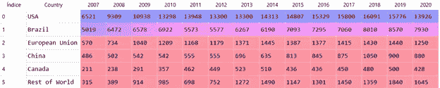
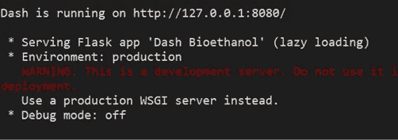
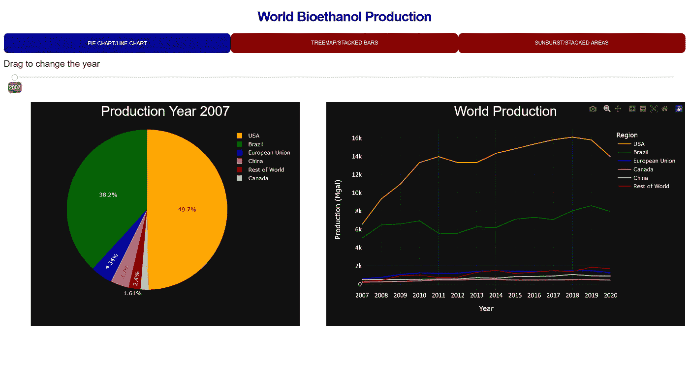
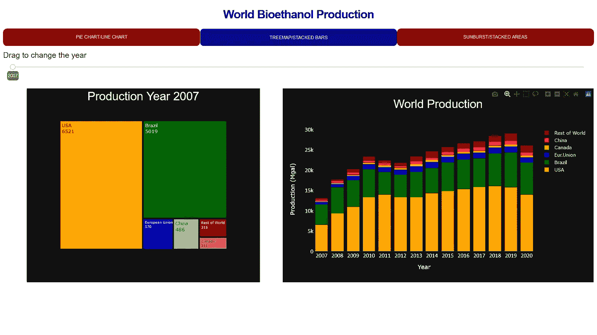
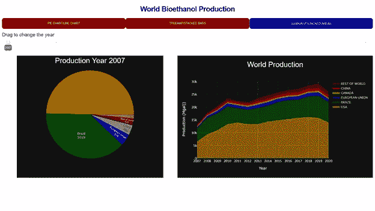
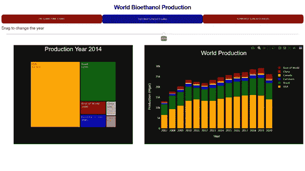

# 用虚线绘制图表

> 原文：<https://towardsdatascience.com/charting-with-dash-583b65a22ace>

# **用绘图破折号制图**

## **3:使用破折号选择图表以更好地讲述故事**


[戴红帽的女孩](https://unsplash.com/@girlwithredhat?utm_source=medium&utm_medium=referral)在 [Unsplash](https://unsplash.com?utm_source=medium&utm_medium=referral) 上的照片

# **简介**

数据可视化中最常见的问题之一是试图根据消息的性质建立最合适的图**。**当可视化的目标不仅仅是显示给定时间段内各种定量变量的趋势或变化模式，而是将其与**成分分析**(组成整体的各个部分是如何相关的)联系起来时，这个问题就更加重要了。最常用的可视化工具是多折线图、堆积条形图和堆积面积图。

当对应于显示的水平轴的时间段具有许多值时，可能难以确定垂直轴上指示的每个数值变量的精确值。然后可以方便地添加第二个图表来显示这些确切的值，以提高消息的质量。在这种情况下，最常用的可视化工具是饼状图、树形图和旭日图。

问题是:对于上述情况，哪种组合可以实现最佳的讲故事效果？

我们将尝试通过使用 Python 框架 Dash 的应用程序来回答这个问题，使用的数据集对应于 2007-2020 年期间的世界生物乙醇产量。

# **破折号**

Dash 是一个开源的免费库，由加拿大蒙特利尔的 IT 公司 **Plotly** 创建。它是一个 **python 框架**，用于创建名为 **Dash Apps** 的 dataviz 应用和仪表盘。Dash 主要基于 ReactJS(前端)、Flask(后端)、Plotly(数据可视化工具)。

Dash Apps 有几个优点:(1)你不仅可以用 python 设计应用，还可以用 Julia，。NET，或 R；(2)您不需要成为 Java、CSS 或 HTML 方面的专家来构建分析型 web 应用程序；(3)应用程序呈现在浏览器中，您可以通过 URL 与几个人共享您的仪表板；(4)它是多平台的，应用程序的设计可以调整到任何你想使用它的屏幕。

# **仪表盘应用**

为了更好地理解本文中开发的一些概念，我推荐阅读我以前在这个中型平台上写的关于 Dash 的文章([用 Plotly Dash 1 制作图表:损耗模式](/charting-with-plotly-dash-fa96c171409b)，[用 Dash 2 制作图表:用于转换的单选项目)。](/charting-with-plotly-dash-ee9334441c11)

本质上，Dash 应用由**两部分组成:** (1)描述应用外观的**布局**；(2)允许应用程序被动响应的**回调**。

我们总是通过布局开始构建应用程序的过程。这是我们放置应用程序组件的地方。为此，我们使用了两个库:(1)*dash _ html _ components(html)*它提供了 HTML 组件(标题、段落、换行符等的 HTML 标签。);(2)*dash _ core _ components(DCC)*提供了滑块、图形、下拉等组件。布局清楚地定义了我们的应用程序的视觉外观。

每个 Dash 应用的反应性(交互性)都是通过回调来实现的。这是一个有两个部分的**函数:(1)装饰器**，在这里你指出输入和输出组件。用户可以修改输入组件。输出组件显示应用对输入组件变化的反应。装饰器必须用 *@app.callback()* 初始化；(2)**函数定义**，根据某个输入组件的变化，对要显示的活动进行编码。函数定义必须用 *def* 初始化。****

# ****我们的 Dash App****

**我们的布局包括以下内容:**

*   **标题在最上面；**
*   **三个选项卡，每个选项卡都有一个相关的回调函数( *dcc。tab*)；**
*   **一个滑块，用户可以在那里拖动来改变年份( *dcc。滑块*)；**
*   **两个图表:左边的图表显示了特定年份的生物乙醇产量；右边的图表显示了世界生物乙醇的产量。图表**

**我们的回拨包括以下内容:**

*   **两个输入:一个用于选项卡组件，另一个用于滑块[ *Input()* ]**
*   **两个输出:一个用于屏幕左侧的图表，另一个用于屏幕右侧的图表 *(Output())***
*   **函数 build_graph，我们在其中对将显示在屏幕上的六个图表进行编码( *def build_graph()* )**

# ****我们的代码****

**我们使用了一个**公共领域数据集**:按国家或地区划分的全球乙醇产量(百万加仑)。数据来源:[可再生燃料协会(RFA)](https://ethanolrfa.org/markets-and-statistics/annual-ethanol-production) 。最后更新 2021 年 6 月[1]。**

**像往常一样，我们通过导入熊猫库作为 *pd* ，Plotly Express 作为 *px* ，plotly.graph_objects 作为 *go* ，并将我们的 *csv* 文件转换成 dataframe 来开始代码:**

```
import pandas as pd
import plotly.express as px
import plotly.graph_objects as go# Step 1: world bioethanol production (units in Mgal)
df_bioet = pd.read_csv(path + 'world_bioethanol_2007_2020.csv',
               index_col = False, sep = ';', engine = 'python',
               header = 1)
```

**首先，我们必须执行某些替换，并将 pandas 对象转换为指定的数据类型:**

```
df_bioet['2007']  = df_bioet['2007'].str.replace(',','')
df_bioet['2008']  = df_bioet['2008'].str.replace(',','')
………………………………………………………………………………………………………………………………………………….
df_bioet['2019']  = df_bioet['2019'].str.replace(',','')
df_bioet['2020']  = df_bioet['2020'].str.replace(',','')df_bioet = df_bioet.astype(
           {'2007': int, '2008': int, '2009': int, '2010': int,
            '2011': int, '2012': int, '2013': int, '2014': int,
            '2015': int, '2016': int, '2017': int, '2018': int,
            '2019': int, '2020': int},
             errors = 'ignore')df_bioet['Country']= df_bioet['Country'].apply(str)
tipo1 = df_bioet.dtypes
```

**我们必须对原始数据帧进行一定数量的修改，以将其转换为适合绘图的数据帧:**

```
df_bioet_f1 = df_bioet.iloc[-1:]
df_bioet_f1 = df_bioet_f1.transpose()df_bioet_f1.columns = df_bioet_f1.iloc[0]
df_bioet_f1 = df_bioet_f1[1:]df_bioet_f1.index.names = ['Year']
df_bioet_f1.reset_index(level = 0, inplace = True)df_bioet_f2 = df_bioet.iloc[:-1]
```

**下面的屏幕截图显示了名为 df_bioet_f2 的数据帧的记录:**

****

**作者图片**

**现在我们准备好第一张图表:一张特定年份世界生物乙醇产量的 [**标准饼状图**](/pie-donut-charts-with-plotly-d5524a60295b)；**

```
h1 = 600
w1 = 600
year = '2007'
text_title = "World Bioethanol Production "
titlefont  = dict(family = 'Arial', color='white', size= 30)col_discr_map = {'USA':'orange', 'Brazil':'darkgreen',
                 'European Union':'blue', 'CANADA': 'yellow',
                 'CHINA' : 'red','Rest of World' : 'darkred'}# First Figure: pie for a specific yearfig1 = px.pie(data_frame = df_bioet_f2,
              values = '2007', names = 'Country',
              color = 'Country',
              color_discrete_map= col_discr_map)fig1.update_layout(template = 'plotly_dark',
            title = dict(text = text_title + str(year),  x = 0.5),
            title_font= titlefont,
            width  = w1, height = h1)
```

**我们的第二张图是生物乙醇生产区域的**多线图**:**

```
xyaxesfont = dict(family='Verdana', color='white', size= 15)
xytickfont = dict(family='Calibri', color='white', size= 15)# Second Figure: line chart for productive regionsdf_bioet_f4 = df_bioet_f2.transpose()
df_bioet_f4.columns = df_bioet_f4.iloc[0]
df_bioet_f4 = df_bioet_f4[1:]df_bioet_f4.rename(columns={'Country': 'Year'})
df_bioet_f4.index.names = ['Year']
df_bioet_f4.reset_index(level = 0, inplace = True)fig2 = px.line(df_bioet_f4, x = 'Year', y = ['USA', 'Brazil', 
               'European Union','Canada',
               'China', 'Rest of World'],
                color_discrete_map= col_discr_map)fig2.update_layout(template = 'plotly_dark',
                   hovermode = 'y',
                   legend_title="Region",
                   width  = w1 +200, height = h1)fig2.update_xaxes(title_text = 'Year',
                  title_font = xyaxesfont,
                  tickfont   = xytickfont)fig2.update_yaxes(title_text = "Production (Mgal)",
                  title_font = xyaxesfont,
                  tickfont   = xytickfont)
```

**现在是时候开始开发我们的应用程序了。**

**在本文中，我们假设您已经安装了库 Dash 如果没有，请遵循这些说明[。](https://dash.plotly.com/installation)**

**首先我们需要导入以下库:*破折号*，主库；*dash _ html _ components(html)*用于构建布局；*dash _ core _ components(DCC)*渲染一组选项卡、一个滑块和 plotly 图形；*输出，输入*来自模块 *dash.dependencies* 的函数用于回调装饰器。**

```
import dash
from dash import html
from dash import dcc
from dash.dependencies import Output, Input
```

**现在，是时候定义一些 *css* 属性来对布局中包含的组件(尤其是选项卡)进行样式化了:**

```
external_stylesheets=['https://codepen.io/chriddyp/pen/bWLwgP.css']app = dash.Dash(__name__, external_stylesheets=external_stylesheets)tab_style = {"background": "darkred",'color': 'white',
             'text-transform': 'uppercase',
             'justify-content': 'center',
             'border': 'grey','border-radius': '10px',
             'font-size': '12px','font-weight': 600,
             'align-items': 'center','padding':'12px'}tab_selected_style = {"background": "darkblue",'color': 'white',
                      'text-transform': 'uppercase',
                      'justify-content': 'center',
                      'border-radius': '10px',
                      'font-weight': 600,'font-size': '12px',
                      'align-items': 'center','padding':'12px'}
```

**我们的布局( *app.layout)* 包括一个标题，三个标签( *dcc。选项卡*)，滑块( *dcc。滑块*)，和两个图表( *dcc。图表*)。都是用 *html 包装的。*div([])容器。**

```
app.layout= html.Div(children =[html.Div([
             html.H1(children = 'World Bioethanol Production',
               style = {'textAlign' : 'center', 'color':'darkblue',
                        'fontSize'  : '30px', 'fontWeight': 'bold'}
                     ),
               html.Br(),
             html.Div([
               html.Br(),
               dcc.Tabs(id="Chart_Tabs",
                        value='Chart_P',
                        children=[
                        dcc.Tab(label='PieChart/LineChart',
                                value='Chart_P',
                                style=tab_style,
                                selected_style=tab_selected_style),
                        dcc.Tab(label='Treemap/StackedBars',
                                value='Chart_T',
                                style=tab_style,
                                selected_style=tab_selected_style),
                        dcc.Tab(label='Sunburst/StackedAreas',
                                value='Chart_S',
                                style=tab_style,
                                selected_style=tab_selected_style),
                                    ]),
               html.Div(id='Tabs_Content'),
               html.Br(),
            html.Div([
               html.Br(),
               html.Div([html.H6('Drag to change the year')],
                                 style={'text-align': 'Left'}),
               dcc.Slider(id = "Year_Slider", updatemode = 'drag',
                          min=2007, max=2020,step=1,value=2007,
                          tooltip={"placement":"bottom",
                          "always_visible": True}),
                         ]),
            html.Div([
               html.Br(),
               dcc.Graph(id = 'A-reactive-graph', figure = fig1,
                         style={'width': '80vh',
                         'display': 'inline-block'}),
                      ], className = 'five columns'),
            html.Div([
               html.Br(),
               dcc.Graph(id = 'A-static-graph', figure = fig2,
                         style={'width': '80vh',
                         'display': 'inline-block'}),
                      ], className = 'six columns'),
                   ]),
                 ]),
             ])
```

**如前所述，我们的回调装饰器由**两个输入**(一个用于选项卡组件，另一个用于滑块)和**两个输出**(一个用于屏幕左侧的图表，另一个用于屏幕右侧的图表):**

```
@app.callback(Output('A-reactive-graph',  'figure'),              
              Output('A-static-graph',    'figure'),            [Input(component_id='Chart_Tabs',component_property='value'),       Input(component_id='Year_Slider',component_property='value')])
```

**我们在回调函数 *build_graph:* 中编写了六个图表**

1.  **图 1，一个饼状图；**
2.  **图 2，多线图表；**
3.  **图 3，一个[树形图](/treemaps-why-and-how-cfb1e1c863e8)；**
4.  **图 4，[堆积条形图](/stacked-bar-charts-with-plotly-express-85885e91874f)；**
5.  **图 7，一张[旭日图](https://medium.com/analytics-vidhya/treemaps-sunburst-charts-with-plotly-c87670cb1897)；**
6.  **图六，[堆叠区域](/area-charts-with-plotly-express-510a1f12ac11)。**

```
def build_graph(value_T, value_S):
    if value_T ==   'Chart_P':
       fig1 = px.pie(data_frame = df_bioet_f2,
                     values = str(value_S), names = 'Country',
                     color  = 'Country',
                     color_discrete_map= col_discr_map)
       fig1.update_layout(template = 'plotly_dark',
                                     + str(value_S),  x = 0.5),
                          title_font= titlefont,
                          width  = w1, height = h1) fig2 = px.line(df_bioet_f4, x = 'Year', y = ['USA', 'Brazil',
              'European Union','Canada', 'China', 'Rest of World'],
               color_discrete_map= col_discr_map) fig2.update_layout(template = 'plotly_dark',
                          title = dict(text = "World Production ",
                                      x = 0.5),
                          title_font= titlefont,
                          hovermode = False,
                          legend_title="Region",
                          width  = w1 +200, height = h1) fig2.update_xaxes(title_text = 'Year',
                         title_font = xyaxesfont,
                         tickfont =   xytickfont) fig2.update_yaxes(title_text = "Production (Mgal)",
                         title_font = xyaxesfont,
                         tickfont =   xytickfont) return fig1, fig2, elif value_T == 'Chart_T':
        fig3 = px.treemap(df_bioet_f2, path = ['Country'],
                          values = str(value_S),
                          color  = 'Country',
                          color_discrete_map= col_discr_map) fig3.update_layout(template = 'plotly_dark',
                           title = dict(text = "Production Year "
                                        + str(value_S),  x = 0.5),
                           title_font=  titlefont,
                           hovermode = 'y',
                           width  = w1, height = h1) fig3.data[0].textinfo = 'label + value'
       fig3.data[0].hovertemplate = '%{label}<br>%{value}' fig4 = go.Figure(data=[
                 go.Bar(name='USA',x=df_bioet_f4['Year'],  
                                   y=df_bioet_f4['USA'],
                        marker_color = 'orange'), 
                 go.Bar(name='Brazil',x=f_bioet_f4['Year'],
                                      y=df_bioet_f4['Brazil'],
                        marker_color = 'darkgreen'), go.Bar(name='Eur.Union',x=df_bioet_f4['Year'],
                             y=df_bioet_f4['European 
                              Union'],
                        marker_color = 'blue'),
                 go.Bar(name='Canada',x=df_bioet_f4['Year'],    
                                     y=df_bioet_f4['Canada'],       
                       marker_color = 'yellow'),
                 go.Bar(name='China',x=df_bioet_f4['Year'],     
                                    y=df_bioet_f4['China'],
                        marker_color = 'red'),
                 go.Bar(name='Rest of World',x=df_bioet_f4['Year'],   
                                   y=df_bioet_f4['Rest of World'],
                        marker_color = 'darkred'),] fig4.update_layout(barmode='stack')
       fig4.update_layout(template = 'plotly_dark',
                          title = dict(text = "World Production ",   
                                       x = 0.5),
                          title_font= titlefont,
                          hovermode = False,
                          width  =  w1 + 200, height = h1) fig4.update_xaxes(title_text = 'Year',
                         title_font = xyaxesfont,
                         tickfont =   xytickfont) fig4.update_yaxes(title_text = "Production (Mgal)",
                         title_font = xyaxesfont,
                         tickfont =   xytickfont)
       return fig3, fig4,
    elif value_T == 'Chart_S':
       fig7 = px.sunburst(df_bioet_f2, path = ['Country'],
                            values = str( value_S),
                            color  = 'Country',
                            color_discrete_map= col_discr_map) fig7.update_layout(template = 'plotly_dark',
                            title = dict(text = "Production Year "
                                         + str(value_S),  x = 0.5),
                            title_font=  titlefont,
                            hovermode = 'y',
                            width  = w1, height = h1) fig7.data[0].textinfo = 'label + value'
       fig7.data[0].hovertemplate = '%{label}<br>%{value}' 

       fig6 = go.Figure()
       fig6.add_trace(go.Scatter(x = df_bioet_f4['Year'], 
                                 y = df_bioet_f4['USA'],
                                 name = 'USA',
                                 mode = 'lines', 
                             line= dict(width=0.5, color='orange'),
                                 stackgroup = 'one'))
       fig6.add_trace(go.Scatter(x = df_bioet_f4['Year'],
                                 y = df_bioet_f4['Brazil'],
                                 name = 'BRAZIL',
                                 mode = 'lines', 
                            line= dict(width=0.5,color='darkgreen'),
                                stackgroup = 'one'))
       fig6.add_trace(go.Scatter(x=df_bioet_f4['Year'],
                                 y=df_bioet_f4['European Union'],
                                 name = 'EUROPEAN UNION',
                                 mode = 'lines',          
                             line=dict(width=0.5, color='blue'),
                                stackgroup = 'one'))\
       fig6.add_trace(go.Scatter(x = df_bioet_f4['Year'], 
                                 y = df_bioet_f4['Canada'],
                                 name = 'CANADA',
                                 mode = 'lines', 
                             line= dict(width=0.5,color='yellow'),
                                 stackgroup = 'one'))
       fig6.add_trace(go.Scatter(x = df_bioet_f4['Year'],
                                 y = df_bioet_f4['China'],
                                 name = 'CHINA',
                                 mode = 'lines',  
                             line=dict(width=0.5, color='red'),
                                stackgroup = 'one'))
       fig6.add_trace(go.Scatter(x = df_bioet_f4['Year'],
                                 y = df_bioet_f4['Rest of World'],
                                 name = 'REST OF WORLD',
                                 mode = 'lines',       
                             line=dict(width=0.5, color='darkred'),
                                stackgroup = 'one')) fig6.update_layout(template = 'plotly_dark',
                            title = dict(text = "World Production ",                       
                                         x = 0.5, y = 0.95),             
                            title_font= titlefont,
                            hovermode = False,
                            width  =  w1 + 200, height = h1)
       fig6.update_xaxes(title_text = 'Year',
                           title_font = xyaxesfont,
                           tickfont =   xytickfont)     
       fig6.update_yaxes(title_text = "Production (Mgal))",
                           title_font = xyaxesfont,
                           tickfont =   xytickfont)
       return fig7, fig6,
```

# ****我们的申请****

**运行服务器需要下面两行代码:**

```
if __name__ == '__main__':
     app.run_server(debug = False, port = 8080)
```

**您应该会在 Python 开发环境中看到一条类似于以下屏幕截图所示的消息:**

****

**图片作者。**

**在您的浏览器中复制 *url* ，您将看到我们应用程序的第一个屏幕，其中有饼状图和多条线图。**

****

**图 1:应用程序的第一个屏幕。图片由作者用破折号。**

**单击带有文本树形图/堆积条形图的选项卡，您将看到我们应用程序的第二个屏幕，带有树形图和堆积条形图:**

****

**图 2:应用程序的第二个屏幕。图片由作者用破折号。**

**单击带有文本旭日图/堆积面积的选项卡，您将看到我们的应用程序的第三个屏幕，上面有旭日图和堆积面积图:**

****

**图 3:应用程序的第三个屏幕。图片由作者用破折号。**

**拖动任一屏幕上的滑块，您会看到左侧图表发生相应变化，而右侧图表保持不变:**

****

**图 4:拖动后在第二个屏幕上产生的变化。图片由作者用破折号。**

# ****分析****

**第一屏:饼状图之所以吸引人，是因为它们简单且广为人知。但它们不太适合进行精确的比较，尤其是当类别之间的差异很小时。我们的多线图表也有它的缺点，因为四条较低的线是交叉重叠的。**

**第二个屏幕:树形图适用于在**非层级扁平结构中表示相对比例，在**相对较小的空间中比较嵌套矩形方案中组成整体的部分。堆积条形图广泛用于**动态构成分析**以显示类别构成如何随时间变化。**

**第三个屏幕:旭日图类似于树状图，但是类别之间的比较非常困难，因为我们用切片和角度而不是矩形来表示它们。堆积面积图存在一些困难，因为每条线都跟随下面的线的基线，随着时间的推移，每个特定的趋势都类似于下面的趋势。**

# ****结论****

**对于前面描述的情况(随时间变化的趋势+成分分析)，最好的叙述方式是将树形图与堆积条形图结合起来。**

**如果你对这篇文章感兴趣，请阅读[我以前的](https://medium.com/@dar.wtz)(https://medium.com/@dar.wtz)**

**[1]年度乙醇产量，RFA，可再生燃料协会，[https://ethanolrfa . org/markets-and-statistics/annual-Ethanol-Production](https://ethanolrfa.org/markets-and-statistics/annual-ethanol-production)**