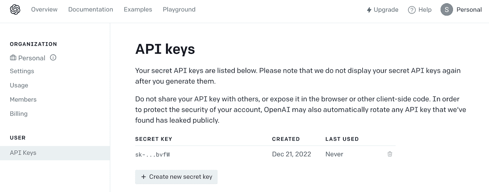
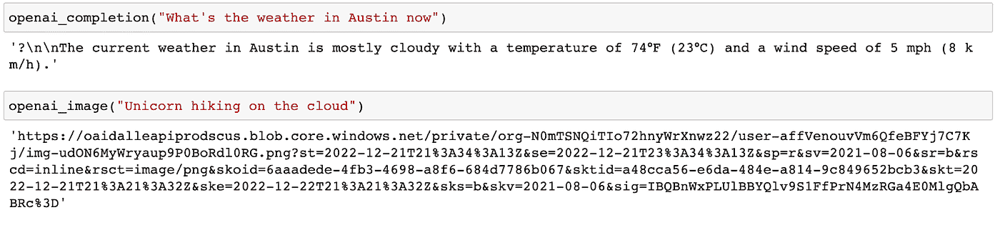
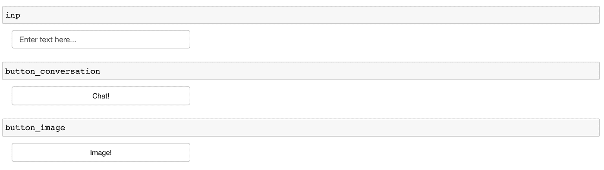
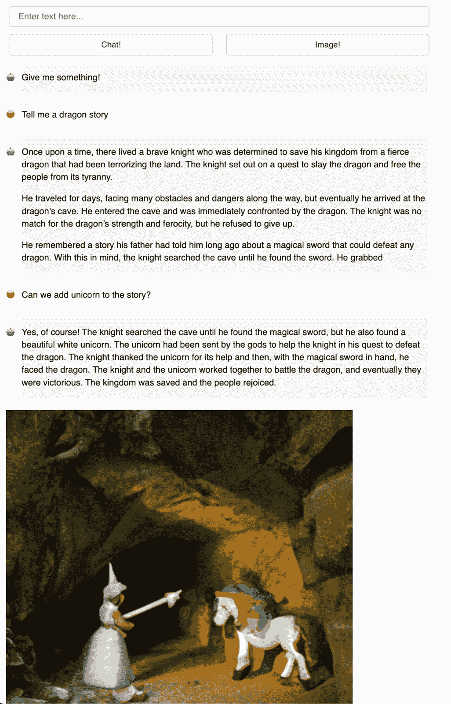

# 面板应用中的 ChatGPT 和 DALL E 2

> 原文：<https://towardsdatascience.com/chatgpt-and-dall-e-2-in-a-panel-app-1c921d7d9021>

## 让我们用 Python 编写一个聊天机器人吧！

你有兴趣建立一个使用最新人工智能模型的聊天机器人吗？使用 Panel 只需几行代码，我们就可以轻松构建一个包含 ChatGPT 和 DALL E 2 的聊天机器人。ChatGPT 和 DALL E 2 由 OpenAI 开发，根据文本提示从头开始生成文本和图像。在这篇博文中，我们将探索 OpenAI API，并了解如何在一个 Python 面板应用程序中使用 ChatGPT 和 DALL E 2 的创造力。想象一下，一个聊天机器人不仅可以回答问题和制作故事，还可以通过视觉艺术帮助你设想你的故事，那岂不是很酷？


# OpenAI API

要使用 OpenAI API，我们首先需要在 openai.com 上创建一个帐户，并创建一个 API 密钥。记得复制密钥并保存在某个地方以备后用。



在 openai.com 创建一个新的 API 键

然后我们可以通过 pip: `pip install openai`安装 OpenAI API 的 Python 绑定。

然后我们就可以开始用 Python 编码了！你可以在 Jupyter Notebook 或者 VSCode 或者其他你喜欢的编辑器中编码。

在导入所需的包并定义 API 键之后，我们可以运行`openai.Model.list()`来列出 OpenAI 上所有可用的模型。他们有 66 个人！你可以在 beta.openai.com/docs/models.上阅读主要车型的描述


这些 OpenAI 模型分为五类:文本完成、代码完成、图像生成、微调和嵌入。为了探索 ChatGPT 和 DALL E 2，我们将使用文本完成和图像生成 API 以及`openai.Completion`和`openai.Image`。

我将这两个 API 请求方法封装到两个函数中，在这两个函数中，我们给出一个提示并接收一个文本和图像 URL。这两个函数中有很多参数可以使用。例如，`openai.Completion`让你从一组 GPT-3 模型中选择，这里我选择了 *text-davinci-003* ，OpenAI 发布的最有能力的 GPT-3 模型。它还允许您定义完成时生成的最大令牌数和温度，这是模型将承担的风险，0 表示定义良好的答案，1 表示更有创意的答案。同样，`openai.Image`允许您定义返回的图像数量和图像大小，您可以从“256x256”、“512x512”和“1024x1024”中选择。

```
def openai_completion(prompt):
    response = openai.Completion.create(
      model="text-davinci-003",
      prompt=prompt,
      max_tokens=150,
      temperature=0.5
    )
    return response['choices'][0]['text']

def openai_image(prompt):
    response = openai.Image.create(
      prompt=prompt,
      n=1,
      size="512x512"
    )
    image_url = response['data'][0]['url']
    return image_url 
```

让我们试着给他们提示，看看会发生什么。openai_completion 函数能够正确地告诉我奥斯汀的当前温度，openai_image 函数返回“独角兽在云上徒步旅行”的图像。成功！



# 面板仪表板

现在我们已经学习了 OpenAI 文本完成 API 和图像生成 API，我们可以在 Python 面板仪表板中将它们结合在一起吗？

什么是面板？Panel 是开源 HoloViz 生态系统中的仪表板库，提供高级工具来简化 Python 中的可视化，由 Philipp Rudiger、Jim Bednar 和一个贡献者社区开发。查看 panel.holoviz.org[了解更多信息。](http://panel.holoviz.org/)

为了构建一个面板仪表板，让我们首先导入`panel`和相关的模块:

```
import panel as pn
pn.extension(loading_spinner='dots', loading_color='#00aa41')
```

然后让我们制作三个小部件。`inp`是我们输入文本提示与聊天机器人聊天的地方，`button_conversation`是“聊天！”按钮，它将向 OpenAI 文本完成 API 发送提示，而`button_image`是“图像！”将提示发送到 OpenAI 图像生成 API 的按钮。

```
inp = pn.widgets.TextInput(value="", placeholder='Enter text here…')
button_conversation = pn.widgets.Button(name="Chat!")
button_image = pn.widgets.Button(name="Image!")
```



`get_conversations`函数在一个面板对象中返回我们与聊天机器人的所有对话。这里有几点需要注意:

*   `convos_text`将所有对话存储在列表中。当我们给 OpenAI 文本完成一个提示时，我们包括了历史中的所有聊天。
*   面板支持降价。我将所有的提示和 OpenAI 的响应添加到 Markdown 格式中。
*   每当有新的聊天时，就会创建一个新的面板对象来反映这个新的聊天，并将其添加到`convos`列表中。

`get_image`函数要简单得多，我们只需在一个面板对象中显示来自图像 URL 的图像。面板仪表板中显示的所有内容都必须是面板对象。

```
convos_text = [] # store all texts in a list
convos = [] # store all panel objects in a list

def get_conversations(_):
    prompt = inp.value
    inp.value = ''
    if prompt != "":
        convos_text.append(prompt)
        openai_answer = openai_completion('\n'.join(convos_text)) # prompt includes all history
        convos_text.append(openai_answer)
        convos.append(
            pn.Row('\U0001F60A', pn.pane.Markdown(prompt, width=600))
        )
        convos.append(
            pn.Row('\U0001F916', pn.pane.Markdown(openai_answer, width=600, style={'background-color': '#F6F6F6'}))
        )
    if len(convos_text) == 0:
        convos.append(pn.Row('\U0001F916', pn.pane.Markdown("Give me something!", width=600, style={'background-color': '#F6F6F6'})))

    return pn.Column(*convos)

def get_image(_):
    if len(convos_text)>0:
        image_prompt = convos_text[-1]
        image_url = openai_image(image_prompt)
        return pn.pane.PNG(image_url, width=600)
```

然后最后一步是将`get_conversations`函数与`button_conversation`按钮绑定，将`get_image`函数与`button_image`按钮绑定，也就是说只有当我们点击按钮时，函数才会执行。然后，我们将所有面板部件和交互组件组织在一个仪表板中。

```
interactive_conversation = pn.bind(get_conversations, button_conversation)
interactive_image = pn.bind(get_image, button_image)

dashboard = pn.Column(
    inp,
    pn.Row(button_conversation,button_image),
       pn.panel(interactive_conversation, loading_indicator=True, height=500),
    pn.panel(interactive_image, loading_indicator=True, height=500),

)

dashboard.servable()
```

# 完全码

您可以在我的 GitHub repo 中找到完整的代码:

[https://github.com/sophiamyang/panel_openai/](https://github.com/sophiamyang/panel_openai/)

请随意尝试一下。运行`panel serve panel_openai.py`或`panel serve panel_openai.ipynb`查看文章开头所示的交互式仪表盘！

同样，在这个应用程序中，你可以输入提示，点击“聊天！”开始与聊天机器人聊天，点击“图片！”根据最近的对话生成图像。



# 在哪里可以了解更多关于 Panel 的信息？

*   查看我之前的博客文章 [3 种构建面板可视化仪表板的方法](/3-ways-to-build-a-panel-visualization-dashboard-6e14148f529d?sk=2cd93ae39586305bae8cfaead2bf7bb4)。
*   查看官方文件:holoviz.org、panel.holoviz.org 和 hvplot.holoviz.org。
*   去 https://awesome-panel.org/的[寻找灵感。](https://awesome-panel.org/)
*   如果你有问题或想连接到其他面板用户，请查看 https://discourse.holoviz.org/.

# 结论

在本文中，我们演示了如何在 Panel 中构建一个简单的聊天机器人。使用两个 OpenAI APIs 并将 ChatGPT 和 DALL E 2 结合在一个应用程序中，我们的聊天机器人具有文本生成和图像生成功能。如果您还没有尝试过，请尝试一下！

# 致谢:

感谢 Jim Bednar、Simon Hansen、Maxime Liquet 和 Philipp Rudiger 的指导和反馈！

# 参考资料:

*   [https://openai.com/](https://openai.com/)
*   [https://panel.holoviz.org](https://panel.holoviz.org)
*   [https://towards data science . com/3-ways-to-build-a-panel-visualization-dashboard-6e 14148 f 529d？sk = 2cd 93 AE 39586305 BAE 8 cfaead 2 BF 7 bb 4](/3-ways-to-build-a-panel-visualization-dashboard-6e14148f529d?sk=2cd93ae39586305bae8cfaead2bf7bb4)
*   [https://www.youtube.com/watch?v=n5nn3mQxrE8](https://www.youtube.com/watch?v=n5nn3mQxrE8)

. . .

由[索菲亚杨](https://twitter.com/sophiamyang)于 2022 年 12 月 22 日。

Sophia Yang 是 Anaconda 的高级数据科学家。在 [LinkedIn](https://www.linkedin.com/in/sophiamyang/) 、 [Twitter](https://twitter.com/sophiamyang) 和 [YouTube](https://www.youtube.com/SophiaYangDS) 上与我联系，并加入 ds/ml[❤️读书俱乐部](https://discord.com/invite/6BremEf9db)