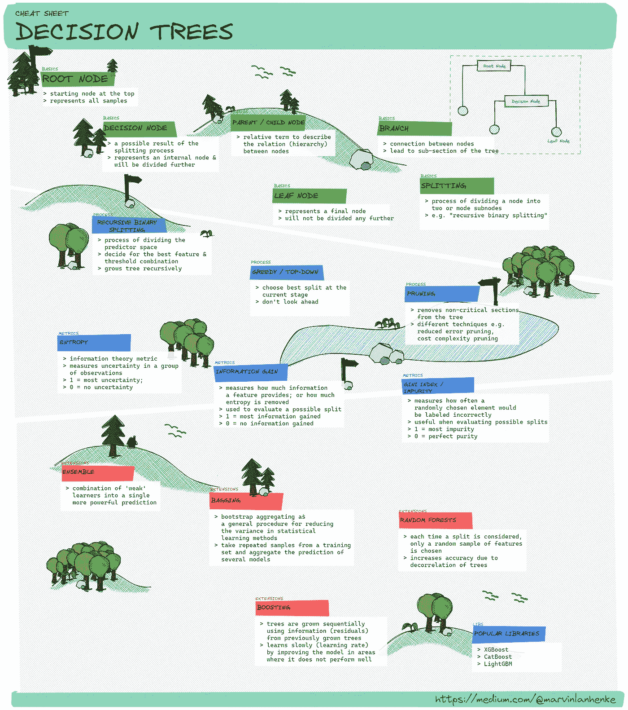
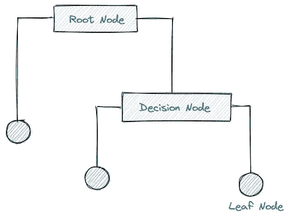
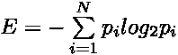
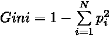

# 备忘单:决策树术语

> 原文：<https://towardsdatascience.com/cheat-sheet-decision-trees-terminology-c37ee6cb2d2e>

## 在术语的随机森林中找到自己的路

备忘单:决策树[图片由作者提供]

B *聚集、推进、集成方法和随机森林* —最初，围绕决策树的术语和概念可能会非常混乱和吓人，尤其是在机器学习领域起步时。

在[上周的](/implementing-a-decision-tree-from-scratch-f5358ff9c4bb)期中，我们从头开始讲述了决策树的实现，解释了算法的内部工作原理。然而，仍然有一些术语和主题没有涉及。

在接下来的章节中，我们试图发现其中的一些主题，创建一个[备忘单](https://github.com/marvinlanhenke/MLFromScratch/blob/main/DecisionTree/img/CheatSheetDT.png)，让我们快速、全面地了解决策树领域中的概念。

> **免责声明**:备忘单的性质只允许对某些主题进行概述，不可能涵盖所有细节。然而，人们可以利用这个概述开始更深入地研究感兴趣的领域。

# 基础知识

在我们进入更高级的、被认为是新奇的东西之前，我们从基础开始——通过学习决策树的主要组成部分来建立基础。

## 根节点

决策树也可以解释为一系列节点，一个从单个节点开始的有向图。这个起始节点称为根节点，它代表整个样本空间。

从根节点开始，然后可以通过根据各种特征和阈值划分或分割样本空间来生长决策树。

## 剧烈的

描述将一个节点划分为两个或更多子节点的过程。有几种方法来分割决策树，涉及不同的度量(例如，信息增益、基尼系数杂质)。

## 决策节点

由分割的结果定义。当一个子节点分裂成更多的子节点时，我们称这些节点为决策节点或内部节点。

决策树的基本组成部分[图片由作者提供]

## 叶节点

如果一个子节点不能再分，我们称之为叶节点。叶节点表示用于预测的响应值(例如，最常见的类标签)。

## 树枝

分支描述了决策树的节点或子部分之间的连接。

## 父/子节点

描述节点之间关系的相对术语。任何属于另一个节点的节点都是子节点。这些子节点之前的任何节点都称为父节点。

# 种植一棵树

现在，我们知道了决策树的基本构建模块，我们需要知道如何构建一个决策树。

## 递归二进制分裂

创建决策树描述了将输入空间划分成几个不同的、不重叠的子空间的过程。为了划分输入空间，我们必须测试所有特征和阈值，以找到最小化我们的成本函数的最佳分割。

一旦我们获得了最佳分裂，我们可以继续递归增长我们的树。

该过程被称为递归，因为每个子空间可以被分裂无限次，直到达到停止标准(例如，最大深度)。

## 贪婪分裂

寻找最佳分割包括评估所有可能的特征和分割点。由于我们只关注当前的增长阶段，而没有向前看，我们正以贪婪的方式选择最佳分割。

## 修剪

通过删除非关键部分来减小决策树的大小和复杂性。这允许更好的泛化、更少的过拟合和更好的预测准确性。修剪可以用不同的方式完成，因此有几种方法。

例如，减少错误修剪用最常见的类标签替换节点。如果精度不受影响，更改将被保留。

另一方面，成本复杂性修剪试图移除影响精确度最小但继承最大复杂性的完整子树。

# 韵律学

仅仅知道生成决策树的过程是不够的。为了评估所有可能的拆分，并能够合理地选择最佳拆分，我们需要一种方法来衡量拆分的质量或有用性。

因此，存在几个度量标准。

## 熵

在信息论中，[熵](https://en.wikipedia.org/wiki/Entropy_(information_theory))衡量一组观察值中信息或不确定性的平均水平。更正式地说，它可以定义为以下等式:

熵为 1 表示最不确定，而熵为 0 表示完全确定。

## 信息增益

[信息增益](https://en.wikipedia.org/wiki/Information_gain_in_decision_trees)提供了一种方法来描述一个特征提供了多少信息——或者换句话说，移除了多少熵。

可以通过从父熵中减去子的加权熵来计算分裂的信息增益。因此，使它特别有助于评估一个可能的分裂候选，让我们找到和选择最佳分裂。

信息增益 1 可能是最佳值，而值 0 意味着没有不确定性或熵被移除。

## 基尼杂质

衡量随机选择的元素被错误标记的频率。它提供了一种测量值为 0 的节点纯度的方法，一方面定义了完全的纯度，另一方面描述了最大的杂质。

基尼系数也可用于评估可能的分裂候选值，其计算公式如下:

# 扩展ˌ扩张

虽然决策树很容易解释，因为它们模拟了人类决策的过程，但它们有时可能缺乏准确性或不够健壮。

为了克服这些缺点，可以应用许多技术和扩展。

## 集成方法

是一种机器学习技术，它将几个“弱学习者”或构建块组合成一个更强大的预测。在我们的例子中，构建块可以是简单的回归或分类决策树。

## 制袋材料

bootstrap aggregating 的缩写，是减少统计学习方法的方差的一般过程。这里的主要思想是，组合和平均观察组减少了方差。

在实践中，我们通过从单个训练集中随机抽取替换样本并构建决策树来进行引导。重复这个过程将产生多个可以聚合的决策树。

例如，应用于回归树，我们通过取预测值的平均值来聚合多个树。将 bagging 应用于分类树，包括对预测的类别标签进行多数投票，以便进行汇总。

## 随机森林

通过决策树的去相关，在 bagging 思想的基础上进行构建和改进。每次考虑分割时，只选择随机样本 *m* 个特征。这意味着每次分割算法甚至不允许考虑大多数可用特征。

虽然一开始感觉违反直觉，但主旨还是有道理的。

例如，当构建袋装树时，算法可能只考虑一个特定的强特征。

因此，大多数树看起来大致相同。由于对高度相关的变量进行平均不会显著降低方差，因此对看起来非常相似的树进行平均不会提高准确性。

## 助推

到目前为止，我们讨论的扩展都涉及到生长多个独立的树。Boosting 通过构建多个依赖于先前树的树，稍微修改了这个想法。

在实践中，我们生长了几棵更小的树，其中每棵树都与前一棵决策树的残差相匹配。因此，在模型表现不好的地方慢慢改进模型。

# 结论

在本文中，我们试图通过创建一个备忘单，在术语的随机森林中找到自己的路，作为围绕决策树学习方法的主题的快速参考和一般概述。

由于我们只能提供一个快速的概述，一些概念值得更多的解释，应该被更深入的发现。然而，概述可能有助于确定感兴趣的领域。

请随意下载并分享我的 GitHub 的备忘单。

[马文·兰亨克](https://medium.com/@marvinlanhenke?source=post_page-----c37ee6cb2d2e--------------------------------)

## # 30 日

[View list](https://medium.com/@marvinlanhenke/list/30daysofnlp-3974a0c731d6?source=post_page-----c37ee6cb2d2e--------------------------------)30 stories

*喜欢这篇文章吗？成为* [*中等会员*](https://medium.com/@marvinlanhenke/membership) *继续无限学习。如果您使用以下链接，我将收取您一部分会员费，无需您支付额外费用*

  

**参考资料/更多资料:**

*   加雷斯·詹姆斯，丹妮拉·威滕，特雷弗·哈斯蒂，罗伯特·蒂布拉尼。《统计学习导论:在 r .纽约的应用》: Springer，2013 年。