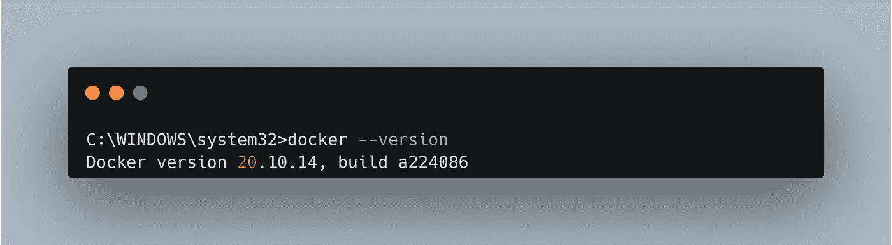
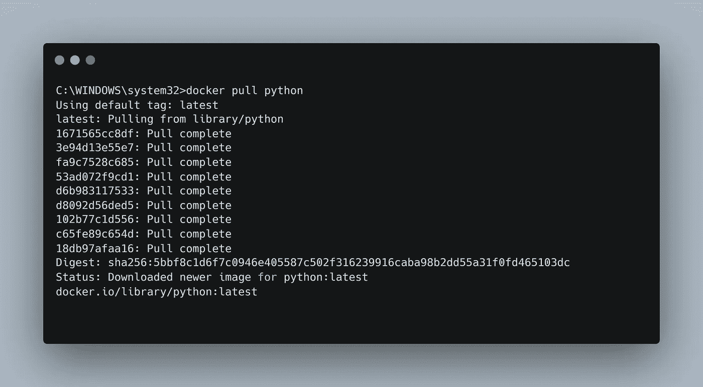
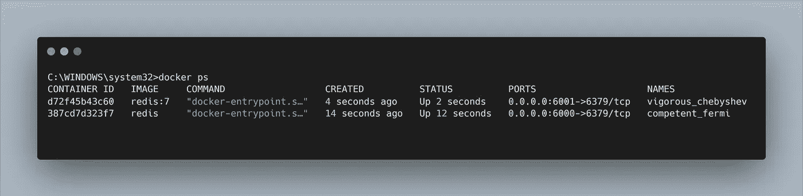
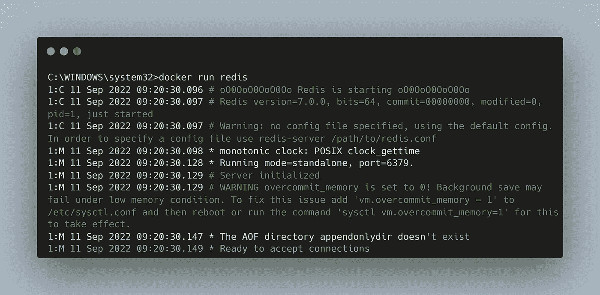

# 重要 Docker 命令的备忘单

> 原文：<https://towardsdatascience.com/cheat-sheet-of-important-docker-commands-6468678ab8ea>


在 [Unsplash](https://unsplash.com?utm_source=medium&utm_medium=referral) 上 [Sai Kiran Anagani](https://unsplash.com/@anagani_saikiran?utm_source=medium&utm_medium=referral) 拍摄的照片

在马上进入命令之前，如果你不知道 docker，下面的代码片段是为你准备的。

# Docker 是什么？

> Docker 是一个开发、发布和运行应用程序的开放平台。Docker 使您能够将应用程序从基础设施中分离出来，这样您就可以快速交付软件。使用 Docker，您可以像管理应用程序一样管理基础设施。通过利用 Docker 快速交付、测试和部署代码的方法，您可以显著减少编写代码和在生产中运行代码之间的延迟。

如果你还有任何疑问，那么你可以访问他们的[官方文档](https://docs.docker.com/get-started/overview/)。现在，让我们深入研究一下这些命令。

我试着列出了大部分命令，使用 docker 的时候你会发现这些命令非常有用。这些命令遵循提取映像、运行容器、删除的逻辑顺序。任何可能被遗漏的核心命令都欢迎评论！

# 1.docker 版本:

首先也是最基本的命令，一旦你下载并安装了 docker，你就可以使用这个命令检查 docker 是否安装正确。

```
docker --version
```



# 2.码头工人拉动:

现在，安装 docker 后，您将开始使用 Docker hub 或私有存储库上的各种图像。提取图像的命令是:

```
docker pull <image_name>
```



从 DockerHub 中提取 python 图像的示例。

***拉具体版本的 docker 图片:***

如果您希望获取图像的任何特定版本，可以通过如下方式指定其版本来轻松实现:

```
docker pull <image_name>:<version>
```

例如:提取特定版本的 python 图像

```
docker pull python:3.10-buster
```

# 3.docker ps:

要查看计算机中正在运行的容器，请运行命令

```
docker ps
```



docker ps 示例

从输出数据来看，*容器 id* 和*名称*总是唯一的。您可以使用这个 id/name 来启动、停止和执行容器上的各种其他选项。

在*端口*部分，*0 . 0 . 0:6001*是本地机器的端口号， *6379/tcp* 是容器的端口。

***见先前停靠码头的集装箱:***

要查看之前停止的容器，使用选项*-a "*

```
docker ps -a
```

# 4.码头运行:

拉出图像后，下一步是从图像创建一个容器(一个实例)。

```
docker run <image_name>
```



创建 redis 图像容器的示例

对于这个命令，它首先检查给定的图像是否存在于本地，如果不存在，它首先下载图像，即执行" *docker pull* "然后运行它的容器。

**与 *docker run 一起使用的有用选项* :**

**a .拆下的端子:**

```
docker run -d <image_name>
```

要在分离的终端中运行容器，并让我们在当前终端中重新获得控制权，请使用 *-d* 选项和 run 命令。

**b .为集装箱指定特定港口:**

假设你拉了不同版本的 redis，说“*最新*”和“ *7* ”。当你做“*docker run redis”*和“*docker run redis:4”*。然后，两个容器将在每个容器的同一个端口启动，通常是 6379。现在，您需要将它们绑定到不同主机端口(您的本地主机端口)。

```
docker run -p<host_port_number>:<container_port> <image_name>
```

例如:将 redis 的端口 6379 绑定到本地主机上的不同端口

```
docker run -p6000:6379 redis
#This will bind your host’s 6000 port to container's 6379 port.
```

将 redis:7 绑定到另一个端口

```
docker run -p6001:1463 redis:7
#This will bind your host’s 6001 port to container's 6379 port.
```

**c .为集装箱命名:**

为了给容器命名，使用选项*“名称”。*

例如:将 redis_new 命名为最新的 redis 映像，将 redis_old 命名为旧映像

```
docker run -d --name redis_new redis && docker run -d --name redis_old redis:7
```

**d .在 docker 运行命令中给出卷:**

为了使数据持久化并利用机器的存储，您需要将卷与容器绑定在一起。下面是我们使用命名卷并将其绑定到容器中的" */usr/lib/data"* 的示例。

```
docker run -v my_personal_volume:/usr/lib/data mongo
```

**e .将容器连接到特定网络:**

要使容器使用任何特定网络，请使用以下命令:

```
docker run -p27017:27017 -d --net mongo-network mongo
```

在这里，我们将容器连接到“mongo-network”。

# 5.docker 图像:

要查看机器上的所有 docker 图像，请使用以下命令:

```
docker images
```

# 6.停靠站:

在运行 docker 容器之后，您希望在某个时候停下来取下容器。要停止容器，请运行下面给出的命令:

```
docker stop <container_id/name>
```

您可以使用 *"docker ps"* 命令获取集装箱的 id，然后停止所需的集装箱。

*注意:或者，您也可以使用容器名称来停止容器。*

# 7.docker 开始:

如果您想再次启动任何停止的容器，那么使用*“docker PS-a”获取容器 id 或名称。*并运行下面给出的命令:

```
docker start <container_id/name>
```

# 8.docker 日志:

要查看容器的日志，您需要使用以下命令:

```
docker logs <container_id/name>
```

***docker 日志的有用选项:***

**a. —尾部**

```
docker logs <container_id/name> --tail <n/all>
```

为了只获得日志的结尾部分，使用 tail 选项，后跟您希望看到的行数。比如 10 等，甚至你可以输入“全部”来查看整个日志。

**b. -f:**

为了实时传输日志，请使用-f 命令。

```
docker logs <container_id/name> -f
```

**9。码头工人执行:**

如果您想在容器的终端内部运行任何命令，那么您需要使用下面给出的 *"docker exec"* 命令:

```
docker exec -d ubuntu_bash touch /tmp/execWorks
```

这将在后台运行的容器`ubuntu_bash`中创建一个新文件`/tmp/execWorks`。

***获取容器的交互终端:***

接下来，在容器上执行一个交互式的`bash` shell。

```
docker exec -it <container_id/name> /bin/bash
```

这将在容器`ubuntu_bash`中创建一个新的 Bash 会话。

*注意:有时，您可能会得到错误消息，指出/bin/bash 命令未找到，在这种情况下，您需要 shell 使用命令:*

```
docker exec -it <container_id/name> /bin/sh
```

**10。docker 网:**

查看 docker 当前正在使用的网络。使用命令:

```
docker network ls
```

***创建码头工人网络:***

```
docker network create mongo-network
```

这将创建新的“mongo-network ”,然后可以与容器一起使用。

**11。docker rm:**

使用完容器后，您希望删除它，那么在这种情况下使用“docker rm”命令:

```
docker rm <container_id/name>
```

*注意:移除容器前，应先停止，否则会出现错误*

12。码头工人 rmi:

如果您希望删除任何图像，请使用以下命令:

```
docker rmi <image_name>
```

*注意:为了删除图像，它不应该有任何基于此图像的运行容器。*

就这样结束了！我试图在这篇文章中涵盖大多数有用的命令。您可以随时在注释中添加任何遗漏的命令。那是我的落款:)