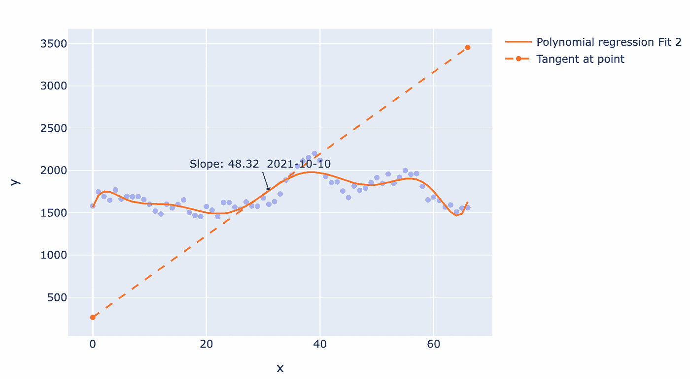
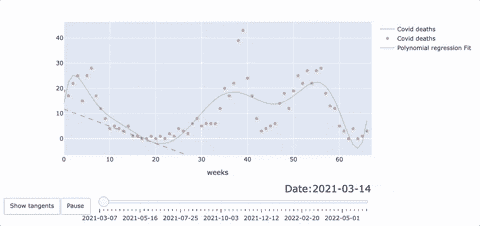

# 使用 Python 亲自检查数据声明

> 原文：<https://towardsdatascience.com/check-data-claims-yourself-with-python-an-example-8b8a92c0ae56>

## 公共媒体越来越多地使用数据可视化。使用您的 python 技能为自己验证声明。


艾通过作者创造艺术。 [*见上图 NFT*](https://opensea.io/accounts/createdd?ref=0xc36b01231a8f857b8751431c8011b09130ef92ec) *受埃伯哈德* [*的启发*](https://unsplash.com/@eberhardgross)

# 介绍

公共媒体越来越多地使用数据可视化。

特别是在疫情时代，各种图表和数据解释被用来支持论点。

作为一名商业法毕业生和数据科学家，我总是对公共媒体和网络上描绘的一些数字和可视化表示好奇和怀疑。

在本文中，我向您展示了对奥地利 covid 死亡的快速分析，以探索我的一些好奇心。我不敢相信我在公共电视上看到的一些数字，我想亲自核实一下。

我鼓励你也这样做。使用分析工具自己检查某些声明从未像现在这样简单。

在我的分析中，我使用了

*   奥地利原始数据的公共数据集
*   用于编程的 python
*   jupyter 笔记本，用于文档和探索
*   用于数据操作的 pandas / numpy 库
*   plotly 用于数据可视化
*   用于代码部署和静态渲染的 Github
*   简化为交互式 web 应用程序

在这篇文章中，我将挑选一些我认为值得详细阐述的东西。如果你需要更多的细节，请随意评论。

多项式回归的动画切线:作者 gif

# 结果链接

*   Github 回购:[https://github.com/Createdd/covid_analysis](https://github.com/Createdd/covid_analysis)
*   笔记本发布:[https://createdd.github.io/covid_analysis/](https://createdd.github.io/covid_analysis/)
*   解说视频:[https://www.youtube.com/watch?v=fjJxxN2PtYk](https://www.youtube.com/watch?v=fjJxxN2PtYk)
*   延时录像:[https://www.youtube.com/watch?v=bZrwzROVczM](https://www.youtube.com/watch?v=bZrwzROVczM)

# 目录

*   [资料准备](https://github.com/Createdd/Writing/blob/be2c5c125896c0cb426bc4fb1be189e990a3f6ee/2022/articles/covidAnalysis.md#data-preparation)
*   [Plotly 和回归线](https://github.com/Createdd/Writing/blob/be2c5c125896c0cb426bc4fb1be189e990a3f6ee/2022/articles/covidAnalysis.md#plotly-and-regression-lines)
*   [剧情动画](https://github.com/Createdd/Writing/blob/be2c5c125896c0cb426bc4fb1be189e990a3f6ee/2022/articles/covidAnalysis.md#animations-with-plotly)
*   [结论](https://github.com/Createdd/Writing/blob/be2c5c125896c0cb426bc4fb1be189e990a3f6ee/2022/articles/covidAnalysis.md#conclusion)
*   [免责声明](https://github.com/Createdd/Writing/blob/be2c5c125896c0cb426bc4fb1be189e990a3f6ee/2022/articles/covidAnalysis.md#disclaimer)
*   [关于](https://github.com/Createdd/Writing/blob/be2c5c125896c0cb426bc4fb1be189e990a3f6ee/2022/articles/covidAnalysis.md#about)

# 数据准备

对于数据准备，重要的是要理解，

*   数据质量非常重要
*   总是需要某种预处理

在这种情况下，我的原始数据来自政府官方。这意味着，在政府主管部门看来，这些数据应该是可信的，但对于数据的来源和收集方式，可能没有任何适当的解释。

在这个分析中，没有特别的准备步骤。我对格式进行了一些操作，比如更改为 DateTime 格式，并创建新的特定列以供将来使用。在最后一步中，我合并了两个使用的数据集，并通过确定分位数阈值来去除异常值。

# Plotly 和回归线

我想展示如何轻松地将回归线(来自 sklearn)集成到您的 plotly 可视化中。因为除了良好的可视化本身之外，将不同的数据点组合在一个图表中也很重要。一个完美的例子是回归线。此外，增加回归线的斜率。

# 绘制数据和多项式回归

这可以通过以下方式轻松实现

计算线的新点

然后在现有图表中添加线条

因此，仅仅添加`add_traces`就能做得很好。

然而，现在我们想做一些更复杂的事情，即添加回归线某一点的斜率。

# 添加回归线某一点的斜率

这实现起来并不容易，因为你首先需要理解多项式回归是如何工作的，然后你还需要画一条好看的切线。事实上，到目前为止还没有任何实现，这也是为什么我在 Stackoverflow 上创建了自己的答案。

最后，看起来是这样的



作者截图

代码看起来像这样:

实现的核心是这些行

```
fitted_params = np.polyfit(np.arange(0, len(y)), y, poly_degree )polynomials = np.poly1d(fitted_params)derivatives = np.polyder(polynomials)y_value_at_point = polynomials(x).flatten()slope_at_point = np.polyval(derivatives, np.arange(0, len(y)))
```

这些漂亮的 NumPy 函数允许你计算用来画切线的数字。

# Plotly 动画

最后一步是 plotly 中的动画。显示切线运动的动画。

大概是这样的:



作者 gif

它的代码如下

这里需要理解的是

*   首先，您需要将数据点和回归线作为普通图形对象添加到 plotly (traces)中。
*   切线需要通过时间线计算并存储为字典
*   然后，您需要将帧添加到数据轨迹和 plotly 布局中
*   plotly 布局还包括滑块和按钮的配置
*   请注意，您需要计算类似于时间轴中每个步骤内的帧的滑块步骤

多项式回归的动画切线:作者 gif

作为 streamlit 应用程序进行分析；作者 gif

# 结论

最后，我很容易明白疫情是如何影响澳大利亚的死亡率的。

我通过使用开源数据和开源工具实现了这一点。

我鼓励你也这样做，检查你在媒体上看到的数据及其可视化的质量。

# 解释为视频

有时通过视频解释项目更容易。这也是我制作一个快速视频的原因

作者的解释视频

为了看到建造一切的全过程，我还制作了一个延时录像

作者拍摄的延时视频

# 你可能喜欢的其他文章

</how-to-switch-from-excel-to-python-20440824602e>  </develop-and-sell-a-python-api-from-start-to-end-tutorial-9a038e433966>  </how-i-set-up-my-new-macbook-pro-for-programming-and-data-science-505c69d2142>  

# 放弃

我与本文中使用的任何服务都没有关联。

我不认为自己是专家。除了做其他事情，我只是记录事情。因此，内容并不代表我的任何专业工作的质量，也不完全反映我对事物的看法。如果你觉得我错过了重要的步骤或者忽略了什么，可以考虑在评论区指出来或者联系我。

这写于 2022 年 7 月 9 日。我无法监控我的所有文章。当你阅读这篇文章时，提示很可能已经过时，过程已经改变。

我总是乐于听取建设性的意见以及如何改进。

# 关于

丹尼尔是一名艺术家、企业家、软件开发人员和商业法毕业生。他的知识和兴趣目前围绕着编程机器学习应用程序及其所有相关方面。从本质上说，他认为自己是复杂环境的问题解决者，这在他的各种项目中都有所体现。


作者图片

*   >在[https://medium.com/subscribe/@createdd](https://medium.com/subscribe/@createdd)订阅或在媒体上阅读更多内容
*   ->【https://medium.com/@createdd/membership 

连接到:

*   [Allmylinks](https://allmylinks.com/createdd)

直接:

*   [领英](https://www.linkedin.com/in/createdd)
*   [Github](https://github.com/Createdd)
*   [中等](https://medium.com/@createdd)
*   [推特](https://twitter.com/_createdd)
*   [Instagram](https://www.instagram.com/create.dd/)
*   [createdd.com](https://www.createdd.com/)

艺术相关:

*   [公海](https://opensea.io/accounts/createdd?ref=0xc36b01231a8f857b8751431c8011b09130ef92ec)
*   [Instagram/art_and_ai](https://www.instagram.com/art_and_ai/)
*   [稀有的](https://app.rarible.com/createdd/collectibles)
*   [已知产地](https://knownorigin.io/profile/0xC36b01231a8F857B8751431c8011b09130ef92eC)
*   中等/最先进的
*   [魔鬼艺术](https://www.deviantart.com/createdd1010/)