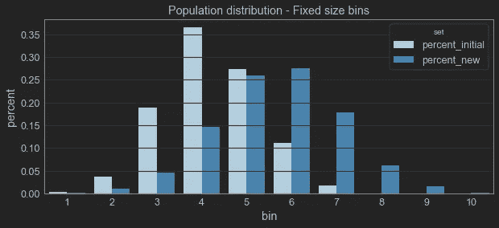
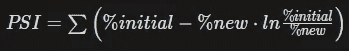
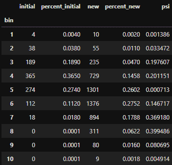
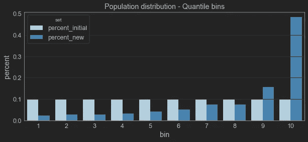
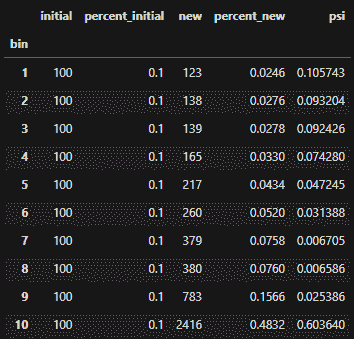
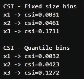

# 你的 ML 模型稳定吗？用 PSI 和 CSI 检查模型稳定性和总体漂移

> 原文：<https://towardsdatascience.com/checking-model-stability-and-population-shift-with-psi-and-csi-6d12af008783>

## 如何确保你的机器学习模型仍然像训练的那样运行


由 Unsplash 上的 Aziz achar ki 原创

我们建立的机器学习模型基于一个简单的前提:我们将在推理时间使用的数据应该与训练时使用的数据具有相同的分布。

这个前提很简单，但相当有力，因为它意味着我们可以根据以前已知的观察结果来推断新的观察结果。

然而，有时一些现实生活中的影响会导致观察结果发生变化。一个例子是新冠肺炎疫情。在病毒传播之前训练出来的金融模型，在疫情之后可能不太适用。家庭收入可能会减少，甚至那些没有减少的家庭在花钱前也可能会三思。

这些影响可能是无声的，为了避免它们，我们需要评估模型的稳定性，或者换句话说，在现实生活场景发生变化后，模型是否仍然有效。

在本文中，我将向您展示两个可以做到这一点的指标，群体稳定性指数(PSI)和特征稳定性指数(CSI)。

# 模型稳定性

在动态系统分析中，我们可以把一个稳定的系统定义为在存在扰动的情况下保持不变(或只有微小变化)的系统。简单地说，一个稳定的系统对外部变化是稳健的。

测量模型稳定性的一种方法是检查总体或数据漂移，评估总体或特征在模型环境中的变化情况。

人口流动有几个可能的来源。一些例子可以包括

*   社会经济关系的变化，如通货膨胀、疾病或政治变化；
*   无法解释的事件，比如假期、世界杯，甚至是自然灾害；
*   新的竞争对手进入市场，和/或客户转移；
*   所提供产品或营销活动的变化。

数据和人口漂移的一个较少被评论的来源是模型本身的使用。如果您开发了一个模型来解决一个业务问题，并且这个解决方案是有效的，那么环境就变了，这个模型可能不会有同样的性能！

在下面的章节中，我将展示如何在机器学习模型的稳定性的背景下计算 PSI 和 CSI。所有代码和示例都可以在我的 GitHub 资源库中找到:

[](https://github.com/vinyluis/Articles/tree/main/Model%20Stability) [## 主要乙烯基/物品的物品/模型稳定性

### 文章:用 PSI 和 CSI [EN]检查模型稳定性和人口转移展示了如何使用 PSI(人口稳定性…

github.com](https://github.com/vinyluis/Articles/tree/main/Model%20Stability) 

# 人口稳定指数

人口稳定指数(PSI)，顾名思义，是衡量人口在两个不同的时刻发生了多大的变化。

我们的目标是根据模型的预测(独立)变量来看人口分布如何变化。如果是回归模型，可以直接用预测值，但是如果是二元分类模型，就需要用概率(scikit-learn 上有`.predict_proba()`)。

首先，我们通过将预测变量的范围分割成相同大小的部分来创建测试数据的箱。箱的数量是任意的，但是通常使用 10 个。

然后，我们将每个箱内的人口百分比与“新”生产数据进行比较。绘制这些箱，我们可以直观地比较它们:



作者图片

很明显，新增人口已经漂移。最初的分布更窄，平均值更接近于 4，因为新的分布平均值接近于 6，分布更广。

现在，我们使用下面的公式计算每个箱的 PSI:



结果如下表所示:



如果我们愿意，我们可以将平均 PSI 作为整个模型的单一指标。在这种情况下，模型的 PSI 为 0.1435。

通常，我们认为:

*   PSI < 0.1 = The population hasn’t changed, and we can keep the model
*   0.1 ≤ PS1 < 0.2 = The population has slightly changed, and it is advisable to evaluate the impacts of these changes
*   PSI ≥ 0.2 = The changes in population are significant, and the model should be retrained or even redesigned.

In our example, the change was significant, but not so much that needs immediate action. We still should dive deeper into the causes and we can do it with CSI.

But first, remember that we created bins of our data with fixed-size ranges? Another way to calculate PSI would be by using quantile bins. In this scenario, by using 10 bins we assure that each bin will have 10% of the initial population, and we compare with the new population:



Image by author

The process here is pretty much the same, but the results can be slightly different:



The average PSI in this scenario is 0.1087, which is still in the “warning” zone, but much closer to the 0.1000 value of the “safe” zone.

If you have the time and resources, it is advisable to calculate PSI both ways.

If you are looking for the Python code to calculate PSI, please check out my [GitHub](https://github.com/vinyluis/Articles/tree/main/Model%20Stability) ，功能如下:

# 特征稳定性指数

在前面的例子中，我们模型的 PSI 在 0.1 到 0.2 之间的“警告”区域。我们现在需要了解哪些特征可能导致了漂移。输入 CSI。

特征稳定性指数(CSI)用于评估每个特征的稳定性或漂移，以便我们可以找到有问题的特征。由于 PSI 关注的是人口漂移对模型预测的影响，因此 CSI 关注的是了解要素分布是如何变化的。

使用它非常简单:我们只需应用与 PSI 相同的公式，但不是通过使用预测变量来宁滨数据，而是使用每个特征来创建条块:

```
# Fixed
print("CSI - Fixed-size bins")
for col in sample_initial.columns:
    csi_values = psi(sample_initial[col].values, sample_new[col].values, mode = 'fixed')
    csi = np.mean(csi_values)
    print(f'{col} -> {csi=:.4f}')# Quantile
print("\\nCSI - Quantile bins")
for col in sample_initial.columns:
    csi_values = psi(sample_initial[col].values, sample_new[col].values, mode = 'quantile')
    csi = np.mean(csi_values)
    print(f'{col} -> {csi=:.4f}')
```

在本例中，结果是:



所以 x1 几乎没有变化，x2 略有变化但仍在“安全区”上，而 x3 变化显著，很可能是造成种群漂移的特征。

# 结论

数据科学课程通常不涉及模型稳定性，但在处理生产模型时，模型稳定性确实非常重要。我希望这篇文章能帮助你理解它，并应用到你的管道中。

另外，请参考我的 GitHub 存储库，查看一个回归和一个分类示例:

[](https://github.com/vinyluis/Articles/tree/main/Model%20Stability) [## 主要乙烯基/物品的物品/模型稳定性

### 文章:用 PSI 和 CSI [EN]检查模型稳定性和人口转移展示了如何使用 PSI(人口稳定性…

github.com](https://github.com/vinyluis/Articles/tree/main/Model%20Stability) 

# 如果你喜欢这个帖子…

支持我一杯咖啡！

[](https://www.buymeacoffee.com/vinitrevisan)

给我买杯咖啡！

看看这个很棒的帖子

[](/evaluating-the-potential-return-of-a-model-with-lift-gain-and-decile-analysis-319f00fde5b6) [## 用提升、增益和十分位数分析评估模型的潜在回报

### 使用这三个工具来理解你的机器学习模型的有用性

towardsdatascience.com](/evaluating-the-potential-return-of-a-model-with-lift-gain-and-decile-analysis-319f00fde5b6) 

# 参考

[1] Yurdakul，b .种群稳定性指数的统计性质。[https://scholarworks.wmich.edu/cgi/viewcontent.cgi?article = 4249&context =学位论文](https://scholarworks.wmich.edu/cgi/viewcontent.cgi?article=4249&context=dissertations)

[2]伯克，m .人口稳定指数。【https://mwburke.github.io/data 科学/2018/04/29/人口-稳定-指数. html