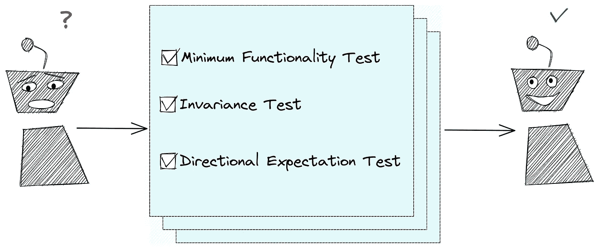
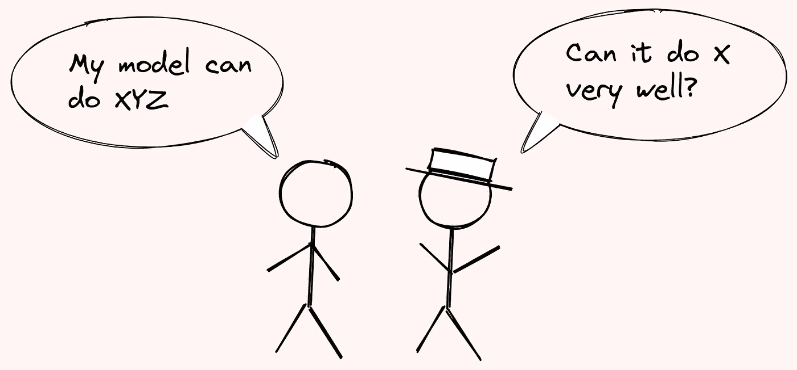
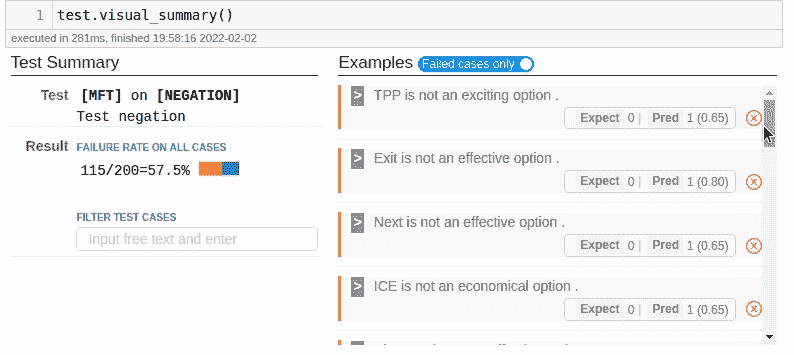
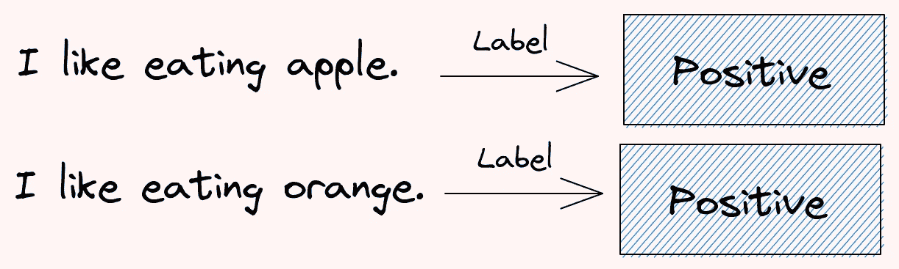
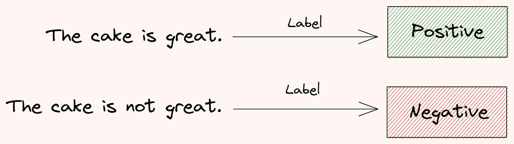

# 清单 NLP 模型的行为测试

> 原文：<https://towardsdatascience.com/checklist-behavioral-testing-of-nlp-models-491cf11f0238>

## 确保你的 NLP 模型如预期的那样工作

# 动机

在新数据上测试时，您的 NLP 模型不会抛出任何错误。是否意味着可以用于生产？

没必要。ML 系统可以**运行完成而不抛出任何错误**，但是仍然可以**产生不正确的输出**。因此，测试您的模型的行为以确保它如您所期望的那样工作是很重要的。



作者图片

但是，为您的 NLP 模型进行测试可能会很困难。一些困难来自于需要:

*   创建数据来测试您的模型
*   知道测试什么以及如何创建测试

如果您可以快速创建测试数据集并使用这些数据集测试您的模型，这不是很好吗？这就是清单派上用场的时候。

# 什么是检查表？

[Checklist](https://github.com/marcotcr/checklist) 是一个开源的 Python 库，使得测试 NLP 模型变得容易。本库中的方法在文章[超越准确性:带清单的 NLP 模型的行为测试](http://homes.cs.washington.edu/~marcotcr/acl20_checklist.pdf)中有描述。

清单特别关注行为测试。行为测试关注的是通过验证输出来测试系统的不同能力，而不需要任何内部结构的知识。

要了解 Checklist 的工作原理，请从安装库开始:

```
pip install checklist
```

将清单扩展添加到 Jupyter:

```
jupyter nbextension install --py --sys-prefix checklist.viewer
jupyter nbextension enable --py --sys-prefix checklist.viewer
```

我们还将下载一个空间模型用于本文:

```
python -m spacy download en_core_web_sm
```

# 最低功能测试(MFT)

最低功能测试(MFT)使用简单的例子来确保模型能够很好地执行特定的任务。例如，我们可能想要测试情绪模型在处理否定时的表现。



作者图片

让我们看看 [TextBlob](/supercharge-your-python-string-with-textblob-2d9c08a8da05) 的情感模型如何处理否定。

```
pip install textblob
```

```
0.3499999999999999
```

情感得分是[-1.0，1.0]范围内的浮动值。由于上述文本的得分为正，因此该文本的情感被归类为正。

看起来这个模型在这些例子中工作得很好。然而，我们需要创建更多的数据来测试该模型是否也适用于其他否定。幸运的是，Checklist 允许我们轻松地创建类似的测试数据。

## 创建数据

我们将使用 Checklist 的编辑器，使用一个模板和一个项目列表来创建多个示例。

```
['Staying at home is not a great option.',
 'Staying at home is not a good option.']
```

我们也可以使用`{mask}`让 Checklist 填入适合句子的单词:

```
['sleep is not a good option.', 'Rest is not a great option.']
```

现在我们知道了 Checklist 的编辑器是如何工作的，让我们使用它来创建一些示例:

相当酷！我们刚刚用几行代码创建了 200 个样本。

## 创建预测情绪的函数

接下来，我们将创建一个预测情绪的函数。请注意，该函数将返回句子情感是消极还是积极的概率，而不是分数。

```
array([[0.15, 0.85]])
```

从上面的输出来看，模型表明文本有 15%的几率是负面的，而文本有 85%的几率是正面的。

由于清单的测试需要一个返回元组`(predictions, confidences)`的函数，我们将使用一个包装器在`predict_proba`返回的置信度旁边添加预测。

```
(array([1]), array([[0.15, 0.85]]))
```

## 创建测试

既然我们已经创建了测试数据和预测功能，我们可以使用`MFT`(最小功能测试)来创建测试。

```
Predicting 200 examples
```

总结测试结果:

```
Test cases:      200
Fails (rate):    115 (57.5%)

Example fails:
0.0 Shipping is not an awful option.
----
0.5 Pinterest is not a time-consuming option.
----
0.5 Training is not an unfeasible option.
----
```

哇哦。200 次测试有 57.5%失败。我们不知道 TextBlob 的情绪在没有测试的情况下有如此高的否定失败率。

摘要还给出了一些失败测试的例子。要查看所有失败的测试，使用`text.visual_summary()`。



作者 GIF

# 不变性测试

除了测试模型的功能，我们可能还想测试当输入的小部分稍微改变时，模型预测是否保持不变。这些测试被称为不变性测试(IV)。



作者图片

让我们为输入添加一些琐碎的元素，如标点符号、错别字、姓名和位置，看看情绪是否会发生变化。

从创建玩具数据集开始:

把数据变成空间的`Doc`:

创建一个向数据集添加扰动的函数，然后创建不变性测试:

## 添加标点符号

理想情况下，如果在句末加上标点符号，句子的情绪应该不会改变。让我们使用`Perturb.punctuation`测试 Textblob 是否对标点符号具有鲁棒性。

```
First sample before and after pertubation:
The cake is great.
The cake is great

Summary:
Predicting 10 examples
Test cases:      5
Fails (rate):    0 (0.0%)
```

酷！5 项测试全部通过。

## 添加错别字

如果我们给一个句子加上错别字，情感会保持不变吗？让我们使用`Perturb.add_typos`来找出答案。

```
First sample before and after pertubation:
The cake is great.
The cake isg reat.

Summary:
Predicting 10 examples
Test cases:      5
Fails (rate):    1 (20.0%)

Example fails:
0.9 The cake is great.
0.5 The cake isg reat.
```

添加错别字会导致 20%的失败率。既然单词`great`变成了`reat`，那么句子的情绪变得既不积极也不消极也是有道理的。

## 更改名称

把`Michael`改成`Jackson`应该不会改变一句话的情调。让我们用`Perturb.change_names`来测试一下。

```
First sample before and after pertubation:
Michael had fun traveling to Mexico
Jackson had fun traveling to Mexico
Jose had fun traveling to Mexico
Shawn had fun traveling to Mexico
Steven had fun traveling to Mexico
Jackson had fun traveling to Mexico
Noah had fun traveling to Mexico
Chad had fun traveling to Mexico
Bryan had fun traveling to Mexico
Stephen had fun traveling to Mexico
Derek had fun traveling to Mexico

Summary:
Predicting 22 examples
Test cases:      2
Fails (rate):    0 (0.0%)
```

酷毙了。该模型对于名称的改变是鲁棒的。

## 改变位置

```
First sample before and after pertubation:
Michael had fun traveling to Mexico
Michael had fun traveling to Afghanistan
Michael had fun traveling to Kenya
Michael had fun traveling to Peru
Michael had fun traveling to Morocco
Michael had fun traveling to Mexico
Michael had fun traveling to Canada
Michael had fun traveling to Germany
Michael had fun traveling to Algeria
Michael had fun traveling to Indonesia

Summary:
Predicting 11 examples
Test cases:      1
Fails (rate):    0 (0.0%)
```

不错！当我们改变句子中的位置时，所有的测试也通过了。

## 改为相关名词

我们也可以创建自定义的扰动函数。让我们创建一个函数，将每个句子的第一个名词变成一个相关名词(例如，将“椅子”换成“桌子”)。

然后将该函数添加到我们的`IV`测试中:

```
First sample before and after pertubation:
The cake is great.
The game is great.
The movie is great.
The book is great.
The food is great.
The story is great.

Summary:
Predicting 20 examples
Test cases:      4
Fails (rate):    0 (0.0%)
```

不错！改变每个句子的第一个名词并不能改变他们的情绪。

# 方向性期望测验

在不变性测试中，我们期望扰动后的输出是相同的。然而，有时我们可能期望扰动后的输出变为**变化**。这就是方向性预期测试派上用场的时候了。



作者图片

## 期待变化

要了解方向性期望测试是如何工作的，首先要创建一个期望。在这里，我们期望原来的预测和它的否定是不一样的。

接下来，向数据集添加求反:

```
[['The cake is great.', 'The cake is not great.'],
 ['Michael had fun traveling to Mexico',
  "Michael didn't have fun traveling to Mexico"]]
```

使用`DIR`测试我们的期望:

```
Predicting 6 examples
Test cases:      3
Fails (rate):    2 (66.7%)

Example fails:
0.5 Anna hates party.
0.1 Anna doesn't hate party.

----
0.7 Michael had fun traveling to Mexico
0.7 Michael didn't have fun traveling to Mexico
```

啊哈。测试失败是因为`Michael had fun traveling to Mexico`和它的否定有相同的情感。

## 期望单调递减

如果你不仅期望预测是不同的，而且期望**正的预测概率不上升**(单调下降)，那该怎么办？这时候`Expect.monotonic`就派上用场了。

让我们创建一个包含所有肯定句的新数据集:

由于所有的句子都是肯定的，我们期望在加上否定之后肯定的预测概率会降低:

`tolerange=0.1`表示如果预测概率上升小于 0.1，我们不认为测试失败

现在，让我们向数据集添加否定，并测试是否所有样本的情绪都降低了:

```
First sample before and after pertubation:
The cheesecake is great.
The cheesecake is not great.

Summary:
Predicting 8 examples
Test cases:      4
After filtering: 2 (50.0%)
Fails (rate):    1 (50.0%)

Example fails:
0.5 Anna loves party.
0.8 Anna doesn't love party.
```

有意思。一个测试失败了，因为`Anna doesn’t love party`比`Anna loves party`更有可能是阳性的。

# 结论

恭喜你！您刚刚学习了如何使用检查表测试您的 NLP 模型。我希望这篇文章能给你动力去测试你自己的 NLP 模型，以确保它如你所愿的那样工作。

随意发挥，并在这里叉这篇文章的源代码:

[](https://github.com/khuyentran1401/Data-science/blob/master/nlp/checklist/checklist_examples.ipynb) [## 数据科学/check list _ examples . ipynb at master khuyentran 1401/数据科学

### 收集有用的数据科学主题以及代码和文章-Data-science/check list _ examples . ipynb at master…

github.com](https://github.com/khuyentran1401/Data-science/blob/master/nlp/checklist/checklist_examples.ipynb) 

我喜欢写一些基本的数据科学概念，并尝试不同的数据科学工具。你可以在 LinkedIn 和 Twitter 上与我联系。

如果你想查看我写的所有文章的代码，请点击这里。在 Medium 上关注我，了解我的最新数据科学文章，例如:

[](/pytest-for-data-scientists-2990319e55e6) [## 数据科学家 Pytest

### 适用于您的数据科学项目的 Pytest 综合指南

towardsdatascience.com](/pytest-for-data-scientists-2990319e55e6) [](/introduction-to-schema-a-python-libary-to-validate-your-data-c6d99e06d56a) [## 模式介绍:验证数据的 Python 库

### 验证您的数据变得更加复杂！

towardsdatascience.com](/introduction-to-schema-a-python-libary-to-validate-your-data-c6d99e06d56a) [](/deepdiff-recursively-find-and-ignore-trivial-differences-using-python-231a5524f41d) [## DeepDiff——使用 Python 递归查找并忽略细微差异

### 比较两个 Python 对象时出现有意义的断言错误

towardsdatascience.com](/deepdiff-recursively-find-and-ignore-trivial-differences-using-python-231a5524f41d) [](/great-expectations-always-know-what-to-expect-from-your-data-51214866c24) [## 远大的期望:永远知道从你的数据中可以期待什么

### 使用 Python 确保数据按预期工作

towardsdatascience.com](/great-expectations-always-know-what-to-expect-from-your-data-51214866c24)