# Cherry Pickup 自底向上动态编程解释

> 原文：<https://towardsdatascience.com/cherry-pickup-bottom-up-explanation-ecc14487db05>

## 发展您在动态编程中的抽象技能

# **问题**

这个动态编程问题 [Cherry Pickup](https://leetcode.com/problems/cherry-pickup/) 在 solution 选项卡中有一个自底向上的解决方案，对于像我这样的初学者来说解释得不够充分，所以本文旨在阐明解决方案中每个元素的物理意义。

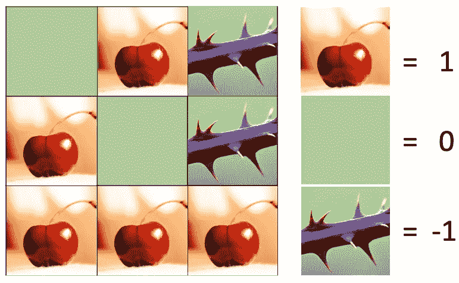

《樱桃》由[布鲁诺](https://www.pexels.com/@brunoscramgnon)创作，《荆棘》由 [CC BY-SA](https://creativecommons.org/licenses/by-sa/3.0/) 授权的未知作者创作

目标是仅使用单下右移动从左上移动到右下，并沿路收集樱桃，然后仅使用单上左移动返回到左上，并沿路收集樱桃，最后在这两条路径后收集最多的樱桃。

对这个问题感兴趣的人应该首先尝试使用自上而下的方法解决 leetcode 问题，也许可以考虑自下而上的解决方案。这篇文章是为那些已经放弃，盯着自下而上的解决方案，仍然不知道发生了什么。

**自下而上的解决方案(稍作编辑，使用 python 3 的范围，而不是 python 2 的 xrange)**

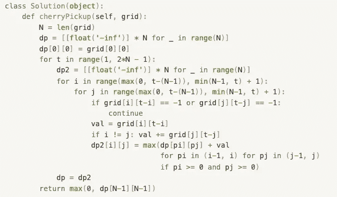

自下而上的解决方案

# **我对这个解决方案的疑问**

1.  为什么`range(1, 2*N - 1)`要进行图层迭代？
2.  I，j 通过`range(max(0, t-(N-1)), min(N-1, t) + 1)`的迭代在做什么？为什么有这些界限？
3.  指数`grid[i][t-i]`或`grid[j][t-j]`是什么意思？
4.  `val`是如何计算的，`i != j`是什么意思？
5.  为什么使用嵌套循环列表理解来完成`dp2`更新？
6.  为什么会有`dp`和`dp2`两个互相依赖的 2D 阵列？

照片由[杰米街](https://unsplash.com/@jamie452?utm_source=medium&utm_medium=referral)在 [Unsplash](https://unsplash.com?utm_source=medium&utm_medium=referral) 上拍摄

基本上，我对解决方案一无所知。在将`**Debug: Inline Values**`设置为 True 并对其他输入进行测试的情况下，在 vscode 中调试完调试器后，事情变得更加清晰了。

## **准备工作**

对我来说，理解解决方案最难的部分是记住`dp`和`dp2`指的是抽象的概念，而不是网格上的物理位置。`dp[1][1]`不代表两个人都在`grid[1][1]`。当跟踪算法时，读者必须不断地在心理上在`dp`数组和`grid`数组之间切换，这是令人困惑的，因为它们都具有相同的正方形形状和大小。

# **溶液流动**

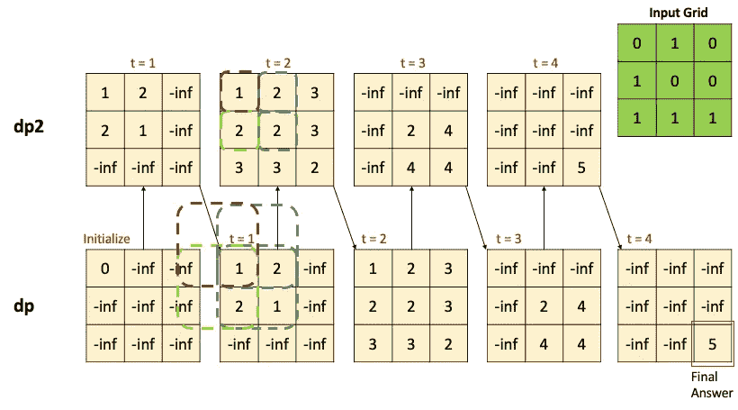

作者图片:动态编程的层次

使用 dp 变量逐层构建 dp2 数组，保存上一层的 dp2。每个 dp2 都需要填充其相关的单元格。`dp2`中的每个相关单元格是两部分的总和

*   来自`dp`的 4 个先前状态中的最佳状态
*   这两个人在网格中所处的当前状态的值(处理了重复计算)。

所有层做好之后，在 dp 中从右下角单元格读取整体答案。

并非每个`dp2`层中的所有单元都会覆盖它们的-inf，原因有二:

*   网格中的-1 使一些路径不可能(稍后解释)
*   人们必须每次移动一步，而不是静止不动的约束
    -如果 t = 1，任何人都无法走到第 2 行或第 2 列
    -如果 t = 3，任何人都无法停留在 N=3 网格中的第 0 行或第 0 列

# **1。为什么** `**range(1, 2*N - 1)**` **要进行图层迭代？**

为了理解这一点，我们可以模拟几个 N 值，看看我们得到了什么。

N = 2 → t =范围(1，2 * 2–1)= 1，2

N = 3 → t =范围(1，2 * 3–1)= 1，2，3，4

N = 4 → t =范围(1，2 * 4–1)= 1，2，3，4，5，6

在任何时刻，`t`都代表着两个人到目前为止已经走了多少步。

请注意，这两个人不可能在任何时候采取不同数量的步骤，因为根据算法设计，我们强迫两个人从一个子问题前进到下一个子问题。

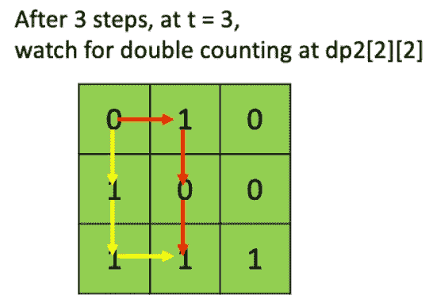

作者图片:重复计算是如何发生的

这样的设计有助于处理两个人可能摘同一个樱桃的情况，并避免了在一些其他回溯解决方案尝试中标记/取消标记网格的需要。

`t`中的最后一个值显示了从网格的左上单元走到右下单元所需的步数。对于大小为 3 的网格，需要 4 步，因此最大的`t`值是 4。不管你怎么走，任何{下，右}的顺序都需要 4 步才能完成 3 格。

## **为什么自下而上不像自上而下的 O(n)空间？**

我的一个外围问题是，既然自顶向下的解决方案中有 3 个变量在变化(`r1, c1, c2`)，为什么自底向上的解决方案不是具有 N 空间复杂度的三维解决方案。这个想法是不需要存储整个`t`(步骤)维度，因为它可以被压缩成一个`dp`和`dp2`的交互。

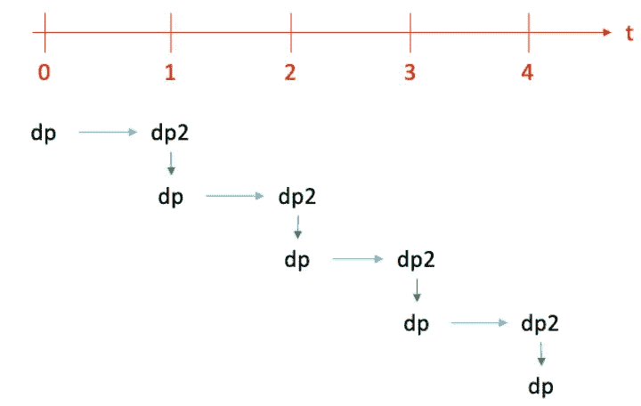

作者图片:将 t 维压缩成多个 dp 和 dp2

每个转移到下一个子问题都需要两个人的 1 步，所以下一个子问题只依赖于前一层。这类似于使用 2 个变量来跟踪 O(1)空间解决方案的 2 个步骤的历史，而不是使用 O(n)数组来跟踪算法开始以来的整个历史，来求解斐波那契。共同点是，如果子问题的依赖行为足够简单，可以硬编码成几个变量，则可以节省一维空间。

## 为什么压缩 t 维而不是其他 2 维？

除了 t 维，您可以选择将这种“只跟踪必要的历史”的想法应用到其他 2 维中的任何一个，只是简化 t 维是最容易解释和调试的。想象一个三维长方体，有三个不同的轴，你可以沿着这些轴将这个长方体切割成许多 2D 切片。虽然你只能将一维压缩成变量，但尝试在二维上进行，并且没有足够的历史记录来完成自下而上的解决方案。不知道这种“只允许一维压缩”的直觉是否适用于所有问题，或者只是樱桃皮卡，希望有经验的人可以在这里附和。

# **2。I，j 通过**`**range(max(0, t-(N-1)), min(N-1, t) + 1)**`T12 的迭代在做什么？为什么有这些界限？

这里有几个移动的部分，N 是固定的，`t`变化，但也有一些最小值/最大值，所以让我们用例子来理解 N = 3 的情况。

t = 1 → max(0，1-(3–1))= max(0，-1) → 0，min(3–1，1) = min(2，1) = 1

t = 2 → max(0，2-(3–1))= max(0，0) → 0，min(3–1，2) = min(2，2) = 2

t = 3 → max(0，3-(3–1))= max(0，1) → 1，min(3–1，3) = min(2，3) = 2

t = 4 → max(0，4-(3–1))= max(0，2) → 2，min(3–1，4) = min(2，4) = 2

我们停在 4，因为 N = 3 最多有 4 层。

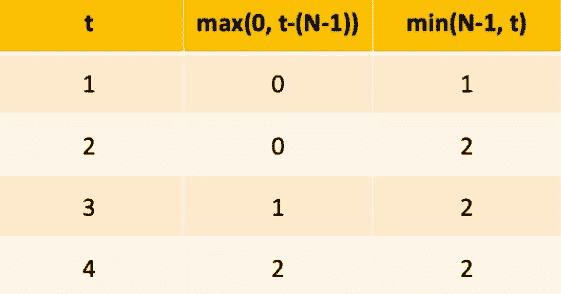

作者图片:I，j 对于每个 t 的迭代范围

概括地说，用于填充每层的`dp2`的`i`、`j`迭代值(包括端点，因为在上述计算中，范围 I 的端点处有一个+1 ):

t = 1 → 0，1

t = 2 → 0，1，2

t = 3 → 1，2

t = 4 → 2

## **为什么会有这些界限？**

在解释这一点之前，我们必须暂时跳到问题 3 来理解这些指数的物理意义。

# **3。指数** `**grid[i][t-i]**` **或** `**grid[j][t-j]**` **是什么意思？**

来自[樱桃皮卡](https://leetcode.com/problems/cherry-pickup/)的官方解决方案:

> *在* `*t*` *时刻，让* `*dp[c1][c2]*` *成为两个人从* `*(0, 0)*` *到* `*(r1, c1)*` *和* `*(0, 0)*` *到* `*(r2, c2)*` *，其中* `*r1 = t-c1, r2 = t-c2*`能够摘到的最多的樱桃

我怀疑上面的语句中存在行和列交换的错误。因为`i`和`j`被用作 grid 中的第 1 个索引，所以我相信它们应该指的是行。

我认为应该这样理解:

> *在* `*t*` *时刻，让* `*dp[r1][r2]*` *成为两个人从* `*(0, 0)*` *到* `*(r1, c1)*` *和* `*(0, 0)*` *到* `*(r2, c2)*` *能摘到的最多的樱桃，其中* `*c1 = t-r1, c2 = t-r2*`

这意味着`dp`或`dp2`中的第一个值是第一个人当前在网格中的哪一行，而`dp`或`dp2`中的第二个值是第二个人当前在网格中的哪一行。因为`t`是已知的，这意味着通过做`t-r1`或`t-r2`我们也知道两个人在哪个列，所以`dp[r1][r2]`完全描述了两个人的坐标。

## **重要警告**

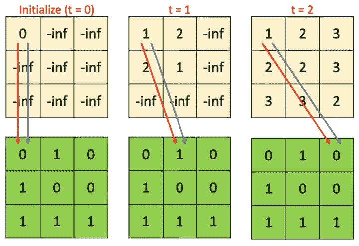

图片作者:注意你在哪个图层的 dp2

很重要的一点要注意，跨层时，`t`会发生变化。因此，t = 1 的`dp[0][0]`与 t = 2 的同一个`dp[0][0]`相比，在网格上具有完全不同的物理意义。

当 t = 1 时，两个人都走了 1 步。因为`dp[0][0]`意味着两者在 1 步后仍然在第 0 行，所以它们必须都移动到右 1 列并且都在`grid[0][1]`。

当 t = 2 时，两个人都走了 2 步。因为`dp[0][0]`意味着两者在两步后仍在第 0 行，所以它们必须都移动到右边的 2 列并且都在`grid[0][2]`。

回到这个问题，`grid[i][t-i]`，`grid[j][t-j]`则分别表示网格上第一个人和第二个人的行列坐标。它们有两个用途:

*   检查这两个人中是否有人走到网格上的-1 单元格上(这种状态是不可能的，因此不需要用任何有用的值更新`dp2`中的相应单元格)
*   访问网格，将当前州的樱桃(可能是 0 或 1)添加到来自`dp`的前 4 个州的最佳答案之上

## **回到为什么这些界限**

t = 1 → 0，1

t = 2 → 0，1，2

t = 3 → 1，2

t = 4 → 2

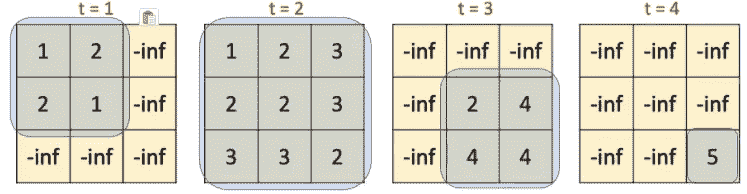

作者的图像:可视化相关的 dp2 区域以填充每个层

正如前面提到的为什么`dp2`中的一些单元格不会被更新的“解流”部分，有一个约束条件，人们必须每次移动一步，而不是静止不动。

当 t = 1 时，只有`dp2`左上方的 2x2 方块需要更新，因为没有人可以只用一个时间步长来踩第 2 行或第 2 列。

当 t = 2 时，整个`dp2`都是可能状态

当 t = 3 时，只有`dp2`右下方的 2x2 方块需要更新，因为在 3 个时间步长后，没有人能停留在行 0 或列 0。

当 t = 4 时，两个人肯定都在网格的右下角

## 如果我们只是遍历整个 NxN 并检查非法方块呢？

我考虑过这是否会使循环边界更容易编写，但后来意识到要检查的条件已经嵌入到优化的循环中了！
例如，如果我们简单地做了`for i in range(N)`、`for j in range(N)`，并为`continue`在当前的 2 个条件中添加了更多的条件，则这些条件将类似于以下内容(因为它们需要对要排除的内容取反，而不是包含的内容):

*   r1 < N, r1≤ t (same 2 conditions for r2) to prevent any person stepping further than the accumulated time step allows him to go
*   r1 ≥ t-(N-1) (same for r2) to prevent any person (impossibly) staying at row 0 when he has used up all the columns in the grid after a certain number of time steps (so is forced to step down the rows).

Rather than adding more conditions in 【 which makes the code harder to read and longer to run, they are already elegantly expressed in 【 and 【 . N for upper bound was changed to N-1 to compensate for/allow factoring out a +1 at the end of 【 .
我更喜欢把上界写成`min(N,t+1)`来去掉结尾奇怪的+1，而不是强制 N-1。

# **4。** `**val**` **是如何计算的** `**i != j**` **是什么意思？**

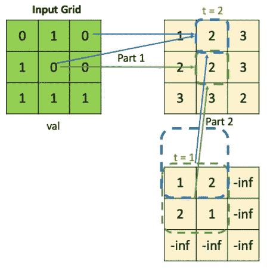

作者图片:计算 val 的两种情况

`val`是算法的两个部分之一，它决定什么进入每层的 dp2 中的每个单元。它查看 person 1 在网格中的位置以获取其值(可能有樱桃，可能没有，但求和 0 不会有什么影响，所以只求和)。`i != j`是有条件的，因此只有当第二个人与第一个人不在同一个格子中时，才计算第二个人的樱桃(如果他在格子中有 1)。这种检查是足够的，因为当两个人在网格的相同位置时，他们将具有相同的行索引，所以`i = j`。它们的列索引也将是相同的，因为在任何`t`，对于相同的`t`，两个人的列索引`t - i`和`t - j`将是相同的列。

**案例 1: i = j**

上面的绿色箭头`dp2[1][1]`演示了这一点。`val`为 0，由于两人在网格中处于同一位置，所以只有一份被加到`dp2[1][1]`中

**案例二:我！= j**

`dp2[0][1]`的蓝色箭头表示网格中 2 个不同位置的 2 个 val 值被加到`dp2[0][1]`中。

这两者只对答案的第一部分有贡献。第 2 部分在问题 5 中解释。

# **5。为什么** `**dp2**` **更新是使用嵌套循环列表理解完成的？**

除了`val`之外，决定`dp2`中每个单元格的内容的第二部分是`dp2`中当前位置左上方的`dp`中的 2x2 方块单元格。该算法按照红色、蓝色、橙色、绿色的顺序进行检查。

`if pi >= 0 and pj >= 0`处理红色、蓝色、橙色支票超出`dp`边界的次数，以防止 IndexError(也因为那里没有物理意义上的信息)。

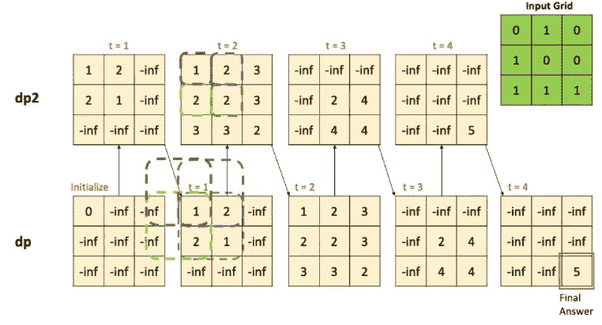

图片由作者提供:查看 dp 中的四个 2x2 方块，以更新 t=2 时的 dp2

## **为什么检查前一层 dp 中的 4 个单元**

4 个单元，因为当前`dp2`中的每个单元可以从`dp`中的 4 个状态到达。

再次注意到`dp`中的这 4 个状态并不对应于物理网格上的 2x2 正方形，而是前一层中两个人的行位置的更抽象的概念。

关注 t = 2 的绿色单元格`dp2[1][1]`，它来自于在 t = 1 时从`dp2`创建的`dp`中的 2x2 单元格。物理意义是人 1 在网格上的第 1 行(也意味着第 1 列，因为 t = 2，c1 = t - r1)，人 2 也在网格上的相同位置。

*   **左上(1):**
    这是当两个人都在第 0 行第 1 列时(因为 t = 1)，这意味着两个人都从他们在 t = 1 时的位置向下移动 1 行到达 t = 2 时的当前状态。
*   **右上(2):**
    这是当人 1 在第 0 行第 1 列，人 2 在第 1 行第 0 列时，意味着当前状态是人 1 向下移动 1 行，人 2 向右移动 1 列。
*   **左下(2):** 这是当人 1 在第 1 行第 0 列，人 2 在第 0 行第 1 列时，意味着人 1 向右移动 1 列，人 2 向下移动 1 行就到达了当前状态。
*   **右下(1):** 这是当两个人都在第 1 行第 0 列时，意味着两个人都向右移动 1 列达到当前状态。

我们可以使用上面的理解来跟踪 t = 1 时从带有单个 0 的初始化 dp 到`dp2`的值，看看它是如何工作的。记住`val`也影响当前`dp2`单元格的值。

# **6。为什么会有** `**dp**` **和** `**dp2**` **两个互相依赖的 2D 数组？**

这两个 2d 数组是为了节省空间而创建的，因此我们不使用 3D 数组，而只使用两个相互依赖的 2D 数组。上面问题 1 的解决方案流程和解释应该已经清楚了这一点。

# **如果输入为-1 怎么办**

敏锐的读者会发现我的输入网格将两个-1 值替换为 0。这样做是为了更好地展示在最简单的情况下`dp2`会是什么样子，并展示`range(max(0, t-(N-1)), min(N-1, t) + 1)`界限是如何工作的。

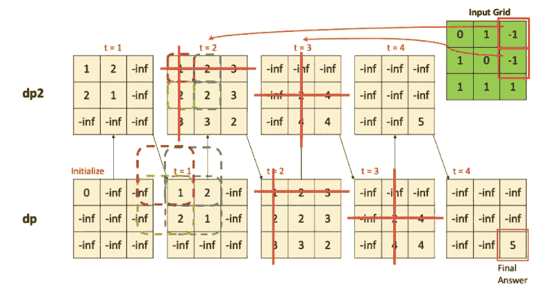

作者的图像:输入包含-1 的情况

如果我们使用 leetcode 上给出的原始网格

*   grid[0][2]处的-1 将导致 t = 2 中 2 条红线下的单元格全部为-inf
*   grid[1][2]处的-1 将导致 t = 3 中 2 条红线下的单元格全部为-inf。

不过这并不影响最终的答案。

## **为什么网格中的-1 会导致红线保持在-inf 处**

以 t = 2 为例。

网格[0][2]处的 A -1 将使`dp2[0][x]` (x 表示任何列)处的所有结果都不可能，因为行索引为 0 意味着人员 1 将 2 列向右移动了 2 步。人 1 遇到了那条不可能的路径，所以无论人 2 在哪里，这条路径都不能保存在`dp2`中。只需将 1 号人物和 2 号人物换成`dp2[x][0]`的理由。

# **为什么 dp2 看起来是对称的？**

任何层的`dp2`都将是对称的。我们重点来看一下 t = 1 的`dp2`的 2x2 平方(1，2，2，1)。

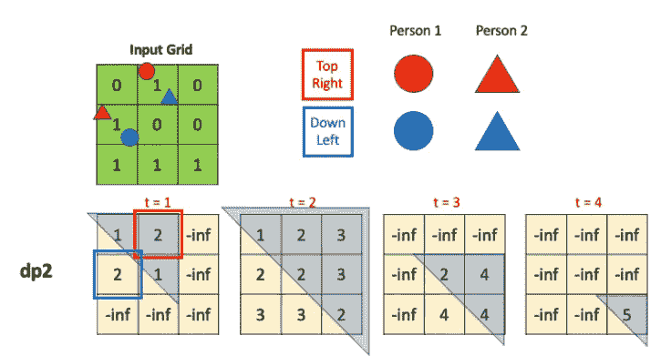

图片作者:看到对称了吗？

*   右上角红色状态，带 2 in `dp2[0][1]`。表示第 0 行第 1 列的人员 1(红色圆圈)，第 1 行第 0 列的人员 2(红色三角形)。
*   `dp2[1][0]`左下角蓝色状态 2 表示第 1 行第 0 列的人 1(蓝色圆圈)，第 0 行第 1 列的人 2(蓝色三角形)。

我们看到的是，尽管樱桃数量出现在相反的对角线上，但它们覆盖了网格中的相同路径，只是人 1 和人 2 被交换了。这种模式只在`dp2`中出现在非对角线上，因为总是有 2 种方式来安排人员 1 和 2，同时共同覆盖网格中相同的 2 个非对角线正方形，但是只有 1 种方式让他们覆盖网格中的对角线正方形，因此在`dp2`中也只有 1 个对角线值。

回到最初的问题描述，这整个人 1，人 2 的事情只是一个虚构的概念，以帮助制定动态编程中的状态变量。无论您沿着路径 A 到达任何(可能是中间)状态并返回路径 B，还是沿着路径 B 到达相同的状态并返回路径 A，都不应该改变在该状态下采摘的樱桃数量。

在层之间移动，我们从对称的`dp`开始，然后对`dp2`中的每个单元应用相同的 2x2 左上检查，这意味着这种对称通过层传播。

这意味着你实际上可以填充`dp2`的上/下三角形，仍然得到相同的最终答案。然而，为了易于实现循环索引，并且由于空间复杂度没有提高一个数量级，填充整个`dp2`方块看起来不错。

# **是什么让这个问题变难了？**

1.  将返回路径逆转为第二条前进路径的创造力
2.  知道迫使每个人每次移动 1 步会使他们在相同步数后到达相同的单元，并且这允许方便地处理重复计数，而不需要标记/取消标记网格
3.  建立状态的抽象表示，而不是直接跟踪`grid`，并使用`dp2`和`t`自下而上地这样做，而不是 r1、c1、c2
4.  正确生成`i`、`j`的索引，并将每个`dp2`单元正确链接到前 4 个状态

# **是什么让自下而上的解决方案比自上而下的更难？**

1.  使用`t`步长变量提取两个人的坐标，并使用`t`作为最外层循环逐步构建解决方案
2.  知道任何时候只需要 2 层，而不是全部的`t`历史，所以只需要 O(n)个空间，而不是自顶向下的 O(n)

照片由[梅尔特·卡赫维奇](https://unsplash.com/@mertkahveci?utm_source=medium&utm_medium=referral)在 [Unsplash](https://unsplash.com?utm_source=medium&utm_medium=referral) 拍摄

# 引人深思的事

1.  迭代方向在自底向上中什么时候重要，或者说重要吗？
2.  自下而上的求解路径是否正好与自上而下的路径相反？总是吗？
3.  “相反”到底是什么意思？当我们超越 1 维时是否存在对立面？
4.  这个问题不是通过两个人同时行走，而是只有一个人，并更新网格状态来解决的吗？为什么或为什么不？是可解性问题还是效率问题？
5.  如果这个问题被调整为需要 3 次行走(在网格的右下方结束)，那么需要 3 个人，如何建模？
6.  如果超过 3 个人，自下而上比自上而下节省的空间会随着人数的增加而增加还是保持不变？
7.  对于任何一个 DP 问题，最多 1 维可以空间优化吗(比如这个例子中的 t)？那一定是在最外面的循环吗？
8.  为什么自上而下用 r1，c1，c2 表示状态，而自下而上用 t，r1，r2？通过使用彼此的表示，这两种方法还能工作吗？既然 t 几乎是 2N 而不是 N，那么用 t 表示是不是浪费空间/时间？

## 我对问题 8“依赖性魔方的诅咒”的部分尝试:

如果我们将 r1 c1 c2 用于自下而上，则无法将 3D 更新关系压缩到 2D 中，也无法像使用 t、r1、r2 那样将 1 维分解到 for 循环中。
为什么？查看 leetcode 上给出的自顶向下解决方案的以下状态转换:

*   人 1 下，人 2 下:`dp[r1+1][c1][c2]`；
*   人 1 右人 2 下:`dp[r1][c1+1][c2]`；
*   人 1 下人 2 右:`dp[r1+1][c1][c2+1]`；
*   人 1 右和人 2 右:`dp[r1][c1+1][c2+1]`；

无论您选择 r1、c1 还是 c2，它们中的任何一个都将使 4 个移动中的 2 个保持相同的值，其他 2 个取决于+1(如果您从左上角的网格[0][0]作为基础情况到网格的右下角构建底部，则必须翻转到-1，否则如果您从相反方向的网格[-1][-1]底部向上，则可以是+1)。

无论 4 个中有多少个，我的重点是阻止在平面块中构建历史的依赖性的不均匀性。使用 t，r1，r2 表示允许对 t-1 的均匀依赖，这是这种自底向上解决方案的精髓。

# 伸展你解决问题的肌肉

1.  **初学者**:接触其他动态编程问题，配以自上而下的樱桃捡拾方法图解:[https://towards data science . com/mastering-Dynamic-Programming-a 627 dbdf 0229](/mastering-dynamic-programming-a627dbdf0229)
2.  **中级**:简明背包利弊来自最喜欢的答案 by【删除】:[https://www . Reddit . com/r/cscareerquestions/comments/c6t7a 0/dynamic _ programming _ problems _ are _ they _ important/](https://www.reddit.com/r/cscareerquestions/comments/c6t7a0/dynamic_programming_problems_are_they_important/)
3.  **高级**:动态编程中的优化机会(古老而珍贵):[https://codeforces.com/blog/entry/8219](https://codeforces.com/blog/entry/8219)

# 最终外卖

在这个练习之前，我一直认为自底向上的状态跟踪空间中的每个单元格都必须填满，但这个问题证明了相反的情况。
然而，这种怪癖只是特定于这个问题的约束和表示，其中人必须移动，并且在每一步 t 只移动 1。

因此，考虑用于表示 DP 状态的每个维度的可能值的范围很重要。这些可能的值在各个维度上可能并不独立。在这个问题中，每个 r1、r2 的范围依赖于 t。(在上面的**部分可视化，回到为什么这些边界**部分)。

我希望这篇文章给你留下一个框架来分解其他自下而上的解决方案，并寻找机会做空间优化。我的 6 个问题是按照代码阅读顺序问的，但是你可能会找到一个更有效的提问和理解算法的顺序。