# 卡方分布简单解释

> 原文：<https://towardsdatascience.com/chi-square-distribution-simply-explained-87f707ba631a>

## 卡方分布及其起源的简单解释

micha Parzuchowski 在 [Unsplash](https://unsplash.com?utm_source=medium&utm_medium=referral) 上的照片

# 介绍

在我之前的文章中，我们推导并讨论了伽玛分布，你可以在这里查看:

  

在这篇文章中，我们将解释伽玛分布的一个特例，卡方分布。这种分布在统计学中无处不在，甚至有它自己的检验，在数据科学中经常使用，卡方检验。

我们将通过推导其**概率密度函数(PDF)** 来了解分布的起源，并展示其与伽马分布的关系。

# 起源

卡方分布， **𝜒2** ，是来自**标准正态分布:**的 ***v*** 随机自变量相加的结果

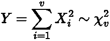

作者在 LaTeX 中生成的方程。

我们来分解一下这个表达式。

值 ***X*** 是从**标准正态分布中抽取的随机变量。**这是一个正态分布，[均值为零，方差为一](https://www.scribbr.com/statistics/standard-normal-distribution/)， ***N(0，1):***

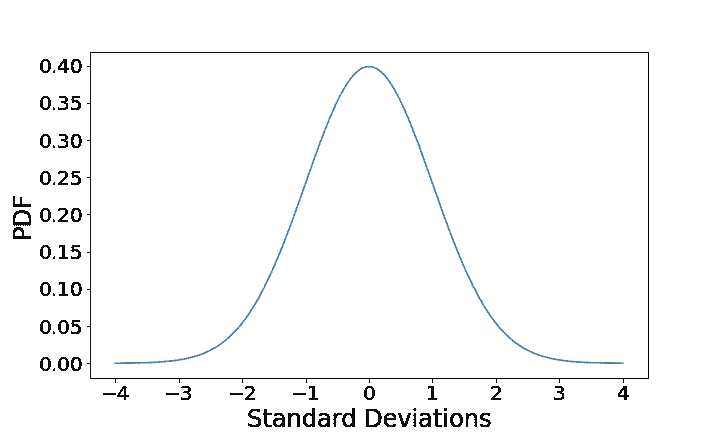

作者用 Python 生成的图像。

***v*** 是)**自由度，是我们从分布中取样的变量的数量。所以，如果我们采样一个变量， ***v = 1*** ，从**标准正态分布:****

**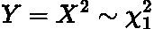**

**作者在 LaTeX 中生成的方程。**

**卡方分布如下所示:**

**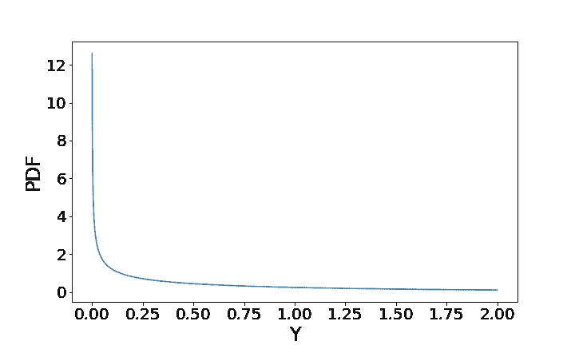**

**作者用 Python 生成的图像。**

**这有道理吗？当我们对这些值求平方时，它们将会**显著减少或增加并变为正值**。此外，由于对-1 和 1 之间的变量进行采样的概率相对较高，因此将它们平方意味着它们将变得更小。因此，我们观察到大部分密度在左手边。**

**当我们有**三个自由度， *v = 3* :** 时呢**

**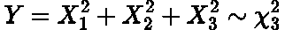**

**作者在 LaTeX 中生成的方程。**

**绘制分布图:**

**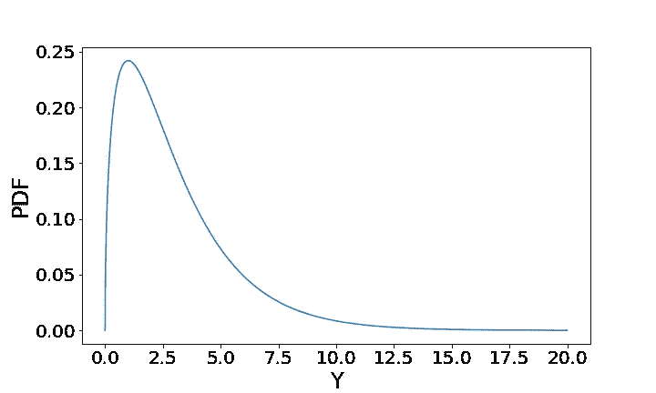**

**作者用 Python 生成的图像。**

**我们看到，这些值平均要大得多，而且更加左倾。这是有意义的，因为当我们有更多的自由度时，我们更有可能采样高数值。求和也自然导致更高的值。**

**所以这就是全部了！卡方是从标准正态分布中选取的值的平方。**

# **导出**概率密度函数****

**现在我们要推导一个一自由度卡方分布的*******v = 1***。******

****让我们从标准正态分布的 PDF 开始:****

****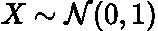****

****作者在 LaTeX 中生成的方程。****

****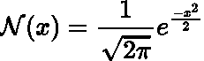****

****作者在 LaTeX 中生成的方程。****

****为了计算 PDF，我们需要找到 [**累积密度函数(CDF)**](https://en.wikipedia.org/wiki/Cumulative_distribution_function) ，然后简单地对其进行微分以返回 PDF。综合发展框架的定义是:****

****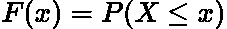****

****作者在 LaTeX 中生成的方程。****

****将它应用到卡方公式中，我们想要找到 **𝑋** 的 PDF:****

****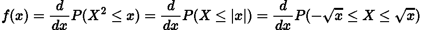****

****作者在 LaTeX 中生成的方程。****

****这个推导需要很多积分和替换，所以我省略了全部证明，因为我不想这篇文章变成一篇研究论文！不过，这里有一个[很棒的帖子](https://math.stackexchange.com/questions/71537/derivation-of-chi-squared-pdf-with-one-degree-of-freedom-from-normal-distributio)和这里的[网页](https://en.wikipedia.org/wiki/Proofs_related_to_chi-squared_distribution)把整个证明过的很彻底很干净。****

****然而，通过进行微分，最终的 PDF 等于:****

****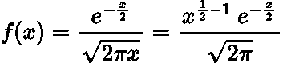****

****作者在 LaTeX 中生成的方程。****

****事实上，这只是一个自由度的 PDF。 ***v*** 自由度的 PDF 为:****

****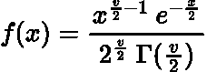****

****作者在 LaTeX 中生成的方程。****

****其中**γ**是[γ函数](https://en.wikipedia.org/wiki/Gamma_function)。对于半正整数值，函数的形式为:****

****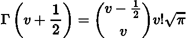****

****作者在 LaTeX 中生成的方程。****

****通过设置 ***v = 1，*** 可以看出，我们获得了上面推导的一个自由度的 PDF。****

# ****与伽马分布的关系****

****我们知道伽马分布由两个值参数化:****

*   *******λ，*事件发生率******
*   *******n* ，你所等待的事件的数量******

****而它的**概率密度函数**是:****

****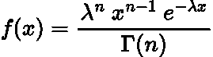****

****作者在 LaTeX 中生成的图像。****

****其中 ***x*** 是感兴趣的随机变量。****

> ****为了充分理解这个表达的来源，我建议阅读我之前关于伽马分布的文章。****

****通过设置 ***n = v/2*** 和 ***λ = 1/2:*******

****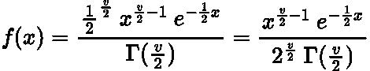****

****作者在 LaTeX 中生成的图像。****

****我们证明了卡方分布只是伽玛分布的一个特例！****

# ****结论****

****在这篇文章中，我们展示了如何从第一原理和伽玛分布中推导卡方分布。在我的下一篇文章中，我们将使用分布来解释卡方检验！****

# ****和我联系！****

*   ****[*要想在媒体上阅读无限的故事，请务必在这里报名！*](/@egorhowell/membership) 💜****
*   ****😀****
*   ****[*LinkedIn*](https://www.linkedin.com/in/egor-howell-092a721b3/)*👔*****
*   *****[*推特*](https://twitter.com/EgorHowell) 🖊*****
*   *****[*github*](https://github.com/egorhowell)*🖥******
*   ********🏅********

> *******(所有表情符号都是由 [OpenMoji](https://openmoji.org/) 设计的——开源的表情符号和图标项目。许可证: [CC BY-SA 4.0](https://creativecommons.org/licenses/by-sa/4.0/#)*******