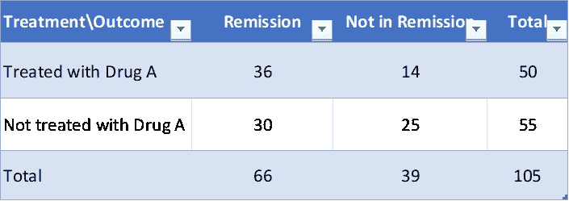
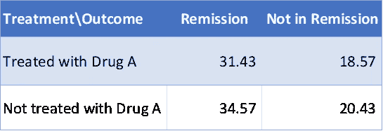

# 卡方检验——如何使用公式和 Python 实现计算卡方

> 原文：<https://towardsdatascience.com/chi-square-test-how-to-calculate-chi-square-using-formula-python-implementation-6da203f96569>


凯利·西克玛在 [Unsplash](https://unsplash.com?utm_source=medium&utm_medium=referral) 上的照片

# 1.测试类型

卡方检验是非参数检验，也就是说，它不需要对抽样人群进行正态分布或方差假设。

# 2.目的

卡方检验的一般目的是比较离散的分类数据(计数数据)。例如，产品可以分为两类，如有缺陷/无缺陷，或者分为两类以上，如优秀、良好、一般和差。卡方检验非常适合于比较的两个变量都是分类变量的数据集。卡方检验将观察值与理论期望值进行比较。

# 3.范围

像卡方检验这样的非参数检验不如参数检验有效，也就是说，它们不太可能拒绝零假设，尤其是当它为假时。一些应用领域包括:

1.  用于检查拟合优度的卡方检验用于检查观察值(实验值)和预期值(理论值)之间是否存在差异。它确定与过去相比，数据的分布是否保持相似
2.  两个属性独立性的卡方检验用于检查两个特征是否独立。它用于确定分类结果变量(Y)是否与另一个分类预测变量(X)相关联

# 4.假设

1.  样本是从人群中随机抽取的。这是将结果推广到全部人口所必需的
2.  数据将以原始频率报告(计数，而非百分比)
3.  观察是独立的
4.  变量是互斥的(个人不能被分配到一个以上的类别)和穷举的(包括所有可能的上下文或类别)
5.  在 2 x 2 表中，观察到的频率不算太小(n 必须相对较大)；如果 n 小于 20 或任何单个细胞计数小于 5，则不应使用卡方检验

# 5.方法学

几种类型的卡方检验取决于所需的数据收集和检验。我们来看一个最简单的例子，它包括一个 2 x 2 的列联表。假设你对一组多发性骨髓瘤患者进行了一项药物试验，并假设接受药物治疗的患者与未接受药物治疗的患者相比，缓解率有所提高。让我们假设收集了以下数据。



**图一。**使用假设数据的列联表。图像—由作者使用 Excel 制作。

**H0(零假设):**各种情况下观察值的分布是相等的(观察到的频率不偏离预测的频率)，即药物治疗不影响进入缓解的患者比例。

**HA(替代假设):**进入缓解期的患者比例与药物治疗有关，这表明观察结果并不是均匀分布在各个环境中的(观察到的频率确实与预测的频率不同)。


**图一。**检验统计量的公式。图像—由作者使用 Powerpoint 准备。

其中 **O** 为*观测频率*，而 **E** 为*期望频率*。

# 6.计算卡方统计

## 6.1 计算预期频率

下表的卡方统计计算如下:

1.  计算每个单元中的预期频率。每个单元格的预期频率(E)由(行总计 x 列总计)/总计给出
2.  行总计表示给定上下文的观察总数(例如，有多少患者用药物 A 治疗？— 50 名患者)
3.  total 列表示给定因变量的观察总数(例如，有多少患者处于缓解期？— 66 名患者)
4.  总计代表观察的总数(例如，参与研究的患者总数-105 名患者)



**图 3。**使用假设数据的列联表和期望值。图像—由作者使用 Excel 制作。

用药物 A 治疗的预期值×缓解计算为(50×66)/105 = 31.43。2.观察到的频率(O)是收集的数据，反映了实际数字，即对于用药物 A×缓解治疗，它是 36。

## 6.2 计算测试统计

使用公式χ2=∑[(O-E)2/E]计算统计值。
χ2 =(36–31.42)/31.42+(14–18..57) /18.57 + (30–34.57) /34.57 + (25–20.43) /20.43 = 3.418

## 6.3 计算自由度

自由度= (# columns (or)因变量—1)*(# rows(or)categories—1)=(2–1)(2–1)= 1

## 6.4 优势比

这是 2 × 2 列联表关联的另一种度量。在分类数据的最重要模型中，它作为一个参数出现。对于成功概率π，成功几率定义为；赔率=π/(1π)。

几率是非负的，当成功的可能性大于失败的可能性时，其值大于 1.0。例如，如果π = 0.75，那么成功的几率等于 0.75/0.25 = 3。当赔率= 4.0 时，成功的可能性是失败的 4 倍。


**图 4。**参考下面的比值比计算。图像—由作者使用 Excel 制作。

所以，比值比=(A 类成功几率)/(B 类成功几率)。在本例中，接受治疗的患者的缓解几率= 36/14 = 2.57，未接受治疗的患者的缓解几率= 30/25 =1.2。比值比由这两个比值给出，即 2.57/1.2 = 2.14。这一比率意味着接受治疗的患者比未接受治疗的患者更有可能获得缓解 2.14 倍。

**计算比值比的捷径:**
让我们考虑上面的例子，其中我们必须计算治疗类别中缓解相对于未治疗类别的比值比。在上表中，每个单元格的值都用一个字母表示。
那么，赔率会是(A*D)/(B*C)。对于我们的例子，优势比= (36*25)/(14*30) = 2.14。

## **6.5 解释**

将计算的χ2 统计值与临界χ2 值进行比较，以确定是否拒绝零假设:

1.  如果计算的χ2 >临界χ2，p≤0.05-表明有重要的统计证据支持拒绝零假设。我们偶然获得这一结果的概率小于或等于 5%,这是实验可接受的误差水平
2.  如果计算的χ2 ≤临界χ2，p> 0.05 表示没有显著的统计证据支持拒绝零假设。我们偶然得到这个结果的概率大于 5%,这超过了任何实验可接受的误差水平

在我们的例子中，我们现在有了卡方统计(χ2 = 3.418)、预先确定的 alpha 显著性水平(0.05)和自由度(df = 1)。进入具有 1 个自由度的卡方分布表并沿行读取，我们发现我们的χ2 (3.418)值位于 2.706 和 3.841 之间。相应的概率是 0.07。因此，p 值大于可接受的显著性水平 0.05，具有 95%的置信区间(CI)(即 p > 0.05)；我们没有足够的证据来否定无效假设。更简单地说，两个治疗组的缓解患者比例没有显著差异。可以使用下面的链接查找 p 值。

 [## 表:卡方概率

### 顶部给出的区域是临界值右侧的区域。要在左侧查找某个区域…

people.richland.edu](https://people.richland.edu/james/lecture/m170/tbl-chi.html) 

# 7.用 Python 实现

从任何数据集中选择两个分类列，然后创建一个交叉表。cross 选项卡的输出然后与 chi2_contingency()一起使用，以获得拒绝或接受零假设的 p 值。

```
#----------step 1: Extract required columns, ideally it should be two columns at a timedata_interim=df[['column1', 'column2']]#----------step 2: Create a cross tab which is a contigency tabledata_cont=pd.crosstab(data_interim['column1'], data_interim['column2'])data_contfrom scipy.stats import chi2_contingencystat, p, dof, expected = chi2_contingency(data_cont)#-----------interpret p-value
alpha = 0.05print("p value is " + str(p))if p <= alpha:

    print('Dependent (reject H0)')

else:
    print('Independent (H0 holds true)')
```

# 8.结论

在制药领域，尤其是在处理患者数据、医生数据或销售人员数据时，需要了解不同变量之间的相关性，尤其是分类变量。制药行业的分类属性包括目标细分、患者数量、性别、人口统计、通话结果、通话质量、销售代表拜访的讨论主题等等。当我们检查更少的类别时，卡方检验可以让我们建立这些变量之间的关系，这反过来可以用来深入研究变量或选择的驱动因素。

*关于作者:高级分析专家和管理顾问，帮助公司通过对组织数据的商业、技术和数学的组合找到各种问题的解决方案。一个数据科学爱好者，在这里分享、学习、贡献；你可以和我在* [*上联系*](https://www.linkedin.com/in/angel-das-9532bb12a/) *和* [*上推特*](https://twitter.com/dasangel07_andy)*；*