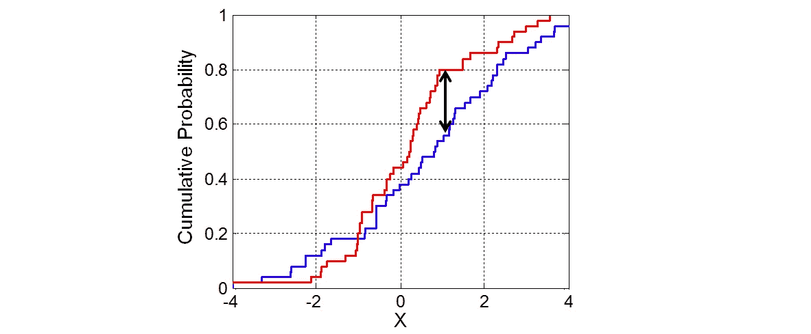
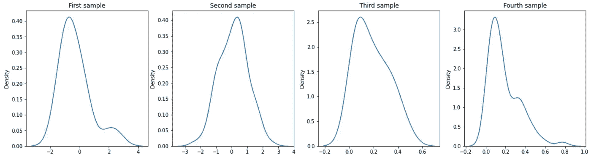

# 选择合适的正态性检验

> 原文：<https://towardsdatascience.com/choose-the-appropriate-normality-test-d53146ca1f1c>

## 夏皮罗-维尔克检验、科尔莫戈罗夫-斯米尔诺夫检验和达戈斯蒂诺-皮尔逊 K 检验


照片由[卢卡斯](https://www.pexels.com/@goumbik)在[像素](https://www.pexels.com/photo/chart-close-up-data-desk-590022/)上拍摄

正态分布，也称为高斯分布，是用两个参数描述的概率分布:平均值和标准差。对于正态分布，68%的观察值在平均值的一个标准差内，95%在两个标准差内，99.7%在三个标准差内。

对于许多最流行的统计检验来说，检验正态性是满足假设所必需的。否则，我们可能会得出不准确的结论，开发出不正确的模型。

但是，要得出数据分布的结论，统计学家不应该只依赖直方图或分布图等图形方法。也有必要包括正态性测试的结果。

然而，文献中有几个测试可以用来评估这种正态性，很难确定哪一个是最准确的。例如，文章[1]提到了 27 种不同的正态性检验。

因此，本文的目的是描述和比较三种主要的正态性检验:

1.  夏皮罗-维尔克试验
2.  科尔莫戈罗夫-斯米尔诺夫试验
3.  达戈斯蒂诺-皮尔逊 K 检验

本文展开如下。首先，对每项测试进行描述(参见第 1 节)。第二，试验之间的比较和关于哪种方法是最佳使用方法的结论(参见第 2 节)。最后，用 Python 实现这些算法(参见第 3 节)。

# 1.描述

夏皮罗-维尔克和达戈斯蒂诺-皮尔逊 K 检验的假设是:

*   [零假设](https://www.statisticshowto.com/probability-and-statistics/null-hypothesis/) (H0):数据服从正态分布。
*   备选假设 (H1):数据不符合正态分布。

相比之下，Kolmogorov-Smirnov 检验的假设为:

*   [零假设](https://www.statisticshowto.com/probability-and-statistics/null-hypothesis/) (H0):数据来自指定的分布。
*   [替代假设](https://www.statisticshowto.com/what-is-an-alternate-hypothesis/) (H1):至少有一个值与指定的分布不匹配。

如果我们认为指定的分布是正态分布，那么我们将评估正态性。

如果 *p 值*小于选择的α水平，那么零假设被拒绝，并且有证据表明测试的数据不是正态分布的。另一方面，如果 *p 值*大于所选的α水平，则不能拒绝零假设。

以下是计算每个测试的 p 值的逐步方法。

## 夏皮罗-维尔克试验

夏皮罗-维尔克(SW)正态性检验的基本方法如下[2]。

首先按升序排列数据，使*x1*≤……≤*xn*。其次，计算平方和，如下所示:


然后，计算 *b* 如下:


从[夏皮罗-维尔克表](https://www.real-statistics.com/statistics-tables/shapiro-wilk-table/)中的表 1(基于 *n* 的值)中取 *ai* 权重。注意，如果 *n* 为奇数，则在 *b* 的计算中不使用中间数据值。如果 *n* 是偶数，设 *m* = *n* /2，如果 *n* 是奇数，设*m*=(*n*–1)/2。

最后，计算测试统计量:


找出[夏皮罗-维尔克表](https://www.real-statistics.com/statistics-tables/shapiro-wilk-table/)的表 2 中最接近 *W* 的值(对于 *n* 的给定值)，必要时进行插值。这是测试的 p 值。

这种方法仅限于 3 到 50 个元素之间的样本。

## 科尔莫戈罗夫-斯米尔诺夫试验

Kolmogorov-Smirnov 测试将您的数据与指定的分布进行比较，如果它们具有相同的分布，则输出结果。尽管该检验是非参数的(它不假设任何特定的基础分布),但它通常被用作正态性检验，以查看您的数据是否正态分布[3]。

运行测试的一般步骤是:

*   为你的样本数据创建一个 EDF(步骤见 [*经验分布函数*](https://www.statisticshowto.com/empirical-distribution-function/) )。经验分布函数是对产生样本点的累积分布函数的估计。
*   指定一个父发行版(即您要与 EDF 进行比较的发行版)
*   将这两个分布绘制在一起。
*   测量两个图形之间的最大垂直距离，并计算检验统计量，其中 m 和 n 是样本大小。



**图一**。双样本 Kolmogorov-Smirnov 检验的一个例子。 **Ref** : [Bscan](https://en.wikipedia.org/wiki/Kolmogorov%E2%80%93Smirnov_test#/media/File:KS2_Example.png) 。

*   在 [KS 表](https://www.statisticshowto.com/kolmogorov-smirnov-test/#table)中找到临界值。
*   与临界值进行比较。

## 达戈斯蒂诺-皮尔逊 K 检验

D'Agostino-Pearson 的 K 检验计算两个统计参数，即峰度和偏斜度，以确定数据分布是否偏离正态分布:

*   **偏斜**是分布被向左或向右推的量化，是分布不对称的度量。
*   **峰度**量化分布有多少在尾部。这是一个简单且常用的正态性统计检验。

该测试首先计算偏斜度和峰度，以量化分布在不对称度和形状方面与高斯分布有多远。然后，它会计算这些值与高斯分布的预期值之间的差异，并根据这些差异的总和计算单个 p 值[4]。

# 2.测试选择

为了回答这个问题，下面是从文章[阿斯加尔·哈塞米](https://pubmed.ncbi.nlm.nih.gov/?term=Ghasemi%20A%5BAuthor%5D)等人(2012) [5]中得出的结论，这篇文章引用了 4000 多次:

> 根据现有文献，使用参数统计检验时，应考虑评估正态性假设。似乎最流行的正态性检验，即 Kolmogorov-Smirnov 检验，由于其功效较低，不应再使用。**最好通过目测和正态性检验来评估正态性，其中强烈推荐夏皮罗-维尔克检验。**

# 3.履行

为了评估测试，我们创建了四个样本，它们的样本大小和分布各不相同:

*   *第一个样本* : 20 个数据，正态分布。
*   *第二个样本* : 200 个数据，正态分布。
*   *第三个样本* : 20 个数据，β= 1，β = 5 的 beta 分布。
*   *第四个样本* : 200 个数据，β= 1，β = 5 的 beta 分布。



**图二**。样本分布。**参考**:图片由作者提供。

原则上，查看这些图，正态性检验应该拒绝第四个样本的零假设，而不应该拒绝第二个样本的零假设。另一方面，第一个和第三个样品的结果很难仅通过观察图来判断。

## 夏皮罗-维尔克试验

下面是夏皮罗-维尔克测试的实现:

```
Sample 1: ShapiroResult(statistic=0.869, pvalue=0.011)
Sample 2: ShapiroResult(statistic=0.996, pvalue=0.923)
Sample 3: ShapiroResult(statistic=0.926, pvalue=0.134)
Sample 4: ShapiroResult(statistic=0.878, pvalue=1.28e-11)
```

结果表明，我们可以拒绝样本 1 和 4 的零假设(样本不遵循正态分布)。

## 科尔莫戈罗夫-斯米尔诺夫试验

以下是 Kolmogorov-Smirnov 测试的实现:

```
Sample 1: KstestResult(statistic=0.274, pvalue=0.081)
Sample 2: KstestResult(statistic=0.091, pvalue=0.070)
Sample 3: KstestResult(statistic=0.507, pvalue=2.78e-05)
Sample 4: KstestResult(statistic=0.502, pvalue=4.51e-47)
```

结果表明，我们可以拒绝所有样本的零假设(样本不遵循正态分布)。

由于这种类型的检验也适用于任何类型的分布，我们可以比较它们之间的样本。

```
Samples 1 and 2: KstestResult(statistic=0.32, pvalue=0.039)
Samples 3 and 2: KstestResult(statistic=0.44, pvalue=0.001)
Samples 4 and 2: KstestResult(statistic=0.44, pvalue=2.23e-17)
```

## **达戈斯蒂诺-皮尔逊 K 检验**

下面是达戈斯蒂诺-皮尔逊 K 检验的实现:

```
Sample 1: NormaltestResult(statistic=10.13, pvalue=0.006)
Sample 2: NormaltestResult(statistic=0.280, pvalue=0.869)
Sample 3: NormaltestResult(statistic=2.082, pvalue=0.353)
Sample 4: NormaltestResult(statistic=46.62, pvalue=7.52e-11)
```

与夏皮罗-维尔克检验相似，结果表明我们可以拒绝样本 1 和 4 的零假设(样本不遵循正态分布)。

# 结论

测试样本的正态性对于满足许多最流行的统计测试的假设是必要的。然而，文献中有许多正态性检验，很难确定哪一个是最合适的正态性。

因此，本文描述了三个主要的正态性检验((1)夏皮罗-维尔克，(2)科尔莫戈罗夫-斯米尔诺夫，以及(3)达戈斯蒂诺-皮尔逊的 K)并且在四个不同的样本上实施了它们。

目前的文献和实验结果都表明，一般来说，推荐使用的测试是夏皮罗-维尔克[5]。

***如果你喜欢这个帖子，请考虑*** [***订阅***](https://javiferfer.medium.com/membership) ***。你将获得我所有的内容+所有其他来自牛逼创作者的文章！***

# 参考

[1]研究门，[二十七个正态性检验的比较](https://www.researchgate.net/publication/338392736_A_Comparison_among_Twenty-Seven_Normality_Tests)

[2]真实统计，[夏皮罗-维尔克原始检验](https://www.real-statistics.com/tests-normality-and-symmetry/statistical-tests-normality-symmetry/shapiro-wilk-test/)

[3]统计学如何， [Kolmogorov-Smirnov 拟合优度检验](https://www.statisticshowto.com/kolmogorov-smirnov-test/)

[4]真实统计，[达戈斯蒂诺-皮尔逊检验](https://www.real-statistics.com/tests-normality-and-symmetry/statistical-tests-normality-symmetry/dagostino-pearson-test/)

[5]美国国家医学图书馆，[统计分析的正态性检验:非统计人员指南](https://www.ncbi.nlm.nih.gov/pmc/articles/PMC3693611/)