# 为您的神经网络选择正确的优化算法

> 原文：<https://towardsdatascience.com/choose-the-right-optimization-algorithm-for-your-neural-network-cb86c15d7328>

## 由于神经网络开发过程的本质是迭代的，我们需要利用每一种可能的方法来最小化训练时间。

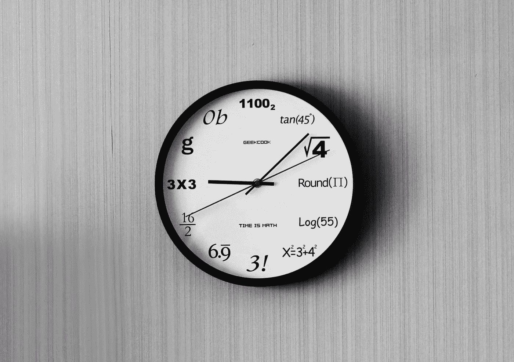

来源:unslpash.com

任何机器学习模型的开发都是一个高度迭代和经验主义的过程，遵循想法-实验-评估的循环。

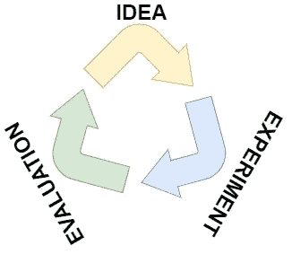

图片由作者提供。

在达到令人满意的性能之前，上述循环通常要重复多次。“实验”阶段包括机器学习模型的编码时间和训练时间。随着模型复杂性的增加和更多数据的处理，训练时间膨胀，结果是训练一个非常大的深度神经网络可能会非常慢[1]。

有不同的方法可以加速训练过程，例如:

*   使用迁移学习，就像我在[这个项目](/image-recognition-algorithm-using-transfer-learning-cae1deb2818f)中所做的那样。
*   应用适当的权重初始化，如 [Glorot](http://proceedings.mlr.press/v9/glorot10a/glorot10a.pdf) 或 [He](https://arxiv.org/abs/1502.01852v1) 初始化[2]，[3]。
*   对训练数据使用批处理规范化。
*   选择一个可靠的激活函数。
*   使用快速优化器。

虽然上述所有技术都是基本的，但本文将详细介绍最后一点。我提出了几种优化神经网络参数的方法，并指出每种方法的局限性和优点。

在文章的最后一部分，我展示了一个比较所有优化器的可视化图表。实际比较的代码可以在这个 GitHub 存储库中找到:

  

# 批量梯度下降

批次梯度下降传统上被认为是优化器方法的默认选择。

在神经网络输出对整个训练集 X 的预测之后，我们将网络的预测与每个训练点的实际标签进行比较。这样做是为了计算成本函数 J(W，b ),它是模型产生准确预测的能力的标量表示。梯度下降优化算法使用成本函数作为寻路器来调整网络的每个参数。直到代价函数接近于零，或者不能再降低，梯度下降在某个方向调整网络的每一个权值和偏差。所选择的方向是降低成本函数最多的方向。

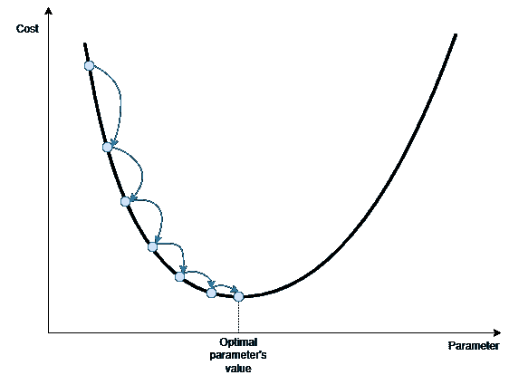

图片由作者提供。

拿上图做参考。梯度下降从最右边的蓝点开始。通过分析成本函数在起始点周围的梯度，它选择向右调整参数(x 轴值)。这个过程重复多次，直到算法以最佳值的非常好的近似值结束。

如果成本函数有两个输入参数，则该函数不是一条线，而是由一个三维表面组成。考虑到表面的水平曲线，可以显示批量梯度下降步骤:

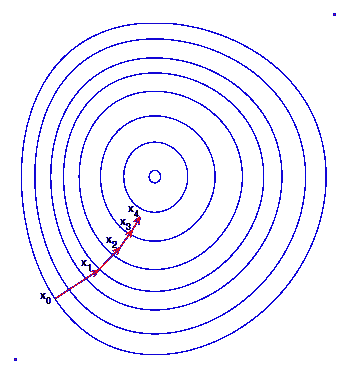

来源:[wikipedia.org](https://en.wikipedia.org/wiki/Gradient_descent)[4]

神经网络由成千上万影响成本函数的参数组成。由于无法显示百万维的图形表示，数学方程有助于理解梯度下降过程。

首先，我们计算成本函数 J(W，b ),它是网络的权重 W 和偏差 b 的函数。然后，由于反向传播算法，我们计算成本函数相对于网络每层的每个权重和偏差的导数:

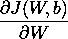

知道了调整参数的方向，我们就更新它们。每个参数的更新幅度由梯度本身和学习速率α来调节。α是优化算法的超参数，其值通常保持不变。

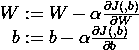

批量梯度下降的优点是:

*   这是一种简单易懂的方法。
*   它只有一个要调整的超参数(学习率)。
*   对于凸代价函数，只要我们为学习速率提供一个合理的值，它总是达到全局最优。

梯度下降的缺点是:

*   由于它会在评估所有训练示例后更新参数，因此可能会很慢，尤其是对于大型训练集。
*   可能会卡在局部最优或鞍点。
*   容易出现渐变消失或渐变爆炸的问题。
*   它需要将所有训练数据存储在 CPU/GPU 内存中。

# 小批量梯度下降

批量梯度下降要求遍历所有训练示例，以便采取单个改进步骤。该步骤将是最准确的，因为它考虑了所有可用的信息。然而，在大多数实际情况下，这种方法慢得不可思议，更快的解决方案是存在的。

最常见的解决方案称为小批量梯度下降，它只使用训练集的一小部分来更新权重值。

考虑整个训练集 X 和相关联的标签 Y:

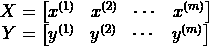

其中 m 是训练样本的数量。

我们只将训练集的一小部分提供给优化算法，而不是将整批数据提供给优化算法。假设子集 X^t 和 Y^t 包含 512 个训练示例:

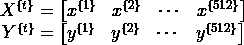

假设整个训练集包含 5，120，000 个训练点。我们将训练集分成 10，000 个小批量，每个小批量包含 512 个示例。

对于每个小批量，我们执行经典的梯度下降操作:

*   计算相对于小批量 t，J^t(W,b).的成本
*   执行反向传播以计算 J^t(W,b 相对于每个权重和偏差的梯度。
*   更新参数。

下图中的绿线显示了小批量梯度下降的典型优化路径。批量梯度下降采用更直接的路径到达最佳点，而小批量梯度下降似乎需要更多不必要的步骤。

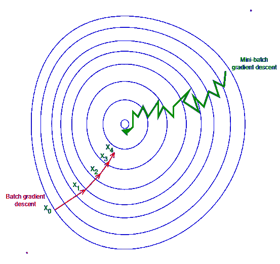

来源:[wikipedia.org](https://en.wikipedia.org/wiki/Gradient_descent)[4]

其原因是小批量梯度下降，在任何时候 t 只有一小部分训练集作为其决策的基础。由于可用信息的限制，很明显，所遵循的路径不是最直接的。

然而，小批量梯度下降的巨大优势在于，由于算法需要评估一小部分数据而不是整个训练集，因此每一步的计算速度都非常快。在我们的例子中，每一步只需要评估 512 个数据点，而不是 500 万。这也是为什么几乎没有真正需要大量数据的应用使用批量梯度下降的原因。

如图所示，使用小批量梯度下降，不能保证迭代 t+1 的成本低于迭代 t 的成本，但是，如果问题设置得很好，算法会非常快地到达最优点周围的区域。

小批量大小的选择是网络训练过程的附加超参数。如果小批量正好是 m，我们将执行批量梯度下降。相反，如果 m=1，我们正在执行随机梯度下降，其中每个训练示例都是一个小批量。

如果训练集非常小，批梯度下降可能是一个有效的选项，否则，通常会考虑大小为 32、64、128、256 和 512 的批。出于某种原因，批量大小等于 2 的幂似乎表现得更好[5]。随机梯度下降的问题是，它可能会非常嘈杂，并且可能会远离最小值。此外，如果我们考虑每个例子的计算时间，随机梯度下降是非常低效的，因为它不能利用矢量化的好处。

# 动量梯度下降

回想一下，批量和小批量梯度下降中的参数更新由以下公式定义:

因此，优化的每个步骤的大小由学习率、固定量和梯度来定义，该梯度是在成本函数的特定点计算的。

如果在成本函数的接近平坦的部分计算梯度，它将非常小，因此梯度下降的步长将成比例地小。考虑下图中 A 点和 B 点的梯度差异。

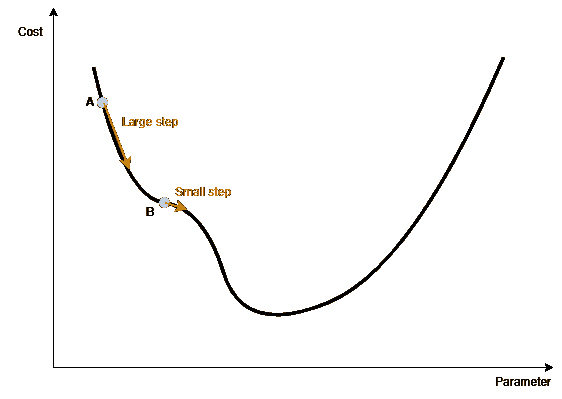

图片由作者提供。

动量梯度下降解决了这个问题。我们可以把动量梯度下降想象成一个滚下山坡的保龄球，其形状是由代价函数定义的。如果球从斜坡的陡峭部分开始下降，它将开始缓慢，但它将迅速获得速度和动量。由于它的动量，球将保持很高的速度，即使通过一个近乎平坦的斜坡。

这是动量梯度下降的关键思想:算法将考虑先前的梯度，而不仅仅是迭代 t 计算的梯度。再次遵循保龄球类比，迭代 t 计算的梯度用于定义加速度而不是速度。

我们计算重量和偏差的速度。在每个迭代步骤中，它是根据先前的速度值和当前迭代的梯度计算的:

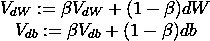

称为动量的参数β规定了新的速度值在多大程度上由当前斜率或过去的速度值确定。

最后，我们更新参数:

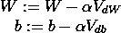

在大多数应用中，动量梯度下降已被证明优于小批量梯度下降。相对于标准梯度下降，动量梯度下降的主要缺点是它需要额外的参数来调节。然而，实践表明β= 0.9 的值是如何有效工作的。

# RMS Prop

考虑一个成本函数，其形状类似于一个细长的碗，其中最小点是最窄的部分。下图中的高程曲线描述了函数的形状。

图片由作者提供。

如果起点远离最小值，梯度下降也随着动量变化，开始沿着最陡的坡度下降，在上图中，这不是通向最小值的最佳路径。RMS Prop 优化算法的思想是尽早校正方向，并且更迅速地瞄准全局最小值。

至于动量梯度下降，RMS Prop 也需要一个额外的超参数来调整，称为衰减率。实践表明，衰减率设置为 0.9 几乎适用于所有问题。

# 圣经》和《古兰经》传统中）亚当（人类第一人的名字

Adam 及其变体可能是神经网络最常用的优化算法。Adam 代表自适应矩估计，它将动量梯度下降和 RMS Prop 结合在一起。

作为两种优化方法的组合，Adam 需要两个额外的超参数来调整(除了学习速率α之外)。我们称它们为β_ 1 和β_ 2，它们是分别用于动量和均方根 Prop 的超参数。幸运的是，beta_1 和 beta_2 有有效的默认选择:beta_1 通常设置为 0.9，beta_2 设置为 0.999。在 adam 中，还有一个用作平滑项的参数ε，它几乎总是被设置为小值，如 e-7 或 e-8。

Adam 优化算法在大多数情况下优于上述所有方法。唯一的例外是非常简单的问题，简单的方法工作得更快。Adam 效率的唯一代价是有两个额外的参数需要调整。

# 优化算法比较

为了实际测试和可视化每个算法的性能，我用上面的每一个优化器训练了一个简单的深度神经网络。该网络的任务是从 28×28 的图像中对时尚物品进行分类。该数据集名为[时尚 MNIST](https://github.com/zalandoresearch/fashion-mnist) (麻省理工学院许可)，由 7 万幅服装小灰度图像组成。

测试不同优化器的算法在下面的要点中给出，更完整的内容在下面链接的 GitHub 库中。

  

结果图如下所示:

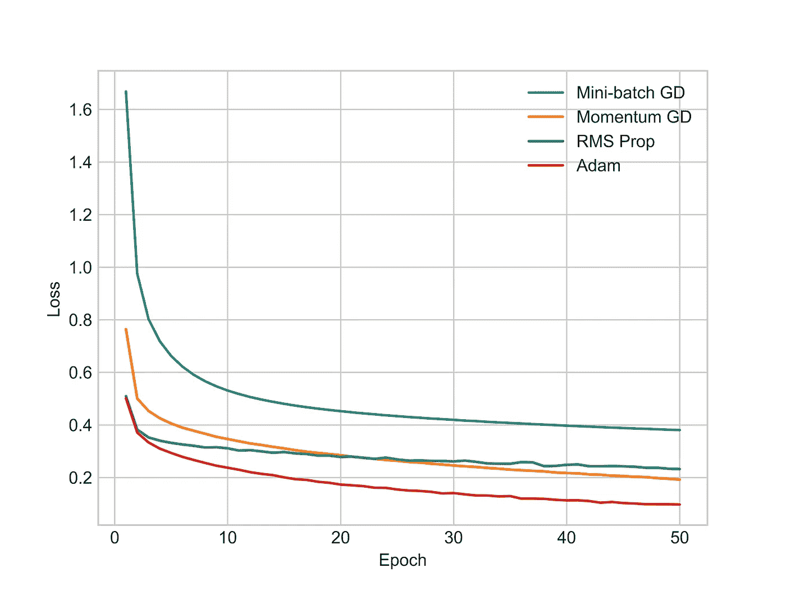

图片由作者提供。

我们可以立即看到动量梯度下降(黄线)比标准梯度下降(蓝线)快得多。相反，RMS Prop(绿线)似乎获得了与动量梯度下降相当的结果。这可能是由于几个原因造成的，例如超参数调整不完美或神经网络过于简单。最后，Adam optimizer(红线)看起来优于所有其他方法。

# 学习率衰减

我想在本文中包括学习率衰减，因为尽管它不是一种优化算法，但它是一种加速学习算法的强大技术。

学习率衰减包括在各时期降低学习率超参数α。这样做的原因是，在优化的开始阶段，我们可以采取更大的步骤，但随着算法接近最小值，我们更喜欢采取更小的步骤，以便它将在更接近最小值的区域反弹。

有几种方法可以降低学习率。其中一个由以下公式描述:

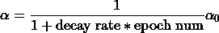

其中衰减率是要调整的附加参数。

其他可能性有:

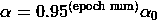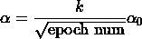

第一个称为指数学习率衰减，在第二个中，k 是一个常数。

最后，其他可能性包括应用离散学习率衰减，例如在 t 次迭代后将其减半，或者手动降低它。

图片由作者提供。

# 结论

对于每个数据科学从业者来说，时间是宝贵的，但也是有限的资源。由于这个原因，掌握加快学习算法训练的工具可以有所作为。

在本文中，我们已经看到了标准的梯度下降优化器是一个过时的工具，并且有几种替代方法可以在更短的时间内提供更好的解决方案。

为给定的机器学习应用选择正确的优化器并不总是容易的。这取决于任务，对于哪一个是最好的还没有明确的共识。然而，正如我们在上面看到的，使用建议的超参数值的 Adam optimizer 在大多数情况下是一个有效的选择，了解最流行的超参数的工作原理是一个很好的起点。

# 参考

[1]: [使用 Scikit-Learn、Keras 和 TensorFlow 进行机器实践学习，第二版——aurélien géRon](https://www.oreilly.com/library/view/hands-on-machine-learning/9781492032632/)

[2]: [了解训练深度前馈神经网络的难度— Xavier Glorot，Yoshua Bengio](http://proceedings.mlr.press/v9/glorot10a/glorot10a.pdf)

[3]:【深挖整流器:在 ImageNet 分类上超越人类水平——何、、任、

[4]: [梯度下降—Wikipedia.org](https://en.wikipedia.org/wiki/Gradient_descent)

[5]: [改进深度神经网络:超参数调整、正则化和优化——吴恩达](https://www.coursera.org/learn/deep-neural-network)