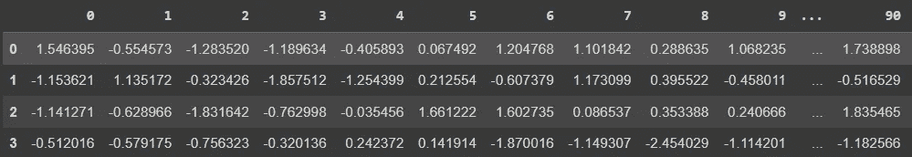
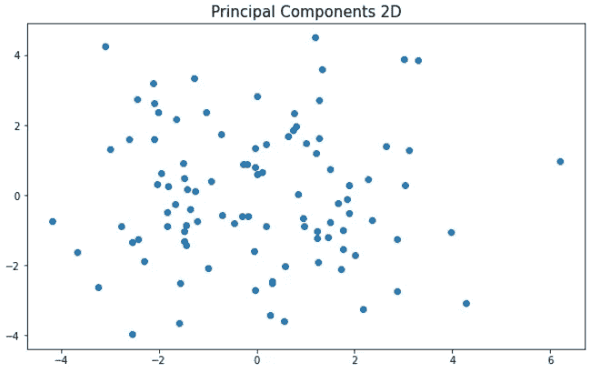
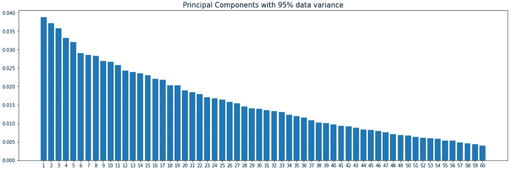

# 为 PCA 降维选择一个好的值

> 原文：<https://towardsdatascience.com/choosing-a-good-value-for-pca-dimensionality-reduction-a763f2edc8d>

## 降低数据维数的快速代码


由[米赫利·克勒斯](https://unsplash.com/@mihaly_koles?utm_source=unsplash&utm_medium=referral&utm_content=creditCopyText)在 [Unsplash](https://unsplash.com/s/photos/points?utm_source=unsplash&utm_medium=referral&utm_content=creditCopyText) 拍摄的照片

# 介绍

如果你曾经面对一个数据集，比如说，有 100 个特征，你可能会考虑减少它的维数。

首先，因为我们真的很难创造出有那么多属性的引人注目的可视化效果。很难知道什么对情节真正重要。

其次，因为有一个被称为 [*维度诅咒*](https://en.wikipedia.org/wiki/Curse_of_dimensionality) 的概念，它告诉我们，包含太多变量的数据集往往会变得稀疏(太多零)，这使得机器学习模型更难估计可靠的结果。随着变量数量的增加，对观测数据的需求呈指数增长。

因此，数据科学家经常使用主成分分析[PCA]来减少数据集的特征数量。

# 主成分分析

PCA 是一种数学变换，它将数据点从其当前维度投影到称为分量的点向量。每个组成部分的目标都是理解真实数据的最大差异，尽可能减少信息损失。

</pca-beyond-the-dimensionality-reduction-e352eb0bdf52>  

# 运行 PCA

让我们快速创建一个数据集并运行 PCA。以下是包含 100 个变量的数据集的代码。

```
from sklearn.datasets import make_regression
from sklearn.decomposition import PCA
import pandas as pd
import matplotlib.pyplot as plt# Dataset
X, y = make_regression(n_features=100, n_informative=40, random_state=12)
```



高维数据集。图片由作者提供。

因为它是用 Scikit Learn 的`make_regression`创建的，所以它已经处于类似的规模，所以我们在本文中不使用缩放技术。

现在，如果我们想要绘制最近创建的数据，这将是一项艰巨的任务。我们需要知道哪些是最重要的变量，然而，比较太多的维度会给我们带来很多麻烦。因此，解决这个问题的一个方法是将数据减少到仅仅 2 维，这样我们就可以用一个普通的 2D 图形来绘制它们。就这么办吧。

```
#Reduce Dimensionality
pca = PCA(n_components=2)# Fit
pca_2d = pca.fit_transform(X)
df_2d = pd.DataFrame(pca_2d, columns=['PC1', 'PC2'])
```

绘制 2D 图形。

```
# Plot 2D PCA
plt.figure(figsize=(10,6))
plt.scatter(x= df_2d.PC1, y = df_2d.PC2)
plt.title('Principal Components 2D', size=15);
```



PCA 减少后的 2D 图形。图片由作者提供。

这是我们缩减到二维的数据。

# 选择维度的数量

为了选择维度的数量，您有几个选项。当然，第一种方法是像刚才那样输入一个整数。我们简化到二维。但是，这是最好的决定吗？

对于可视化来说，可能是的，因为它使我们能够绘制数据。但是，让我们看看我们通过这种减少获得了多少差异。

```
# Variance comprehended in 2D
pca.explained_variance_ratio_**[OUT]:**
array([0.03874607, 0.03712152])
```

我们只获得了总方差的 7.58%。不是我们数据的一个很好的代表，对吗？仅用这种方法将数据拟合到模型中并不是一个好的选择。

这就是为什么`PCA()`类可以选择从数据中插入您想要的百分比来创建组件。换句话说，例如，您可以询问获取数据集中 95%方差的维度数量。

这是我们如何做到这一点。

```
#Reduce Dimensionality
pca95 = PCA(n_components=0.95)# Fit
transformed = pca95.fit_transform(X)
```

正如在前面的代码片段中看到的，如果我们使用属性`explained_variance_ratio_`，就有可能看到每个主成分捕获的数量。利用这些数据，我们可以绘制一个柱状图。

```
# Plot
plt.figure(figsize=(15,6))
plt.bar(x= [str(i) for i in range(1,pca95.n_components_+1)], height= pca95.explained_variance_ratio_,)
plt.title('Principal Components with 95% data variance', size=15);
```



60 个主成分将获得 95%的方差。图片由作者提供。

在这里，我们可以看到方差在许多变量中分布良好。不存在方差超过 4%的组件，因此需要 60 台电脑来弥补我们数据集中高达 95%的方差。

# 在你走之前

我以前写过关于 PCA 的文章，重温这个概念和这个漂亮的变压器总是好的。

我们可以使用 PCA 来帮助我们解决复杂的问题，因此知道如何选择正确的组件数量也同样重要。

如果你喜欢这个内容，关注我的博客或者在 [LinkedIn](https://www.linkedin.com/in/gurezende/) 找到我。

<http://gustavorsantos.medium.com/>  

Git Hub 代码:[https://github . com/gure zende/studining/blob/master/Python/sk learn/PCA _ Python . ipynb](https://github.com/gurezende/Studying/blob/master/Python/sklearn/PCA_Python.ipynb)

# 参考

<https://scikit-learn.org/stable/modules/generated/sklearn.decomposition.PCA.html>  <https://medium.com/@monishatemp20/principal-component-analysis-pca-1c285cce3c26>  

Aurélien Géron，2019。 [*用 Scikit-Learn 动手机器学习，Keras & TensorFlow*](https://tinyurl.com/2s3tsh9x) 。第二版，奥赖利。