# 为自然语言处理选择神经网络而不是 N-Gram 模型

> 原文：<https://towardsdatascience.com/choosing-neural-networks-over-n-gram-models-for-natural-language-processing-156ea3a57fc>

## 今天，我们将通过一个利用 LSTMs 分析金融科技数据的例子，来看看在 N 元模型上使用递归神经网络、门控递归单元和 LSTMS 的优势

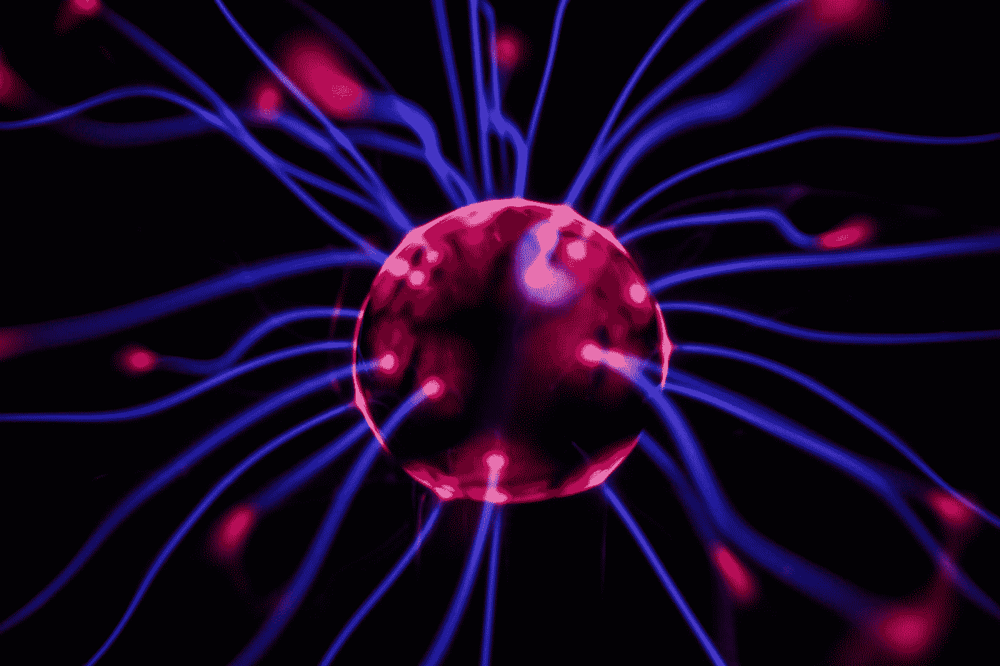

乔希·里默尔在 [Unsplash](https://unsplash.com?utm_source=medium&utm_medium=referral) 上的照片

# **为什么是神经网络？传统的学习模式需要大量的空间和内存！！！**

传统的学习模型将文本从一种语言转换成另一种语言。为了准确翻译，您将使用一个 *N-Gram* 语言模型来计算一个句子的概率。一个限制是捕捉相距较远的单词之间的差异。这需要一个大的语料库，意味着更多的空间和内存。与 *N-* Grams 相比，递归神经网络(RNNs)和门控递归单元(GRUs)对于机器翻译更有效，因为它们可以使用过去记忆的概念和结合来预测单词是什么，或者文本语料库的情感。虽然神经网络可能更适合您的分析，但传统的学习模型仍然有效，至少会为您的工作提供一个起点。

# **普通递归神经网络(RNN)**

rnn 有能力捕捉传统语言模型没有捕捉到的依赖关系。RNN 将信息从句子的开头一直传播到结尾。

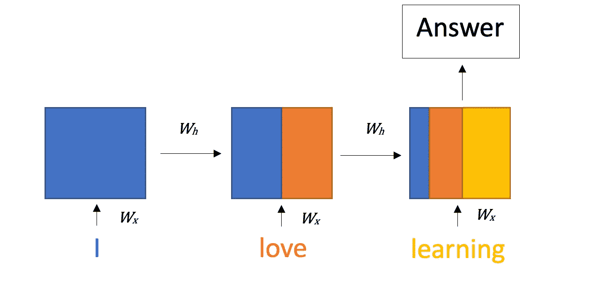

基本的 RNN 结构(图片来自作者)

如上所示，与旧信息相比，最新信息在 RNN 的给定步骤中具有更高的影响。通过训练 RNN 更新的参数有 ***Wx* 、 *Wh* 、**和 ***W*** 。

## 优势

*   在序列之间传播信息
*   计算共享相同的参数

## 数学

RNN 的第一个计算是隐藏状态，它通过激活函数做矩阵乘法。

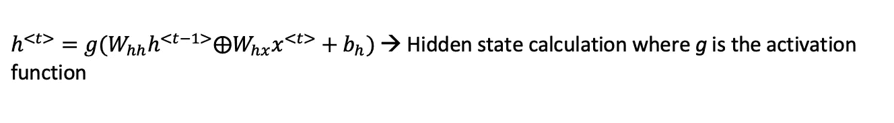

隐藏状态计算(图片来自作者)

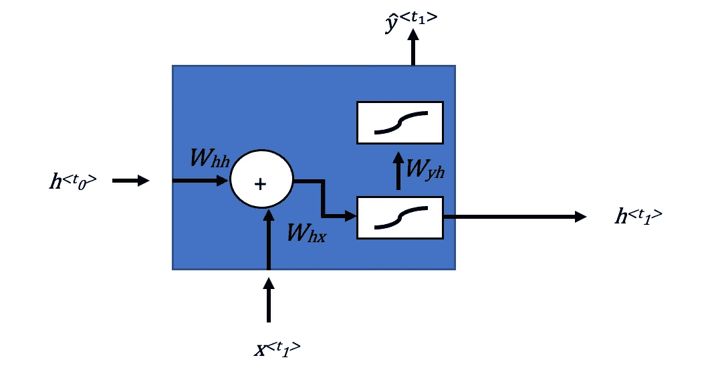

RNN 中的计算顺序(图片来自作者)

在计算出下一个时间步的隐藏状态后，状态乘以另一个参数矩阵 ***Wyh*** 并通过一个激活函数，得到该时间步的预测。

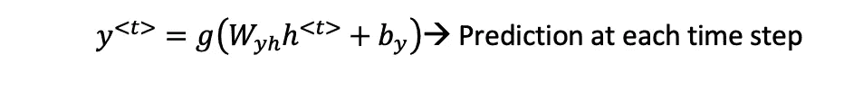

预测计算(图片来自作者)

## 价值函数

RNNs 可以利用交叉熵损失进行训练。

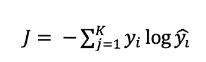

交叉熵损失(图片来自作者)

RNN 的交叉熵损失的计算略有不同。

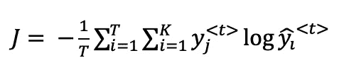

RNN 交叉熵损失(图片来自作者)

*   K →类别数
*   T →时间步长 T
*   查看实际值和预测值之间的差异。

# 门控循环单位

**gru 不同于 rnn，因为它们现在将学习随着时间的推移保存相关信息(可能是词性)**。如果与正在解决的问题相关，长期记忆就不会丢失。这很重要，因为在一个普通的 RNN 中，长期信息将开始随着时间消失，**导致消失梯度**。基本上，RNN 架构增加了一个额外的输入。GRU 的架构中有一个*相关性*和*更新门*。更新门确定应该保留或更新多少以前的信息。gru 更加数学化，因此，使用它们的一个缺点是更大的内存和计算成本。

## 数学

如上所述，gru 比普通的 rnn 更加数学密集。

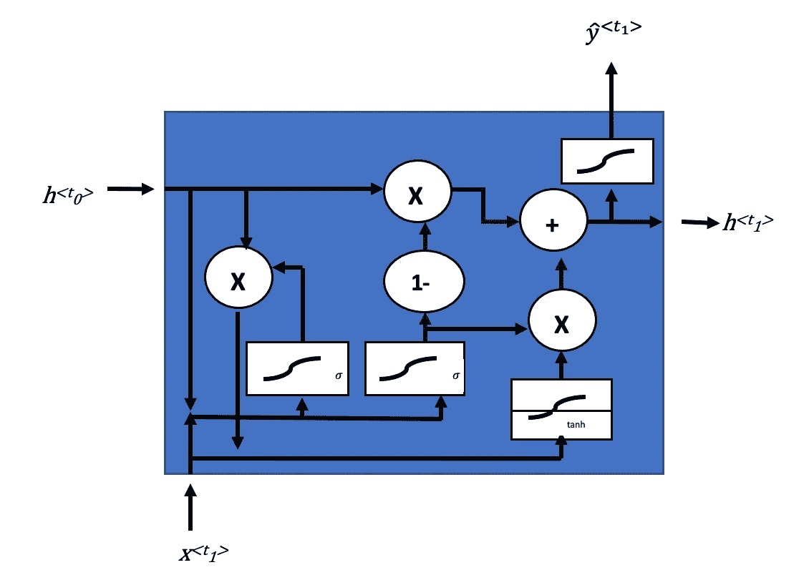

门控循环单元(图片来自作者)

两个 sigmoid 激活单元是关联门和更新门。

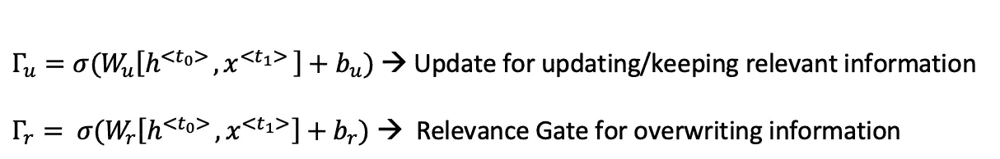

相关性和更新方程式(图片来自作者)

这些门的权重参数将随时间变化，以确定应该保留、更新和从该单元传递什么信息。

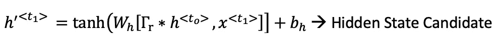

隐藏状态候选人(图片来自作者)

隐藏状态候选从关联门和隐藏状态中获取信息进行计算，并最终通过 *tanh* 激活函数。

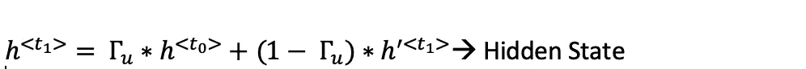

隐藏状态(图片来自作者)

基于由更新门传递的信息来更新 GRU 的隐藏状态。

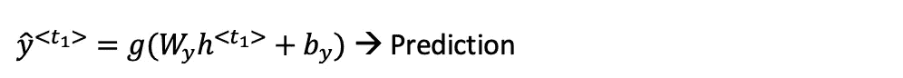

预测(图片来自作者)

通过最后激活函数的最后一次传递是由 GRU 做出的预测。

# **双向 RNNs**

想象未来流向现在，这基本上是双向 RNN 所做的。它将有两个方向的信息流，其中每个方向都独立于另一个方向。双向 rnn 是非循环图，这意味着一个方向的计算独立于另一个方向的计算。

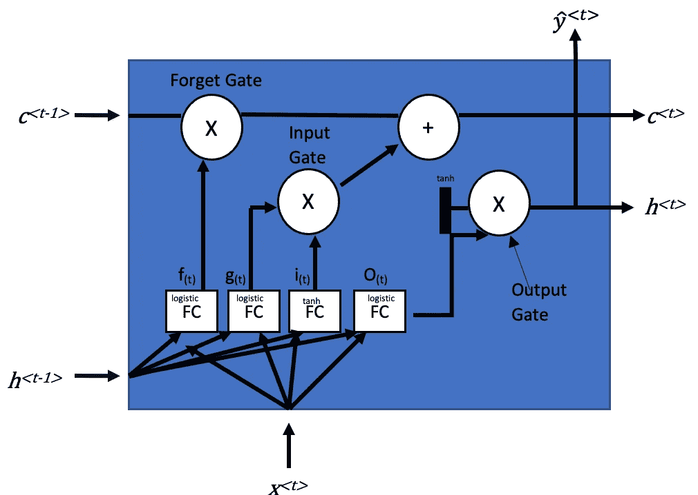

LSTM 细胞(图片来自作者)

双向 RNN 的一个例子是长短期模型(LSTM)。LSTM 单元最大的变化是，它现在把状态分成两个向量。在两个新的状态向量中，一个数组表示长期记忆，另一个表示短期记忆。如上面的单元格所示，有许多输入和变量计算与 LSTM 单元格相关联。*是细胞的短期信息 ***c(t)*** 是细胞的长期信息。*

*对于长期信息，它将首先通过一个遗忘门来丢弃一些记忆信息，然后通过加法门添加新信息。在添加新的记忆并通过 *tanh* 激活功能后，短时记忆、**、*、【t】、***、*、*被创建。*

**

*LSTM 方程(图片来自作者)*

*上面显示的是 LSTM 细胞在训练过程中进行的不同计算。主要的要点是，LSTM 将更新不同的权重矩阵*以识别给定问题和数据的相关长期和短期记忆。**

# **例子**

**我想使用 Kaggle 的[金融情绪分析数据集提供一个快速编码示例。我训练了一个 LSTM 网络来识别金融问题的情绪是积极的还是消极的。今天的代码将帮助您重新创建和训练模型，但请注意，由于模型计算的复杂性和组合性，训练 LSTM 模型可能需要很长时间。虽然这不同于](https://www.kaggle.com/datasets/sbhatti/financial-sentiment-analysis)**

**首先，让我们导入库和数据。**

```
**from keras.layers import Input,GlobalMaxPooling1D, Dense, Dropout, LSTM, SpatialDropout1D
from keras.models import Model, Sequential
from keras.preprocessing.text import Tokenizer
from keras.optimizers import Adam
from keras.losses import BinaryCrossentropy
from keras.utils import pad_sequences
import pandas as pd
import numpy as np
from sklearn.model_selection import train_test_split
import re df = pd.read_csv('finance_data.csv')
df.head()**
```

**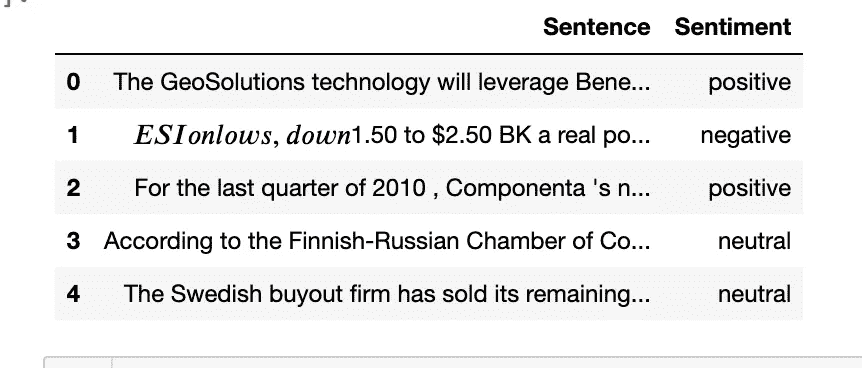**

**数据集示例(图片来自作者)**

**如您所见，数据集是讨论金融部门不同领域的条目的集合。在“情绪”栏中，我们有“积极”、“消极”和“中性”情绪，我们将它们映射为 0 或 1。此外，我们希望预处理我们的句子，并将它们转换成 NumPy 数组。**

```
**df['Sentence'] = df['Sentence'].apply(lambda x: x.lower())
df['Sentence'] = df['Sentence'].apply((lambda x: re.sub('[^a-zA-z0-9\s]','',x)))mapping = {'negative' :0,
            'neutral' : 1,
            'positive': 1}
df['Sentiment'] = df['Sentiment'].map(mapping)X = df['Sentence'].to_numpy() #turn the sentences into numpy arrays
y = df['Sentiment'].values #Targert sentimen values**
```

**接下来将使用 80/20 分割创建训练集和测试集。**

```
**X_train, X_test, y_train, y_test = train_test_split(sentences, y, test_size=0.2)**
```

**接下来，我们要标记我们的句子。标记化是将每个句子分解成单个单词的操作，其中每个单词都是一个标记。**

```
**vocab_size = 10000
tokenizer = Tokenizer(num_words=vocab_size, oov_token="<OOV>")
tokenizer.fit_on_texts(X_train) #Fit the tokenizer on the training data#We will then fit onto each of the sequences
X_train = tokenizer.texts_to_sequences(X_train)print(X_trai[0])[2, 100, 3, 2, 138, 12, 326, 9, 259, 29]**
```

**在我们转换了我们的序列后，我们将填充它们，使它们都是相同的形状。**

```
**seq_length = 100
X_train = pad_sequences(X_train, maxlen=seq_length, padding='post', truncating='post')#Now do the same for the test data 
X_test = tokenizer.texts_to_sequences(X_test)
X_test = pad_sequences(X_test, maxlen=seq_length, padding='post', truncating='post')**
```

**让我们创建我们的分类模型。该模型将首先使用嵌入层，该嵌入层将是序列向量的嵌入大小(在这种情况下是 FinTech 概要)。为简单起见，我使用了 1 个 LSTM 层，但两个或更多层也可以(这里建议使用进一步的超参数调整以及 *k-* 折叠交叉验证)。最后，sigmoid 激活函数将用于预测输出为 0 或 1。**

```
**embed_dim = 100
batch_size = 32model = Sequential()
model.add(Embedding(vocab_size, embed_dim, input_length=sequence_length))
model.add(LSTM(units = 100))
model.add(Dense(1,activation='sigmoid'))
model.compile(loss = 'binary_crossentropy', optimizer='adam',metrics = ['accuracy'])
print(model.summary())**
```

**我们的最后一步是训练和执行模型。**

```
**history = model.fit(X_train, y_train, epochs=100, 
                    validation_data=(test_padded, y_test))**
```

**训练这个模型需要很长时间，但是训练之后，你会有一个模型，可以预测任何 FinTeh 相关的摘要/评论/语料库的情绪。**

# **结论**

**虽然 N-gram 模型是预测句子中下一个单词的伟大工具，但神经网络是一个更强大的工具，因为它们可以保留长期信息，在进行 NLP 分析时不应被忽略。神经网络不仅可以用于 n-gram 预测，而且今天的例子还显示了用 Python 创建 LSTM 网络并在您的数据上实现它是多么简单！**

**如果你喜欢今天的阅读，请关注我，让我知道你是否还有其他想让我探讨的话题(这对我的帮助超乎你的想象)！另外，在[**LinkedIn**](https://www.linkedin.com/in/benjamin-mccloskey-169975a8/)**上加我，或者随时联系！感谢阅读！****

## **来源**

**-盖伦，奥雷连恩。*使用 Scikit-Learn、Keras 和 TensorFlow 进行动手机器学习:构建智能系统的概念、工具和技术*。第二版。，奥莱利，2019。**

**[](https://www.kaggle.com/datasets/sbhatti/financial-sentiment-analysis) [## 金融情绪分析

### 带有情感标签的金融句子

www.kaggle.com](https://www.kaggle.com/datasets/sbhatti/financial-sentiment-analysis) 

-该数据集属于首席运营官公共领域，允许公众使用。**