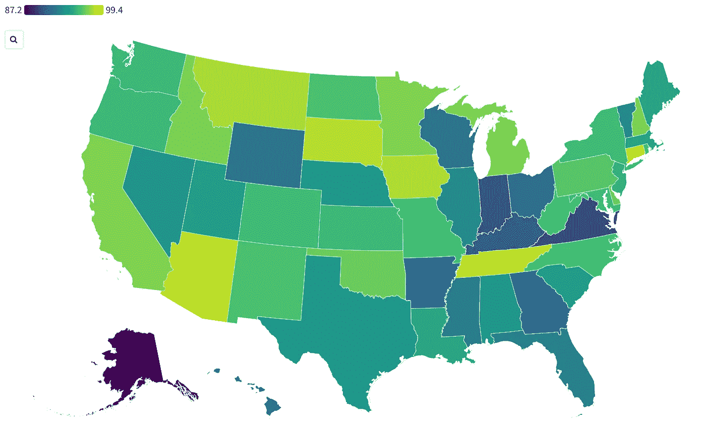
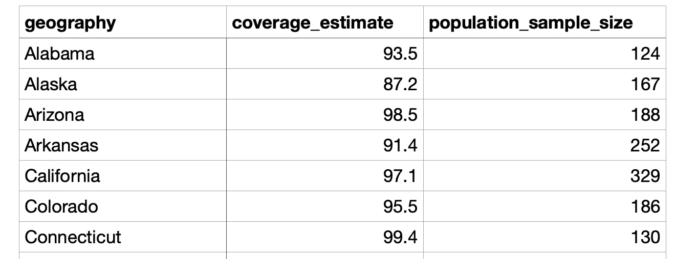
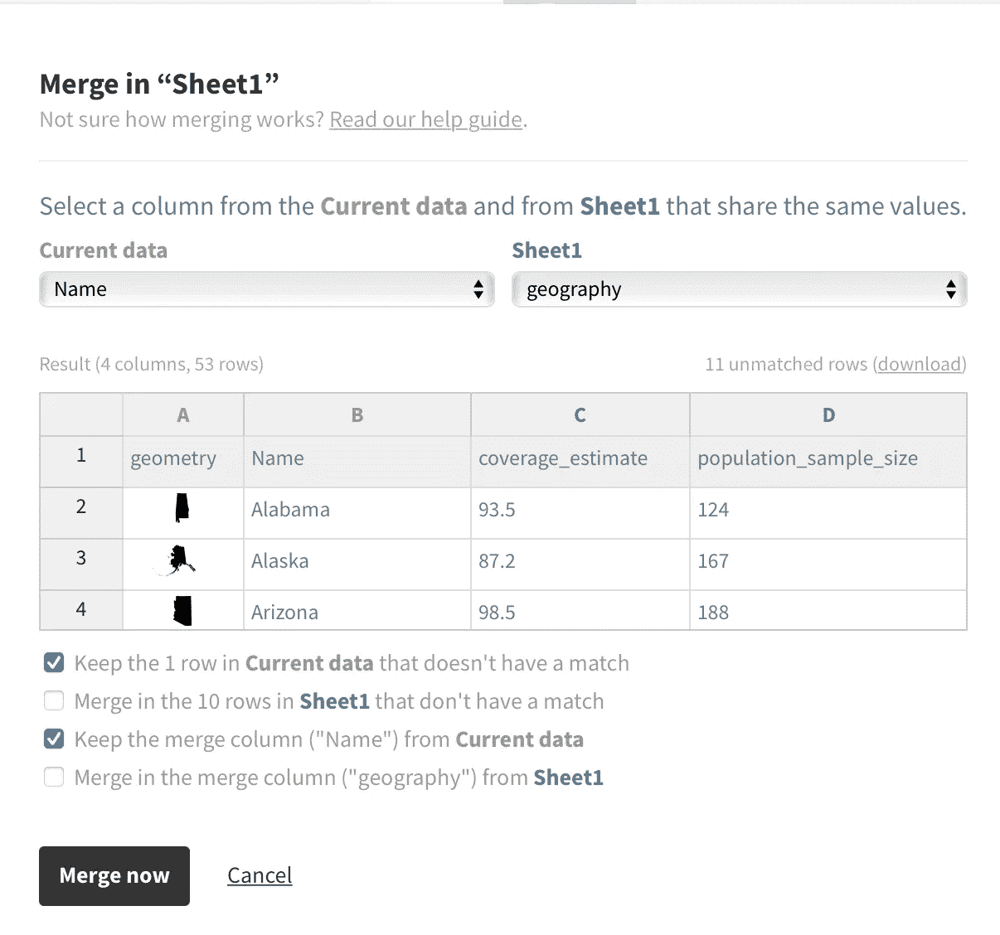
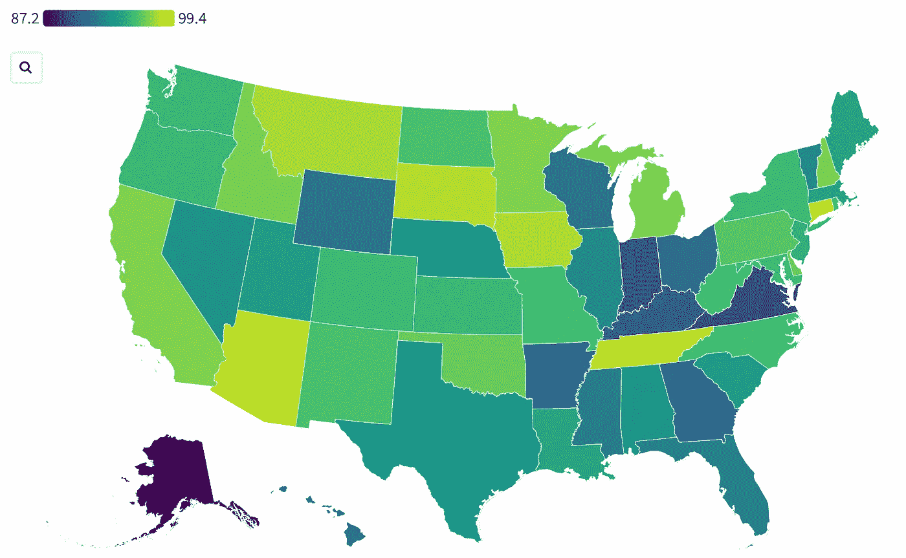
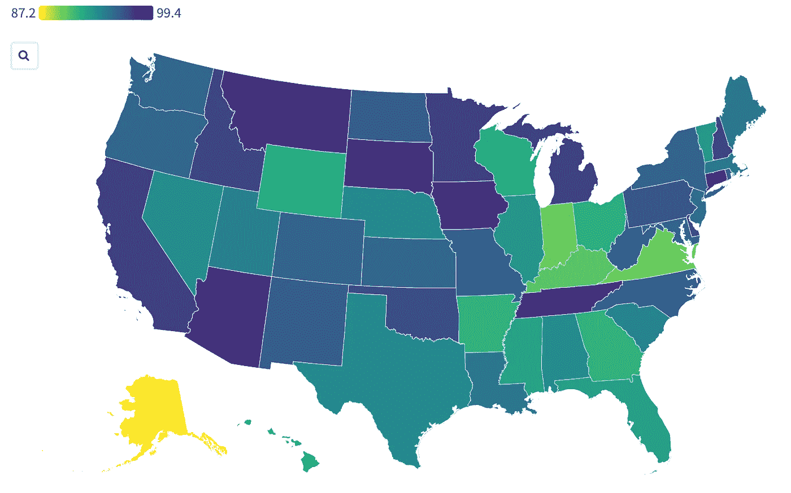
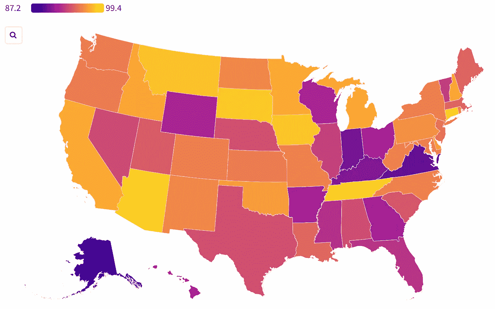
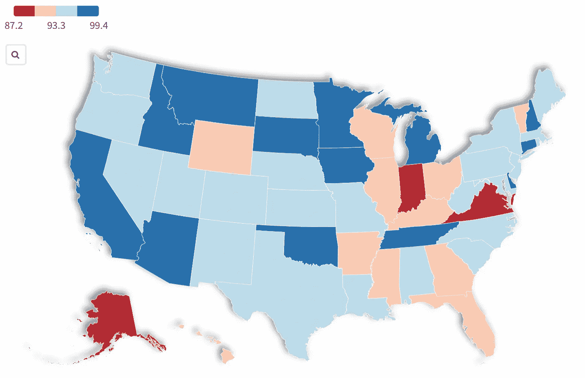

# Choropleth 地图与熊猫和繁荣

> 原文：<https://towardsdatascience.com/choropleth-maps-with-pandas-and-flourish-aea2ad9ec5e3>

## 使用 Python、pandas 和 fluore 制作美国脊髓灰质炎疫苗接种率地图的教程



图片由作者提供，使用 Flourish.studio

# 背景

在之前的一篇文章中，我简要介绍了如何制作与废水追踪相关的美国县数据的 choropleth [地图](https://public.flourish.studio/visualisation/9120368/)。当然，这里使用的方法可以应用于其他数据，并且有许多映射选项没有在那些指令中显示。

本教程包含更多关于使用 fluore 制作地图的详细信息——使用美国各州脊髓灰质炎疫苗接种率的示例数据，并创建如上所示的[地图](https://public.flourish.studio/visualisation/10938243/)。

首先，几个定义…

*   **choropleth map** 是一种地理地图(如县或州),通过对地理区域进行颜色编码来显示数据值。
*   **fruit**是[fruit . studio](https://flourish.studio)的简写，这是一家总部位于伦敦的软件公司，提供非编程数据可视化。地理地图是一种数据可视化。

美国儿童脊髓灰质炎疫苗接种的标准时间表是总共四剂，其中三剂在儿童三岁生日之前给药。在本教程中，我们做了一个简化的假设，一个在三岁生日前接种了全部三针的孩子被称为“接种疫苗”，一个没有接种的孩子被称为“未接种疫苗”。

# 准备数据

关于美国各种疾病和年龄组的儿童早期疫苗接种率的数据包含在 CDC 的[单一数据集中。简单的 Python/pandas](https://data.cdc.gov/Child-Vaccinations/Vaccination-Coverage-among-Young-Children-0-35-Mon/fhky-rtsk) [数据准备](https://github.com/ChuckConnell/articles/blob/master/make_polio_vax_map.py)将原始数据集翻译成[地图输入文件](https://github.com/ChuckConnell/articles/blob/master/polio_coverage_map.tsv)。

```
import pandas as pd 
from sodapy import SocrataPOLIO_MAP_DATA = "polio_coverage_map.tsv"
VAX_DATASET = "fhky-rtsk"   # CDC code for this dataset# Get the data, which covers many vaccines and age groups.cdc_client = Socrata("data.cdc.gov", None)
VaxDF = pd.DataFrame.from_records(cdc_client.get(VAX_DATASET, limit=1000000))# Select rows about 3 doses of polio vax.PolioDF = VaxDF.query("vaccine == 'Polio'")
PolioDF = PolioDF.query("dose == '≥3 Doses'")# Select rows for the 50 US states.PolioDF = PolioDF.query("geography_type == 'States/Local Areas'")
PolioDF = PolioDF.query("geography != 'Puerto Rico'") # Use the latest year in the dataset.PolioDF = PolioDF.query("year_season == '2018'") # Get rows for almost-3-year olds.PolioDF = PolioDF.query("dimension_type == 'Age'")
PolioDF = PolioDF.query("dimension == '35 Months'")# Select the columns we need for mapping.PolioDF = PolioDF[["geography", "coverage_estimate", "population_sample_size"]]# Make the data file that becomes the input to the map.print ("\nWriting map data to " + POLIO_MAP_DATA)
PolioDF.to_csv(POLIO_MAP_DATA, encoding='utf-8', sep='\t', index=False)
```

生成的地图文件如下所示:



# 开始繁荣

个人使用免费，商业和企业用户有付费选项。我所有的作品都是免费版的。

创建一个繁荣的帐户，并点击新的可视化。你用“繁荣”制作的一切都是“可视化”，包括条形图，折线图，散点图，层次图，2D 和三维地图。

# 选择并清理地图模板

内置模板是启动任何项目的最佳方式，但是在使用自己的数据和设计之前，您需要清除示例数据和设置。

向下滚动到投影地图/美国各州，并选择它作为您的起点。在左上角给你的地图命名。

此示例将仅使用区域，而不使用地图点，因此移除点数据:

*   转到预览窗格，并设置点层=禁用。
*   确保不使用任何点数据。转到数据窗格/数据点，删除你在最右边看到的 A，B，C，D。
*   删除所有的点数据。点按 A 列的标题，然后按住 SHIFT 键点按 D 列的标题，以便选择所有列。下拉 D 列标题中的小部件，并选择 Remove Columns。

清除您将替换的区域数据:

*   转到“数据/区域”并删除最右侧列出的任何列，除了“几何图形= A”和“名称= B”
*   完全移除 C、D 和 E 列。

转到预览窗格。你应该会看到一张空白的美国地图。当您将鼠标悬停在一个州上时，它的轮廓会高亮显示，其名称会弹出。您的地图现在已准备好接收有关脊髓灰质炎疫苗接种的数据。

# 导入和合并数据

转到数据/区域。更改右侧的上传选项，上传数据并合并。按下那个按钮。

当前数据(flower 模板中的地图地理)与传入数据(Python 中的脊髓灰质炎疫苗文件)正确对齐非常重要。fruit 善于猜测哪些列应该相互连接。在这种情况下，模板中的**名称**列应该连接到传入数据中的**地理位置**列。您通常可以保留其他选项的默认设置。因此，上传/合并操作如下所示:



作者图片

继续进行合并，然后选择 Next。

# 设置 Choropleth 值和颜色

choropleth 映射的目标是将数据值(数字或关键字)显示为颜色。对于如何给地图上色，您有许多选择，因此您应该尝试各种方案，看看哪种方案最能表达您想要讲述的数据故事。有内置的配色方案，你可以定义自己的。颜色可以是分级的(一组固定的颜色，每个颜色代表一个值范围)或连续的(根据数值字段改变阴影)。任何配色方案都可以轻松反转，因此低/高颜色可以互换。

制作同样的[脊髓灰质炎疫苗接种图](https://public.flourish.studio/visualisation/10938243/)如本文顶部所示:

*   转到数据/区域。
*   设置值= C。(该值决定哪个变量控制着色。)
*   转到预览/区域/填充。
*   设置刻度类型=数字、顺序、线性。
*   设置调色板=绿色，不反转。

您应该看到这个:



图片由作者提供，使用 Flourish.studio

以下是具有相同数据的完全相同的配色方案，但颜色相反:



图片由作者提供，使用 Flourish.studio

以下是使用等离子调色板的相同数据:



图片由作者提供，使用 Flourish.studio

标度类型=数值型、发散型、分仓型怎么样；调色板=红色/蓝色？顺序/发散指的是颜色轴。连续通常是同一颜色的阴影，而发散是两种不同的颜色。



图片由作者提供，使用 Flourish.studio

哪个地图比较好？哪个更清楚的说出了你想要传达的故事？这些都是主观问题，是你做的每一张地图的选择。

此外，还有如何处理缺失值区域的选项，为准 3D 效果添加阴影，以及许多其他可能性。请注意，你可能会把自己逼疯，试图找到最好的总体结果。

# 设置区域弹出窗口

choropleth 地图上的颜色编码有助于突出显示您希望查看者关注的地理区域。但是查看感兴趣区域的更多详细信息也很有帮助。为此，您需要弹出窗口:

*   转到弹出窗口的数据/区域/元数据(在右侧控件的底部)。
*   将弹出菜单设置为 C，d。
*   转到预览。当您将鼠标悬停在每个区域上时，您应该会看到该区域的疫苗接种百分比和数据样本量。

# 设置页眉、页脚和致谢名单

由于大多数地图都需要标题和数据配额:

*   转到预览/页眉/标题(和副标题)。想怎么设置就怎么设置。
*   转到预览/页脚/源名称(和 URL)。根据需要设置。我建议保持名称简短，因为几个学分很快就会填满地图页脚。您可以添加多个信号源。
*   您输入的任何要注意的内容都会出现在源演职员表之后。

# 发布地图

要使您的地图对其他人可见:

*   单击导出和发布/发布以共享和嵌入/发布。
*   将向您显示公共 URL 和嵌入地图的代码。

如果您稍后对地图进行了更改，您可以在相同的 URL 上重新发布，以便读者可以立即看到更新。

# 了解更多信息

[en.wikipedia.org/wiki/Choropleth_map](https://en.wikipedia.org/wiki/Choropleth_map)(关于 choropleth 地图的一般信息)

[help . friedy . studio](https://help.flourish.studio)(兴旺帮话题)

【www.cdc.gov/vaccines/ (更多疾控中心疫苗数据)