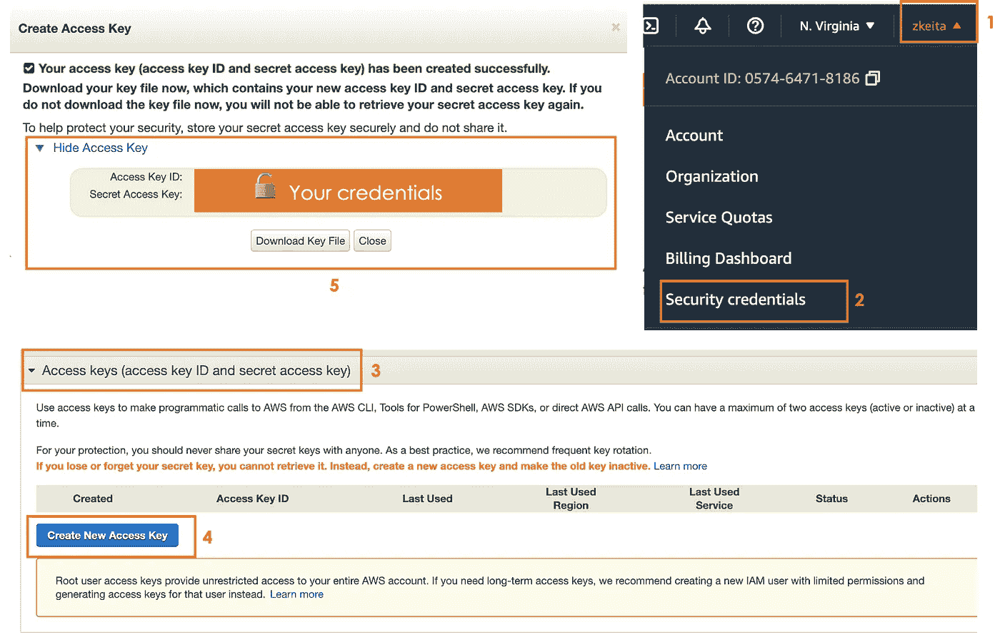
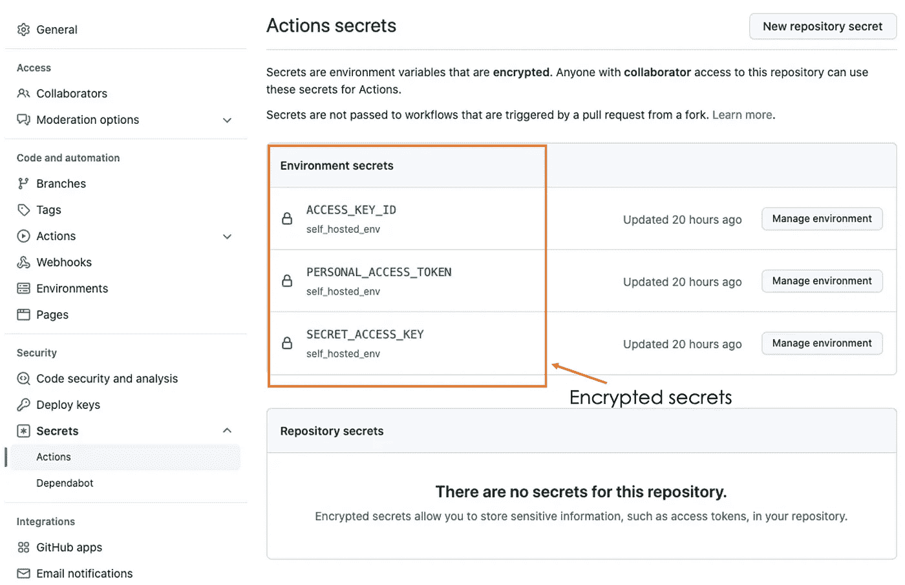
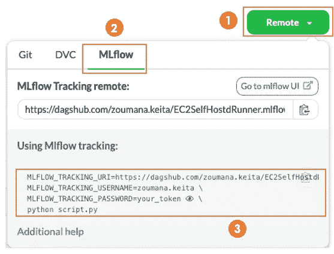
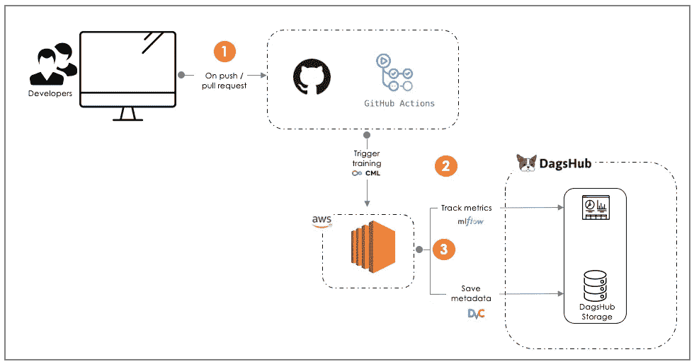
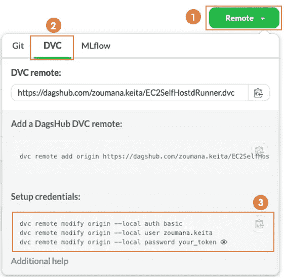
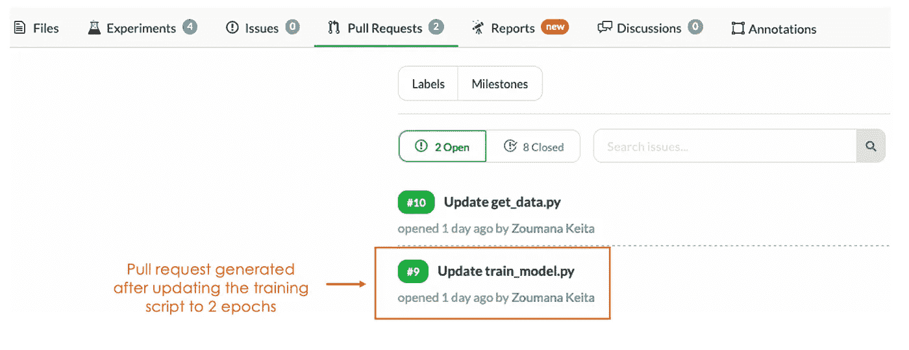
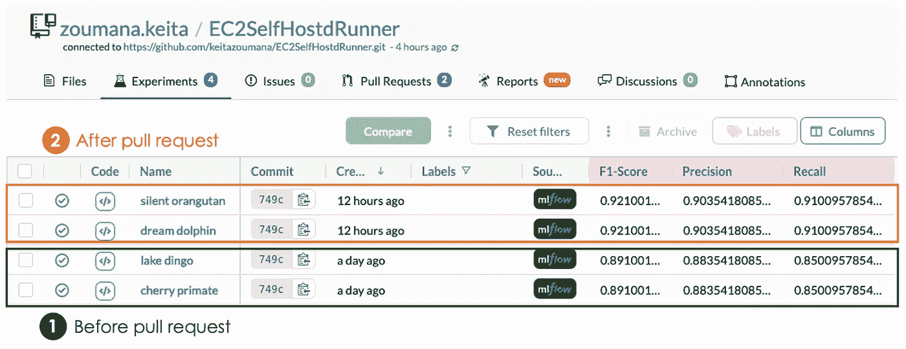

# 使用 GitHub 动作进行机器学习模型训练的 CI/CD

> 原文：<https://towardsdatascience.com/ci-cd-for-machine-learning-model-training-with-github-actions-24b6a28cab96>

## 使用 EC2 实例作为训练机器学习模型的服务器的综合指南


图片由[this engineering RAEng](https://unsplash.com/@thisisengineering)在 [Unsplash](https://unsplash.com/photos/ZPeXrWxOjRQ) 上拍摄

# 介绍

可以使用多个开源工具来执行机器学习流水线的适当编排。Github actions 是众所周知的。它是一个内置的 Github 工具，主要用于自动化软件的开发、测试和部署过程。

如今，机器学习实践者已经在使用它来自动化他们项目的整个工作流程。所有这些工作流都与可以使用 Github actions 服务器或您自己的服务器执行的特定作业相关。

在这个概念 blob 的结尾，你会明白:

*   招待自己的跑步者的好处。
*   如何创建 EC2 实例并为手头的任务配置它。
*   使用您的跑步者通过 GitHub 动作实现机器学习工作流程。
*   使用 DVC 存储模型元数据。
*   MLFlow 来跟踪您的模型的性能。

# 为什么要使用自托管运行程序？

托管自己的运行程序意味着您可以在定制的硬件环境中执行作业，并拥有所需的处理能力和内存存储。

这样做有以下好处:

*   用户可以轻松地增加或减少跑步者的数量，这在并行训练模型时是有益的。
*   在操作系统方面没有限制。Linux、Windows 和 macOS 都受支持。
*   当使用 AWS、GCP 或 Azure 等云服务时，跑步者可以受益于所有服务，具体取决于订阅级别。

# 如何配置您的 AWS EC2 实例？

为了成功地执行这一部分，我们需要执行两个主要任务。首先，获取 AWS 和 Github 凭证，然后设置加密的秘密来同步 EC2 和 Github。

## 获取您的 AWS 和 Github 证书

在开始之前，你需要首先创建一个 EC2 实例，这可以从[这篇文章](/nlp-mlops-project-with-dagshub-deploy-your-streamlit-app-on-aws-ec2-instance-part-2-eb7dcb17b8ba)中完成。需要三个主要的证书，下面详细介绍了获取它们的过程。

→从您的 Github 帐户获取您的`[PERSONAL_ACCESS_TOKEN](https://docs.github.com/en/authentication/keeping-your-account-and-data-secure/creating-a-personal-access-token)`。这被用作密码的替代，需要与 [Github API](https://docs.github.com/en/rest/overview/other-authentication-methods#via-oauth-and-personal-access-tokens) 交互。

→完成以下 5 个步骤后，可以取回`ACCESS_KEY_ID`和`SECRET_ACCESS_KEY`:

*   点击右上角附近的用户名。
*   选择安全凭据选项卡。
*   选择访问密钥(访问密钥 ID 和秘密访问密钥)。
*   创建新的访问密钥。
*   单击显示访问密钥查看您的访问密钥 ID 和秘密访问密钥。



获取 AWS 访问密钥 ID 和秘密访问密钥的 5 个步骤的图示(图片由作者提供)

## 为同步设置加密的机密

这一步是从 Github 上的项目存储库中执行的。Khuyen Tran 在下一篇文章的[的加密秘密部分描述了所有步骤。](https://dagshub.com/blog/ci-cd-for-machine-learning-test-and-and-deploy-your-ml-model-with-github-actions/)

最后你应该会有和我差不多的东西，像这样。



添加到 Github secrets 的环境机密(图片由作者提供)

# 使用 GitHub actions 和您的自托管 EC2 runner 实现机器学习工作流。

本节涵盖的机器学习任务是使用 BERT 模型实现 3 类分类。这是使用以下工作流程执行的:

*数据采集→数据处理→模型训练&评估→模型&元数据序列化。*

我们将首先解释每个步骤中执行的底层任务及其源代码，然后解释如何使用我们的自托管 runner 运行模型训练。

→ **数据采集**:负责从 DVC 存储器采集数据。

get_data.py

→ **数据处理**:为简单起见，仅限于去除特殊字符。

准备 _ 数据. py

→ **模型训练&评测**:创建一个 BERT 变压器模型。

模型训练包括两个主要部分:(1)训练和评估模型性能，以及(2)使用 MLFlow 跟踪度量。

培训生成两个主要文件:

*   `model/finetuned_BERT_epoch{x}.model:`对应于第 n 个`x`纪元后生成的微调后的 BERT 模型。
*   `metrics/metrics.json:`包含先前生成的模型的精度、召回率和 F1 值。

对于模型跟踪，我们需要从您的 [DagsHub 项目存储库](https://dagshub.com/zoumana.keita/EC2SelfHostdRunner)的右上角获取如下凭证。



从 DagsHub 项目获取 MLFlow 凭据的步骤(图片由作者提供)

下面的脚本只显示了 MLFlow 的模型跟踪部分，因为显示所有的源代码会太长。然而，完整的代码可以在文章的末尾找到。

培训文件中的 MLFlow 部分。

→ **Model &元数据序列化**:负责将以下元数据保存到 DVC 存储: *metrics.json，fine tuned _ BERT _ epoch { x } . Model .*

## 使用 EC2 自托管跑步者训练您的模型。

这一节主要关注在提供自托管运行器之后启动模型的训练，该运行器将用于训练模型，而不是使用默认的 GitHub actions 运行器。

培训工作流程在`.github/workflows/training.yaml`中实施

您可以随意命名`training.yaml`文件。但是，它必须位于`.github/workflows`文件夹中。yaml 扩展。这样它将被 Github 认为是一个工作流文件。

以下是培训工作流程的一般格式:

training.yaml

*   `name`:工作流程的名称。
*   `on` : push 和 pull_request 是我们案例中负责触发整个工作流的主要事件。
*   `jobs`:包含我们工作流程中的一组作业，它们是:(EC2 转轮的部署，以及(2)模型的训练。

> 每项工作的步骤是什么？

在深入研究源代码之前，让我们理解工作流的底层可视化说明。



博客范围的一般工作流程(图片由作者提供)

1.  工作流由开发人员/机器学习工程师的推或拉请求启动。
2.  该训练是在供应的 EC2 实例中触发的。
3.  元数据(metrics.json 和 model)存储在 DVC 上，度量值由 DagsHub 上的 MLFlow 跟踪。

自托管 runner (training.yaml)中培训流程的完整工作流程

**→第一个作业** : `**deploy-runner**`

我们从使用 [*连续机器学习库开始，通过迭代*](https://cml.dev/doc/start/github) 来自动化服务器供应和模型训练。然后，我们获得运行资源调配所需的所有凭据。

正在使用的 EC2 实例是:

*   自由层`t2.micro`实例。
*   位于`us-east-1a`区域。
*   用`cml-runner`标签标记，该标签将用于在训练模型时识别实例。

**→第二个作业** : `**train-model**`

通过使用先前提供的运行器，我们能够使用 *CML* 库来执行训练。

## 将元数据保存在 DVC 存储中。

从训练步骤生成的所有文件都自动存储在本地机器中。但是我们可能希望跟踪这些数据的所有变化。这就是我们在本节中使用`[dvc](https://dvc.org/)`的原因。

总共有两个主要步骤:(1)获取您的凭证，以及(2)实现推送数据的逻辑。

**→获取您的 DVC 证书。**

获取您的 DVC 证书遵循相同的流程，类似于 MLFlow:



从 DagsHub 项目获得 DVC 证书的步骤(图片由作者提供)

→ **执行逻辑**

首先，我们在`save_metadata.py`文件中实现 DVC 配置和数据保存逻辑。

save _ 元数据. py

然后，这个文件被工作流中的`save_metadata`作业调用。

```
jobs: ... # deploy-runner & train-model jobs save_metadata:
   steps:
     - name: Save metadata into DVC
       run: python save_metadata.py 
```

现在，我可以提交更改并在 Github 上推送代码，以便能够执行拉请求。

```
git add . 
git commit -m “Pushing the code for pull request experimentation”
git push -u origin main
```

在将 epochs 的数量更改为 2 之后，我们得到了触发 pull 请求的新版本的训练脚本。下面是一个插图。



拉取请求

下图显示了 pull 请求之前和之后的模型度量，分别针对时段 1 和时段 2。



# 结论

当使用 Github 操作实现完整的机器学习管道时，使用自托管服务器在许多方面都有好处，如本文开头所示。

在这篇概念博客中，我们探讨了如何提供 EC2 实例，从 push 和 pull 请求中触发模型序列，然后将元数据保存到 DVC 存储中，并使用 MLFlow 跟踪模型性能。

掌握这些技能将帮助您提供一项宝贵的技能，将您组织的整个机器学习管道提升到下一个级别。

此外，如果你喜欢阅读我的故事，并希望支持我的写作，考虑[成为一个媒体成员](https://zoumanakeita.medium.com/membership)解锁无限制访问媒体上的故事。

欢迎在[媒体](https://zoumanakeita.medium.com/)、[推特](https://twitter.com/zoumana_keita_)、 [YouTube](https://www.youtube.com/channel/UC9xKdy8cz6ZuJU5FTNtM_pQ) 上关注我，或者在 [LinkedIn](https://www.linkedin.com/in/zoumana-keita/) 上问好。讨论人工智能、人工智能、数据科学、自然语言处理和人工智能是一种乐趣！

# 额外资源

[项目源代码](https://dagshub.com/zoumana.keita/EC2SelfHostdRunner)

[关于自托管跑步者](https://docs.github.com/en/actions/hosting-your-own-runners/about-self-hosted-runners)

[在自托管 AWS EC2 runner 上使用 CML 训练和保存模型。](https://iterative.ai/blog/CML-runners-saving-models-1)