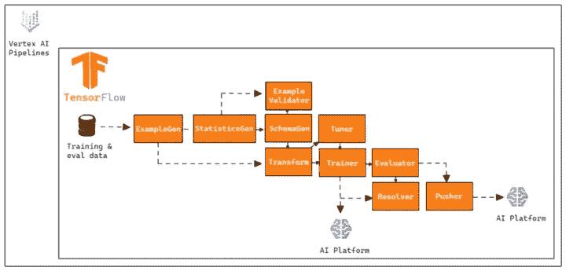
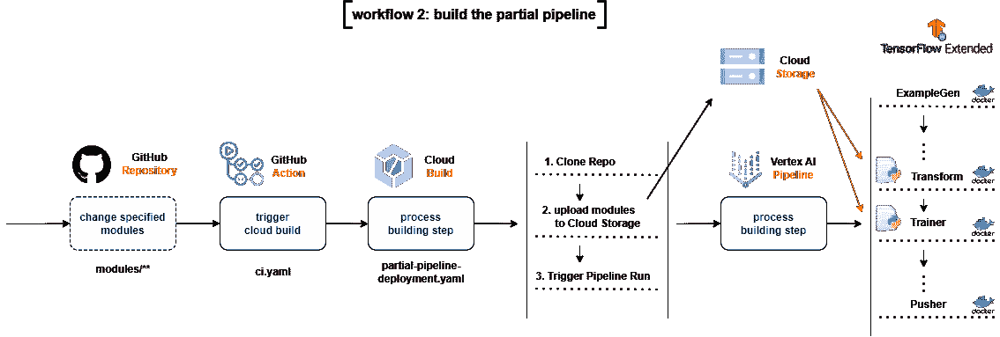
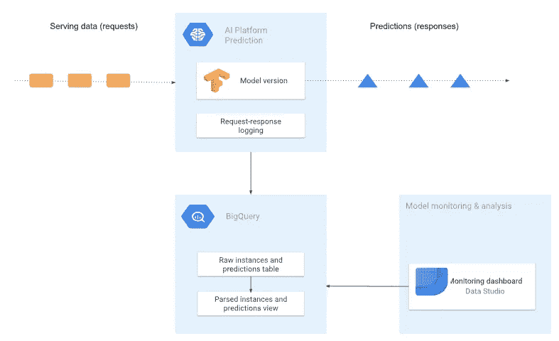
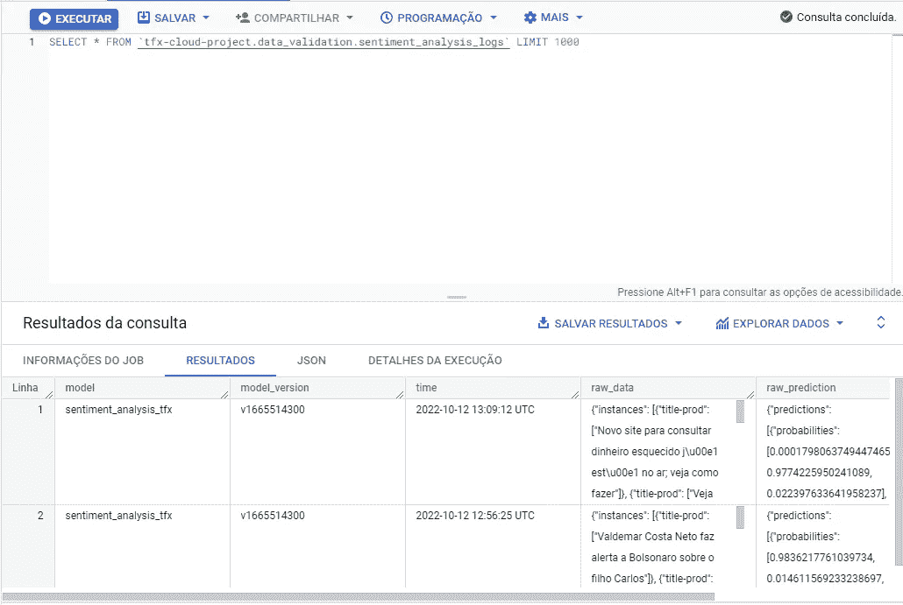
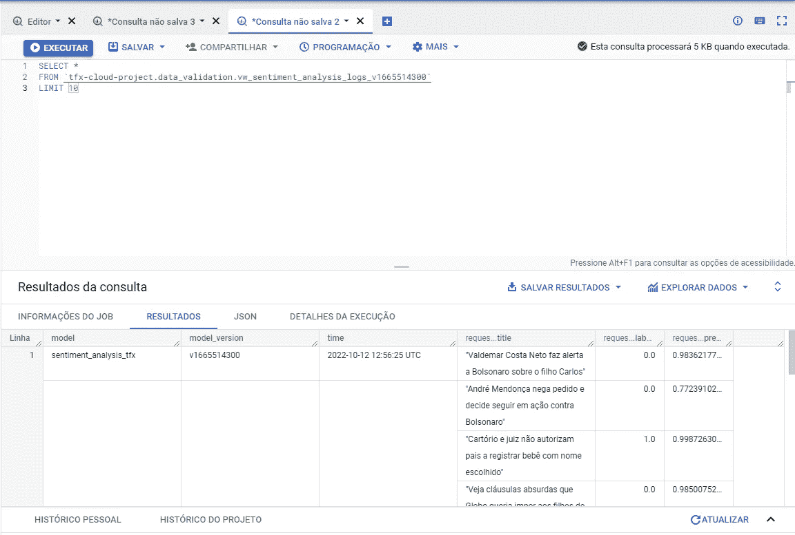

# 带顶点和人工智能平台的 TFX 管道 CI/CD

> 原文：<https://towardsdatascience.com/ci-cd-for-tfx-pipelines-with-vertex-and-ai-platform-c562452fba1>

## 使用顶点管道部署 TFX 管道，在人工智能平台上服务您的模型，监控您的请求，并构建 CI/CD 管道来扩展您的系统


里卡多·戈麦斯·安吉尔在 [Unsplash](https://unsplash.com/s/photos/pipe?utm_source=unsplash&utm_medium=referral&utm_content=creditCopyText) 上的照片

# **1。简介**

本文是两部分的第二部分，第一部分可在[TFX 管道情绪分析—本地部署](https://arturlunardi.medium.com/sentiment-analysis-with-tfx-pipelines-local-deploy-e9daa4cbde2a)获得。在第一部分中，我们讨论了如何在本地开发管道，此外还展示了构建情感分析模型的过程。

**在这一部分中，我们将介绍如何在云环境中运行我们的管道，如何开发 CI/CD 管道，以及如何监控我们模型的服务请求。**

完成本文后，您将能够:

*   创建情感分析模型
*   创建一个与[顶点 AI](https://cloud.google.com/vertex-ai) 集成的 TFX 管道
*   通过 REST API 在云环境中服务您的模型
*   分析您的管道元数据
*   创建 CI/CD 管道
*   使用 [BigQuery](https://cloud.google.com/bigquery/docs) 分析推论

整个应用程序的代码可以在这个 GitHub 存储库中找到[。](https://github.com/arturlunardi/sentiment-analysis-tfx)

# **2。顶点 AI + TFX 管线**

在第一部分，我们解释了什么是 TFX 管道，它的组成部分是什么，以及我们的模型是如何工作的。现在，**让我们来关注如何在云环境中使用这个管道，以及如何构建 CI/CD 管道来扩展我们的系统。**

当部署一个模型时，我们需要考虑如何让最终用户可以使用它。最常用的方法之一是通过 REST API 中的请求。

在本教程中，我们将使用[谷歌云平台](https://cloud.google.com/) (GCP)的服务部署我们的管道，一般来说，我们将使用两个主要服务:

## **2.1 顶点 AI**

Vertex AI 是谷歌新的 AI 平台，联合所有谷歌云服务构建 ML。我们将使用[顶点管道](https://cloud.google.com/vertex-ai/docs/pipelines)到**来运行我们的训练管道**，主要有两个原因:

*   **比** [**AI 平台管道**](https://cloud.google.com/ai-platform/pipelines/docs) **便宜——在我们这里。**顶点管道具有每次运行的固定执行率，也与通过计算引擎训练模型的成本相关联。无需激活和管理集群，使基础架构更精简、更便宜。
*   与人工智能平台中使用的[谷歌 Kubernetes 引擎](https://cloud.google.com/google/kubernetes)(GKE)**不同，我们不需要管理服务器和集群的基础设施/健康状况**，因为 Vertex 是一个自我管理的平台。

## **2.2 人工智能平台**

虽然我们的管道使用顶点管道运行，但我们的模型将在 AI 平台上训练和服务，主要原因有一个:

**到目前为止，无法通过顶点 AI 中的函数** [**预测**](https://cloud.google.com/ vertex-ai/docs/reference/rest/v1/projects.locations.endpoints/predict) **来通知**[**saved model**](https://www.tensorflow.org/guide/saved_model)**tensor flow 的订阅。**

因此，我们的管道的工作原理如下:



**图一。** TFX 管道上的云。这张图片是从谷歌创作和分享的[作品中复制的，并根据](https://developers.google.com/readme/policies)[知识共享 4.0 归属许可](https://creativecommons.org/licenses/by/4.0/)中描述的条款使用。来源:[https://www.tensorflow.org/tfx/guide](https://www.tensorflow.org/tfx/guide)

# **3。云上 TFX 管道**

现在，让我们了解如何将我们的管道迁移到云环境。

## **3.1 配置项目**

> 重要:这个项目将有成本。谷歌云的新用户可能有资格获得免费试用。

首先，您需要在 [Google Cloud Console](https://cloud.google.com/) 中创建一个项目，并启用以下 API:

*   顶点人工智能
*   人工智能平台训练和预测
*   云存储
*   集装箱登记处
*   BigQuery
*   云构建
*   笔记本 API

## **3.2 管道设置**

现在让我们打开 *configs.py* 文件并分析一些变量:

*   ***【GCP _ 人工智能 _ 平台 _ 训练 _ARGS*** —传递给人工智能平台训练我们模型的参数。
*   ***【GCP _ AI _ 平台 _ 服务 _ ARGS***——传递给 AI 平台服务我们模型的参数。

添加这些参数是为了在 *kubeflow_v2_runner* 中创建管道。py 文件

现在，让我们来看看相对于路径的变量。请注意，在代码中，所有变量都指向 [Google 云存储](https://cloud.google.com/storage/docs)中的存储桶，这是因为当我们要构建 CI/CD 管道时，这些文件将在云环境中找到并可用。

*   ***TRANSFORM _ MODULE _ FILE***—包含变换组件的变换的文件。
*   ***TRAIN _ MODULE _ FILE***—包含训练器组件说明的文件。
*   ***TUNER _ MODULE _ PATH***—包含一个*best _ hyperparameters . txt*文件的目录，该文件包含模型的超参数。
*   ***数据路径*** —包含我们数据的目录。
*   ***LABEL _ ENCODER _ FILE***—包含我们的 LabelEncoder 来转换我们的目标变量的文件。

## **3.3 为云构建创建 Docker 映像**

我们需要创建一个 Docker 映像，供[云构建](https://cloud.google.com/build)使用。我们创建此映像是因为默认 Python 映像提供的 Python 版本是 3.9，但最新的 TFX 版本仅支持 Python 3.8 或更低版本。

因此，我们必须访问 Vertex AI -> Workbench 并创建一个笔记本来定义我们的图像。这个步骤也可以在本地完成[或者在云壳](https://cloud.google.com/container-registry/docs/quickstart)中完成。

打开终端并克隆 repo:

```
git clone [https://github.com/arturlunardi/sentiment-analysis-tfx](https://github.com/arturlunardi/sentiment-analysis-tfx)
```

在存储库内部，打开*create _ first _ container . ipynb*记事本，运行代码行在指定的路径中创建容器。

运行后，您可以在[容器注册表](https://cloud.google.com/container-registry)中检查图像。

## **3.4 创建存储桶**

为了让我们能够将文件从我们的存储库复制到 Google 云存储的[桶](https://cloud.google.com/storage/docs/creating-buckets)中，我们需要创建文件夹来复制它们。

访问项目中的云存储，并使用以下目录结构创建一个存储桶:

```
└───{{ GOOGLE_CLOUD_PROJECT }} + '-vertex-default'
    └───{{ PIPELINE_NAME }}
        ├───best_hyperparameters
        ├───data
        └───modules
```

## **3.5 创建服务账户**

为了让 GitHub Actions 能够在 Cloud Build 中执行任务，我们需要创建一个用于身份验证的服务帐户。

创建服务帐户并添加以下权限:

*   AI 平台管理员
*   顶点人工智能服务代理
*   服务代理顶点人工智能自定义代码
*   云构建服务帐户
*   电视观众

然后在 keys -> Add Key -> JSON 中创建一个 Key。

最后一步是必要的。由于我们要通过 Vertex AI 服务从 Google 云存储中读取文件，所以我们需要给 Vertex AI 服务帐户授予读取权限。

然后进入 IAM 和 admin ->勾选右侧包含 Google 提供的角色授予->找到名为:AI 平台自定义代码服务代理->添加查看者角色的账户。

## **3.6 在 Git Repo 中设置秘密**

我们的 CI/CD 管道将使用一些秘密的变量，所以我们需要添加它们。

转到您的存储库->设置->机密->操作，并创建以下机密:

*   GCP 项目标识:你的项目标识
*   **GCP _ 凭证**:复制并粘贴上面创建的服务帐户的 JSON 密钥的全部内容

# **4。CI/CD 管道**

> 根据 Park，c；在软件工程中，持续集成(CI)和持续交付(CD)是两个非常重要的概念。CI 是集成变更(新特性、批准的代码提交等。)进入你的系统。CD 是您可靠地、持续地部署这些变更的时候。CI 和 CD 既可以单独执行，也可以耦合执行。

为了使我们的系统可伸缩，我们需要使用 CI/CD 实践。这将**允许我们更快、更可靠地应用实验、集成和部署。**让我们分析几个场景:

*   有了新数据，我如何定期重新培训我的模型？
*   添加新功能时，我如何确保我的系统不会崩溃？
*   在部署我的模型之后，我如何通过 API 测试预测服务以确保输入和预测被正确解释？

在生产中实现 ML 不仅仅意味着通过 API 提供模型，还意味着实现一个可扩展的、适应变化的管道，允许快速实验并提供准确的结果。如果你想了解更多关于 CI/CD 管道及其重要性的知识，我推荐这篇谷歌文章， [MLOps:机器学习中的连续交付和自动化管道](https://cloud.google.com/architecture/mlops-continuous-delivery-and-automation-pipelines-in-machine-learning)。

在这个项目中，我们的 CI/CD 渠道将按如下方式工作:

1.  我们创建了一个 [Github 库](https://github.com/arturlunardi/sentiment-analysis-tfx)，包含了将在 Vertex AI 上运行的 TFX 管道的所有代码。
2.  我们在 GitHub Actions 上设置了一个流程，它将触发对主分支的每次推送，并将检查我们的存储库的特定目录中的更改。
3.  如果有变化，对每种类型的变化采取特定的行动。

YAML 文件后面的[定义了一个 GitHub 动作，由对主分支的推送激活。](https://github.com/arturlunardi/sentiment-analysis-tfx/blob/master/.github/workflows/ci.yaml)

让我们理解重要的一点:GitHub Actions 的 *dorny/paths-filter* 允许我们检测使用 *push* 时某些路径是否发生了变化。

在这种情况下，我们看到两条路径: *tfx-pipeline* 和*模块*:

*   如果 *tfx-pipeline* 路径有变化，使用*Build/full-pipeline-deployment . YAML*文件中提供的设置，通过 *—替换*使用环境变量，启动云构建过程。
*   如果*模块*路径有变化，而 *tfx_pipeline* 没有变化(为了避免重复运行)，则使用*Build/partial-pipeline-deployment . YAML*文件中提供的设置启动云构建过程，通过 *—替换*使用环境变量。

现在让我们仔细分析这两个文件。

## **4.1** [**全管道部署. yaml**](https://github.com/arturlunardi/sentiment-analysis-tfx/blob/master/build/full-pipeline-deployment.yaml)


**图二。**整个 CI/CD 管道。本图片转载自 Park，c .创作并分享的作品[；并根据](https://github.com/deep-diver/Model-Training-as-a-CI-CD-System) [Apache 2.0 许可证](https://www.apache.org/licenses/LICENSE-2.0)中描述的条款使用。来源:[https://cloud . Google . com/blog/topics/developers-从业者/模型-培训-cicd-system-part-i](https://cloud.google.com/blog/topics/developers-practitioners/model-training-cicd-system-part-i)

如果在包含与**管道设置**相关的文件的目录中有变化，流程将启动云构建过程，该过程将克隆整个储存库，仅将变化的模块复制到 Google 云存储桶中的模块目录，基于代码变化构建新的 Docker 映像，将新映像上传到 Google 容器注册表，并在 Vertex AI 中提交 TFX 管道。

第一次阅读可能很难，但如果我们一步一步地阅读，我们就会明白发生了什么:

1.  我们克隆整个存储库
2.  我们将这个存储库中的一些文件复制到指定的桶中
3.  我们编译管道来检查是否一切正常
4.  我们用 *tfx 管道创建*创建管道
5.  我们用 *tfx run create* 创建顶点 AI 中的游程

该文件中有三个要点:

*   *tfx pipeline create* 中的 *— build-image* 标志用于创建我们环境的新 Docker 映像
*   云构建使用的 Docker 镜像是*gcr.io/$_PROJECT/cb-tfx:latest*，也就是我们在步骤 3.3 中创建的镜像
*   我们将 *tfx 运行创建*引擎设置为*顶点*，因为我们正在向顶点 AI 提交管道。

## **4.2** [**局部-管道-部署. yaml**](https://github.com/arturlunardi/sentiment-analysis-tfx/blob/master/build/partial-pipeline-deployment.yaml)

如果目录中包含**模型代码、预处理器代码、训练数据、超参数或标签编码器**的变更

1.  该流程将启动一个云构建过程，该过程将克隆整个存储库
2.  仅将更改的模块复制到 Google 云存储桶中的模块目录
3.  在 Vertex AI 中提交 TFX 管道，无需建立新的 Docker 映像



**图 3。**部分 CI/CD 管道。本图片转载自 Park，c .创作并分享的作品[；并根据](https://github.com/deep-diver/Model-Training-as-a-CI-CD-System) [Apache 2.0 许可证](https://www.apache.org/licenses/LICENSE-2.0)中描述的条款使用。来源:[https://cloud . Google . com/blog/topics/developers-从业者/模型-培训-cicd-system-part-i](https://cloud.google.com/blog/topics/developers-practitioners/model-training-cicd-system-part-i)

该文件实际上与*full-pipeline-deployment . YAML*相同，不同之处在于:

*   *tfx 管道创建*中的 *—构建映像*标志已被移除，因为我们不需要创建新的 Docker 映像
*   因为没有改变管道设置，我们不需要编译它，移除 *tfx 管道编译*

# **5。监控**

当将一个模型部署到产品中时，**我们需要不断地监控它。**我们的模型已经在某个数据集上进行了训练，因此为了保持性能，它将暴露的数据必须具有相同的分布。

由于模型不是在静态环境中运行的，**由于训练数据和预测数据之间的偏差，它们的性能可能会随着时间而降低。**偏差的一些例子可能是:

*   新词汇(新语言)的引入
*   测量单位的变化(米到公里)
*   消费者行为因某些外部事件而改变(疫情)

由于模型没有受到这些变化的影响，因此性能可能会受到影响。所以我们需要监控:

*   数据如何随时间变化
*   当需要重新训练模型以捕捉新模式时
*   正在摄取的数据是否与我的模型所接触到的数据相同

在这个例子中，我们将记录模型中所有的[请求/响应日志](https://cloud.google.com/ai-platform/prediction/docs/online-predict#requesting_logs_for_online_prediction_requests)。我们的模型将在 AI 平台上可用，**记录将以 raw 格式(JSON)保存在一个**[**big query**](https://cloud.google.com/bigquery/docs)**表**中。

下图显示了我们将要创建的架构:



**图 4。**监控架构。这张图片是从谷歌创作和[分享的作品中复制的，并根据](https://developers.google.com/readme/policies)[知识共享 4.0 归属许可](https://creativecommons.org/licenses/by/4.0/)中描述的条款使用。来源:[https://cloud . Google . com/architecture/ml-建模-监控-分析-ai-平台-预测-大查询](https://cloud.google.com/architecture/ml-modeling-monitoring-analyzing-ai-platform-prediction-in-big-query)

## **5.1** 为 BigQuery 启用请求-响应日志记录

默认情况下，AI 平台预测服务不提供关于请求的日志信息，因为日志会产生成本。模型可以接收非常多的请求，导致相当大的成本，所以我们需要显式地启用注册。代码在[activate _ logging _ requests . ipynb 文件](https://github.com/arturlunardi/sentiment-analysis-tfx/blob/master/activate_logging_requests.ipynb)中。

在启用日志之前，我们需要创建一个 [BigQuery 表](https://cloud.google.com/bigquery/docs/tables)来保存日志。

每个表都需要在一个 [BigQuery 数据集](https://cloud.google.com/bigquery/docs/datasets-intro)中，所以我们定义数据集和表名并创建数据集。

然后，我们定义表所期望的数据模式。

我们创建表格。*注意，我们没有为表格设置任何到期时间，如果您想了解更多信息，请前往* [*文档*](https://cloud.google.com/bigquery/docs/tables) *。*

现在我们可以为我们的模型启用日志记录了。重要的一点是我们需要定义我们想要激活记录的模型的版本。对于模型的每个版本，我们需要显式地启用日志记录。

我们在模型中搜索最新版本。

最后，我们启用日志记录。 *samplingPercentage* 参数定义了我们想要记录的请求的百分比，在我们的例子中，我们设置 1.0，也就是说，我们记录 100%的记录。

在我们的表中会有我们模型的所有版本的原始记录。

## **5.2 可视化我们的数据**

正如我们在下面看到的，我们的数据是以 JSON 格式记录的。



**图五。** Raw 格式数据(JSON)(图片由作者提供)。

为了改进我们的视图，我们可以为我们的数据创建一个特定的视图。让我们来理解 BigQuery 表模式。

在下表中，我们分别显示了存储在 BigQuery 表的 *raw_data* 和 *raw_prediction* 列中的数据示例。

现在，在文件 [create_view.py](https://github.com/arturlunardi/sentiment-analysis-tfx/blob/master/create_view.py) 中我们定义了视图的创建。首先，我们创建一些辅助函数。

之后，我们定义将创建视图的函数，接收所有参数。让我们把它分成四个部分:

1.我们定义特征和目标变量。

2.我们定义两个变量 *json_features_extraction* 和*JSON _ prediction _ extraction*。这些变量包含可以在 SQL 语句中输入的格式的属性和预测值。

3.我们创建了 *sql_script* 变量，它包含了 *CREATE 或 REPLACE VIEW* 语句。该语句包含几个标记，这些标记在字符串中使用@作为前缀进行标记。

4.最后，我们用前面定义的变量替换 SQL 语句中的标记，并创建视图。

现在我们可以访问 BigQuery 控制台并访问我们的数据。

输出和这个差不多。



**图 6。**个性化 BigQuery 视图(图片由作者提供)。

我们也可以使用 [Google Looker](https://cloud.google.com/looker) 来创建交互式仪表盘和我们数据的可视化。

要清理该项目中使用的所有 Google Cloud 资源，您可以[删除您在教程中使用的 Google Cloud 项目](https://cloud.google.com/resource-manager/docs/creating-managing-projects#shutting_down_projects)。

# 6。结论

在云环境中开发管道可以让我们的系统变得可伸缩，并且不容易出错。部署模型只是整个过程的一部分，为了保持我们预测的性能，我们需要不断地监控推论并分析哪些数据被发送到我们的模型。

CI/CD 管道为我们的系统提供了响应能力，允许更快的测试周期、模型部署中更高的可靠性、改进的代码质量和更短的反馈循环。

# 7。参考文献

[1] [**MLOps:机器学习中的连续交付和自动化管道**](https://cloud.google.com/architecture/mlops-continuous-delivery-and-automation-pipelines-in-machine-learning)(2020 年 1 月 07 日)，谷歌。

[2]帕克，c；保罗，S. [**模型训练作为一个 CI/CD 系统:第一部分**](https://cloud.google.com/blog/topics/developers-practitioners/model-training-cicd-system-part-i)(2021 年 10 月 6 日)，谷歌。

[3] [**ML 模型监控:利用 AI 平台预测记录服务请求**](https://cloud.google.com/architecture/ml-modeling-monitoring-logging-serving-requests-using-ai-platform-prediction)(2021 年 3 月 12 日)，Google。

[4] [**分析 AI 平台预测日志在 big query**](https://cloud.google.com/architecture/ml-modeling-monitoring-analyzing-ai-platform-prediction-in-big-query)(2021 年 3 月 12 日)，Google。

[5]迪凡特，A. L. [**我如何部署我的第一个机器学习模型**](/how-i-deployed-my-first-machine-learning-model-1147c04c449b)(2021 年 12 月 15 日)，中。

[6] [**云 AI 平台管道上的 TFX**](https://www.tensorflow.org/tfx/tutorials/tfx/cloud-ai-platform-pipelines)(2021 年 11 月 05 日)，TensorFlow。

[**【简单 TFX】管道为顶点管道**](https://www.tensorflow.org/tfx/tutorials/tfx/gcp/vertex_pipelines_simple)**(2021 年 12 月 08 日)，TensorFlow。**