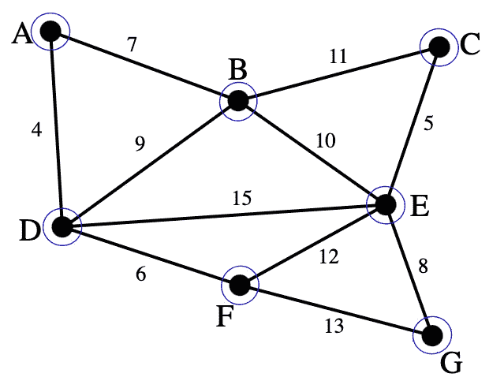
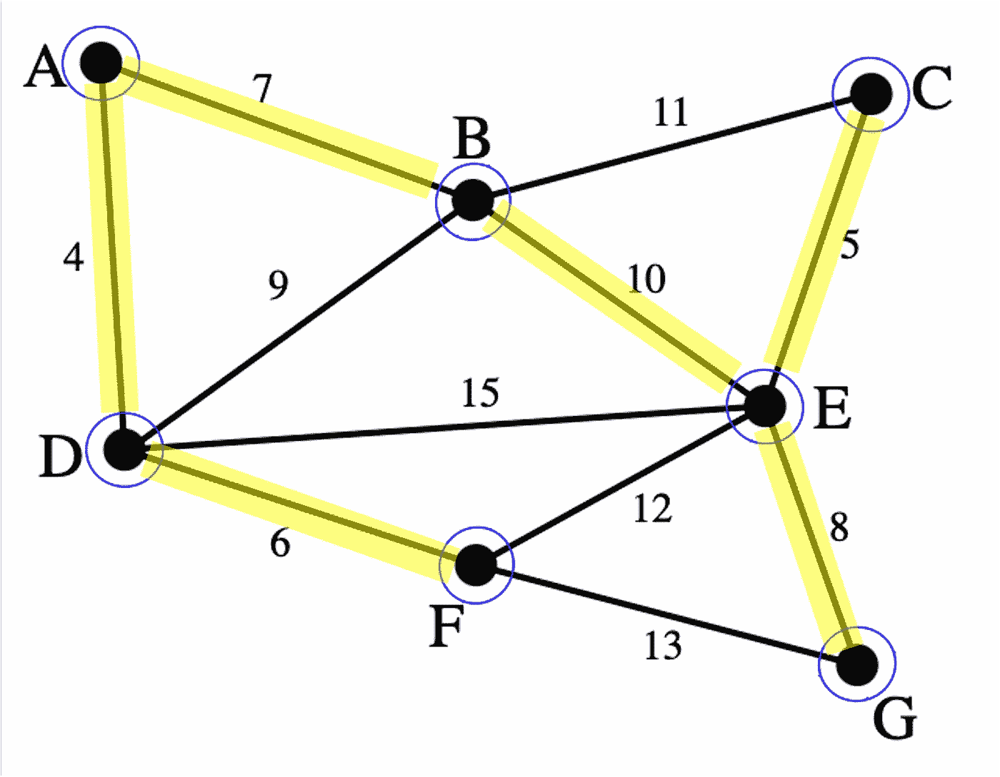

# 最小生成树算法的冲突

> 原文：<https://towardsdatascience.com/clash-of-the-minimum-spanning-tree-algorithms-12568d21ca15>

## 在 Go 中实现 Boruvka、Kruskal 和 Prim 算法

假设你正在建设一个连接一个小城镇的电网。你所在的城镇有许多建筑——住宅、办公室、商店、学校、图书馆和其他需要电力的建筑，因此它们都需要成为电网的一部分。像许多城镇一样，这些建筑也不是一个挨着一个，事实上它们四处蔓延，有些稀疏，有些密集。连接这些建筑的最佳方式是什么，以减少能源损失并最具成本效益？


布尔季哈穆德的街道([图片来自 Pixabay](https://pixabay.com/photos/street-buildings-cables-ancient-3729096/)

许多配电公司使用 [*最小生成树*](https://en.wikipedia.org/wiki/Minimum_spanning_tree) 来模拟他们的电网。*生成树*是一个加权的、连通的和无向图的子集，它包括该图的所有节点。图中通常有不止一棵生成树。

将生成树的所有边的权重相加，就得到生成树的权重或成本。*最小生成树* (MST)是成本最低的生成树。

基本思想是在可能的电力线连接图中，将建筑物建模为节点，将电力线建模为边。边缘权重可以是铺设线路的成本或电力传输损耗，也可以是我们想要表示用电力线连接两栋建筑的成本的任何值。它甚至可以是通过包含多个参数的公式计算出的值。然而，最终我们把它们归结为一个数字。

使用最小生成树算法，我们从该图中创建一个 MST。这将为我们提供最具成本效益的电网来为城市服务。

在这篇文章中，我将讨论 3 种经典的 MST 算法——Boruvka、Kruskal 和 Prim 算法。我还将使用 Go 实现它们，并对它们进行基准测试。然而，你应该明白，虽然它们在今天作为软件算法被实现和使用，但是它们是在计算机还没有发明或者几乎没有的时候被创造出来的。


CSIRAC 照片由维多利亚博物馆[在](https://unsplash.com/@museumsvictoria?utm_source=unsplash&utm_medium=referral&utm_content=creditCopyText) [Unsplash](https://unsplash.com/s/photos/early-computer?utm_source=unsplash&utm_medium=referral&utm_content=creditCopyText) 上拍摄

第一个真正在计算机上运行的计算机程序是在 1948 年，而第一台商用计算机仅在 1951 年售出。这里的算法根本不是软件算法，它们基本上是数学算法，它们的创造者/发现者都是数学家。

# 最小生成树算法

最小生成树是一个很好解决的问题。最早提到最小生成树算法的是捷克数学家 Otakar Boruvka，他在 1926 年发表了一篇论文，题目是“T2 对电力线网络经济建设问题解决方案的贡献”。


捷克共和国南摩拉维亚的米库洛夫镇

这篇论文是西南[摩拉维亚](https://en.wikipedia.org/wiki/Moravia)(现在捷克共和国的一部分)电气化问题相关工作的一部分。如果这还不清楚的话，这是大约 100 年前，那时计算机还不存在。

## 博鲁夫卡算法

博鲁夫卡的算法优雅而简单。给定一个带节点和边的加权无向图 G:

1.  从 G 中所有节点的图 M 开始，但是没有边
2.  找出每个节点连接到另一个节点的最小权重边，并在两个节点之间创建一条边。这导致了节点的集群，我们称之为子图
3.  找出连接到另一个子图的每个子图的最小权重边，并在它们之间添加一条边。这将导致两个子图合并成一个子图。
    *(记住，子图的边本质上是连接一个子图中的节点和另一个子图中的另一个节点的边。将一个子图中的节点连接到同一子图中的另一个节点的边不是子图的边)。*
4.  重复步骤 3，直到只剩下 1 个子图

在算法的最后，M 将是最小生成树。

## 克鲁斯卡尔算法

约瑟夫·克鲁斯卡尔是美国数学家和计算机科学家。他来自一个拥有惊人的数学家和科学家的家庭——他的两个兄弟都是著名的数学家，其中一个是统计学家([威廉·克鲁斯卡尔](https://www.cs.umd.edu/users/gasarch/BLOGPAPERS/wkruskalleg.pdf))，他是克鲁斯卡尔-沃利斯单向方差分析的共同制定者，另一个([马丁·克鲁斯卡尔](http://www.nasonline.org/publications/biographical-memoirs/memoir-pdfs/kruskal-martin.pdf))是物理学家和天文学家，他发明了孤立子理论以及其他一些东西。马丁的儿子，约瑟夫的侄子是克莱德·克鲁斯卡尔，他是美国计算机科学家，是并行和分布式计算中读-修改-写概念的发明者之一。

约瑟夫·克鲁斯卡尔本人相当多产。他最有影响力的工作是他对[多维尺度(MDS)](https://www.statisticshowto.com/multidimensional-scaling/) 公式的贡献，它允许我们将一个数据集转换为另一个更低维度的数据集。这有助于我们将高维数据集可视化为 2D 数据集。其他以他名字命名的著作还有[克鲁斯卡尔树定理](https://en.wikipedia.org/wiki/Kruskal%27s_tree_theorem)、[克鲁斯卡尔-考托瑙定理](https://en.wikipedia.org/wiki/Kruskal–Katona_theorem)和[克鲁斯卡尔秩](https://arxiv.org/pdf/0901.1796.pdf)(或 k 秩)。

但是让我们回到克鲁斯卡尔的算法。1956 年，当他 28 岁的时候(你 28 岁的时候在做什么？).

算法很简单。给定一个带节点和边的加权无向图 G:

1.  从 G 中所有节点的图 M 开始，但是没有边
2.  在列表 L 中，根据权重对所有边进行排序
3.  从 L 中取最小重量的边，加到 m 上。
4.  检查这是否会创建一个循环图。如果有，去掉边缘，否则不要管它
5.  重复步骤(3)和(4)，直到 L 为空

## 普里姆算法

Prim 的算法有一个有趣的起源故事。该算法最早是由著名的捷克数学家(是的，另一个) [Vojtech Jarnik](https://mathshistory.st-andrews.ac.uk/Biographies/Jarnik/) 在 1930 年开发的，他也阅读了 Boruvka 的论文，并在同一份期刊上用他的算法写了一篇回应。不幸的是，Jarnik 的回应不如 Boruvka 的论文那样知名或广为人知(Kruskal 和 Prim 后来都引用了 Boruvka 的论文，但没有 Jarnik 的)。

1957 年，[美国数学家和计算机科学家 Robert Prim](https://en.wikipedia.org/wiki/Robert_C._Prim) 独立提出了类似的算法。巧合的是，普里姆和克鲁斯卡尔都是贝尔实验室的同事，他们都为基本相同的问题提出了不同的算法。


霍姆德尔的老贝尔实验室大楼

甚至更晚些时候，Edsger Dijkstra([Dijkstra 的算法名声，我在另一篇文章](https://go-recipes.dev/dijkstras-algorithm-in-go-e1129b2f5c9e)中详细描述过)在 1959 年再次独立提出了它。

因此，这种算法现在有很多名字，包括普里姆算法、贾尼克算法、普里姆-贾尼克算法、普里姆-迪克斯特拉算法甚至 DJP 算法。在这篇文章中，我将使用 Prim 算法这个名字。

尽管系谱复杂，算法本身相当简单，这也是 Dijkstra 想出它的原因。这是因为这些步骤与 Dijkstra 算法非常相似。

给定一个带节点和边的加权无向图 G，步骤如下:

1.  从一个空图 M 开始，图 G 中的一个任意节点作为当前节点
2.  找到图 G 中当前节点的所有边，并将其添加到最小堆中
3.  弹出最小堆以获得最小权重的边。将边添加到图 m。(在后面的迭代中，该边可能不是连接到当前节点的边)
4.  使边节点成为当前节点，并将其添加到图 M 中
5.  重复步骤(2)到(4)，直到图 G 中的所有节点也在图 M 中

你可以看到为什么 Dijkstra 也想出了同样的算法。Dijkstra 和 Prim 的算法都是从单个节点开始，使用最小堆添加最小权重的边。不同之处在于，Dijkstra 的算法寻找从一个节点到另一个节点的最短路径，而 Prim 的算法寻找以最小的边总权重连接所有节点。

# 在围棋中实现算法

既然我们已经研究了这 3 种算法，让我们依次看看它们，看看它们是如何实现的。在所有 3 个算法中，我们将重复使用我之前关于 Dijkstra 算法的文章中的相同图形结构。

这还不够，但我们以后会添加更多的功能。我们也将使用这个简单的图作为最小生成树的基础。



亚历山大·德里切尔，CC BY-SA 3.0<[https://creativecommons.org/licenses/by-sa/3.0](https://creativecommons.org/licenses/by-sa/3.0)>，转自维基共享

一天结束时，最小生成树看起来像这样(突出显示的图表)。



在我们开始任何算法之前，让我们看看这个图是如何创建的。

这就是我们将如何可视化图表。

当我们运行这个程序时，这就是将要显示的内容。

```
GRAPH
-----
A -> [B(7) D(4)]
B -> [A(7) C(11) D(9) E(10)]
C -> [B(11) E(5)]
D -> [A(4) B(9) E(15) F(6)]
E -> [B(10) C(5) D(15) F(12) G(8)]
F -> [D(6) E(12) G(13)]
G -> [E(8) F(13)]
```

既然已经解决了，我们就从博鲁夫卡算法开始。

# 围棋中的博鲁夫卡算法

让我们再来看看算法:

1.  从 G 中所有节点的图 M 开始，但是没有边
2.  找出每个节点连接到另一个节点的最小权重边，并在两个节点之间创建一条边。这导致了节点的集群，我们称之为*子图*
3.  找出连接到另一个子图的每个子图的最小权重边，并在它们之间添加一条边。这将导致两个子图合并成一个子图。
    *(记住子图的边本质上是连接一个子图中的节点和另一个子图中的另一个节点的边。将一个子图中的节点连接到同一子图中的另一个节点的边不是子图的边)。*
4.  重复步骤 3，直到只剩下 1 个子图

这是代码。

首先，我们创建`mst`图，并从`graph`复制节点。然后我们创建一部分`Subgraph`结构。`Subgraph`结构有一片`Node`结构和一片`NodePair`结构。记住，子图是节点和连接这些节点的边的集群。子图本身就是一棵最小生成树。在这个实现中，我们使用这个结构作为工具来帮助我们构建最终的 MST。我们没有使用子图作为实际的 MST 本身。

我们知道什么是`Node`结构，一个`NodePair`结构仅仅是一个有`Node`和`Edge`的结构。这代表一对节点，有一条边连接两个节点(记住`Edge`本身有一个节点和一个权重)。

我们为什么要这样做？在一个图中，我们用一个 map 来表示边，这个 map 将节点名作为键，将一部分`Edge` structs 作为值，但是我们不能在图之外表示它，所以我们需要使用其他的东西。

我们初始化子图切片，MST 中的每个节点也表示为一个子图。每个子图都有一些连接它和其他子图的边，这由一个`NodePair`表示。

一旦设置好了，我们就取第一个子图，并对它的所有节点对进行排序，以得到最小权重边，该边从这个子图的一个节点连接到另一个子图中的另一个节点。

我们将这条边添加到`mst`图中，并组合这两个子图。

`combine`函数只是将两个子图结合在一起。首先，我们需要找到这两个子图。接下来，我们将第二子图的节点和节点对添加到第一个子图中。哪个子图被添加到哪个子图并不重要，因为在一天结束的时候，所有子图都被添加到了一起，成为一个子图。

接下来是剔除从新的组合子图中的一个节点连接到同一子图中的另一个节点的边。我们使用`in`函数来解决这个问题。

一旦节点对被清理干净，我们就移除第二子图。

我们重复这样做，直到只剩下 1 个子图。在这个时间点上，最后剩下的子图是 MST，但是同时我们也已经建立了 MST in out `mst`图。

我们再次运行 main 函数，这次可视化 mst 图。

这是你应该看到的。

```
GRAPH
-----
A -> [B(7) D(4)]
B -> [A(7) C(11) D(9) E(10)]
C -> [B(11) E(5)]
D -> [A(4) B(9) E(15) F(6)]
E -> [B(10) C(5) D(15) F(12) G(8)]
F -> [D(6) E(12) G(13)]
G -> [E(8) F(13)]BORUVSKA MINIMUM SPANNING TREE
-----------------------------
A -> [D(4) B(7)]
B -> [A(7) E(10)]
C -> [E(5)]
D -> [A(4) F(6)]
E -> [B(10) C(5) G(8)]
F -> [D(6)]
G -> [E(8)]
```

试着把这个和上面的图匹配一下，看看是否符合！

接下来我们来看看克鲁斯卡尔的算法。

# 围棋中的克鲁斯卡尔算法

这就是算法。给定一个带节点和边的加权无向图 G:

1.  从 G 中所有节点的图 M 开始，但是没有边
2.  在列表 L 中，根据权重对所有边进行排序
3.  从 L 中取最小重量的边，加到 m 上。
4.  检查这是否会创建一个循环图。如果有，去掉边缘，否则不要管它
5.  重复步骤(3)和(4)，直到 L 为空

这是代码。

该算法使用了我们之前在 Boruvka 算法中看到的相同的`NodePair`。我们还需要创建一个 min 堆，并向`Graph`结构添加一些方法。让我们从 min 堆开始。

Go 标准库有一个打包的`container/heap`，带有一个名为`Interface`的接口，您可以用它来实现自己的堆。你需要做的是实现`sort`包中的`Interface`，这意味着你需要实现`Len`、`Less`和`Swap`，此外还有两个名为`Push`和`Pop`的方法。

这些方法实现起来非常简单。方法`Len`、`Less`和`Swap`非常简单，就像你如何实现对任何结构片的排序一样。`Less`方法确定它是最小堆还是最大堆。

`Push`方法只是简单地添加到堆中，而`Pop`从堆中移除。您可能会注意到`Push`和`Pop`方法分别接受和返回`any`。这是最近发布的 Go 泛型 1.8 中的新特性。这在`Pop`中不太重要，但是对于`Push`来说，变化只是在追加参数之前将参数声明为`NodePair`。这与 1.7 和之前的版本没有什么不同，因为之前它是一个空接口(`interface{}`)，你也需要做类型断言。

使用这个堆实现的一个常见错误是忘记使用`heap.Init`初始化堆。您不能在创建堆后立即使用它，您需要在开始使用它之前运行它:

```
h := &Heap{}
heap.Init(h)
```

除了 min 堆，我们还需要增加一些方法:

*   `HasEdge` —检查图形是否有特定的边
*   `RemoveEdge` —从图形中删除给定的边
*   `IsCyclic` —检查图形是否循环

`HasEdge`方法很简单。给定节点名称，我们遍历所有的边，如果边节点的名称和边权重检查通过，我们返回 true。

移除边有点棘手，因为这是一个无向图，我们需要从节点的两端来看。然而，步骤是相同的，我们获得给定节点的所有边，并删除边节点名称匹配的边，只是我们需要在两边都这样做。

检查一个图是否是循环的需要我们对图进行深度优先遍历。有几种方法可以实现这一点，但在这种实现中，我们需要一个堆栈。堆栈的元素是一个指向`Node`的指针的 2 元素数组。

第一个元素是父节点，第二个是子节点。堆栈实现现在应该很熟悉了——推入和弹出堆栈只是简单地添加一个元素或从元素切片中移除一个元素。

我们从将一个元素推到父节点和子节点相同的堆栈开始遍历。在每次迭代中，我们弹出堆栈，如果子节点以前没有被访问过，我们将其标记为已访问，然后遍历子节点的边。如果边缘节点没有被访问过，我们将一个新元素推送到堆栈上，其中父节点是当前节点，子节点是边缘节点。如果边节点已经被访问过，这意味着图是循环的。

如果我们遍历整个图而没有遇到边节点，这意味着该图不是循环的。

现在让我们运行这个算法，看看我们得到了什么。

```
GRAPH
-----
A -> [B(7) D(4)]
B -> [A(7) C(11) D(9) E(10)]
C -> [B(11) E(5)]
D -> [A(4) B(9) E(15) F(6)]
E -> [B(10) C(5) D(15) F(12) G(8)]
F -> [D(6) E(12) G(13)]
G -> [E(8) F(13)]BORUVSKA MINIMUM SPANNING TREE
-----------------------------
A -> [D(4) B(7)]
B -> [A(7) E(10)]
C -> [E(5)]
D -> [A(4) F(6)]
E -> [B(10) C(5) G(8)]
F -> [D(6)]
G -> [E(8)]KRUSKAL MINIMUM SPANNING TREE
-----------------------------
A -> [D(4) B(7)]
B -> [A(7) E(10)]
C -> [E(5)]
D -> [A(4) F(6)]
E -> [C(5) G(8) B(10)]
F -> [D(6)]
G -> [E(8)]
```

你可能会觉得这个算法实现起来有点长，但是没有一个部分是困难的，事实上它们是非常常见的图形算法和数据结构。

这个三重奏的最后一个算法是 Prim 的算法。

# 围棋中的 Prim 算法

和以前一样，我们再看一下算法。给定一个带节点和边的加权无向图 G:

1.  从一个空图 M 开始，图 G 中的一个任意节点作为当前节点
2.  找到图 G 中当前节点的所有边，并将其添加到最小堆中
3.  弹出最小堆以获得最小权重的边。将边添加到图 m。(在后面的迭代中，该边可能不是连接到当前节点的边)
4.  使边节点成为当前节点，并将其添加到图 M 中
5.  重复步骤(2)到(4)，直到图 G 中的所有节点也在图 M 中

这是算法的代码。

您会注意到函数签名有点不同。不是只接受一个参数，图形，`prim`函数接受图形和节点名。这是因为 Prim 需要从图中的一个节点开始。它可以是任何节点，所以我可以随机选择一个，但我选择了一个起始节点。

该算法还使用了像 Kruskal 算法中的最小节点对堆。我们从一个`mst`图开始，然后添加开始节点。然后，我们获取开始节点的所有边，并使用它创建节点对，将每个节点对推入堆中。

然后，当堆不为空时，我们将弹出节点对，并检查 MST 是否已经有了边缘节点。如果没有，我们将边节点和边添加到`mst`中。

我们还将从边缘节点中取出所有的边缘，并在下一个周期将它们作为节点对推入堆中。这样，我们将遍历图中的所有节点和边..

检查图形是否有特定的节点需要我们为图形创建一个新的方法。这个方法很简单，不需要太多解释。我们简单地遍历图中的所有节点，如果找到节点，则返回 true。

Prim 的算法看起来是 3 个算法中最简单的，但那是因为我们已经实现了之前需要的函数和数据结构。

下面是运行 main 时的结果，包括 Prim 的算法。

```
GRAPH
-----
A -> [B(7) D(4)]
B -> [A(7) C(11) D(9) E(10)]
C -> [B(11) E(5)]
D -> [A(4) B(9) E(15) F(6)]
E -> [B(10) C(5) D(15) F(12) G(8)]
F -> [D(6) E(12) G(13)]
G -> [E(8) F(13)]BORUVSKA MINIMUM SPANNING TREE
-----------------------------
A -> [D(4) B(7)]
B -> [A(7) E(10)]
C -> [E(5)]
D -> [A(4) F(6)]
E -> [B(10) C(5) G(8)]
F -> [D(6)]
G -> [E(8)]KRUSKAL MINIMUM SPANNING TREE
-----------------------------
A -> [D(4) B(7)]
B -> [A(7) E(10)]
C -> [E(5)]
D -> [A(4) F(6)]
E -> [C(5) G(8) B(10)]
F -> [D(6)]
G -> [E(8)]PRIM MINIMUM SPANNING TREE
-------------------------
A -> [D(4) B(7)]
B -> [A(7) E(10)]
C -> [E(5)]
D -> [A(4) F(6)]
E -> [B(10) C(5) G(8)]
F -> [D(6)]
G -> [E(8)]
```

# 对 3 种算法进行基准测试

现在我们已经有了所有的 3 个，接下来要做的当然是对它们进行基准测试。

这是基准测试结果。

```
% go test -bench=. -benchmem
goos: darwin
goarch: amd64
pkg: github.com/sausheong/gocookbook/graph
cpu: VirtualApple @ 2.50GHz
BenchmarkBoruvka-10       112311      10238 ns/op     4488 B/op      183 allocs/op
BenchmarkKruskal-10        72430      16436 ns/op     4623 B/op      147 allocs/op
BenchmarkPrim-10          220465       5326 ns/op     2120 B/op       81 allocs/op
PASS
ok   github.com/sausheong/gocookbook/graph 4.109s
```

可以看到，Prim 的算法在 5.3ms 左右性能最好，比 Kruskal 的算法在 16.4ms 左右快 3 倍左右，Boruvka 的算法在 10.2ms，当然这些都是未优化的实现。

# 密码

这里的所有代码都可以在这个库中找到。

[](https://github.com/sausheong/mst) [## GitHub - sausheong/mst:最小生成树算法的代码库

### 此时您不能执行该操作。您已使用另一个标签页或窗口登录。您已在另一个选项卡中注销，或者…

github.com](https://github.com/sausheong/mst)