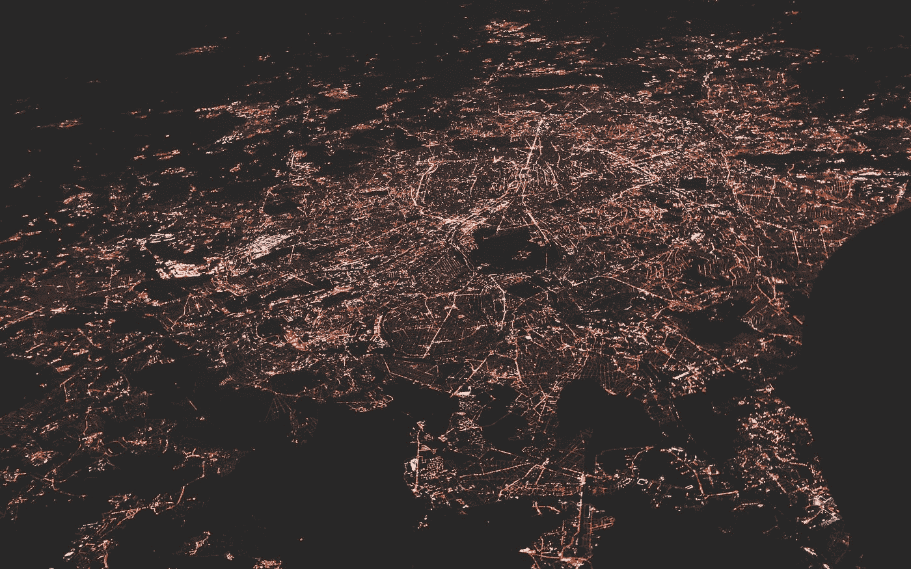
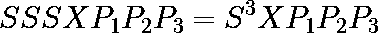

# 放大图形神经网络的经典策略

> 原文：<https://towardsdatascience.com/classical-strategies-for-scaling-up-graph-neural-networks-69dd10cd21a>

## 总结了使网络运行速度更快、占用内存更少的方法

纳斯蒂亚·杜尔希尔在 [Unsplash](https://unsplash.com?utm_source=medium&utm_medium=referral) 上的照片

在[我之前的帖子](/how-to-create-a-graph-neural-network-in-python-61fd9b83b54e)中，我谈到了图形神经网络(GNNs)如何成为一个热门的研究主题，因为在复杂网络(图形)的深度学习相关任务上取得了进展。

由于这是一个如此重要的主题，许多研究都集中在改进 GNNs 上。有两个主要目标:使它们更强大(就预测性能而言)并使它们运行得更快，消耗的内存更少。

在本帖中，我们将看到，今天，使用消息传递框架的传统 gnn 训练起来非常慢，并且需要大量的内存。我假装指导你一些已经到位的策略，尝试将 gnn 扩展到非常大的图。

# 分析消息传递框架的复杂性

消息传递框架包括聚集来自节点邻居的信息以及节点本身的信息，以生成节点表示。

我们已经在[这篇文章](/how-to-create-a-graph-neural-network-in-python-61fd9b83b54e)中看到了一点这是如何工作的，以及它与[这篇文章](/testing-if-two-graphs-are-isomorphic-cf6c44ab551e)中的 WL 测试的关系。现在，让我们评估一下拥有一个大图的深度网络可能有多困难。

让我们记住，每增加一层 GNN 就意味着网络上多了一跳。

现在，如果我们看看 GraphSAGE [1]架构，它为每层上的每个节点选择固定数量的邻居，我们可以看到内存消耗是如何开始失控的。

设 F 为网络的 X 数据集上的要素数，L 为图层数。首先，你将有一个 O(LF)的内存消耗来保存网络的权重矩阵。这本身问题不大。

现在，让我们来看看内存消耗，它来自于在内存中保存节点的嵌入，这是为了在训练期间计算每个目标节点的嵌入而需要的。

假设 b 是批量大小，r 是使用 GraphSAGE 采样的节点数。让我们假设每层采样相同数量的节点。在这种情况下，您需要的内存量将是 O(bFr^L).关于这种计算的更多信息可以在[2]中找到

问题在于网络层数之间的指数关系。这说明了为什么现在存在的一些架构不能超越 3 或 4 层。

(*这里需要注意的是，一些研究指出，深入研究 GNNs 可能不会带来性能提升，然而，这一讨论超出了本文的范围*)。

现在，让我们回顾一下研究人员为了改善 GNNs 的可扩展性问题而采用的一些策略。

# 取样方法

采样方法试图通过对计算图进行采样来减少我们在任何给定时间点需要处理的节点数量。根据取样的方式和地点，我们可以有三种不同的分类。

## 节点采样

这是我们刚刚看到的 GraphSAGE 实现的方法。其思想是，在训练期间，我们可能不需要考虑整个节点邻域，而是可以选择一些节点。

正如我们所看到的，这仍然带来了复杂性问题。此外，随机采样可能不是一个好策略，因为没有选择这些节点的标准，这可能会对性能产生负面影响。

## 子图采样

子图采样背后的想法是，可能有一种方法可以将一个非常大的复杂网络分成更小的组件，然后在训练期间批量处理这些组件。这种方法有两个主要的例子:ClusterGCN [2]和 GraphSAINT [3]。

ClusterGCN 在训练之前对图应用聚类算法(或社区检测算法)。因此，通过生成几个聚类(子图)，就有了一批随时可用的子图。

另一方面，GraphSAINT 有一些采样方法，考虑到采样的重要性和偏差，定义哪些节点和哪些边应该添加到采样的子图中。

这两种方法都成功地改善了模型训练的时间和记忆复杂性。然而，两者都包括生成子图的潜在缓慢的预处理步骤。此外，他们有一些假设，现在可以推广到每一个网络。例如，如果图上没有社区结构会发生什么？ClusterGCN 在这些情况下可能不太好用。

## 分层取样

层采样策略包括对每个层上要考虑的节点进行采样。请注意，这不同于节点采样。在节点采样中，每个节点都经过每一层，只是计算邻居的变化。在图层采样中，一个图层可能根本没有一个节点。

这种策略的主要例子是 FastGCN [4]。该架构假设节点之间独立，然后应用一些蒙特卡罗近似来生成采样。

注意，这里节点之间的独立性是一个非常强的假设。我们正在处理一个图，根据定义，节点之间有某种关系(一条边)。

# 通过预计算简化架构

另一类扩展 GNNs 的策略是简化架构。这种策略背后的想法是打破经典 GCN 论文[5]中定义的消息传递框架，支持另一种类型的架构，通过预计算更好地扩展。我们将探索这种架构的两个例子。

## 简化图形卷积神经网络(SGC)

该架构[6]始于这样一个假设，即产生 GNNs 良好性能的是邻居的聚合，而不是 GNN 各层之间的非线性(ReLU 等)。

如果你去除非线性，你会看到整个 GNN 开始看起来像一个矩阵乘法序列。以三层网络为例:

其中 S 是归一化邻接矩阵，X 是特征向量，P 是网络层的权重矩阵。

可以清楚地看到，这些乘法运算的整个左侧不依赖于网络的权重。这意味着我们可以在训练网络之前将其相乘。

该体系结构的作者表明，这种方法与传统的 GNNs 相比是有竞争力的，表明人们可以消除网络的非线性，并预先计算大量以前在训练期间会发生的信息。

## 可扩展初始图神经网络(SIGN)

这个架构[7]是基于计算机视觉领域的初始网络。这个网络背后的基本思想是，人们可以预先计算多个没有可训练权重的聚合，然后在一个模型上连接它们以生成嵌入。

这与 SGC 的想法非常相似。在 SIGN 上，该架构的作者预计算网络的每种类型的跳(通过对邻接矩阵求幂)，然后将其乘以特征矩阵，并且只有在那时他们才使用下游模型。

来自这两个架构的想法表明，预计算是一个非常突出的研究领域，可以为 GNNs 产生非常强大的结果

# 结论

这绝不是对图形神经网络的缩放方法的广泛回顾。然而，我希望这能够向您展示一些最著名的方法，以及它们如何在扩展 gnn 的大背景下相互配合。

[1]汉密尔顿，威廉&英，雷克斯&莱斯科维奇，朱尔。(2017).大型图上的归纳表示学习。

[2]蒋、刘维林、宣庆、李、杨、谢、曹瑞。(2019).聚类 GCN:一种训练深度和大型图卷积网络的有效算法。

[3]曾、韩青&周、洪宽&斯里瓦斯塔瓦、阿吉特什&坎南、拉杰戈帕尔&普拉桑纳、维克托。(2020).GraphSAINT:基于图抽样的归纳学习方法。

[4]陈、马杰、曹腾飞、萧。(2018).FastGCN:通过重要性抽样快速学习图形卷积网络。ICLR。

[5]基普夫，托马斯&韦林，马克斯。(2016).基于图卷积网络的半监督分类。

[6]吴，费里克斯&张，天一&苏扎，Jr &五十，克里斯托弗&余，陶&温伯格，基连。(2019).简化图形卷积网络。

[7]罗西，伊曼纽&弗拉斯卡，法布里齐奥&张伯伦，本&埃纳德，大卫&布朗斯坦，迈克尔&蒙蒂，费德里科。(2020).SIGN:可扩展初始图神经网络。