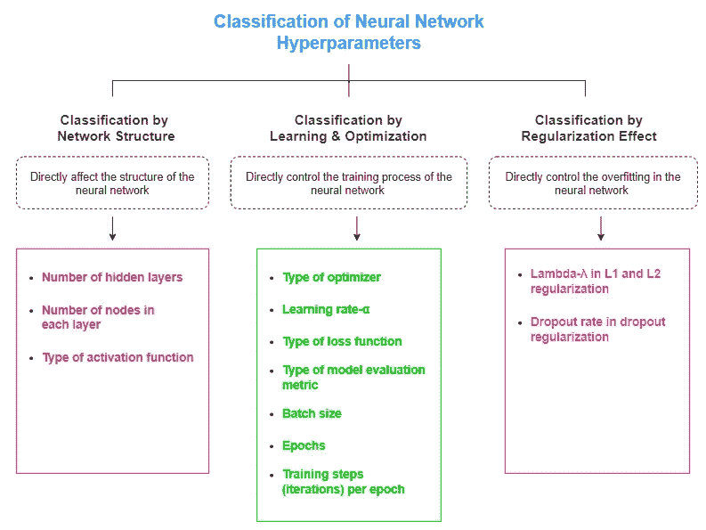
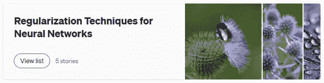
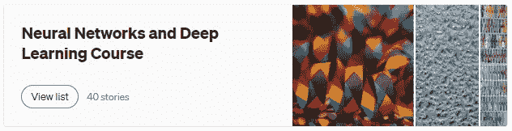

# 神经网络超参数的分类

> 原文：<https://towardsdatascience.com/classification-of-neural-network-hyperparameters-c7991b6937c3>

## 受网络结构、学习和优化以及正则化效应的影响


约翰-马克·史密斯在 [Unsplash](https://unsplash.com/?utm_source=unsplash&utm_medium=referral&utm_content=creditCopyText) 上的照片

使用 DL 算法时的一个主要挑战是设置和控制超参数值。这在技术上叫做 ***超参数调优*** 或者 ***超参数优化*** 。

超参数控制 DL 算法的许多方面。

*   他们可以决定运行算法的时间和计算成本。
*   他们可以定义神经网络模型的结构
*   它们会影响模型的预测准确性和泛化能力。

换句话说，超参数控制神经网络模型的行为和结构。因此，了解每个超参数在正确分类的神经网络中的作用非常重要([见图表](#a105))。

# 关于超参数的重要事实

在介绍和分类神经网络超参数之前，我想列出以下关于超参数的重要事实。要结合实例详细了解参数和超参数的区别，请阅读我的*[***参数 Vs 超参数:有什么区别？***](https://rukshanpramoditha.medium.com/parameters-vs-hyperparameters-what-is-the-difference-5f40e16e2e82)*条。**

*   **不要混淆 ***超参数*** 和 ***参数*** 。两者都是存在于 ML 和 DL 算法中的变量。但是，它们之间有明显的区别。**
*   **参数是变量，其值从数据中学习并在训练期间更新。**
*   **在神经网络中，权重和偏差是参数。它们在反向传播期间被优化(更新)以最小化成本函数。**
*   **一旦找到参数的最佳值，我们就停止训练过程。**
*   **超参数是变量，其值由 ML 工程师或任何其他人在训练模型之前设置。这些值不是从数据中自动学习的。因此，我们需要手动调整它们来构建更好的模型。**
*   **通过改变超参数的值，我们可以建立不同类型的模型。**
*   **在 ML 和 DL 中，寻找超参数的最佳值是一项具有挑战性的任务。**
*   **超参数的最佳值还取决于数据集的大小和性质以及我们想要解决的问题。**

# **神经网络超参数分类标准**

**可以通过考虑以下标准对神经网络中的超参数进行分类。**

*   **网络结构**
*   **[学习和优化](https://rukshanpramoditha.medium.com/overview-of-a-neural-networks-learning-process-61690a502fa)**
*   **[正规化效果](https://rukshanpramoditha.medium.com/list/regularization-techniques-for-neural-networks-c4ad21cce618)**

**基于上述标准，神经网络超参数可以分类如下。**

****

**(作者图表，用 draw.io 制作)**

# **定义神经网络结构的超参数**

**根据该标准分类的超参数直接影响神经网络的结构。**

## **隐藏层数**

**这也被称为网络的*深度*。深度学习中的术语**【深度】**是指一个神经网络的隐含层数(*深度*)。**

**在设计 [MLP](/creating-a-multilayer-perceptron-mlp-classifier-model-to-identify-handwritten-digits-9bac1b16fe10) 、 [CNN](/coding-a-convolutional-neural-network-cnn-using-keras-sequential-api-ec5211126875) 、 [AE](/generate-mnist-digits-using-shallow-and-deep-autoencoders-in-keras-fb011dd3fec3) 等神经网络时，隐含层数决定了网络的*学习能力*。为了学习数据中所有重要的非线性模式，神经网络中应该有足够数量的隐藏层。**

**当数据集的大小和复杂性增加时，神经网络需要更多的学习能力。因此，大型复杂数据集需要太多的隐藏层。**

**非常少量的隐藏层会生成较小的网络，可能会使训练数据不足。这种类型的网络不会学习训练数据中的复杂模式，也不会对看不见的数据进行很好的预测。**

**过多的隐藏层会生成一个较大的网络，可能会使训练数据过拟合。这种类型的网络试图记忆训练数据，而不是学习数据中的模式。因此，这种类型的网络不能很好地概括新的看不见的数据。**

**[过拟合](https://rukshanpramoditha.medium.com/list/addressing-overfitting-868959382d1d)没有欠拟合有害，因为过拟合可以通过适当的调整方法减少或消除。**

## **每层中的节点数(神经元/单元)**

**这也就是所谓的 ***宽度*** 的网络。**

**隐藏层中的节点通常称为 ***隐藏单元*** 。**

**隐藏单元的数量是影响网络学习能力的另一个因素。**

**太多的隐藏单元会创建非常大的网络，这可能会使训练数据过拟合，而非常少的隐藏单元会创建较小的网络，这可能会使训练数据过拟合。**

**MLP 输入层中的结点数量取决于输入数据中的[维度](/11-dimensionality-reduction-techniques-you-should-know-in-2021-dcb9500d388b)(要素数量)。**

**MLP 输出图层中的结点数量取决于我们想要解决的问题类型。**

*   ****二元分类:**使用输出层的一个节点。**
*   ****多标签分类:**如果有 ***n*** 个相互包含的类，则在输出层使用 ***n*** 个节点。**
*   ****多类分类:**如果有 ***n*** 个互斥类， ***n*** 个节点用于输出层。**
*   ****回归:**使用输出层的一个节点。**

> **新手总是问一个神经网络层应该包含多少个隐层或者多少个节点。**

**要回答这个问题，你可以利用上述事实以及以下两点。**

*   **当隐藏层和隐藏单元的数量增加时，网络变得非常大，参数的数量显著增加。训练这样的大型网络，需要大量的计算资源。因此，大型神经网络在计算资源方面非常昂贵。**
*   **我们可以通过添加或删除隐藏层和隐藏单元来试验不同的网络结构，然后通过[绘制训练误差和测试(验证)误差相对于训练期间的时期数](/replicate-a-logistic-regression-model-as-an-artificial-neural-network-in-keras-cd6f49cf4b2c#0346)来查看模型的性能。**

## **激活功能的类型**

**这是定义网络结构的最后一个超参数。**

**我们在神经网络层中使用激活函数。输入层不需要任何激活功能。我们必须在隐藏层中使用激活函数来给网络引入非线性。输出层中使用的激活类型由我们想要解决的问题类型决定。**

*   ****回归:**同一个节点的身份激活函数**
*   ****二元分类:**具有一个节点的 Sigmoid 激活函数**
*   ****多类分类:**每类一个节点的 Softmax 激活函数**
*   ****多标签分类:**每类一个节点的 Sigmoid 激活函数**

**要通过图形表示详细了解不同类型的激活函数，请阅读我的*[***如何为神经网络选择正确的激活函数***](/how-to-choose-the-right-activation-function-for-neural-networks-3941ff0e6f9c)*一文。****

***要阅读激活功能的使用指南，请点击此处的。***

***要了解激活函数的好处，请阅读我的*[***神经网络中激活函数的 3 个惊人好处****文章。*](https://rukshanpramoditha.medium.com/3-amazing-benefits-of-activation-functions-in-neural-networks-22b17b91a46e)****

***要了解如果在神经网络的隐藏层中不使用任何激活函数会发生什么，请阅读本文。***

# ***决定如何训练网络的超参数***

***根据该标准分类的超参数直接控制网络的训练过程。***

## ***优化器的类型***

***优化器也叫 ***优化算法*** 。优化器的任务是通过更新网络参数来最小化损失函数。***

**梯度下降是最流行的优化算法之一。它有三种变体。**

*   **批量梯度下降**
*   **随机梯度下降**
*   **小批量梯度下降**

**所有这些变量[的不同之处在于我们用来计算损失函数梯度的批量](https://rukshanpramoditha.medium.com/all-you-need-to-know-about-batch-size-epochs-and-training-steps-in-a-neural-network-f592e12cdb0a#968f)(稍后将详细介绍)。**

**为解决梯度下降算法的缺点而开发的其他类型的优化器有:**

*   **动量梯度下降**
*   **圣经》和《古兰经》传统中）亚当（人类第一人的名字**
*   **阿达格拉德**
*   **阿达德尔塔**
*   **阿达马克斯**
*   **那达慕**
*   **Ftrl**
*   **RMSProp (Keras 默认值)**

## **学习率- **α****

**这个超参数可以在任何优化算法中找到。**

**在优化过程中，优化器采取微小的步骤来降低误差曲线。学习率指的是步长的大小。它决定了优化器下降误差曲线的快慢。步长的方向由梯度(导数)决定。**

**这是神经网络训练中最重要的超参数之一。**

**较大的学习速率值可以用来更快地训练网络。过大的值会导致损失函数在最小值附近振荡，永远不下降。那样的话，模型就永远训练不出来了！**

**学习率的值太小会导致模型训练甚至几个月。在这种情况下，收敛发生得非常慢。该网络将需要许多纪元(稍后将详细介绍)才能以非常小的学习速率收敛。**

**我们应该避免使用太大和太小的学习率值。最好从一个小的学习率开始，例如 0.001(大多数优化器中的默认值)，然后如果网络需要太多时间收敛，则系统地增加学习率。**

## **损失函数的类型**

**应该有一种方法在训练期间测量神经网络的性能。损失函数用于计算预测值和实际值之间的损失分数(误差)。我们的目标是通过使用优化器来最小化损失函数。这就是我们在训练中取得的成绩。**

**训练中使用的损失函数的类型取决于我们所面临的问题的类型。**

*   ****均方误差(MSE)** —这是用来衡量回归问题的表现。**
*   ****平均绝对误差(MAE)** —这是用来衡量回归问题的表现。**
*   ****平均绝对百分比误差** —用于衡量回归问题的表现。**
*   ****Huber Loss** —用于衡量回归问题的表现。**
*   ****二元交叉熵(对数损失)** —这用于衡量二元(两类)分类问题的性能。**
*   ****多类交叉熵/分类交叉熵** —用于衡量多类(两类以上)分类问题的性能。**
*   ****稀疏分类交叉熵** —在多类分类问题中，自动将标量值标签转换为 ***一个热点向量*** 。点击了解更多关于此[的信息。](https://rukshanpramoditha.medium.com/one-hot-encode-scalar-value-labels-for-deep-learning-models-4d4053f185c5)**

## **模型评估指标的类型**

**就像我们在训练期间使用损失函数来测量神经网络的性能一样，我们在测试期间使用评估度量来测量模型的性能。**

**对于分类任务，将使用“准确性”、“精确度”、“召回率”、“auc”指标。对于回归任务，将使用“均方误差”、“平均绝对误差”。**

## **批量**

*****批量*** 是在`model.fit()`方法中发现的另一个重要的超参数。**

> **批次大小指的是批次中训练实例的数量—来源:[关于批次大小、时期和神经网络中的训练步骤，您需要了解的全部信息](https://rukshanpramoditha.medium.com/all-you-need-to-know-about-batch-size-epochs-and-training-steps-in-a-neural-network-f592e12cdb0a)**

**换句话说，它是每次渐变更新(迭代)使用的实例数。**

**批量大小的典型值为 16、32 (Keras 默认值)、64、128 和 256、512 和 1024。**

**较大的批量通常需要每个时段大量的计算资源，但是需要较少的时段来收敛。**

**较小的批量不需要每个时期大量的计算资源，但是需要许多时期来收敛。**

## **纪元**

*****时期*** 是在`model.fit()`方法中发现的另一个重要的超参数。**

> **时期指的是模型看到整个数据集的次数——来源:[您需要知道的关于批量大小、时期和神经网络中的训练步骤的所有信息](https://rukshanpramoditha.medium.com/all-you-need-to-know-about-batch-size-epochs-and-training-steps-in-a-neural-network-f592e12cdb0a)**

**当，**

*   **网络是用很小的学习率训练出来的。**
*   **批量太小。**

**有时，网络会倾向于用大量的历元来过度拟合训练数据。也就是说，在收敛之后，验证误差在某个点开始增加，而训练误差进一步减小。当这种情况发生时，该模型在训练数据上表现良好，但在新的未知数据上表现不佳。此时，我们应该停止训练过程。这就叫 [***早停***](https://rukshanpramoditha.medium.com/using-early-stopping-to-reduce-overfitting-in-neural-networks-7f58180caf5b) 。**

****

****提前停止进程**(图片由作者提供，用 matplotlib 和 draw.io 制作)**

## **每个时期的训练步骤(迭代)**

> **一个训练步骤(迭代)是一个梯度更新—来源:[关于神经网络中的批量大小、时期和训练步骤，您需要知道的一切](https://rukshanpramoditha.medium.com/all-you-need-to-know-about-batch-size-epochs-and-training-steps-in-a-neural-network-f592e12cdb0a)**

**我们不需要为此超参数设置一个值，因为算法会按如下方式自动计算它。**

```
****Steps per epoch = (Size of the entire dataset / batch size) + 1****
```

**我们加 1 来补偿任何小数部分。比如我们得到 18.75，我们忽略 0.75，18 加 1。总数是 19。**

**在 Keras `model.fit()`方法中，这个超参数由 **steps_per_epoch** 参数指定。它的默认值是`None`，这意味着算法自动使用使用上述等式计算的值。**

**无论如何，如果我们为这个参数指定一个值，将会覆盖默认值。**

> ****注:**要通过例子了解更多关于批量大小、时期和训练步骤之间的联系，请阅读我的*[***所有你需要知道的关于神经网络中批量大小、时期和训练步骤的文章***](https://rukshanpramoditha.medium.com/all-you-need-to-know-about-batch-size-epochs-and-training-steps-in-a-neural-network-f592e12cdb0a)*。****

# ****应用正则化效果的超参数****

****根据该标准分类的超参数直接控制神经网络中的过拟合。****

****我不打算像以前在我的其他文章中所做的那样，在这里详细讨论每个超参数。链接到以前发表的文章将被包括在内。****

## ****L1 和 L2 正则化中的λ-λ****

****λ是控制 L1 和 L2 正则化级别的正则化参数(因子)。λ的特殊值为:****

*   ****`lambda=0`:不适用正规化****
*   ****`lambda=1`:应用完全正则化****
*   ****`lambda=0.01` : Keras 默认****

****λ可以取 0 到 1 之间的任何值(包括 0 和 1)。****

****要详细了解这个超参数以及李和的正则化技术，请阅读我的文章*[***【如何将和的正则化技术应用于 Keras 模型***](https://rukshanpramoditha.medium.com/how-to-apply-l1-and-l2-regularization-techniques-to-keras-models-da6249d8a469)*。******

## ****辍学调整中的辍学率****

****该超参数定义了丢失正则化中的丢失概率(要从网络中移除的节点比例)。两个特殊值是:****

*   ****`rate=0`:不应用辍学调整****
*   ****`rate=1`:从网络中删除所有节点(不实用)****

****辍学率可以取 0 到 1 之间的任何值。****

****要了解关于这个超参数以及辍学正则化的更多信息，请阅读我的*[***辍学正则化如何减轻神经网络中的过度拟合***](https://rukshanpramoditha.medium.com/how-dropout-regularization-mitigates-overfitting-in-neural-networks-9dcc3e7102ff)*文章。******

# ****摘要****

****术语 ***超参数*** 在 ML 和 DL 中是一个非常重要的概念。对于 DL 中的给定任务，神经网络架构的类型也是超参数。例如，我们可以使用 MLP 或 CNN 架构来分类手写数字。这里，在 MLP 和 CNN 之间选择是一种设置超参数的类型！****

***对于给定的神经网络架构，存在上述超参数。注意，正则化超参数是可选的。***

***在 Keras 中，一些超参数可以通过函数中的相关参数作为层或字符串标识符添加。***

***例如，可以通过以下方式之一将 ReLU 激活功能添加到层中。***

```
***# As a string identifier
model.add(Dense(100, activation='relu'))***
```

```
***# As a layer
from tensorflow.keras.layers import ReLU
model.add(Dense(100))
model.add(ReLU())***
```

***这两个选项给出了相同的结果。当我们想要在激活功能之前添加任何其他层(例如[批量归一化层](https://rukshanpramoditha.medium.com/batch-normalization-explained-in-plain-english-3436014f9e52))时，第二个选项是理想的选择。***

***另一个例子是，优化器可以被定义为字符串标识符或函数本身。***

```
***# As a string identifier
model.compile(optimizer="rmsprop",...)***
```

***当我们将 RMSProp 优化器定义为字符串标识符时，默认的学习率 0.001 将应用于该算法。没有办法改变。但是，我们经常需要在训练过程中改变学习率的值来获得最佳结果。为此，我们可以使用以下选项。***

```
***# As a function itself
from tensorflow.keras.optimizers import RMSprop
model.compile(optimizer=RMSprop(learning_rate=0.005),...)***
```

***这里，优化器被定义为 RMSprop()函数。期望的学习速率可以被定义为该函数中的一个自变量。***

***这些都是新手经常混淆的东西。希望你今天拿到了这些分！***

***今天的帖子到此结束。***

***如果你有任何问题或反馈，请告诉我。***

## ***阅读下一篇(推荐)***

*   *****参数 Vs 超参数:有什么区别？*****

***[](https://rukshanpramoditha.medium.com/parameters-vs-hyperparameters-what-is-the-difference-5f40e16e2e82) [## 参数 Vs 超参数:区别是什么？

### 用 4 个不同的例子进行讨论

rukshanpramoditha.medium.com](https://rukshanpramoditha.medium.com/parameters-vs-hyperparameters-what-is-the-difference-5f40e16e2e82) 

*   **所有你需要知道的关于批量大小、时期和神经网络中的训练步骤**

[](https://rukshanpramoditha.medium.com/all-you-need-to-know-about-batch-size-epochs-and-training-steps-in-a-neural-network-f592e12cdb0a) [## 你所需要知道的关于批量大小、时期和神经网络中的训练步骤

### 并用简单的英语举例说明它们之间的联系

rukshanpramoditha.medium.com](https://rukshanpramoditha.medium.com/all-you-need-to-know-about-batch-size-epochs-and-training-steps-in-a-neural-network-f592e12cdb0a) 

*   **如何为神经网络选择正确的激活函数**

[](/how-to-choose-the-right-activation-function-for-neural-networks-3941ff0e6f9c) [## 如何为神经网络选择合适的激活函数

### 用视觉表征分析不同类型的激活功能——神经网络和深度学习…

towardsdatascience.com](/how-to-choose-the-right-activation-function-for-neural-networks-3941ff0e6f9c) 

*   [](https://rukshanpramoditha.medium.com/list/regularization-techniques-for-neural-networks-c4ad21cce618)****(文章收藏)****

**[](https://rukshanpramoditha.medium.com/list/regularization-techniques-for-neural-networks-c4ad21cce618)

(作者截图)** 

*   ****全集我的** [**神经网络与深度学习教程**](https://rukshanpramoditha.medium.com/list/neural-networks-and-deep-learning-course-a2779b9c3f75)**

****[](https://rukshanpramoditha.medium.com/list/neural-networks-and-deep-learning-course-a2779b9c3f75)

(作者截图)**** 

## ****支持我当作家****

****我希望你喜欢阅读这篇文章。如果你愿意支持我成为一名作家，请考虑 [***注册成为会员***](https://rukshanpramoditha.medium.com/membership) *以获得无限制的媒体访问权限。它只需要每月 5 美元，我会收到你的会员费的一部分。*****

****[](https://rukshanpramoditha.medium.com/membership) [## 通过我的推荐链接加入 Medium

### 阅读 Rukshan Pramoditha(以及媒体上成千上万的其他作家)的每一个故事。您的会员费直接…

rukshanpramoditha.medium.com](https://rukshanpramoditha.medium.com/membership) 

非常感谢你一直以来的支持！下一篇文章再见。祝大家学习愉快！

[鲁克山普拉莫迪塔](https://medium.com/u/f90a3bb1d400?source=post_page-----c7991b6937c3--------------------------------)
**2022–09–16*********