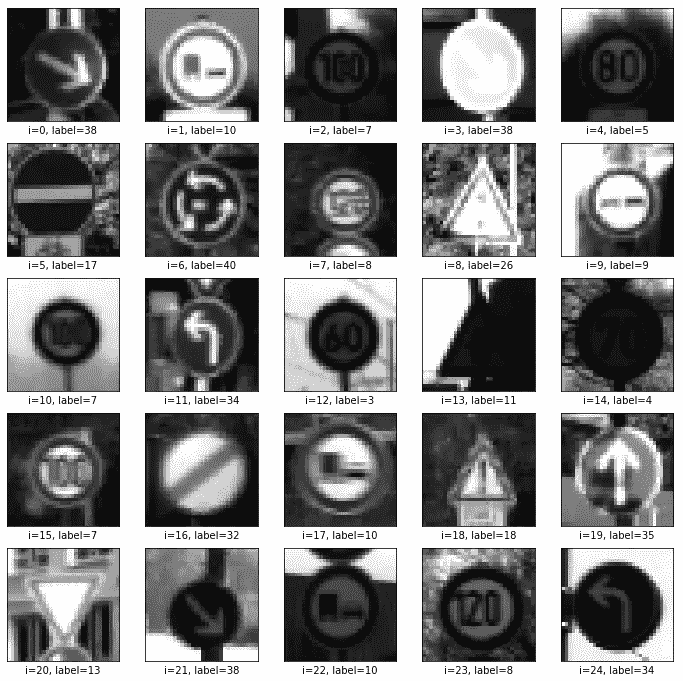
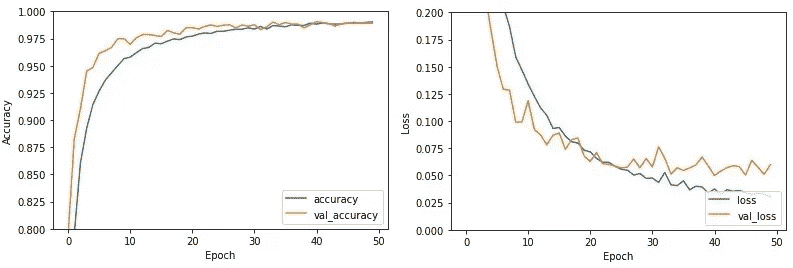
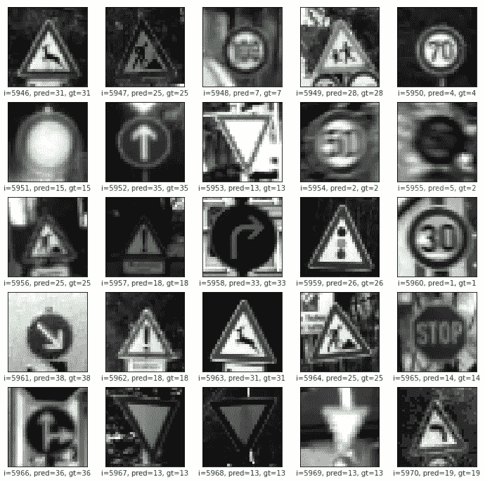
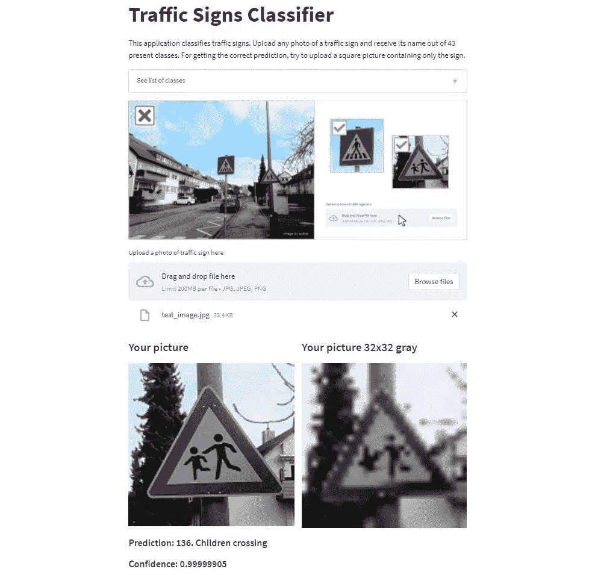

# LeNet-5 CNN 在交通标志分类中的应用

> 原文：<https://towardsdatascience.com/classification-of-traffic-signs-with-lenet-5-cnn-cb861289bd62>

## 使用 Keras 库构建和利用一个简单的 CNN


丽贝卡·扎尔从[派克斯](https://www.pexels.com/photo/selective-focus-photography-of-assorted-color-hanging-decor-lot-764690/?utm_content=attributionCopyText&utm_medium=referral&utm_source=pexels)拍摄的照片

*   在 Streamlit 上查看应用:[https://share . Streamlit . io/andriigoz/traffic _ signs _ classification](https://share.streamlit.io/andriigoz/traffic_signs_classification)
*   GitHub 库:[https://github.com/AndriiGoz/traffic_signs_classification](https://github.com/AndriiGoz/traffic_signs_classification)

这个项目的目的是训练和测试一个分类任务的 LeNet-5 卷积神经网络的实现。该模型将用于一个应用程序中，用户可以上传一张交通标志的照片，并获得其类别的预测。

## **1。数据集**

该数据集取自德国交通标志识别基准(gt SRB)【1】的 [*，并在 2011 年*](https://benchmark.ini.rub.de/gtsrb_dataset.html)*【2】国际神经网络联合会议 [*的单幅图像分类挑战赛上首次亮相。它是根据白天在德国不同道路上行驶时录制的大约 10 个小时的视频制作的。该数据由大约 40，000 幅真实的彩色交通标志照片组成。这些图像有一个*。ppm* 扩展名，它们的大小从 15x15 到 250x250 像素不等。笔记本的话，我更喜欢用 Google Colab。我将数据集保存在我的 Google Drive 上，只需使用 *drive.mount* 命令即可访问它:*](https://www.sciencedirect.com/science/article/pii/S0893608012000457?via%3Dihub)*

```
***from** google.colab **import** drive
drive**.**mount('/content/gdrive', force_remount**=True**)*
```

## *2.图书馆*

*对于我们的项目，我们需要以下库:一些标准库，如 NumPy、OS 和 Matplotlib [*cv2*](https://opencv.org/) ，为解决计算机视觉任务而开发的强大库；[*sk learn . model _ selection . train _ test _ split*](https://scikit-learn.org/stable/modules/generated/sklearn.model_selection.train_test_split.html)用于将数据集拆分成训练和测试子集；用于构建模型的[*TF . keras . models*](https://www.tensorflow.org/api_docs/python/tf/keras/models)和[*TF . keras . layers*](https://www.tensorflow.org/api_docs/python/tf/keras/layers)中的一些组件。*

```
***import** numpy **as** np
**import** random
**import** os
**import** cv2 **as** cv
**import** matplotlib.pyplot **as** plt
**from** sklearn.model_selection **import** train_test_split
**from** keras.models **import** Sequential, load_model
**from** keras.layers **import** Conv2D, Dense, Flatten, Rescaling, AveragePooling2D, Dropout*
```

## *3.读取和预处理图像文件*

*我们从读取数据集中的图像开始。这些图像分布在代表 43 个班级的 43 个文件夹中。我们遍历文件夹和图像，打开它们，调整到 32x32 像素，从 RGB 转换为灰色，并保存为 np.arrays。*

```
*images **=** []
labels **=** []
classes **=** 43

current_path **=** '/content/gdrive/My Drive/GTSRB/Images/'

**for** i **in** range(classes):
    path **=** os**.**path**.**join(current_path, str(str(i)**.**zfill(5)))
    img_folder **=** os**.**listdir(path)
    **for** j **in** img_folder:
        **try**:
            image **=** cv**.**imread(str(path**+**'/'**+**j))
            image **=** cv**.**resize(image, (32, 32))
            image **=** cv**.**cvtColor(image, cv**.**COLOR_BGR2GRAY)
            image **=** np**.**array(image)
            images**.**append(image)
            label **=** np**.**zeros(classes)
            label[i] **=** 1.0
            labels**.**append(label)
        **except**:
            **pass***
```

*我们现在将数据标准化:我们将图像除以 255，得到 0.0 到 1.0 之间的像素值。最后，我们将总共 39.209 幅图像分配给 43 个类别。*

```
*images **=** np**.**array(images)
images **=** images**/**255
labels **=** np**.**array(labels)Images shape: (39209, 32, 32)
Labels shape: (39209, 43)*
```

*当处理图像时，查看一些样本总是值得的。让我们从数据集中随机抽取 25 幅图像，并显示它们的标签。*

**

*25 张预处理图片样本。图片来自作者的笔记本*

*在这组图片中，我们可以看到一些可能的错误分类问题。例如，在图像 7 上很难识别数字，图像 13 和 14 太暗。图 8(“交通信号”)可能被误归类为“一般注意事项”。*

## *4.构建模型*

*在创建模型之前，我们必须将数据集分成训练和测试子集。对于测试子集，我们取出标准的 20%的数据集。另外，一定要确保我们的数据有 *np* ***。*** *float32* 格式。*

```
*X **=** images**.**astype(np**.**float32)
y **=** labels**.**astype(np**.**float32)

X_train, X_test, y_train, y_test **=** train_test_split(X, y,                 
test_size**=**0.2, random_state**=**123)X_train shape: (31367, 32, 32)
y_train shape: (31367, 43)
X_test shape: (7842, 32, 32)
y_test shape: (7842, 43)*
```

*对于我们的分类任务，我们将使用 LeNet-5 卷积神经网络的实现。LeNet-5 是 Yann LeCun 等人[3]在 1998 年设计的，是最早的卷积神经网络之一。它的架构非常简单，但非常高效。*

*有三个基于 5×5 滤波器的卷积层，然后是具有 2×2 补丁的平均池。我们使用 ReLU 功能进行激活，因为它可以加快训练速度。然后我们添加系数为 0.2 的 Dropout 层来处理过拟合。这意味着 20%的输入将被随机取消，以防止层间的强依赖性。我们最终得到了扁平化和两个致密层。在最后一个密集层中，我们必须分配与类别数量相等的神经元数量，并使用 Softmax 激活函数来获得 0.0 到 1.0 之间的概率。该网络中的最终参数数量为 70，415。*

```
 *Model: "sequential_6"
_________________________________________________________________
 Layer (type)                  Output Shape              Param #   
=================================================================
 rescaling_7 (Rescaling)       (None, 32, 32, 1)         0         
 conv2d_19 (Conv2D)            (None, 28, 28, 6)         156       
 average_pooling2d_12          (None, 14, 14, 6)         0         
      (AveragePooling2D)                                                    
 conv2d_20 (Conv2D)            (None, 10, 10, 16)        2416      
 average_pooling2d_13          (None, 5, 5, 16)          0         
      (AveragePooling2D)                                                    
 conv2d_21 (Conv2D)            (None, 1, 1, 120)         48120     
 dropout_6 (Dropout)           (None, 1, 1, 120)         0         
 flatten_6 (Flatten)           (None, 120)               0         
 dense_12 (Dense)              (None, 120)               14520     
 dense_13 (Dense)              (None, 43)                5203      
=================================================================
 Total params: 70,415
 Trainable params: 70,415
 Non-trainable params: 0*
```

*现在有了*型号* ***。*** *编译*的方法，我们配置模型。Adam 学习率优化算法是随机梯度下降的扩展，在训练速度方面是一个很好的选择。分类交叉熵损失函数适合这里，因为它为我们的分类问题提供了多类概率分布。对于模型的性能评估，我们将采用准确性指标。*

```
*model**.**compile(optimizer**=**'adam',
              loss**=**'categorical_crossentropy',
              metrics**=**['accuracy'])*
```

## *5.训练模型*

*现在是训练模型的时候了。我们将输入数据( *X_train* )和目标数据( *y_train* )传递给 *model.fit* 方法，定义了 50 个训练时期，还添加了验证数据 *X_test* 和 *y_test* ，用于在每个时期结束时评估损失和其他模型指标。*

```
*history **=** model**.**fit(X_train, y_train, epochs**=**50,
                    validation_data**=**(X_test, y_test))*
```

## *6.培训结果评估*

*我们如何知道我们的模型是好是坏？来看看学习曲线吧！*训练* *精度*和*验证精度*曲线最终收敛，经过 50 个历元我们得到了 98.9%的精度，相当不错。*验证损失*曲线上下跳动一点。这意味着如果有更多的验证数据就好了。大约 25 个时期后*验证损失*超过*列车损失*，这意味着我们这里有一点过度拟合。但是曲线不会随着时间的推移而上升，并且*验证*和*列车损失*之间的差异并不大，因此这是可以接受的。我们就此打住。*

**

*学习曲线。作者图片*

*让我们来看看一些样本，找出错误的分类图片。我们用*预测*和*地面实况*类来标记图像。如果预测等于地面真相，我们分配一个绿色的标签。否则，我们把它变成红色:*

**

*25 个随机样本的预测和增长的真实性。图片来自作者的笔记本*

*对于编号为 5955 的图片，我们可以看到“限速(50 公里/小时)”标志被误归类为“限速(80 公里/小时)”。显然，这里标牌上的文字很难辨认。*

## *7.保存模型。在应用程序中使用模型*

*最后，我们使用*模型* ***将模型保存到 Google Drive 上的一个单独的文件夹中。*** *保存*方法。该文件夹包含模型的图形定义和权重，并将用于交通标志识别应用程序中的进一步预测。*

*很明显，客户或任何数据科学之外的人永远不会深入你的笔记本，他不会对图表、模型、准确性和所有这些机器学习的东西感兴趣。他需要一个应用程序，他可以上传图像，并得到他的结果。让我们开始吧。*

*对于我们的 Streamlit 应用程序，我们必须准备一个 GitHub 存储库:我们将 *keras_model* 文件夹、 *streamlit_app.py* 和 *requirements.txt* 放在这里。在 Python 文件中，我们制作一个应用程序本身:定义它的外观、降价、按钮，我们加载模型并进行预测。*

```
***def** sign_predict(image):
    model = load_model('./keras_model/')    
    image = np.array(image, dtype=np.float32)    
    image = image/255    
    image = np.reshape(image, (1, 32, 32))    
    x = image.astype(np.float32)    
    prediction = model.predict(x)    
    prediction_max = np.argmax(prediction)    
    prediction_label = labels_dict[prediction_max]    
    confidence = np.max(prediction)    
    return prediction_label, confidence*
```

*我们让用户上传他的照片，并得到他的交通标志预测。在开始预测之前，我们要对用户的图像进行预处理:使其灰度化，32x32 像素，另存为 *np* ***。*** *浮子 32* 式。我认为这将是很好的显示上传的图像，以及其预处理的 32x32 灰色版本。此外，我们将显示代表模型中 43 个可用类的扩展列表。上传一张图片后，得到的是预测和置信度。 [*这里你可以自己试试 app*](https://share.streamlit.io/andriigoz/traffic_signs_classification) 。*

**

*在 Streamlit 上的[应用](https://share.streamlit.io/andriigoz/traffic_signs_classification)。作者图片*

## *参考*

*[1]德国交通标志识别基准(GTSRB):[https://benchmark.ini.rub.de/gtsrb_dataset.html](https://benchmark.ini.rub.de/gtsrb_dataset.html)*

*[2] J. Stallkamp，M. Schlipsing，J. Salmen，C. Igel，Man vs. computer:交通标志识别的基准机器学习算法:[https://www . science direct . com/science/article/pii/s 0893608012000457](https://www.sciencedirect.com/science/article/pii/S0893608012000457)*

*[3] Lecun，y；博图湖；纽约州本吉奥；哈夫纳，P. (1998 年)。基于梯度的学习应用于文档识别:[http://vision . Stanford . edu/cs 598 _ spring 07/papers/le Cun 98 . pdf](http://vision.stanford.edu/cs598_spring07/papers/Lecun98.pdf)*

*[4] Suhyun Kim，卷积神经网络(CNN)初学者指南:[https://towardsdatascience . com/A-初学者-卷积神经网络指南-cnns-14649dbddce8](/a-beginners-guide-to-convolutional-neural-networks-cnns-14649dbddce8)*

*[5] Keras，Python 深度学习 API:【https://keras.io/ *

*[6] OpenCV，一个计算机视觉库:【https://opencv.org/ *