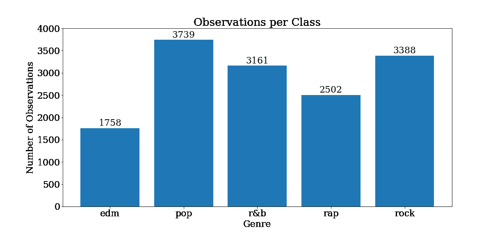
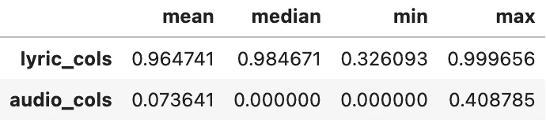
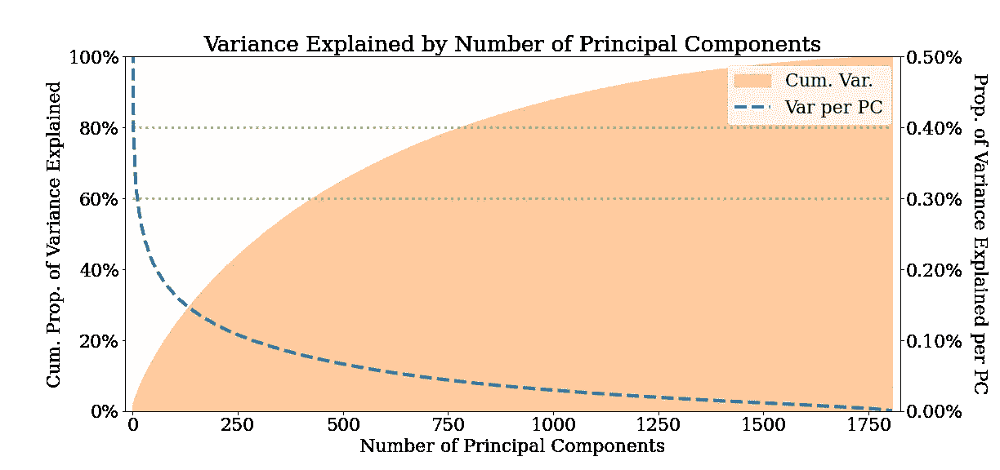
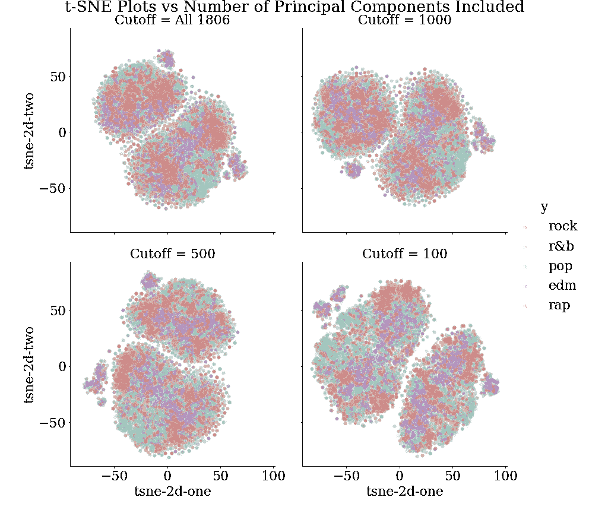
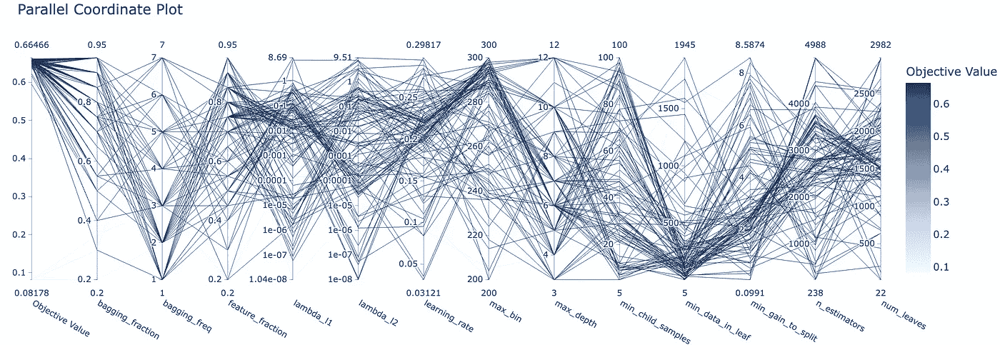
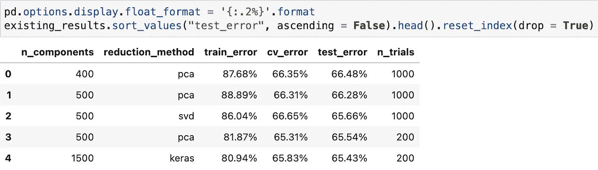

# 使用 LightGBM 对音乐流派进行分类

> 原文：<https://towardsdatascience.com/classifying-music-genres-with-lightgbm-17662035cf4e>

## Optuna 超参数优化和降维

图片由[马体·米罗什尼琴科](https://www.pexels.com/@tima-miroshnichenko/)从[派克斯](https://www.pexels.com/photo/a-man-and-woman-browsing-through-vinyl-music-records-6827191/)拍摄

他的文章概述了使用 tuned LightGBM 模型根据歌曲的音频和歌词特征将歌曲分类的过程。它从一个 [Kaggle 音乐数据集](https://www.kaggle.com/datasets/imuhammad/audio-features-and-lyrics-of-spotify-songs)中提取公开的音乐数据(通过 Spotify API 和一个授权开发者账户提取)。LightGBM 是一个基于决策树算法的梯度推进框架，被认为是当今可用的最佳开箱即用模型之一。它带有大量的[可调参数](https://lightgbm.readthedocs.io/en/latest/Parameters-Tuning.html)，我们将尝试使用超参数优化框架 [Optuna](https://optuna.org/) 对其进行优化。

**文章大纲如下:**

*   数据概述和预处理
*   探索性分析
*   歌词特征的探索性降维
*   建模和超参数优化
*   结果
*   带回家的点数

# 数据概述和预处理

Kaggle 数据集包含超过 18，000 首歌曲的信息，以及关于其音频特征的信息(例如，它有多活跃或充满语音，或者它以什么速度或基调播放等。)，以及歌曲的歌词。在[地图](https://www.kaggle.com/datasets/imuhammad/audio-features-and-lyrics-of-spotify-songs)上可以看到更详细的可用列概览。

在最初的形式下，数据有点难以处理，所以在使用之前需要一些过滤和整理。可以在 [GitHub repo](https://github.com/louismagowan/lgbm-music_classifier/blob/master/prep_kaggle_data.py) 中查看所采取的预处理步骤的完整概要。`prep_kaggle_data.py`脚本可用于处理来自 Kaggle 的数据，或者，处理后的数据也可作为 repo 中的压缩 CSV 文件。

预处理步骤是这个项目中最不有趣的部分，所以我们将在总结中忽略它们:

1.  过滤数据，只包括英语歌曲，并删除“拉丁”风格的歌曲(因为这些歌曲几乎全部是西班牙语，所以会造成严重的类别不平衡)。
2.  整理歌词，使它们小写，删除标点符号和停用词。统计剩余单词在歌曲歌词中出现的次数，然后过滤掉所有歌曲中出现频率最低的单词(杂乱数据/噪音)。
3.  转换剩余的单词计数，使每首歌曲都包含计算某个单词在该歌曲的歌词中出现的次数的列。

# 探索性分析

本节和下一节的所有代码都可以在 repo 中的 eda.ipynb 笔记本中找到。

让我们检查一下标签(流派)的**等级平衡**。

作者图片

似乎有一点*的类不平衡，所以交叉验证和训练测试拆分大概应该是 ***分层*** 。*

*音频和歌词特征的 ***稀疏性*** 呢？下面的数据框架显示了它们各自的百分比稀疏度。**相比之下， ***的抒情特色却极其稀疏*** 。这是有意义的，因为歌词中的大多数非停用词不会在不同的歌曲中一致出现。***

**

*作者图片*

> *歌词特征的稀疏性可以很好地表明它们非常适合于降维。*

# *歌词特征的探索性降维*

*如果许多机器学习算法处理具有大量特征(维度)的数据，它们的性能会更差。如果这些特征中的许多非常稀疏，情况尤其如此。这就是降维有用的地方。*

> *其思想是将高维数据投影到低维子空间中，同时尽可能多地保留数据中存在的差异。*

*我们将首先使用两种方法(主成分分析和 t-SNE)来探索对我们的歌词数据使用降维是否合适，以及获得降维的良好范围的早期指示。建模过程中使用的实际降维将略有不同(用户选择截断 SVD、PCA 和 Keras autoencoder)，我们将在后面看到。*

## *主成分分析*

*一种常用的降维方法是主成分分析或 PCA(关于它的很好的入门可以在[这里](https://machinelearningmastery.com/calculate-principal-component-analysis-scratch-python/)找到)。我们可以用它来看看，相对于我们减少的维数，我们可以解释歌词列中的多少变化。例如，我们可以看到，通过 ***将歌词缩减到大约 400 维*** (在这种情况下是主分量)我们仍然 ***保留了歌词*** 中 60%的方差。大约 800 个维度，我们可以覆盖 80%的差异。减少维度的另一个好处是，它消除了歌词特征的稀疏性，使它们更容易建模。*

**

*作者图片*

*上面的图和 PCA 的代码可以在下面找到。*

*作者要点*

## *SNE 视觉化*

*我们还可以更进一步，想象我们的数据在一系列维度缩减中是如何分离的。t-SNE 算法可以用于进一步将我们的歌词主成分减少到二维，即人脑可以感知的图形。想了解更多关于 t-SNE 的信息，这里有一篇好文章。本质上，该图向我们展示了当我们使用例如所有 1806 个特征，或者将其缩减为 1000、500、100 个主分量等时，如果将其投影到 2-D 空间，我们的歌词数据将会是什么样子。*

**

*作者图片*

*理想情况下，我们希望看到在某个特定的缩减维数(例如截止值= 1000)时，类型变得更加可分。*

*然而，根据 t-SNE 图的结果，似乎任何特定数量的维度/主成分都不会产生更容易分离的数据。所有的体裁在抒情特征上似乎都相当混杂。*因此，对所有类型进行准确分类可能很困难*。*

*t-SNE 图的代码如下:*

*作者要点*

# *建模和超参数优化*

*我们可以使用下面的代码得到最终形式的数据。我们这样做，以便我们可以很容易地改变我们想要在歌词特征上使用的降维方法，以及要降维的维数。我们将在一系列输出维度上试验 PCA、截断 SVD 和 Keras 欠完整自动编码器。*

*为了简洁起见，省略了自动编码器的代码，但是可以在 [repo](https://github.com/louismagowan/lgbm-music_classifier/blob/master/custom_functions.py) 的`custom_functions.py`文件中的`autoencode`函数中找到。*

*作者要点*

*现在 ***我们已经按照我们想要的方式对数据进行了标准化、转换和简化*** ，我们可以开始用它建模了。*

## *构建模型*

*首先，让我们 ***定义一个评估指标*** 来评估我们的模型的性能并进行优化。由于我们数据中的流派/类别略有不平衡，宏 F1 分数*可能是一个很好的选择，因为它平等地评估了类别的贡献。下面定义了它，以及一些我们将应用于所有 LightGBM 模型的固定参数。**

**作者要点**

**接下来，我们必须 ***为 Optuna 定义一个目标函数*** 进行优化。这是一个返回性能指标的函数，在我们的例子中，这将是一个分层的 5 重交叉验证，超级法拉利(jk jk，但它肯定是一个拗口的)，宏观 F1 分数。**

**LightGBM 带有大量可调参数，所以这段代码中有很多内容。如果你想了解更多关于他们的信息，那么[文档](https://lightgbm.readthedocs.io/en/latest/Parameters-Tuning.html)很好，还有[这篇](/kagglers-guide-to-lightgbm-hyperparameter-tuning-with-optuna-in-2021-ed048d9838b5)和[这篇](/how-to-beat-the-heck-out-of-xgboost-with-lightgbm-comprehensive-tutorial-5eba52195997)文章。**

> **然而，关键的一点是，在`param`论证中，我们**定义了一个可能的超参数的搜索空间**(最初是一个相当广泛的搜索空间)，Optuna 将用它来测试我们的模型。**

**作者要点**

## **超参数优化**

**现在我们有了目标函数，我们可以使用 Optuna 来调整模型的超参数。**

**我们 ***创建一个“研究”，用不同的超参数值运行我们的目标函数*** ，模型的每次运行被称为“试验”该研究记录了特定试验中使用的超参数值/组合，以及该试验中模型的表现(根据 5 倍分层 CV 宏 F1)。**

**我们还可以 ***为研究*** 分配一个修剪程序，以减少训练次数。如果很早就清楚当前选择的超参数将导致较差的性能，则`HyperbandPruner`将提前结束或“修剪”试验。**

**作者要点**

**然后，我们可以使用 [Optuna 的可视化模块](https://optuna.readthedocs.io/en/stable/reference/visualization/index.html)来 ***可视化不同超参数组合*** 的性能。例如，我们可以使用`plot_param_importances(study)`来查看哪些超参数对模型性能最重要/对优化影响最大。**

**按作者分类的图表**

**我们还可以使用`plot_parallel_coordinate(study)`来查看尝试了哪些超参数组合/范围，从而产生了较高的目标值(良好的性能)。**

****

**作者图片**

**然后，我们可以使用`plot_optimization_history`来查看最佳目标值/最强模型性能与运行的试验数量之间的关系。**

**按作者分类的图表**

****最后，我们可以这样选择****

*   **使用研究确定的最佳超参数运行我们的最终模型。最佳超参数存储在`study.best_params`属性中。最终模型中的`params`参数需要更新为`params = {**fixed_params, **study.best_params}`，如下面的代码所示。**
*   **或者，运行更多轮次的超参数调整/研究，缩小搜索空间/超参数范围，以更接近之前确定的每一轮次的最佳超参数值。然后使用`study.best_params`运行你的最终模型。**

**作者要点**

# **结果**

**好了，现在我们有了最终的模型，让我们来评估它！我们将考察 ***列车，交叉验证并测试 F1 成绩。*** 我们还可以将我们的结果与使用的降维方法、使用的降维数量以及我们进行研究的试验数量一起存储在一个数据框架中。**

**作者要点**

**通过将上述所有代码的结果保存到一个 CSV 中，我们可以比较一系列缩减方法、试验和缩减的维度，以查看哪一个给出了总体上最好的模型。在所试验的值中， ***具有 400 个缩减维度和 1000 次试验*** 的 PCA 似乎已经产生了最佳模型- ***，实现了 66.48%* 的测试宏 F1 分数。****

****

**作者图片**

**可以使用更小尺寸的更多值和更大量的试验，但是这很快在计算上变得昂贵(运行数小时)。**

# **带回家的点数**

1.  ****预处理音乐数据，将歌词整理成列，统计歌曲中非停用词的出现次数。****
2.  ****探索性数据分析:考虑类别平衡和特征稀疏性。其他 EDA 也可以在** `[**eda.ipynb**](https://github.com/louismagowan/lgbm-music_classifier/blob/master/eda.ipynb)` **笔记本中找到。****
3.  ****探索性地对高度稀疏的歌词特征进行降维:使用主成分分析，然后使用 t-SNE，在一系列降维选项/截止点上将音乐流派可视化(投影到 2-D 空间)。****
4.  ****将数据分成测试集和训练集，然后使用您选择的降维方法(截断 SVD、PCA 或 Keras 欠完整编码器)对其进行处理。****
5.  ****定义您的目标函数/构建 LightGBM 模型。使用 Optuna 研究为其尝试一系列超参数值(搜索空间)。****
6.  *** * *可选:重复 5，但缩小超参数值的范围，使其更接近第一轮超参数调整研究确定的最佳值。**
7.  ****使用 Optuna 研究发现的最佳超参数值运行您的最终模型。****
8.  ****在测试集上评估模型。****

# **链接**

*   **LinkedIn : [路易斯·马戈万](https://www.linkedin.com/in/louismagowan/)**
*   **GitHub:[lgbm-music _ classifier](https://github.com/louismagowan/lgbm-music_classifier)**

# **参考**

*   **t .秋叶，s .佐野，t .柳濑，t .太田，t .，& Koyama，M. (2019，7 月)。Optuna:下一代超参数优化框架。在*第 25 届 ACM SIGKDD 知识发现国际会议论文集&数据挖掘*(第 2623–2631 页)。**
*   **[自动编码器特征提取](https://machinelearningmastery.com/autoencoder-for-classification/)，机器学习掌握**
*   **数据集:[音乐数据的 Kaggle 数据集](https://www.kaggle.com/datasets/imuhammad/audio-features-and-lyrics-of-spotify-songs)，Muhammad Nakhaee。最初是从 Spotify API 刮来的，[被授权用于非流媒体 SDAs 的有限商业用途](https://developer.spotify.com/policy/#iv-streaming-and-commercial-use)。**
*   **[kag gler 2021 年使用 Optuna 进行 LightGBM 超参数调优指南](/kagglers-guide-to-lightgbm-hyperparameter-tuning-with-optuna-in-2021-ed048d9838b5)，Bex T。**
*   **[你错过了 LightGBM。它在各方面碾压 XGBoost](/how-to-beat-the-heck-out-of-xgboost-with-lightgbm-comprehensive-tutorial-5eba52195997)，Bex T。**