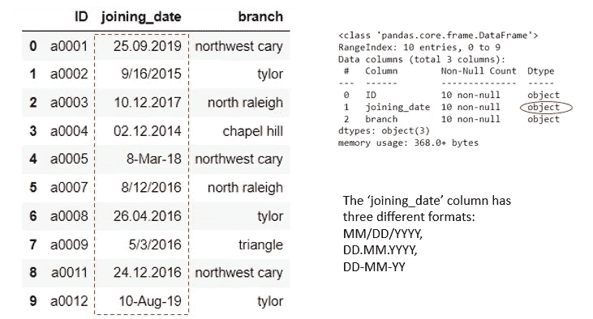
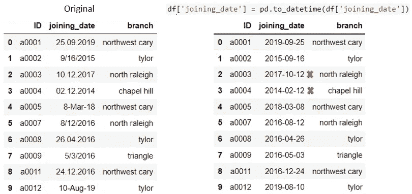
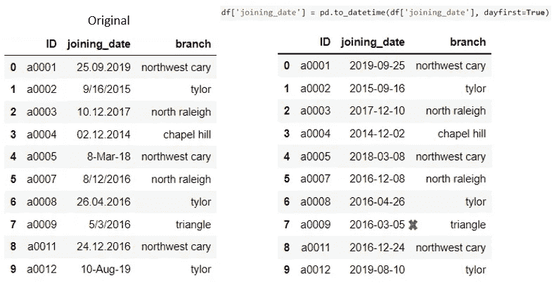
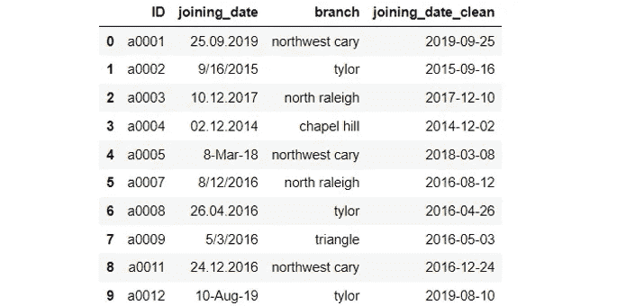
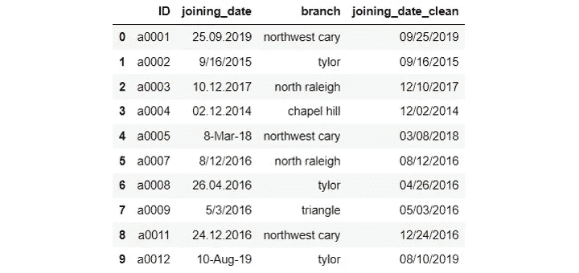

# 清理 Pandas 中格式混乱的日期列

> 原文：<https://towardsdatascience.com/clean-a-messy-date-column-with-mixed-formats-in-pandas-1a88808edbf7>

## 处理 Pandas Dataframe 中混乱的日期字符串列的提示和技巧


图片由 [Pixabay](https://pixabay.com/photos/broom-ragpicker-mop-picker-toilet-1837434/) 提供

如果您的`datetime`列是一个格式混乱的字符串，那么在 Pandas 中使用`datetime`有时会很棘手。您将需要做一些预处理，并将混合格式转换为标准的`datetime`类型，以便执行任何后续的数据分析。

让我们看看下面的例子。在这个数据框架中，我们有一个名为‘joining _ date’的列，它看起来是一个`datetime`列，但实际上是一个字符串列。此外，日期都是以不同的格式排列的。

例如，对于 ID a0001，日期字符串排列在 DD 中。首先写入日期的 MM.YYYY 格式。对于 ID a0005，日期字符串以 DD-MM-YY 格式显示，其中也首先写入日期。对于 ID a0002，日期字符串以 MM/DD/YYYY 格式排列，首先写入月份，这在美国很常见。



作者图片

那么，我们能做些什么来简单有效地清理这个混杂格式的日期字符串列呢？

让我们首先试试 Pandas 的`to_datetime()`方法，它可以很容易地将任何有效的日期字符串解析为`datetime`。如果我们在没有任何附加参数的情况下简单地执行以下操作，我们会得到如下所示的结果:

```
df['joining_date'] = pd.to_datetime(df['joining_date'])
```



作者图片

我们可以看到，使用`pd.to_datetime()`方法，我们能够将混合格式的日期字符串解析为标准格式的`datetime`(默认为 YYYY-MM-DD)。由于`pd.to_datetime()`默认解析月首(MM/DD、MM DD 或 MM-DD)格式的字符串，它将日首格式的日期字符串的日和月混淆了(例如，DD。MM.YYYY 表示带有红色叉号的日期)。

要解决这个问题，我们可以简单地在下面的代码中添加参数`dayfirst=True`:

```
df['joining_date'] = pd.to_datetime(df['joining_date'], dayfirst=True)
```



作者图片

好的。因此，这解决了之前的问题，但产生了新的问题。对于格式为 MM/DD/YYYY(第 7 行)的日期字符串，由于我们将参数`dayfirst=`设置为`True`，因此它将 2016 年 5 月 3 日转换为 2016–03–05，将 5 视为日，将 3 视为月。

为了解决这个新问题，我们可以应用`np.where()`条件，只为首先写入日期的日期字符串设置参数`dayfirst=`到`True`。

```
df['joining_date_clean'] = np.where(df['joining_date'].str.contains('/'), pd.to_datetime(df['joining_date']), pd.to_datetime(df['joining_date'], dayfirst=True))
```



作者图片

有用！现在我们有了一个更加简洁的日期列。请注意，通过使用`dt.strftime()`方法，您还可以指定默认格式之外的输出日期格式。例如，您可以通过指定`dt.strftime(‘%m/%d/%Y’)`来选择将输出日期显示为 MM/DD/YYYY。

```
df['joining_date_clean'] = np.where(df['joining_date'].str.contains('/'), pd.to_datetime(df['joining_date']).dt.strftime('%m/%d/%Y'), pd.to_datetime(df['joining_date'], dayfirst=True).dt.strftime('%m/%d/%Y'))
```



作者图片

这就对了。不需要做任何复杂的字符串操作，我们就可以将原始数据集中杂乱的日期字符串转换成标准的`datetime`列。我希望您学到了一些在 Pandas 中处理混乱的日期字符串列的技巧。感谢阅读，希望你喜欢这个简短的教程。

# 数据源:

本文中使用的样本数据集是作者出于演示目的创建的。

你可以通过这个[推荐链接](https://medium.com/@insightsbees/membership)注册成为 Medium 会员(每月 5 美元)来获得我的作品和 Medium 的其他内容。通过这个链接注册，我将收到你的会员费的一部分，不需要你额外付费。谢谢大家！