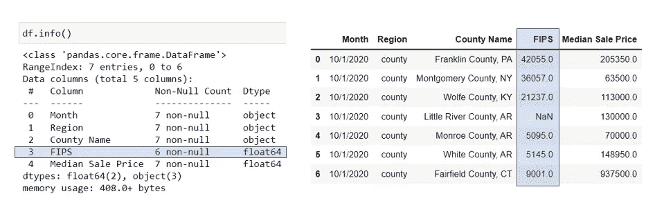
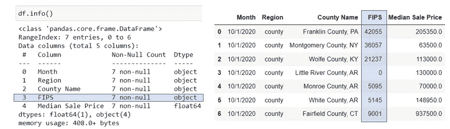
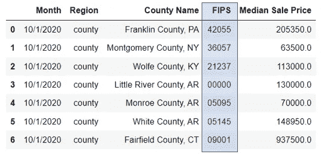
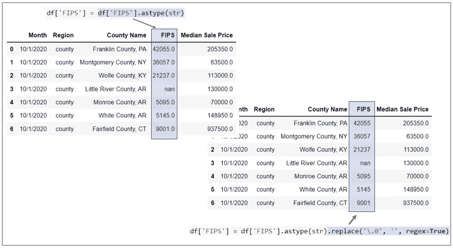
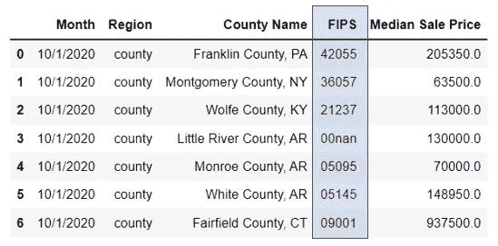
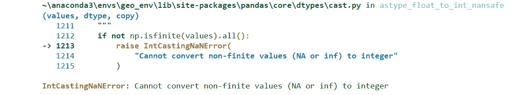

# 清理熊猫数据框中的“数字”ID 列

> 原文：<https://towardsdatascience.com/clean-a-numeric-id-column-in-pandas-dataframe-fbe03c11e330>

## 熊猫初学者的一段方便的代码


图片由 [Pixabay](https://pixabay.com/photos/disinfectant-spray-trigger-5093503/) 提供

作为一名数据科学家，在您的数据科学之旅中，您一定至少遇到过一次这样的问题:您将数据导入到 Pandas dataframe 中，ID 列显示为一个数字(整数或浮点)变量。原始 ID 列中可能有前导零，但由于数据类型为数字，它们已被删除。

这是一个常见的问题，几乎总是需要在进行数据管理和分析任务之前进行处理。如果您计划以后将 ID 字段用作与其他表连接的键，这一点尤其重要。那么如何在 Python 中修复呢？

让我们看一个简单的例子。我们有一个样本数据框架，显示了 2020 年 10 月每个县的房屋销售价格中值。在此数据框架中，我们有一个 ID 字段— FIPS，它是美国每个县的唯一 5 位地理标识符



作者图片

FIPS 字段应该是一个五位数的代码，应该作为字符串导入；相反，它显示为没有意义的浮点类型。我们需要将它改为字符串类型，并添加回前导零。我们可以通过两种方式做到这一点:

## 方法 1:

使用这种方法，我们首先将 FIPS 字段从`float`类型更改为`integer`类型，然后将其更改为`string`。我们可以使用 Pandas 的`DataFrame.astype()`方法来改变数据类型。

```
df['FIPS'] = df['FIPS'].fillna(0).astype(int).astype(str)
```



作者图片

在 FIPS 字段更改为`string`类型后，我们可以添加前导零，使其成为一个五位数代码。我们可以用熊猫的方法来做。

```
df['FIPS'] = df['FIPS'].str.zfill(5)
```



作者图片

## 方法二:

清理 FIPS 字段的另一种方法是首先将其数据类型更改为`string`，然后使用 Python 中的`regex`(正则表达式)来搜索和替换字符串中的某些模式，以便删除小数位。以下代码使用`regex`从 FIPS 列的字符串中删除“. 0”部分。

```
df['FIPS'] = df['FIPS'].astype(str).replace('\.0', '', regex=True)
```



作者图片

然后，我们使用`zfill()`将前导零添加回 FIPS 字段，使其成为一个五位数代码。

```
df['FIPS'] = df['FIPS'].str.zfill(5)
```



作者图片

您还可以选择使用以下代码将所有“00nan”替换为“00000”或其他值，但这是可选的。

```
df['FIPS'] = df['FIPS'].replace('00nan', '00000')
```

我想指出的一点是，在方法 1 中，请确保在使用`astype(int)`更改数据类型之前，使用`fillna(0)`将 FIPS 列中所有缺失的值替换为 0。这是因为如果您的 ID 列(即 FIPS)有缺失值，那么`astype(int)`将无法工作。

例如，如果您使用下面的代码试图将 FIPS 从`float`直接更改为`integer`，您将得到如下所示的回溯错误:

```
df['FIPS'] = df['FIPS'].astype(int)
```



作者图片

总之，通过使用以下两种方法之一，可以很容易地清除带有前导零的“数字”ID 列。这是一个非常常见并且看起来很容易解决的问题，但是对于 python 初学者来说却很难解决。因此，我希望这篇简短的教程和代码对您有所帮助，尤其是对于那些刚刚开始数据科学和 python 之旅的人。感谢阅读！

**方法一:**

```
df['FIPS'] = df['FIPS'].fillna(0).astype(int).astype(str)
df['FIPS'] = df['FIPS'].str.zfill(5)
```

**方法二:**

```
df['FIPS'] = df['FIPS'].astype(str).replace('\.0', '', regex=True)
df['FIPS'] = df['FIPS'].str.zfill(5)
```

## 数据源:

[Redfin 数据中心](https://www.redfin.com/news/data-center/) : Redfin 月度房市数据——县级。这是由全国房地产经纪公司 [*Redfin*](https://www.redfin.com/news/data-center/) *，*提供的一个开放数据集，你可以免费下载，并注明出处供你自己使用。

你可以通过这个[推荐链接](https://medium.com/@insightsbees/membership)注册 Medium 会员(每月 5 美元)来获得我的作品和 Medium 的其他内容。通过这个链接注册，我将收到你的一部分会员费，不需要你额外付费。谢谢大家！