# 清除 AutoML 中的“脏”数据

> 原文：<https://towardsdatascience.com/clean-automl-for-dirty-data-how-and-why-to-automate-preprocessing-of-tables-in-machine-learning-d79ac87780d3>

## **如何以及为什么在机器学习中自动预处理表格**

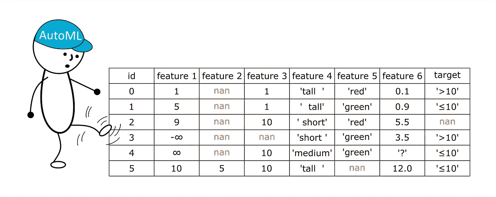

预览图像(按作者)

在本帖中，我们将讨论一个众所周知且被广泛描述的主题，即数据科学中的表格数据预处理。你可能会问，“我们为什么需要它？没什么新鲜的可说！”事实上，还有什么比机器学习模型的表格数据处理更琐碎的呢？但是我们会尝试收集尽可能多的信息到一个最终指南中，并通过自动机器学习(AutoML)的角度给出它。

免责声明:我们下面描述的所有方法都不是唯一的方法。我们在开源 AutoML 框架 [FEDOT](https://github.com/nccr-itmo/FEDOT) 的开发过程中使用过它们。这个项目在架构和开发设计方法上都有自己的特点。我们实现了一个相当大的预处理模块，与框架的主要部分正交。然而，它仍然抓住了图书馆核心的灵魂。言归正传！

## **引言(“我感觉不到我的特征。——他们不在那里！”)**

首先，有必要澄清(以防万一)数据科学中“预处理表格数据”的含义。它是一组转换数据的操作，以便机器学习模型能够正确拟合。广义地说，预处理包括初始数据清理(删除不可读的单元格和列等)。)、消除缺口(插补)、分类特征编码、数据归一化和异常值去除。在这篇文章的下面，我们将只把前三个块称为“预处理”如果您想了解更多关于预处理表格数据的内容，请从[数据预处理:概念](/data-preprocessing-concepts-fa946d11c825)开始，然后继续阅读[数据预处理综合指南](https://neptune.ai/blog/data-preprocessing-guide)。

因此，在我们的团队中，在我们的 AutoML 框架中实现高级预处理的需求(最终变得相当大)并没有立刻出现。起初，我们对最小的功能感到满意:填补空白、编码分类特征、标准化并传递给模型输入。然而，在过去的几个月里，我们的任务是在来自 OpenML、Kaggle 和其他来源(例如，来自资源“Departamento de science ia de computadores”)的大量数据集上运行我们的框架。直到那时，我们才意识到我们之前为框架创造了多么舒适的条件——我们只在干净的数据集上运行框架。因此，该算法无法在超过一半的数据集上启动 AutoML 过程。我们运行了 46 个表格数据集，其中大部分是针对分类任务的。这是我们旅程的起点。


图一。我们通常不得不玩右边的(http://memegenerator.net/)

关于数据集的一些信息:表的大小从很小(对于“输血服务中心”，每 5 列 748 行)到很大(对于“KDDCup99_full”，每 42 列 490 万行)。元素的总数(行数乘以列数)从几千到几亿不等。我们需要所有这些来测试算法在不同数据大小上的性能(图 2)。

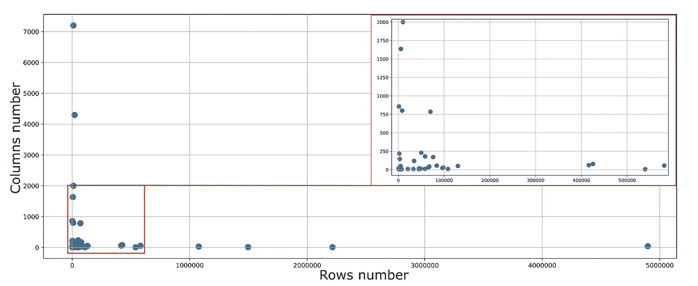

图 2:我们为实验选择的表格数据的维度(图片由作者提供)

除了间隙和大量分类属性的问题之外，这些数据还有一个令人不快的特性，即多种数据类型(如 float 和 string)可以混合在一列中。我们将在下面写下这种邻域导致了什么样的麻烦，但现在，只是总结一下——数据集有一些不允许对数据运行机器学习模型的功能，因为它们没有经过认真的预处理。

实验中使用的数据集的链接:

*   AutoML 基准 OpenML—[https://www.openml.org/search?q=tags.tag%3Astudy_218&type = data&table = 1&size = 39](https://www.openml.org/search?q=tags.tag%3Astudy_218&type=data&table=1&size=39)([术语&引用](https://www.openml.org/terms))
*   4 表 OpenML 大尺寸(> 100 万样本):AirlinesCodrnaAdult，Click_prediction_small，KDDCup99_full，SF-police-incidents—【https://www.openml.org/search?type=data】T4([条款&引用](https://www.openml.org/terms))
*   [https://www . ka ggle . com/adityadesai 13/二手车-数据集-福特-奔驰/tasks？taskId=1258](https://www.kaggle.com/adityadesai13/used-car-dataset-ford-and-mercedes/tasks?taskId=1258) ( [许可证](https://creativecommons.org/publicdomain/zero/1.0/))

**Research("顺便问一下，船上有人知道如何启动 AutoML 吗？")**

在我们开始修改预处理系统之前，我们决定看看其他团队的同事是如何解决类似问题的。诚然，我们要考虑数据中最关键的变化；如果有必要，任何大规模 AutoML 库都会隐式考虑将一维目标数组转换为向量列格式。

让我们从 [H2O 框架开始，它遵循这个结构](https://www.automl.org/wp-content/uploads/2020/07/AutoML_2020_paper_61.pdf)。预处理先于 AutoML 算法的启动。预处理包括经典的绅士工具包:自动类型检测、使用 OneHotEncoding 的分类编码、插补方法以及必要时的归一化。也有可能为某些模型执行可选的预处理—例如，决策树和随机森林模型等不需要标准化。一些有趣的事实:3.28.1.2 的 H2O 版本在 46 个数据集的 24 个上成功运行。

与 H2O 不同，流行的学术 TPOT 框架并不是一个完全“端到端”的解决方案。因此，该库将其大部分预处理留给了用户，而是专注于管道优化。然而，TPOT 结构有输入数据同化的方法。特别是，预处理器检查数据集是否存在缺口，并对其进行估算。有各种标准化和规范化。分类特征和浮点特征的分离是基于列中唯一值的数量来完成的。与 H2O 相反，没有为 TPOT 提供可选的预处理—预处理在模型搜索的进化算法开始之前充当单个块。尽管预处理不是这个框架的强项，但它是广为人知的，而且相当可靠。但是，建议在提交数据之前清理原始数据集。例如，框架不消化数组中存在的字符串数据类型。

LightAutoML 框架也有标准的预处理:填补空白、处理分类特征和不同类型。就框架而言，类型被称为“角色”，其中每个“角色”(数字或分类类型)都有自己的预处理方式。数字特征经历缩放过程。在启动模型之前有几个处理步骤:选择合适的特征和生成新的特征。第一块主要包括预处理方法，如缩放、编码和插补。预处理对模型来说是必须的，但也可能是多种多样的。

自动引导框架实现了[两级预处理](https://arxiv.org/pdf/2003.06505.pdf):独立于模型和特定于模型。这种划分避免了不必要的计算。它还允许保持方法的灵活性。除了标准化、间隙填充和类别编码等经典操作之外，该框架还有一个用于将日期时间索引转换为数字特征的模块。在我们的实验中，自转被证明是最可靠的。

根据我们的简要回顾，我们可以得出结论，最常见的预处理方案是“灵活的”版本。基于模型确定输入数据的变换集。

此处的简要概述并不涉及技术实现的细节。此外，目前的审查可能会失去相关性，因为框架正在被修改。如果不是开发人员，只是在做评审，也很容易遗漏一些细节。因此，如果您发现任何不匹配的地方，并建议对预处理方法的描述进行补充，我们将非常高兴。

## **实现(“像瑞士表一样可靠”)**

故障排除是迭代的；我们一桌一桌地尝试管理图书馆。如果出了问题，我们会改进。决定在将数据输入管道之前，在单独的块中实现预处理。

让我们以下表为例来考虑预处理。假设我们解决了二进制分类的问题，并且表存储在 csv 文件中:

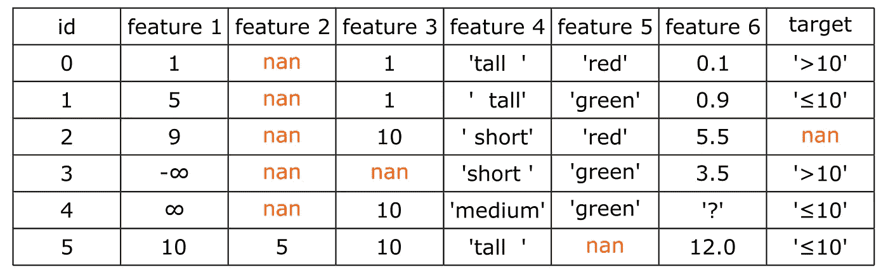

表 1。包含用于解决二元分类任务的要素的表示例(图片由作者提供)

此表中可以突出显示哪些功能:

*   在特征一中，有无穷大的值；
*   功能 2 中缺少太多值；
*   特征 3 中有一个遗漏。还要注意，该特性只取两个可能的值:1 和 10；
*   特征 4 中有三个类别，但是由于行中的缩进，类别数可以定义为 5；
*   特征 5 是二元分类的，并且有遗漏；
*   特性 6 包含数据类型 float 和 string
*   目标变量包含间隙。同时以 raw 标签的形式表示，也就是字符串。

我们开始从左向右移动。首先，用 NaN 替换特征 1 中所有具有无穷大值的单元格。然后，我们移除特征二，因为它包含太多缺失值(我们在框架中的阈值被设置为 90%的对象)。

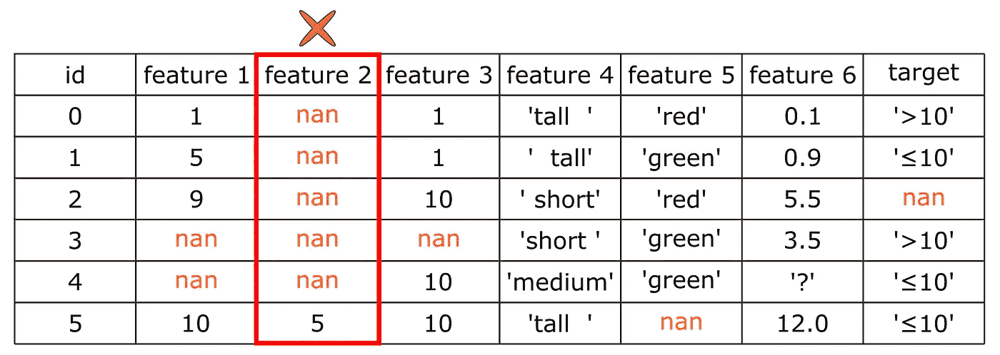

表二。将无效值(正无穷大和负无穷大)转换为 NaN，删除丢失值比例较大的列(图片由作者提供)

之后，我们从训练样本中移除目标未知的对象— id 2。

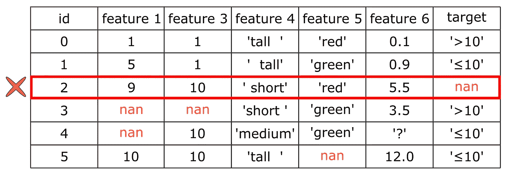

表 3。删除目标列中具有未知值的行(作者图片)

然后应用 LabelEncoder 将标签' > 10 '和' < = 10 '分别翻译为 0 和 1。让我们删除特性 4 中的缩进。

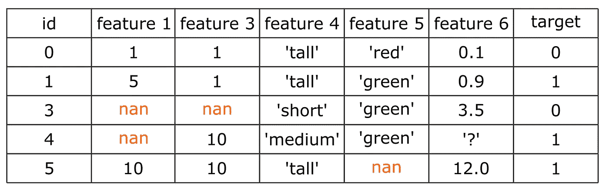

表 4。目标变量编码和前导及尾随空格删除(图片由作者提供)

让我们稍微反思一下。sklearn 中的 OneHotEncoding 实现(我们在 AutoML 中使用)支持处理二进制分类特征和预处理操作在训练样本中没有看到的新类别。第一个意思是，如果表中有一个二进制分类特征，它不会通过扩展到多个列而被扩大。第二个意思是，如果训练样本具有诸如“中等”和“小”的类别，而测试样本具有“大”的类别，那么算法将能够继续而不会产生错误。唯一的问题是这两个选项不能同时工作:必须选择其中之一。我们认为，在处理新类别时，框架不崩溃更重要。

因此，二元分类特征(唯一类别的数量不超过两个)应该单独处理。我们正在用特性 5 做这件事:把值转换成“1”和“0”。

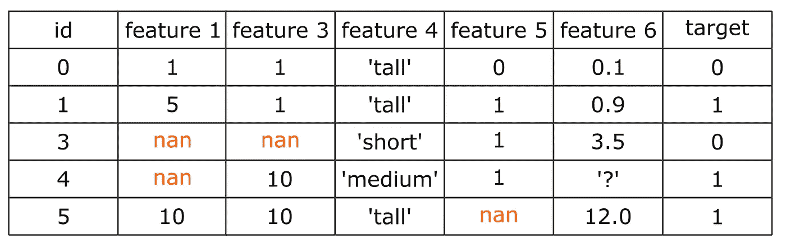

表 5。二进制分类特征的编码(图片由作者提供)

最后是功能 6。来自类型处理系统的输出也是作为预处理的一部分实现的，这是至关重要的。它对所有列都是一样的。但是首先，让我们定义这个问题:一个具有浮点值的特性有一个“？”sign，当加载这样的数据帧时，发现熊猫已经小心翼翼地将所有数字转换成字符串。但是，如果列中唯一值的数量很大，并且使用一种热编码进行编码，那么您会对结果表的大小感到惊讶。

使用 map 函数，我们查看列中的每个元素，并确定该列包含什么类型的数据。在本列的例子中，唯一值的数量比分类特征中应有的数量要多得多(可能在上面的特定片段中没有，但是如果表稍微大一点，您会马上看到)。然后，算法会尝试将列转换为 float 类型，同时将所有无法转换为此类型的值标记为 nan(请参见“？”)在表 6 中签名)。

我们以这样的方式通过每一列，每一个单元格。因此，当预处理结束时，我们就有了表中每一列的汇总信息，这些关于类型的知识会进一步用于各种数据处理模型和算法。

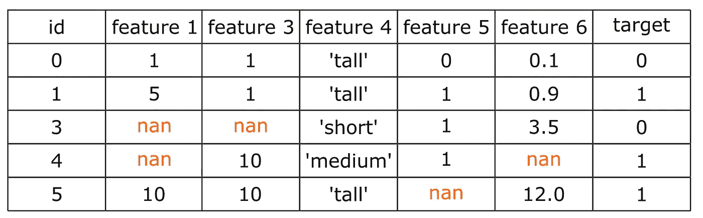

表 6:处理混合数据类型的列。替换“？”带有缺失值的签名(图片由作者提供)

尽管已经做了很多工作，但数据中仍然存在差距和分类特征。是的，这就是目标。现在我们继续第二步，额外的预处理步骤，允许对特征进行编码并消除间隙。

## **又一个实现(“你不能处理差距！”)**

一旦数据经过必要的预处理，AutoML 的核心——进化算法——就启动了。正是这个“引擎”产生了多个管道。他们中的每一个都被给定了原始的预处理数据。请记住，数据只是经过了强力清理，仍然包含间隙和字符串数据类型。因此，对每个生成的模型应用不同的预处理步骤。

预处理表的主要目的是防止模型因错误而崩溃。让我们看看填补空白的例子。如果算法“理解”如果间隙没有被填充，则管道不能被拟合，则应用默认的间隙填充策略。如果管道结构中的模型可以拟合有间隙的数据，则该表将进一步未经处理。那么问题来了，“那么为什么不立即预处理数据，填补空白，并应用编码器呢？比较靠谱。”事实是，有相当多的方法来填补空白，并且许多[不止两种编码方式](/beyond-one-hot-17-ways-of-transforming-categorical-features-into-numeric-features-57f54f199ea4)。将搜索空间限制为只有一种预处理方式不是一种灵活的方法；— AutoML 算法将计算出如何最好地转换数据，以获得最准确的模型。

模型识别期间的专家推理是相似的——转换由要解决的任务的细节和数据集的特征决定:例如，用中值、平均值填充间隙，或者创建指标变量的[。如果有必要，专家可以拒绝在模型中包含不合适的预处理方法，而只使用默认的转换。](https://www.coursera.org/lecture/sas-predictive-modeling-using-logistic-regression/missing-value-imputation-with-missing-value-indicator-variables-ZyOaD)

管道结构分析基于从每个主节点(左边的那些)到根节点的图形的顺序遍历。根节点总是唯一的，位于右边的图中(图 3)。在这种情况下，操作由标签分为:

*   可以处理数据并解决问题(例如，是否存在差距)；
*   可以跳过数据，但不消除误差源；
*   当对数据执行操作导致错误时。

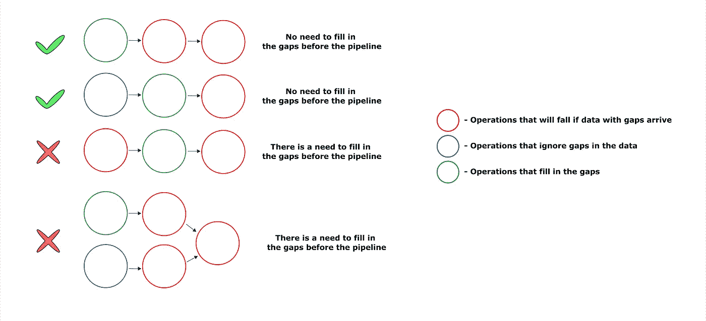

图 3。分析复合管道结构，对表格数据中出现的间隙示例进行额外预处理(图片由作者提供)

图中显示了不同的管道配置。如果复合管道在其结构中包含同化具有间隙和分类特征的数据的操作，则不执行预处理。否则，它将应用默认策略。

上述方法允许解决方案的灵活性。自动识别复合模型结构的算法可以找到最佳的预处理方法和模型配置组合。在流水线结构搜索过程中，预处理操作可以用类似的操作来代替。如果该模型足以产生令人满意的预测误差来产生默认预处理，则将仅基于这些模型来构建复合模型。

假设管道中没有预处理操作，默认情况下，算法需要填充间隙并对分类值进行编码。首先，让我们处理一下差距:它们存在于特性 1、3、5 和 6 中。对于第 1 列和第 6 列，通常的策略是用平均值来填补空白。第 3 列和第 5 列更有趣:这些列包含数值，但是这些列中的指标可以接受的唯一值的数量不超过两个。你知道有多少数字特征只包含两个值？—让我们假设—一个特征最有可能表示一个对象中某种东西的存在或不存在。例如，物体要么有尾巴，要么没有。这里不需要输入半色调。所以在这样的列中，让我们用多数类来填充值。如果类别的数量相等(这种情况很少发生)，那么无论如何都会用二元特征的平均值来填充间隙。

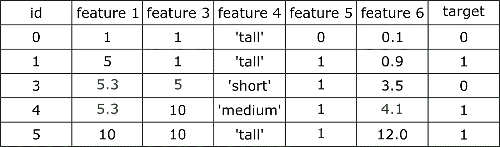

表 7。默认情况下填充表格中的间隙(恢复的值以绿色显示)(图片由作者提供)

使用分类值 I 更简单—默认的编码策略是 OneHotEncoding(表 8)。

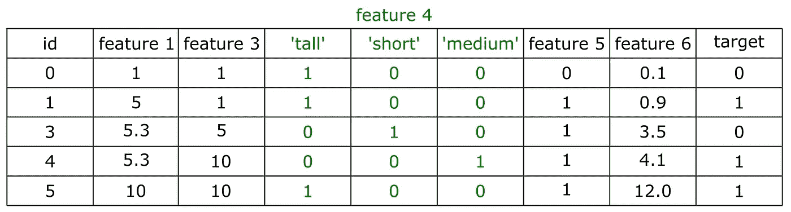

表 8。转换分类特征(作者图片)

## **决赛(“坦白说，亲爱的，我一点也不在乎”)**

让我们复制我们在 AutoML 框架中开发预处理块时实现的所有调整。

因此，预处理分为两个层次:强制的和可选的。第一个是永远永远适用于所有数据。第二种方法仅在管道结构中没有模型来吸收数据时进行，以便在尝试训练管道时不会出现错误。

必修模块包括:

*   用 nan 替换特征和目标列中的值 infinity。
*   移除缺失值数量超过 90%的要素
*   从表中移除目标变量值未知的要素(目标中有 NaN)
*   将目标列中的标签从字符串格式转换为整数格式
*   消除特征中字符串对象的缩进
*   不同数据类型的列同化包括检测混合类型的列，并将它们转换为多数类型、任何可能的类型，或者从表中删除一列。

可选模块:

*   间隙填充作业的管道结构分析——必要时进行间隙填充
*   分类编码操作的管道分析-如果需要，应用编码

上面的修改允许框架在提到的数据集上运行(甚至在最可怕的数据集上),完全符合章节标题中的短语。

我想停下来想一想。以上描述的都是复杂的技术任务(不是开玩笑)。但是它对研究人员或商业客户有吸引力吗？—可能不会。所有这些对数据的大惊小怪通常希望尽快被跳过，并转移到模型开发，因为这是最令人兴奋的部分。想象一下，以这种方式预处理数据需要编写多少代码。所以把所有的预处理留给 AutoML 算法不是更好吗？

请注意，有时您希望自己构建模型，而不是将最激动人心的部分交给 AutoML 算法。然后，您可以通过为 FEDOT 编写以下代码行来分配所有预处理:

```
import numpy as np
from fedot.core.data.data import InputData
from fedot.core.pipelines.node import PrimaryNode
from fedot.core.pipelines.pipeline import Pipeline
from fedot.core.repository.dataset_types import DataTypesEnum
from fedot.core.repository.tasks import Task, TaskTypesEnumtrain_input = InputData(
idx=np.arange(0, len(features)),                
features=features, target=target, task=Task(TaskTypesEnum.classification), data_type=DataTypesEnum.table
)pipeline = Pipeline(PrimaryNode('scaling'))
pipeline.fit(train_input)
preprocessed_output = pipeline.predict(train_input)
transformed_data = preprocessed_output.predict
```

Pipeline 会自动启动数据处理器，输出会经过预处理和标准化，可以作为实验的基础。默认情况下会进行预处理。考虑到数据可能是什么，这可以在模型开发过程中节省大量时间。

## **结语。实验(“数据集就像一盒巧克力。你永远不知道你会得到什么。”)**

因为在所有的表上运行这个框架需要很多时间，所以我们在[汽车碰撞测试库](https://github.com/ITMO-NSS-team/automl-crash-test)中准备了一个小的玩具数据集。用于解决分类任务的表相对较小，但它是我们在所有 46 个数据集上运行期间遇到的所有糟糕事情的一般化表示。

如果你想在这些数据上运行你喜欢的框架，欢迎你。只有通过正确地预处理至少一些列、丢弃所有不必要的列并保留必要的列，才能为此表的测试样本键入 ROC AUC 1.0。通过这样的碰撞测试并不像看起来那么容易。而且拿到一个好成绩(ROC AUC 1.0)是很棒的成绩。

下面是对这些数据运行 FEDOT 框架(版本 0.5.2)的示例。运行该脚本的结果非常好——没有出现任何错误，并且我们可以获得最终的解决方案。存储库中还有运行它的所有代码和依赖项。

```
train_features, train_target = get_train_data()
test_features, test_target = get_test_data()# Task selection, initialisation of the framework
fedot_model = Fedot(problem='classification', timeout=timeout)# Fit model
obtained_pipeline = fedot_model.fit(features=train_features, target=train_target) 
obtained_pipeline.show()# Evaluate the prediction with test data
predict = fedot_model.predict(test_features)
predict_probs = fedot_model.predict_proba(test_features)
```

测试部分的最终指标是 1.0 ROC AUC。

## **结论(“一个男孩最好的朋友是他的汽车。”)**

综上所述，AutoML 中实现的上述所有转换都不是最先进的技术。然而，它们的成功结合使得运行机器学习模型成为可能，即使在表格数据是“垃圾”的情况下。

值得记住的是，所有实现的算法都是在修改 AutoML 框架时开发的。一个好的 AutoML 框架必须在初级数据科学家不能快速可靠地工作的地方可靠地工作(或者可以，但不是非常可靠或非常快速)。如果这种预处理适用于我们的模型，那么它也适用于您的模型。

有用的链接:

*   [FEDOT 框架的开源 AutoML 库](https://github.com/nccr-itmo/FEDOT)
*   [包含“脏”表的存储库自动崩溃测试](https://github.com/ITMO-NSS-team/automl-crash-test)

在一次带有预处理表格数据指南的表演中，参与的有:[米哈伊尔·萨拉法诺夫](https://github.com/Dreamlone)和 [NSS 实验室团队](https://itmo-nss-team.github.io/)。