# 使用 AWS Glue DataBrew 清理和规范化数据

> 原文：<https://towardsdatascience.com/cleaning-and-normalizing-data-using-aws-glue-databrew-b31fb1075302>

## 使用 AWS DataBrew 自动清理数据，无需编写任何代码

斯蒂芬·道森在 [Unsplash](https://unsplash.com/s/photos/data-pipeline?utm_source=unsplash&utm_medium=referral&utm_content=creditCopyText) 上拍摄的照片

任何数据管道的主要部分都是数据的清理。根据项目的不同，清理数据可能意味着很多事情。但是在大多数情况下，这意味着将数据规范化，并将数据转换成项目中可以接受的格式。例如，可以从时间戳列中提取日期和时间成分到多个列中，转换字符串列的大小写，或者[标签编码](https://blog.contactsunny.com/data-science/label-encoder-vs-one-hot-encoder-in-machine-learning)。

我们为此编写代码，然后使用 [Apache Airflow](https://blog.contactsunny.com/data-science/getting-started-with-apache-airflow) 等工具设计一个自动化的管道。我们已经这样做了很多年了。但是，随着我们将越来越多的处理和管道转移到云中，我们可以通过使用云基础设施提供商提供的工具来实现这些数据清理结果。通常，这样的工具不需要任何编码。作为一名开发人员，我可以看到这是如何威胁到我的工作的。但我不想卷入这场争论，因为我认为这是没有实际意义的。

无论如何，在这篇文章中，我们将看看 AWS Glue DataBrew，以及我们如何使用它来清理数据集。对于这个 [POC](https://blog.contactsunny.com/proof-of-concepts-pocs) ，我使用 S3 来存储输入和处理后的输出(主要是因为这是我看到的最简单的选项)并使用 NYC OpenData 数据集。更具体地说，我使用的是[机动车碰撞——碰撞](https://data.cityofnewyork.us/Public-Safety/Motor-Vehicle-Collisions-Crashes/h9gi-nx95)数据集。

# 什么是 AWS Glue DataBrew？

我们已经知道 AWS Glue 是一个用于设计提取、转换和加载(ETL)管道的工具。它为创建和运行 ETL 作业提供了很多特性。DataBrew 领先一步，提供了清理和转换数据的功能，为进一步处理或输入机器学习模型做好准备。

DataBrew 提供了 250 多种转换。这些包括过滤数据、转换格式或将数据转换为标准格式、修复数据问题、使用 regex 从列中提取数据等等。最棒的是，这些转换在 DataBrew 中已经可用，这意味着我们不需要编写任何这些转换的代码。

这样做的好处是，数据分析师可以自己设计转换管道，而不必等待开发人员对转换进行编码。您可以在管道的任何阶段应用这些转换，尤其是如果您已经有一个 Glue ETL 作业的话。

这里的另一个优势是所有这些都是无服务器的。这意味着您只需为您使用的东西付费，当管道不运行时，您不需要为任何东西付费。此外，它可以根据传入的数据量自动扩展。

现在，让我们从 DataBrew 开始吧。我们首先要创建一个新项目和一个配方。然后我们将下载样本数据集并上传到 DataBrew。然后，我们将应用一些转换，并创建一个作业来对整个数据集运行转换。最后，我们将看到转换后的数据是什么样子。

# AWS Glue DataBrew 入门

# 创建项目

首先，前往 [AWS Glue DataBrew 控制台](https://console.aws.amazon.com/databrew/home?region=us-east-1#create-project)并创建一个新项目。接下来，提供一个项目名和一个配方名，如下面的截图所示。

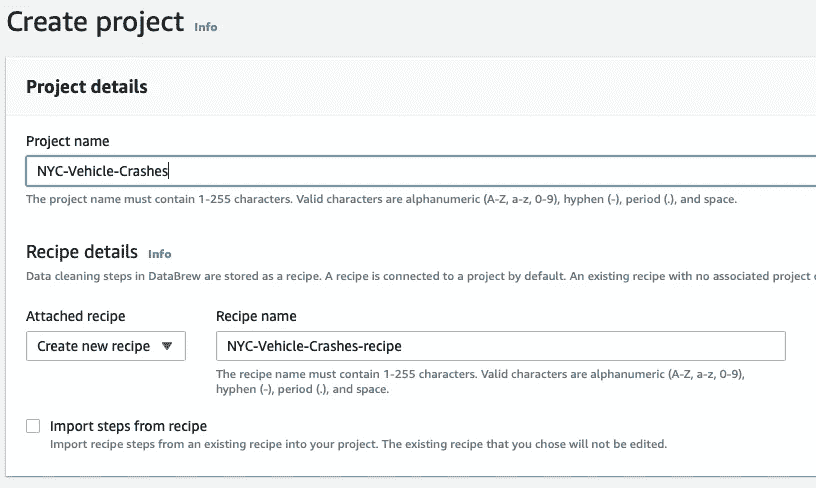

作者图片

对于此概念验证，我们可以将所有配置保留为默认值。为项目和配方命名后，向下滚动到*选择数据集*部分，上传样本 CSV 数据集。如果你还没有下载样本数据集，你可以从纽约市开放数据网站[这里](https://data.cityofnewyork.us/Public-Safety/Motor-Vehicle-Collisions-Crashes/h9gi-nx95)获得。

在*选择数据集*部分，选择屏幕右侧的*新数据集*选项。为数据集提供一个名称。然后在*连接到新数据集*选项中选择*文件上传*选项。你可以在下面的截图中看到这个配置。

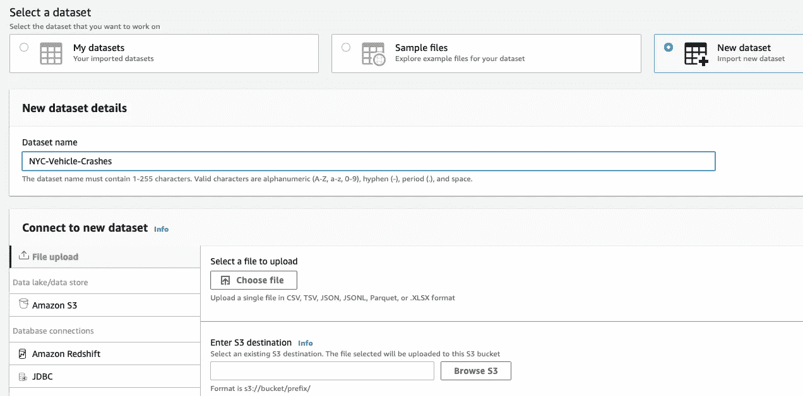

作者图片

在*输入 S3 目的地*选项中，选择用于存放源数据和转换数据的 S3 存储桶。如果您没有为此创建的存储桶，您可以从这里自己创建。

最后，向下滚动到页面底部，单击*创建项目*按钮创建项目。这将需要一些时间，因为文件必须首先上传到 S3 桶，然后必须提供一堆资源，并且还必须预览文件。在此期间，您会看到一个进度指示器，如下所示:

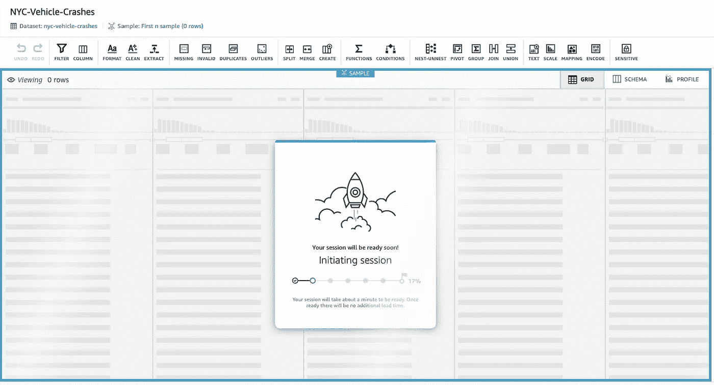

作者图片

# 应用变换

准备好数据后，您将看到数据以表格形式呈现，在表格顶部有一堆选项。在这里，我们可以选择单个行，选择转换，预览结果，然后应用转换。此外，我们还可以操作列，如复制列、拆分列等。这些确实算作转换，但我只是想明确地把它们叫出来，因为它们是非常普遍应用的转换。

我们将从第一列开始应用转换，即*崩溃日期*列*。*在大多数分析用例中，我们会希望在几年内汇总一些数据。我们通常有时间戳列，从中我们可以提取查询中的年份部分。但是如果我们有一个专用于 year 值的列，查询会更容易和高效。所以我们现在将从日期列中提取年份，并将其保存为一个名为*崩溃年份*的新列。

为此，选择该列，单击该列右上角的三个点，选择*提取*菜单，然后选择*日期时间值*选项。这将在页面右侧打开一个新的配置窗格，如下面的屏幕截图所示:

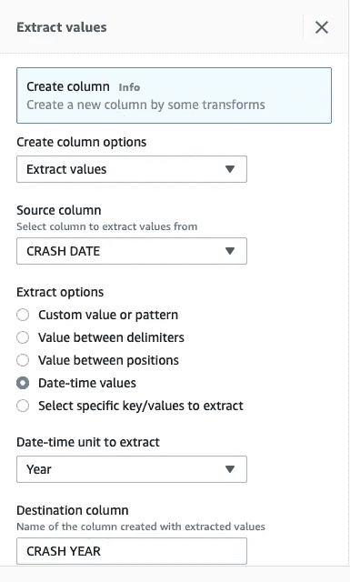

作者图片

这里，*创建列选项*、*源列*和*提取选项*部分应该已经被填充。在*提取*的日期时间单位部分，从下拉菜单中选择*年份*，输入*车祸年份*作为*目的列*字段值。这将创建一个名为*撞车年份*的新列，其中年份部分是从日期列中提取的。点击底部的*预览*按钮预览更改。这应该会向数据集添加一个新列，如下面的屏幕截图所示。

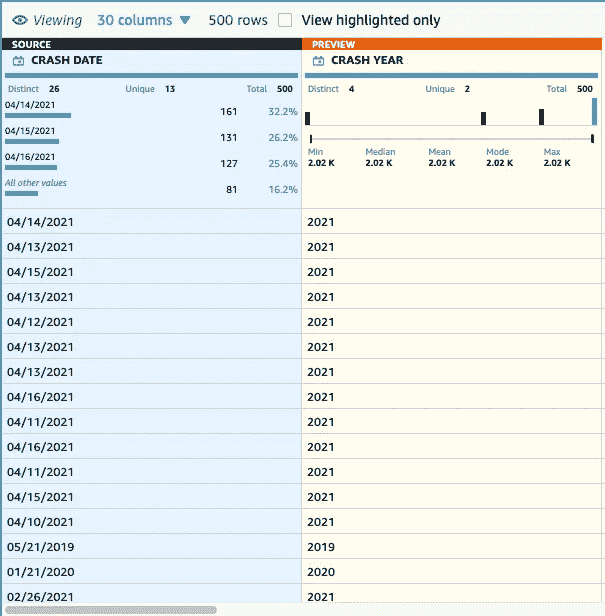

作者图片

点击*应用*按钮应用转换。

接下来，我们将转换*崩溃时间*列，将其格式化为 *HH:MM* 格式。它已经是标准格式了。但是为了实验起见，我们还是要这样做。所以我们再重复一遍同样的过程。点击栏右上角的三个点，选择*格式*菜单，然后点击*日期时间格式*菜单。然后向下滚动到子菜单的末尾，选择*更多选项*。这将打开一个类似的配置窗格，我们在前面提取 year 组件时看到了这个窗格。使用下面的屏幕截图作为配置此转换的参考。

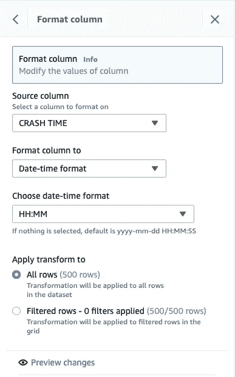

作者图片

单击*预览更改*选项，查看应用变换后的差异。应该和下面的截图差不多。最后，点击*应用*按钮来应用转换。值得注意的是，这些更改不会在点击*应用*按钮后立即应用。apply 按钮将只保存转换，以便我们可以随时返回并更改它。只有在我们运行作业之后，转换才会更改数据。

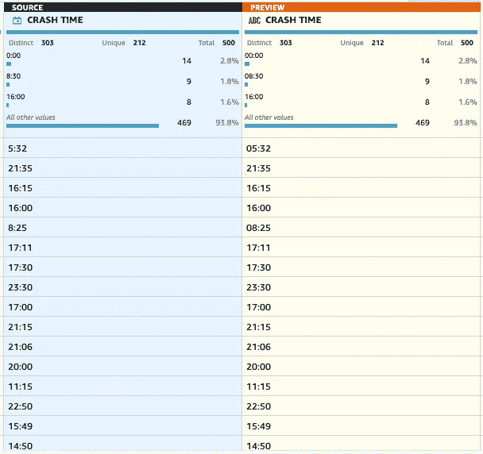

作者图片

现在，我们将最后的转换应用到另一列。对于机器学习用例，我们需要尽可能多地消除文本列。在我们处理分类数据的情况下，我们可以将它们映射到数字上，以确保机器学习模型不会产生任何偏见。在我们的数据集中，我们有一个这样的列— *促成因素车辆 1。*将文本、分类数据转换成数字的过程称为分类映射。还有另外一种方法，叫做[一个热编码](https://blog.contactsunny.com/tech/label-encoder-vs-one-hot-encoder-in-machine-learning)。

Glue DataBrew 提供了这两种选项。单击列右上角的三个点，打开上下文菜单并滚动到末尾，您将看到*分类映射*和*一键编码列*选项。对于这个例子，我们将使用分类映射。所以选择菜单打开配置面板。匹配如下图所示的配置。

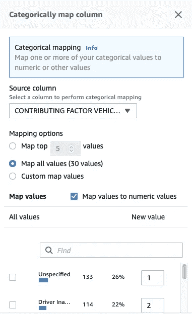

作者图片

点击*预览更改*按钮预览更改，应该如下所示:

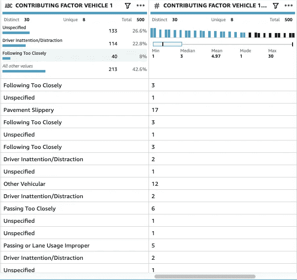

作者图片

再次点击*应用*按钮，应用该转换。我们应该会看到添加了映射值的新列。现在，对于一个实际的项目，这种转换对机器学习没有太大帮助，因为数值会让模型认为这是某种排序而不是分类数据。我们需要使用一次性编码。但是在这个例子中，我们将坚持这样做。

之后，点击工作台右上角的*制作方法*按钮。现在，您应该可以看到我们应用于数据集的所有转换。它应该看起来类似于下面的截图。

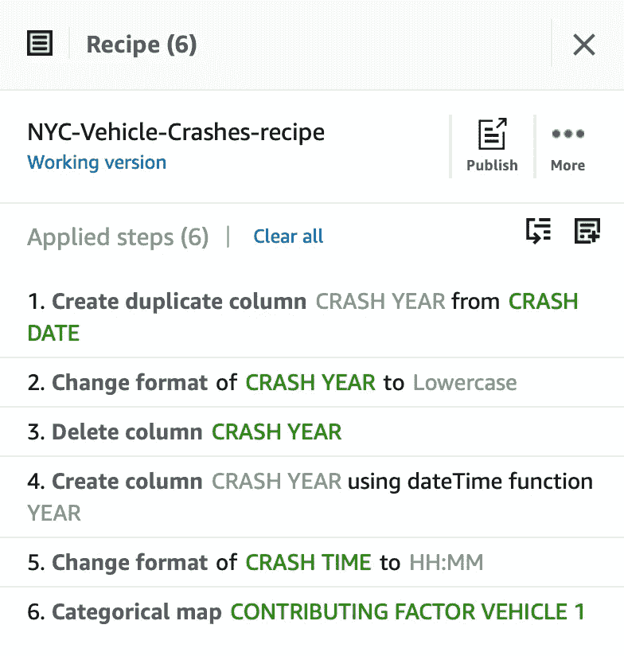

作者图片

从这里，我们应该能够轻松地编辑或删除这些食谱。我们甚至可以从这个面板中添加一个新的转换。当我们想在一个地方检查应用到数据集的所有转换时，这非常方便。

# 运行作业

我们现在终于准备好运行作业，将所有这些转换应用到整个数据集。您应该会在页面右上角看到*运行作业*按钮。点击那个按钮，现在休息一下。这需要几分钟才能完成。

与此同时，我们可以查看数据谱系来可视化和理解完整的管道。点击*运行任务*按钮右侧的*沿袭*按钮。在这里，您将看到来自 S3 时段的数据流，通过转换配方，然后返回到 S3 时段。它应该看起来类似于下面的截图所示。

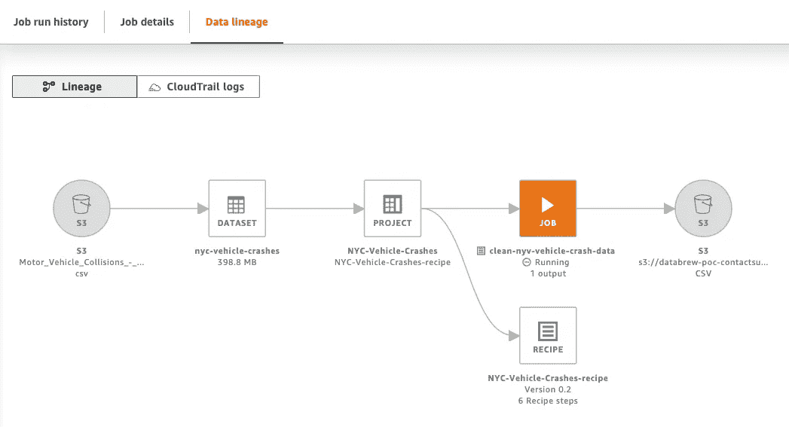

作者图片

您可以看到，我们有一个数据集是从 S3 存储区中的源文件创建的。从该数据集中，我们有一个包含六个配方的项目。这六种配方目前正通过作业应用于数据集，最后，转换后的数据将保存回 S3 存储桶。

# 好了

差不多就是这样。我重复一遍，这不是典型的生产流水线。通常，数据源通过 Kinesis DataStream 等工具流入系统。通过微批处理即时应用转换，并存储在数据仓库中。但是如果用例是用于批处理，S3 可能是源。

尽管如此，这个练习应该可以帮助您开始使用 DataBrew，并探索该工具的高级转换功能。如果这个工具没有提供你需要的转换，或者如果你需要添加一个定制的转换，你总是可以使用 [Lambda 函数](https://blog.contactsunny.com/?s=lambda)。

AWS 有很好的工具来创建带有转换的数据管道、数据湖和仓库、机器学习模型等等。您可以点击[这里](https://blog.contactsunny.com/?s=aws)查看更多资源、入门指南和 AWS 服务的概念验证。如果你想让我为你探索一个特定的工具或服务，请在评论中告诉我。

如果你喜欢你在这里看到的，或者在我的个人博客上看到的。要写博客，并希望在未来看到更多这样有用的技术帖子，请考虑在 [Github](https://github.com/sponsors/contactsunny) 上关注我。

*原载于 2022 年 1 月 17 日 https://blog.contactsunny.com***。**

*[1] NYC OpenData —纽约警察局[https://data . cityofnewyork . us/Public-Safety/Motor-Vehicle-Collisions-Crashes/h9gi-nx95](https://data.cityofnewyork.us/Public-Safety/Motor-Vehicle-Collisions-Crashes/h9gi-nx95)*