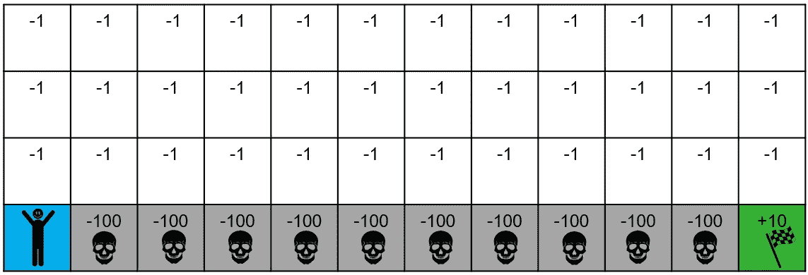
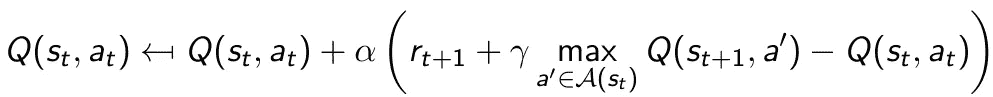
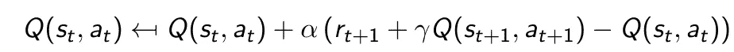
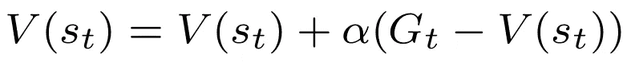
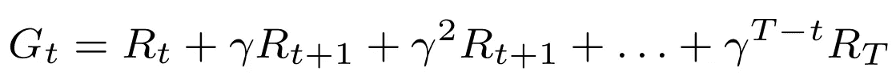
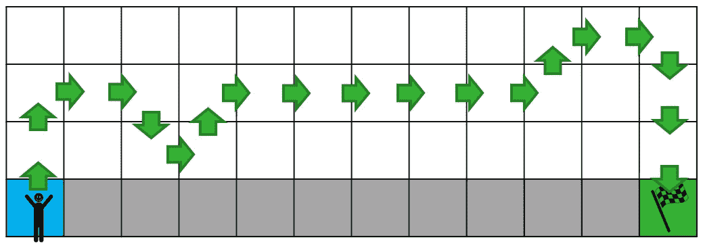
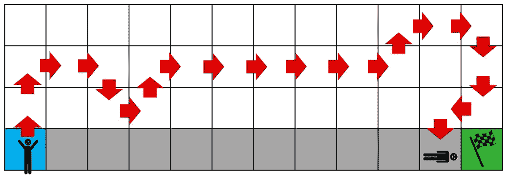
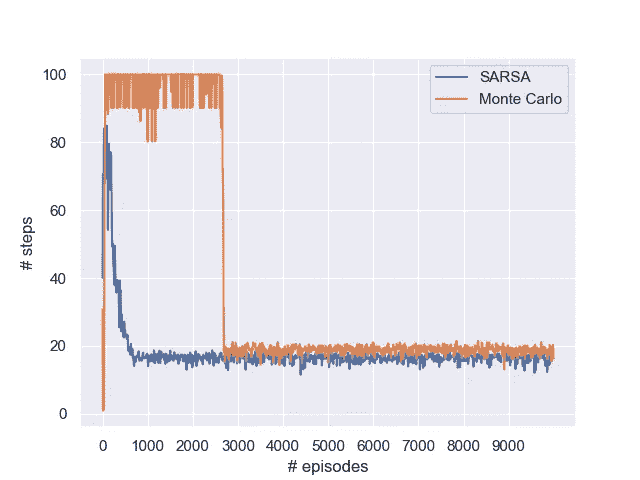
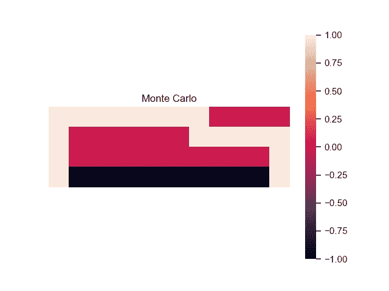
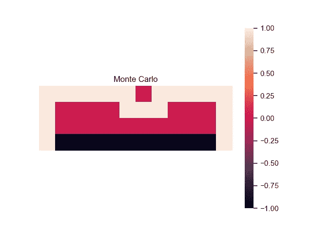

# 蒙特卡洛强化学习的悬崖行走

> 原文：<https://towardsdatascience.com/cliff-walking-with-monte-carlo-reinforcement-learning-587e9d3bc4e7>

## TD(0)和 TD(1)学习的比较，包括完整的 Python 实现

玛丽安·布兰德在 [Unsplash](https://unsplash.com?utm_source=medium&utm_medium=referral) 上的照片

新的一年，新的悬崖行走算法！这一次，**蒙特卡洛强化学习**将被部署。可以说，这是强化学习最简单、最直观的形式。本文将该算法与时间差分方法(如 Q 学习和 SARSA)进行了对比。此外，还提供了完整的 Python 实现，并显示了一些数值结果。

# 悬崖漫步问题

悬崖行走问题是一个教科书问题(萨顿和巴尔托，2018 年)，其中一个代理试图从左下瓦片移动到右下瓦片，旨在最大限度地减少步骤数，同时避免悬崖。一集在走进悬崖(大负奖励)或在目标瓦片上(正奖励)时结束。

悬崖漫步世界[图片由作者提供]

# 蒙特卡洛强化学习

蒙特卡洛 RL 还有其他几个名称(技术上有一些细微的区别，但我们可以忽略不计)，包括:

*   **双重传递**:首先向前传递直到剧集结束，同时收集奖励，然后向后传递以更新所有遇到的状态的值函数。
*   **向后传递**:这个术语强调向后机制，在情节中遇到的所有状态上循环返回。
*   **时间差 1 或 TD(1)** : TD(0)指的是在每个时间步长之后发生的更新，TD(1)在整个轨迹之后更新。

我并不偏爱这两个名字，但是在本文的剩余部分，我将坚持使用蒙特卡罗 RL (MC-RL)。

无论如何，核心概念是首先完成**完整体验轨迹**——在这种情况下，这些步骤一直走到达到目标或跌入悬崖——然后才继续更新查找表。

MC-RL 和**时间差分方法**如 Q-learning 和 SARSA 的根本区别在于，后者在每个时间步长后更新查找表，使用*估计值* `Q(s_t+1,a)`更新`Q(s_t,a_t)`。这个过程也称为引导；一个估计用于更新另一个。作为复习，以下是更新功能:

q-学习更新公式(非政策)

SARSA 更新公式(根据政策)

相比之下，MC-RL 仅利用轨迹的*实际*观测值来更新查找表。关键的好处是使程序**无偏**；为了直观起见，假设观察值是从相应的概率分布中随机抽取的。特别是当 Q 值由近似函数表示时——当问题变大时，这通常是不可避免的——偏差会严重影响性能。然而，MC-RL 奖励轨迹表现出更大的**方差**，因此通常学习(慢很多)。

价值函数`V(s_t)`的更新函数非常简单，简单地计算观察到的回报轨迹`G_t`和价值函数`V(s_t)`之间的误差，用权重`α`进行更新:

蒙特卡罗强化学习的更新函数

其中累积奖励轨迹`G_t`(下游奖励除以`γ`)由下式给出:

累积奖励函数

机制非常全面和直观，但让我们考虑一些并发症。看看下面两个轨迹示例:

成功轨迹。在目标状态下产生的积极回报会反向传播到轨迹中的所有状态。[图片由作者提供]

失败的轨迹。在悬崖状态产生的负回报会反向传播到轨迹中的所有状态。[图片由作者提供]

尽管轨迹几乎相同，但一个轨迹会导致所有遇到的状态的正奖励更新，而另一个轨迹会导致负奖励更新。如前所述，蒙特卡罗方法的**方差**往往非常高，因为累积奖励可能会有很大差异。上述情况对 TD(0)学习的影响要小得多。

此外，以次优解决方案告终的风险也在增加。对于这个特定的问题，代理可能只坚持一条路径，仅仅因为它曾经发现过这条路径。由于这些图块具有较高的值，代理可能会一遍又一遍地遵循相同的路径。

# 数值实验

这里介绍的蒙特卡罗方法是**政策上的**，这意味着它使用实际观察到的奖励来更新估计值。因此，一个公平的基准是 SARSA，它也是根据政策原则运作的。像往常一样，Python 源代码可以在我的 [GitHub 库](https://github.com/woutervanheeswijk/cliff_walking_public)中找到。

注意到的第一件事是，使用标准探索率`ϵ=0.05`，MC-RL 通常不会在 10，000 集内收敛到令人满意的解决方案。我把它提高到`ϵ=0.10`，为了公平起见，对 SARSA 也做同样的事情。

事不宜迟，该出结果了。显然，蒙特卡罗 RL 比 SARSA 表现差得多，需要更长的时间来收敛，并且经常坚持更差的路径。急剧下降意味着代理继续遵循第一条成功的路径，之后几乎没有改善。

SARSA 和蒙特卡罗 RL 的比较。SARSA 通常收敛得更快，并且经常找到更好的解决方案。[图片由作者提供]

相应的解决方案也往往表现出一些奇特的模式。上了政策，自然要绕道悬崖(由于正面`ϵ`)。然而，也有一些模式显然没有理性基础。

使用 MC-RL 学习路径的示例[图片由作者提供]

使用 MC-RL 学习路径的示例[图片由作者提供]

尽管直觉很吸引人，但方差问题确实阻碍了 MC-RL 快速识别好的解决方案。如果有的话，这些结果说明了为什么时间差异学习方法已经成为基于价值的强化学习的标准。

# 外卖食品

*   蒙特卡洛强化学习(或 TD(1)，双通)基于观察到的**完全回报轨迹**更新价值函数。
*   与时间差异学习方法(如 Q-learning 和 SARSA)相比，MC-RL 是**无偏的、**，即，值更新不受值函数的不正确先验估计的影响。
*   由于奖励轨迹的**高方差**，MC-RL 通常比时间差异学习花费更长的时间来收敛。

*蒙特卡洛强化学习算法的完整代码可以在我的* [*GitHub 资源库*](https://github.com/woutervanheeswijk/cliff_walking_public) *上找到。*

*也来看看我这个系列的其他文章吧！*

***-Q-learning****:*

 [## 用非策略强化学习走下悬崖

### 政策外强化学习和政策内强化学习的深入比较

towardsdatascience.com](/walking-off-the-cliff-with-off-policy-reinforcement-learning-7fdbcdfe31ff) 

***离散政策梯度*** *:*

 [## 基于离散策略梯度算法的悬崖行走问题

### 用 Python 实现了一个完整的增强算法。手动执行这些步骤来说明内部…

towardsdatascience.com](/cliff-walking-problem-with-the-discrete-policy-gradient-algorithm-59d1900d80d8) 

***深度政策梯度*** *:*

 [## 悬崖漫步的深度政策梯度

### 用 Python 实现 TensorFlow 2.0。在这个解决方案中，参与者由一个神经网络来表示，它是…

towardsdatascience.com](/deep-policy-gradient-for-cliff-walking-37d5014fd4bc) 

***深度 Q-学习*** *:*

 [## TensorFlow 2.0 中深度 Q 学习的最小工作示例

### 一个多臂土匪的例子来训练一个 Q 网络。使用 TensorFlow，更新过程只需要几行代码

towardsdatascience.com](/a-minimal-working-example-for-deep-q-learning-in-tensorflow-2-0-e0ca8a944d5e) 

# 参考

鲍威尔(2007 年)。*近似动态规划:解决维数灾难*(第 703 卷)。约翰·威利的儿子们。

萨顿和巴尔托(2018 年)。*强化学习:简介*。麻省理工出版社。