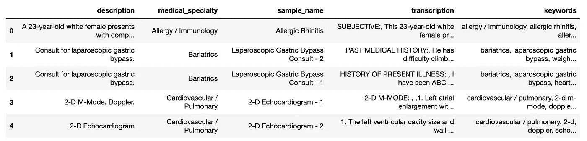
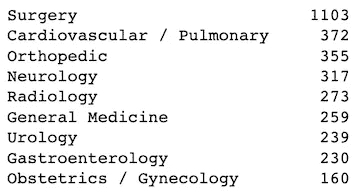
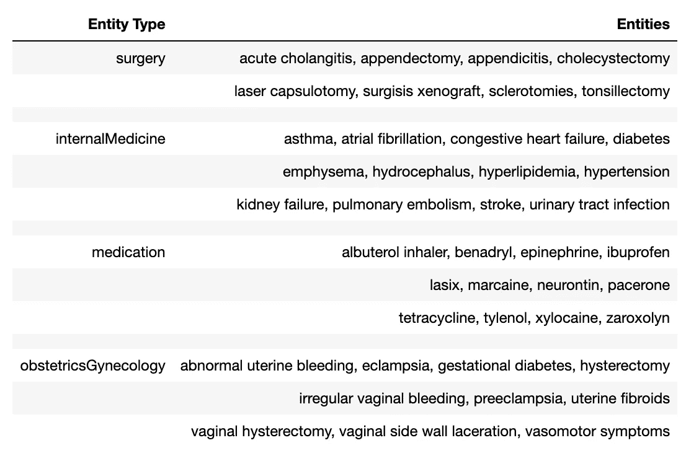
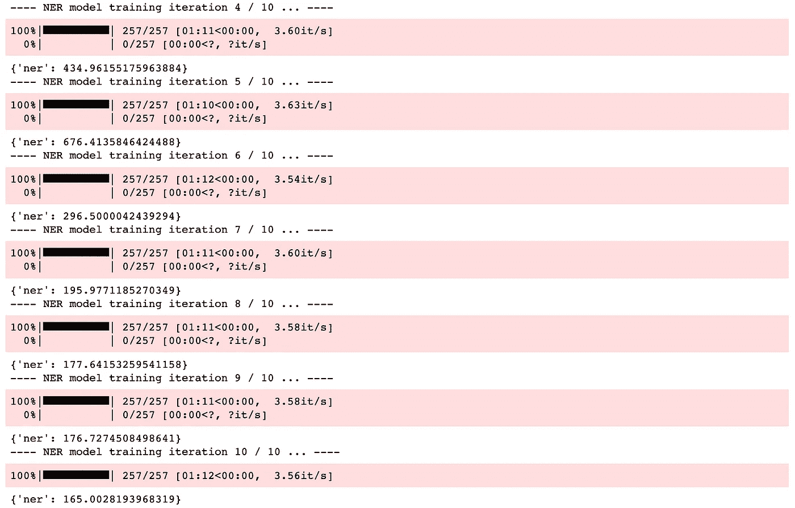
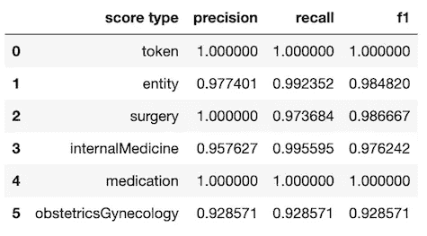
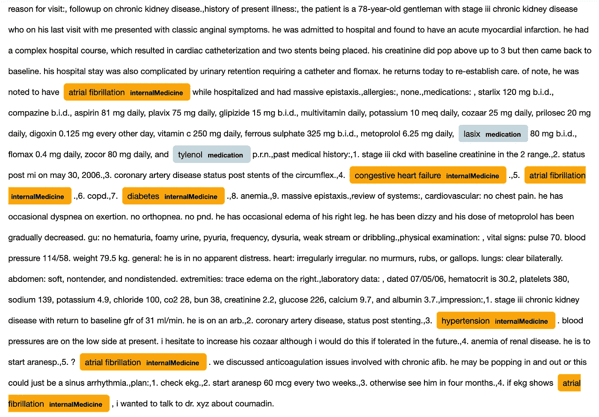
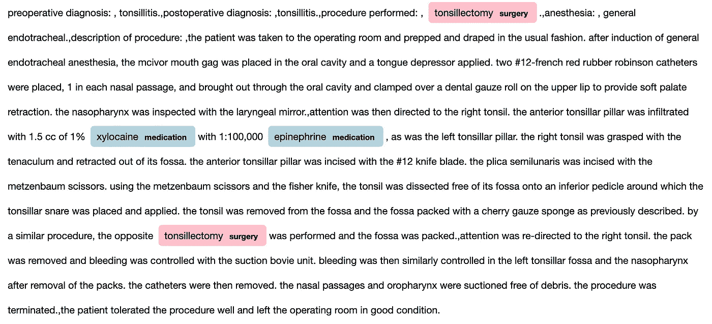

# 基于空间的临床命名实体识别

> 原文：<https://towardsdatascience.com/clinical-named-entity-recognition-using-spacy-5ae9c002e86f>

## 一种基于空间的医疗保健领域 NER 方法


作者照片

正如我在以前的文章[1]中所描述的，自然语言处理( [NLP](https://en.wikipedia.org/wiki/Natural_language_processing) )成为了 [AI](https://en.wikipedia.org/wiki/Artificial_intelligence) 研究和应用的热门话题，因为文本(例如，英语句子)是自然语言数据的主要类型。医疗领域文本数据的人工智能方法有很多，如临床文本分类、临床命名实体识别()、……等。

在[1]中，我使用了一个开源的临床文本数据集[2][3]来介绍一些常见的用于临床文本分类的机器学习和深度学习方法。

在本文中，我使用相同的数据集来演示如何使用 spaCy [4]实现特定于医疗保健领域的命名实体识别( [NER](https://en.wikipedia.org/wiki/Named-entity_recognition) )方法。

新 NER 方法包括以下步骤:

*   预处理数据集
*   定义特定于领域的实体和类型
*   生成带注释的数据集
*   创建和培训 NER 模型
*   评估 NER 模型
*   扩展 NER 模型
*   预测和可视化命名实体

# 1.预处理数据集

从 Kaggle [3]下载数据集 *mtsamples.csv* 文件后，数据集可以作为 Pandas 数据帧加载到内存中，如下所示:

```
raw_df = pd.read_csv('./medical-nlp/data/mtsamples.csv', index_col=0)
raw_df.head()
```



数据集中有 40 个独特的医学专业类别。如[1]中所述，通过以各种方式过滤数据集，医学专业类别的数量可以从 40 个减少到以下 9 个类别:



为了更好地演示，通过将本文中的*转录*列改为小写，对这个过滤后的数据集进行进一步预处理。

# 2.定义特定于领域的实体和类型

空间中的 NER 模型是有监督的深度学习模型。因此，数据集中的每个文档都需要标记的实体来进行模型训练和测试。

典型的文本注释工具如 [prodigy](https://prodi.gy/) 用于注释文档中的实体类型。本文利用另一种方法来自动生成带注释的文本数据集。为此，需要指定实体(不是它们在文档中的位置)和类型。

出于演示的目的，假设我们对以下实体(疾病或医学)和类型(医学专业)感兴趣:



每种实体类型的实体在实现中存储为一个集合。作为一个例子，下面是手术的设置:

```
surgery = set(['acute cholangitis', 'appendectomy', 
               'appendicitis', 'cholecystectomy', 
               'laser capsulotomy', 'surgisis xenograft', 
               'sclerotomies', 'tonsillectomy' 
               ])
```

# 3.生成带注释的数据集

如前所述，为了训练和测试空间 NER 模型，每个包含实体的文本文档都需要使用以下模板中的文本注释进行标记:

*('文档文本'，{ '实体':[(开始，结束，类型)，…，(开始，结束，类型)]))*

一旦确定了实体和类型(参见上一节)，就可以自动生成一个带注释的文本数据集，如下所示:

*   使用识别的实体和类型创建空间实体标尺模型
*   使用实体标尺模型从给定文档中查找每个实体的位置和类型
*   使用确定的位置和类型以及上面的模板来标记给定的文档

可以通过三个步骤创建空间实体标尺模型(参见下面的 *RulerModel* 类中的 __ *init* __ 方法):

*   为给定语言(如英语)创建空模型
*   将一个 *entity_ruler* 管道组件添加到模型中
*   创建实体规则，并将其添加到 *entity_ruler* 管道组件中

```
import spacy
from spacy.lang.en import English
from spacy.pipeline import EntityRulerclass RulerModel():
    def __init__(self, surgery, internalMedicine, medication, obstetricsGynecology):
        self.ruler_model = spacy.blank('en')
        self.entity_ruler =      self.ruler_model.add_pipe('entity_ruler')

        total_patterns = [] patterns = self.create_patterns(surgery, 'surgery')
        total_patterns.extend(patterns) patterns = self.create_patterns(internalMedicine, 'internalMedicine')
        total_patterns.extend(patterns) patterns = self.create_patterns(medication, 'medication')
        total_patterns.extend(patterns)

        patterns = self.create_patterns(obstetricsGynecology, 'obstetricsGynecology')
        total_patterns.extend(patterns)

        self.add_patterns_into_ruler(total_patterns)

        self.save_ruler_model()

    def create_patterns(self, entity_type_set, entity_type):
        patterns = []
        for item in entity_type_set:
            pattern = {'label': entity_type, 'pattern': item}
            patterns.append(pattern) return patterns

    def add_patterns_into_ruler(self, total_patterns):
        self.entity_ruler.add_patterns(total_patterns)
```

创建实体标尺模型后，可将其保存到文件中供以后使用，如下所示:

```
ruler_model.to_disk('./model/ruler_model')
```

下面的类*generated dataset*中的*assign _ labels _ to _ documents*()*方法使用上述实体标尺模型查找实体的位置和类型，并使用它们生成带注释的数据集:*

```
*class GenerateDataset(object):

    def __init__(self, ruler_model):
        self.ruler_model = ruler_model

    def find_entitytypes(self, text):
        ents = [] 
        doc = self.ruler_model(str(text))
        for ent in doc.ents:
            ents.append((ent.start_char, ent.end_char, ent.label_)) return ents     

    def assign_labels_to_documents(self, df):
        dataset = []
        text_list = df['transcription'].values.tolist() for text in text_list:
            ents = self.find_entitytypes(text)
            if len(ents) > 0:
                dataset.append((text, {'entities': ents}))
            else:
                continue        return dataset*
```

*一旦生成了带注释的文本数据集，就可以将其分成子集，用于模型训练、验证和测试。*

# *4.创建和培训 NER 模型*

*与实体标尺模型类似，空间 NER 模型可以分两步创建(参见下面的 *NERModel* 类的 *__init__* 方法):*

*   *为给定语言(如英语)创建空模型*
*   *将一个 *ner* 管道组件添加到模型中*

*一旦创建了 NER 模型，就可以调用类 *NERModel* 的方法 *fit* ()来使用模型训练数据集训练该模型。*

*模型训练遵循典型的深度学习模型训练过程:*

*   *设置纪元的数量(在本文中默认为 10)*
*   *混洗训练数据并将其分成每个时期的小批*
*   *设置模型超参数，如丢弃率*
*   *获取空间优化器，并使用它来管理目标函数损失的计算和通过反向传播更新权重*
*   *显示模型训练进度(通过使用本文中的 tqdm 库)*

```
*import spacy
from spacy.util import minibatch
from spacy.scorer import Scorer
from tqdm import tqdm
import randomclass NERModel():
    def __init__(self, iterations=10):
        self.n_iter = iterations 
        self.ner_model = spacy.blank('en') 
        self.ner = self.ner_model.add_pipe('ner', last=True)

    def fit(self, train_data):
        for text, annotations in train_data:
            for ent_tuple in annotations.get('entities'):
                self.ner.add_label(ent_tuple[2])
        other_pipes = [pipe for pipe in self.ner_model.pipe_names 
                       if pipe != 'ner']

        self.loss_history = []

        train_examples = []
        for text, annotations in train_data:
            train_examples.append(Example.from_dict(
               self.ner_model.make_doc(text), annotations))

        with self.ner_model.disable_pipes(*other_pipes): 
            optimizer = self.ner_model.begin_training()
            for iteration in range(self.n_iter):
                print(f'---- NER model training iteration {iteration + 1} / {self.n_iter} ... ----')
                random.shuffle(train_examples)
                train_losses = {}
                batches = minibatch(train_examples, 
                  size=spacy.util.compounding(4.0, 32.0, 1.001))
                batches_list = [(idx, batch) for idx, batch in 
                  enumerate(batches)]
                for idx, batch in tqdm(batches_list):
                     self.ner_model.update(
                         batch,
                         drop=0.5,
                         losses=train_losses,
                         sgd=optimizer,
                     )

                self.loss_history.append(train_losses)
                print(train_losses) def accuracy_score(self, test_data):
        examples = []
        scorer = Scorer()
        for text, annotations in test_data:
            pred_doc = self.ner_model(text)
            try:
                example = Example.from_dict(pred_doc, annotations)
            except:
                print(f'Error: failed to process document: \n{text}, 
                      \n\n annotations: {annotations}')
                continue

            examples.append(example)

        accuracy = scorer.score(examples)

        return accuracy*
```

*以下是斯帕西·NER 模型训练输出的屏幕截图:*

**

*在模型训练期间，*损失*历史已经保存在 *NERModel* 类的 *fit* ()方法中。*

```
*from matplotlib import pyplot as pltloss_history = [loss['ner'] for loss in ner_model.loss_history]
plt.title("Model Training Loss History")
plt.xlabel("Iterations")
plt.ylabel("Loss")
plt.plot(loss_history)*
```

*上述代码使用保存的*损失*历史数据绘制了以下损失历史图。*

**

*一旦 *NER* 模型被训练，它可以保存到文件中以备后用，如下所示:*

```
*ner_model.to_disk('./model/ner_model')*
```

# *5.评估 NER 模型*

*一旦一个空间 *NER* 模型被训练，那么 *NERModel* 类的 *accuracy_score* ()方法就可以用模型测试数据集来调用，以获得模型精度性能结果。*

*原始精度结果是一个 Python 字典，其中包含令牌、实体和每种实体类型的精度、召回率和 f1 值。这样的字典可以被格式化为熊猫数据帧，如下所示:*

**

# *6.扩展 NER 模型*

*如前所述，本文创建了一个实体标尺模型，用于自动生成带注释的文本数据集。*

*以下代码显示了如何通过将相同的实体标尺模型和 NER 模型合并为一个来扩展已训练的 NER 模型。这很有用，因为实体标尺模型识别的实体可能由于训练数据和/或时间的限制而被 *NER* 模型遗漏。*

```
*from spacy.language import Languagedef extend_model(surgery, internalMedicine, 
                 medication, obstetricsGynecology):
    ruler_model = spacy.load('./model/ruler_model') 
    base_ner_model = spacy.load('./model/ner_model')     @Language.component("my_entity_ruler")
    def ruler_component(doc):
        doc = ruler_model(doc)
        return doc

    for entity_type_set in [surgery, internalMedicine, 
                            medication, obstetricsGynecology]:
        for item in entity_type_set:
            base_ner_model.vocab.strings.add(item) if 'my_entity_ruler' in base_ner_model.pipe_names:
        base_ner_model.remove_pipe('my_entity_ruler') base_ner_model.add_pipe("my_entity_ruler", before='ner') 

    return base_ner_model*
```

# *7.识别和可视化命名实体*

*一旦空间 NER 模型被训练和/或扩展，那么我们可以使用它从给定的文本文档中识别命名实体，如下所示:*

```
*doc = *extended_ner_model*(text)*
```

*可以通过*文档*访问已识别的实体。*

*下面的功能是在 Jupyter 记事本中使用颜色编码显示已识别的命名实体:*

```
*def display_doc(doc): 
    colors = { "surgery": "pink",
               "internalMedicine": "orange",
               "medication": "lightblue",
               "obstetricsGynecology": "lightgreen", 
             }
    options = {"ents": ["surgery", 
                        "internalMedicine", 
                        "medication",
                        "obstetricsGynecology",
                       ], 
                "colors": colors
              } displacy.render(doc, style='ent', 
                     options=options, jupyter=True)display_doc(doc)*
```

*以下是两个示例文档中带注释的实体的显示:*

****

# *8.结论*

*在本文中，我使用了与[1]中描述的相同的数据集[2][3]，来展示如何使用 spaCy [4]实现特定于医疗保健领域的命名实体识别( [NER](https://en.wikipedia.org/wiki/Named-entity_recognition) )方法。在该方法中，首先识别一组医疗实体和类型，然后创建空间实体标尺模型并用于自动生成用于模型训练和测试的带注释的文本数据集，之后创建并训练空间 NER 模型，最后使用相同的实体标尺模型来扩展训练的 NER 模型的能力。结果表明，这种新的 NER 方法在识别临床领域特定命名实体方面是有效的。*

# *参考*

*[1] Y. Huang，[用于临床文本分类的常用机器学习和深度学习方法](/common-machine-learning-and-deep-learning-methods-for-clinical-text-classification-188473477a32)*

*[2]MTS 示例:[https://www.mtsamples.com](https://www.mtsamples.com)*

*[3] T .波义耳，[https://www.kaggle.com/tboyle10/medicaltranscriptions](https://www.kaggle.com/tboyle10/medicaltranscriptions)*

*[4]空间:[https://allenai.github.io/scispacy/](https://allenai.github.io/scispacy/)*

*鸣谢:我要感谢 MTSamples 和 Kaggle 提供的数据集。*