# 剪辑和粘贴:使用人工智能从文本提示创建照片拼贴

> 原文：<https://towardsdatascience.com/clip-and-paste-using-ai-to-create-modern-collages-from-text-prompts-38de46652827>

## 如何使用 ML 模型从照片中提取物体并重新排列以创建现代艺术

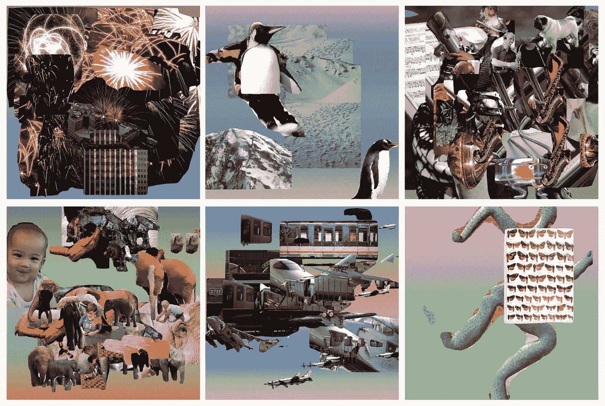

**来自剪辑和粘贴的样本照片拼贴画**，图片由作者提供

在我之前的许多[帖子](https://robgon.medium.com/list/creating-fine-art-with-gans-73476c209de3)中，我展示了如何使用人工智能模型从文本提示中创建新的艺术作品。对于这些项目，我至少使用了两个人工智能模型，一个是生成式对抗网络(GAN)等生成器来创建图像，另一个是多模态语言/图像模型，如 OpenAI 的对比语言-图像预训练(CLIP) [1]来指导生成器。

对于这个项目，我想看看我是否可以让 CLIP 从文本提示中组装现代照片拼贴画，而不使用人工智能模型作为生成器。我构建了一个自定义的图像生成器，它组装图像的各个部分，并使用 CLIP 反复分析和调整拼贴中的各个部分。我称这个系统为“剪辑和粘贴”，其中第二个缩写代表通过编辑在语义上组合的图片。

下图显示了剪切和粘贴的重要组成部分。我将简要讨论这些元素，然后在接下来的部分中描述细节。

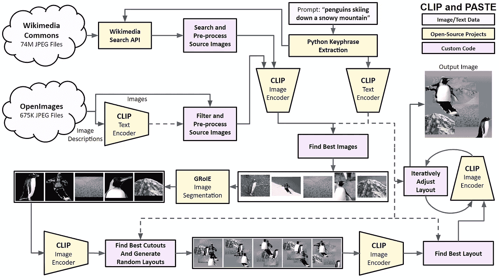

**剪贴组件图，**作者图

这个过程从一个文本提示开始，就像“企鹅从雪山上滑下”系统使用 Python 关键短语提取库[2]来提取关键词。然后，它从 Wikimedia Commons [3]和 OpenImages [4]中搜索与提示中的关键字匹配的图像。我使用维基媒体搜索 API 来寻找可能匹配的图片。对于 OpenImages，我使用剪辑文本编码器，通过比较关键字和描述的嵌入来找到最佳文本匹配。接下来，该系统从 Wikimedia Commons 和 OpenImages 下载前 100 张图像，并通过剪辑图像编码器运行它们，再次将它们与关键字进行比较。该系统通过 GRoIE [5]图像分割模型运行顶部图像，以从照片中创建剪切部分。剪切部分通过剪辑重新运行，以找到与关键字最匹配的图像部分。我构建了一个定制的图像合成器，它可以将图片随机组合成多个照片拼贴。布局通过剪辑运行，以找到最好的一个。该系统通过使用 Pytorch 中的 Adam 优化器[6]迭代地分析和合成拼贴来调整图像部分的位置。经过 100 次迭代后，显示最终图像。

你可以在下面的章节中了解这个系统的细节。请务必查看附录中更多生成的照片拼贴。你也可以使用 Google Colab [在这里](https://colab.research.google.com/github/robgon-art/CLIPandPASTE/blob/main/CLIP_and_PASTE.ipynb)创建自己的。

# 背景

制作照片拼贴的艺术，也称为照片蒙太奇，可以追溯到 100 多年前。

> 拼贴通常被认为是一种典型的现代艺术手法。这个词来自法语动词 *coller* ，意思是“粘着”,最早用于描述巴勃罗·毕加索和乔治·布拉克的立体派创新，他们于 1912 年开始将剪报和其他材料粘在画布上。故事是这样的，从那时起，艺术家们就开始用剪贴的方式将我们周围的世界在画布上进行意想不到的、变革性的组合。——塞缪尔·赖利，[《经济学家》](https://www.economist.com/1843/2019/07/24/stick-em-up-a-surprising-history-of-collage)

这里有一些早期照片拼贴的样本，从左上按时间顺序顺时针展示。

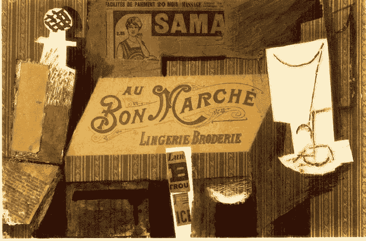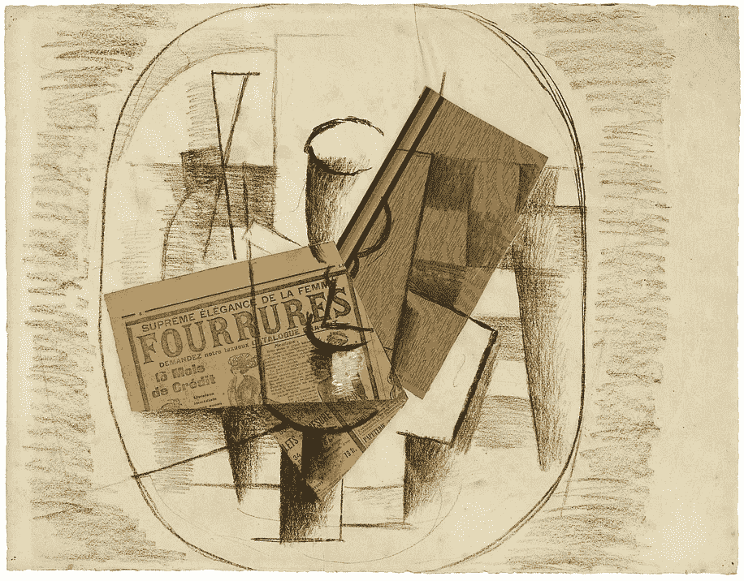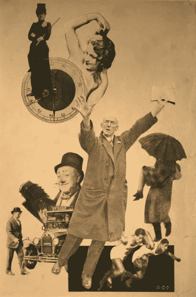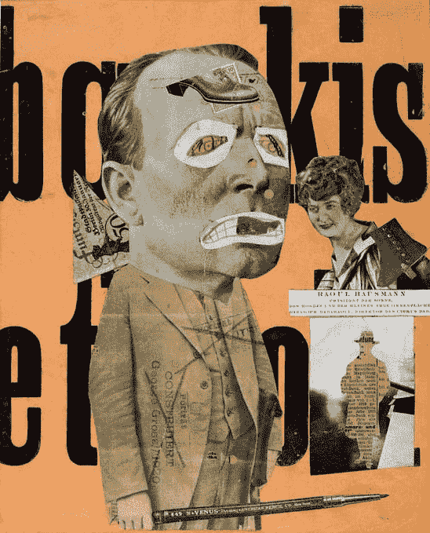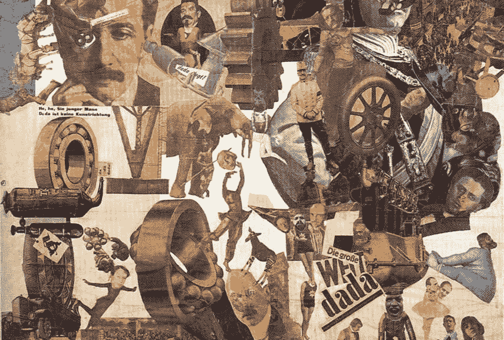

从左上顺时针方向，**带广告的静物**，1913 年，巴勃罗·毕加索，**玻璃杯和瓶子(皮草)**，乔治·布拉克，1914 年，**用菜刀切开德国最后一个魏玛啤酒肚文化时代**，1919 年，汉娜·霍奇，**女孩、运动员和小丑拼贴画**，1925 年，亚历山大·罗德钦科，**艺术评论**，1920 年，拉乌尔·豪斯曼

你可以看到艺术形式是如何发展的，从用颜料和铅笔画将剪报粘贴在画布上，到仅仅通过安排照片的剪切来制作作品。

# 系统详细信息

以下是对“剪切和粘贴”中使用的组件和过程的描述。

## 关键短语提取

与过去的项目不同，我使用 KeyBERT [7]从文本中提取关键词和短语，我改用一个叫做 Python 关键短语提取(PKE)的包。在对这两个软件包做了一点试验后，我发现 PKE 似乎做得更好。例如，PKE 允许我指定关键字的词性(名词、形容词和动词。)

下面是两个系统中从“企鹅从雪山上滑下”中提取的关键短语和分数的比较。

```
**KeyBERT** penguins skiing snowy, 0.9217
penguins skiing, 0.8879
skiing snowy, 0.6593
skiing snowy mountain, 0.643
penguins, 0.6079**PKE**
penguins skiing, 0.5
snowy mountain, 0.5
```

尽管 KeyBERT 想出了更多的候选关键词，但其中一些，如“企鹅在雪地里滑雪”是无意义的。然而，PKE 系统似乎用两个同等权重的关键词“企鹅滑雪”和“雪山”抓住了提示的要点

你可以在这里看到我用于关键短语提取的 Python 代码。

## 查找源图像

正如我在概述中提到的，我从 Wikimedia Commons 和 OpenImages 数据集收集拼贴图像。这两个来源都在知识共享署名共享开源许可下发布它们的图像。

为了在维基共享资源中搜索图片，我在 https://commons.wikimedia.org/w/api.php 使用了 API。

下面是设置搜索参数的 Python 代码。

```
s = requests.Session()
url = "https://commons.wikimedia.org/w/api.php"
params = {
"action": "query",
"generator": "images",
"prop": "imageinfo",
"gimlimit": 500,
"titles": keyphrases,
"iiprop": "url|dimensions",
"format": "json"
}
results = s.get(url=url, params=params)
```

当结果出来时，我根据它们的尺寸过滤图像。我保留尺寸为 512x512 或更大的图像。

为了在 OpenImages 数据集中搜索图片，我使用剪辑文本编码器来比较关键短语的嵌入和数据集中描述的嵌入。如果你想了解更多关于这个过程的信息，你可以在我的文章中阅读关于搜索设计专利的细节[这里](/using-openais-clip-to-search-for-design-patents-7fcc63d91033)。

一旦我获得了图像集合，我就通过 CLIP Image Encoder 将它们与整个提示的嵌入进行比较。以下是来自维基共享和 OpenImages 的顶级照片。

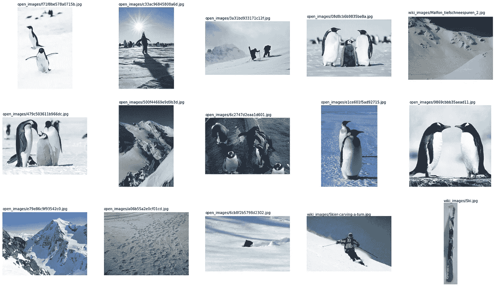

**来源图片**来自维基共享和开放图片

**图像分割**

我使用了一个称为 GRoIE 的人工智能模型进行图像分割，GRoIE 代表通用感兴趣区域提取器[5]。该系统是由意大利帕尔马大学的莱昂纳多·罗西等人开发的。给定输入图像，GRoIE 将提取并标记任何可辨别的前景对象。对于找到的每个对象，它会创建一个定义对象形状的遮罩图像。

注意，GRoIE 模型通常在每个输入图像中找到并提取不止一个对象。例如，在这张照片中，它发现并隔离了两只企鹅。

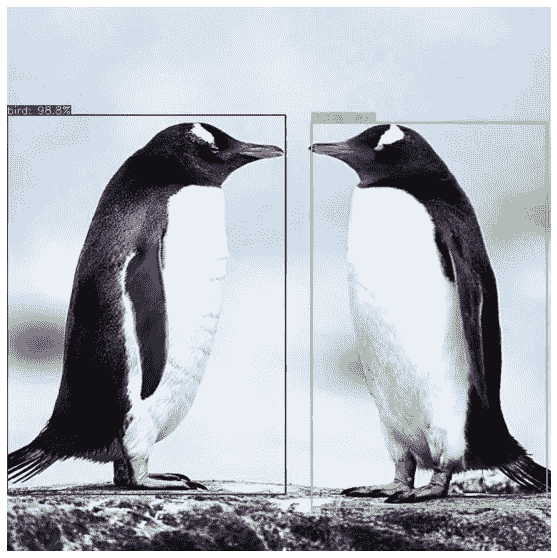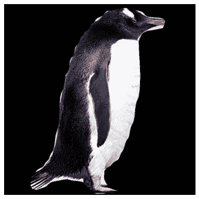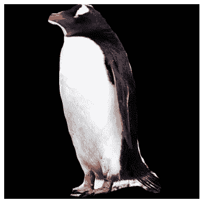

**使用 GRoIE 进行多对象提取**，图片由作者提供

在我提取了所有的对象之后，我再次运行 CLIP 来比较图像嵌入和来自提示的嵌入。原始图像在上面，提取的图像在下面。这些是从排名前五的图片中剪下的物品。

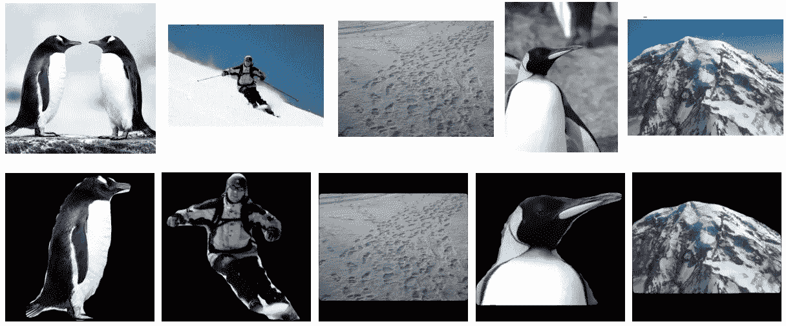

**使用 GRoIE** 进行图像分割，图像由作者提供

**创建背景颜色渐变**

我可以用纯色，比如白色或黑色，来合成照片拼贴的剪影。但是为了增加背景的趣味性，我写了一点 Python 代码来创建带有五个控制点的垂直颜色渐变。然后，我使用 CLIP 分析结果图像，并使用 Pytorch 中的 Adam optimizer [6]迭代调整颜色，以找到文本提示的最佳匹配。

> 我们提出 Adam，这是一种有效的随机优化方法，只需要一阶梯度和很少的内存需求。该方法根据梯度的一阶和二阶矩的估计来计算不同参数的个体自适应学习率；Adam 这个名字来源于自适应矩估计。迪德里克·金马和吉米·巴

如果你不会说数学，Adam 方法会稍微调整参数，并注意每次迭代的结果是否会改善以及改善了多少。它根据每个参数对改善结果的贡献大小，以不同的速率改变参数。

这是在对 25 个参数(红、绿和蓝的 5 个控制点)使用 CLIP 和 Adam 100 次迭代后，得到的“企鹅在雪山上滑雪”的渐变。)

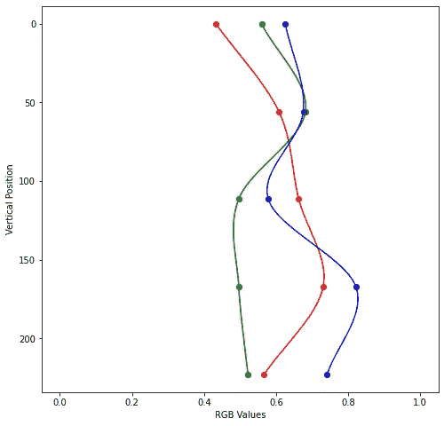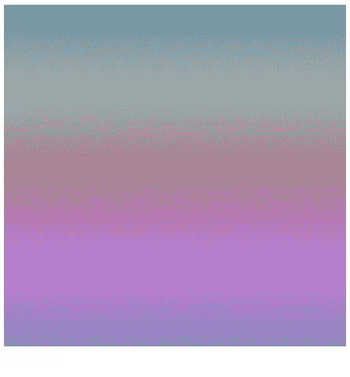

**使用剪辑创建背景渐变图片**，图片作者

左边是参数值的图表，右边是合成的梯度图像。我不知道为什么它在中下区域显示紫色，但它看起来棒极了！

这里有一些使用这种方法的附加背景渐变。

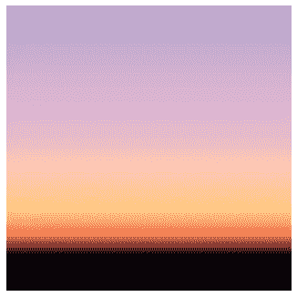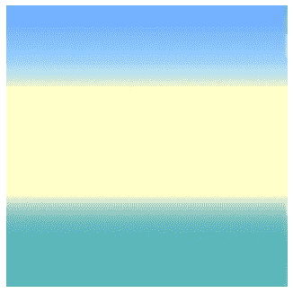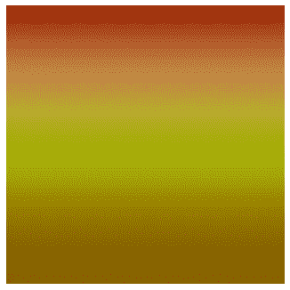

**背景渐变为**(左)**城市上空的夕阳**(中)**海边的晴天**(右)**秋叶**，图片作者

正如你所看到的，创建一个只有 15 个参数的图像，在 CLIP 的指导下，是相当有表现力的。从文本生成颜色渐变的代码是[这里是](https://gist.github.com/robgon-art/920ac282f92f5f1ae1946458b0dfeb88)。

## 寻找最佳拼贴布局

一旦系统有了背景图像和剪贴画，下一步就是有意义地排列对象。为了做到这一点，我创建了 100 个随机对象放置变量，然后通过 CLIP 运行它们，以查看哪个布局最匹配文本提示。我按大小对剪出的图片进行分类，将较大的图片放在背景，较小的放在前景。这样做可以减少遮挡较小图片的机会。

以下是三种随机布局的示例。

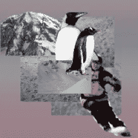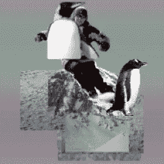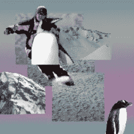

**随机对象布局，**作者图片

通过 CLIP 运行所有 100 个布局后，右边的一个与“企鹅在雪山上滑雪”最匹配这很好，但它可以使用一点微调。

## 优化布局

类似于创建背景渐变的方法，我再次使用 Adam 优化器来调整对象位置，以更好地匹配文本提示。这有效地颠倒了函数，允许优化器找到最佳解决方案。我使用了 Edgar Riba 等人编写的名为 Kornia [8]的软件包，它在 Pytorch 中执行数学上可微分的图像处理例程。

系统对渐变中的对象和颜色的位置进行微小的调整，然后使用 CLIP 分析结果图像。然后，它会检查自己是朝着更好的解决方案前进，还是远离它。这个循环重复 100 次，以创建最终的图像。

以下是“企鹅在雪山上滑雪”的第一、第五十和第一百次迭代的布局

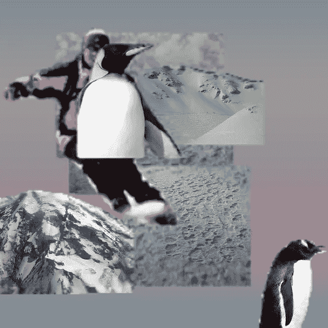

**布局优化**，作者图片

你可以看到系统如何将企鹅的身体滑过人类滑雪者的头部和胸部，组织背景中的雪的图片，并调整颜色梯度，将紫色移动到图像的顶部。

这是“企鹅在雪山上滑雪”的最终拼贴画

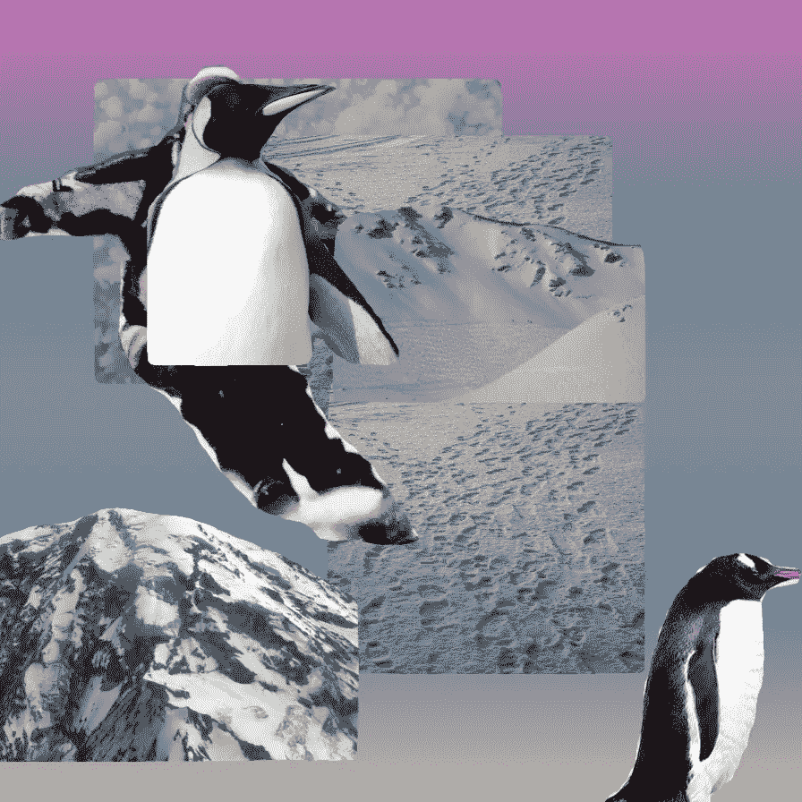

**企鹅从雪山上滑下**，图片作者

好吧，这很酷(哈，双关语)。因为拼贴是使用参数组装的，所以可以以各种尺寸渲染，包括高分辨率。

请务必在附录中查看更多的剪贴照片。

# 讨论和未来方向

剪贴系统似乎工作得相当好。请注意，它高度依赖于从维基共享和 OpenImages 中找到合适的图像。如果它找不到与提示中的文字相匹配的图片，它会继续搜索找到的图片。

未来的改进将增加图像缩放和旋转。如果有更多的参数需要控制，优化器可能会找到更好的布局。

# 源代码和 Colabs

这个项目的所有源代码都可以在 [GitHub](https://github.com/robgon-art/CLIPandPASTE) 上获得。我在 [CC BY-SA 许可](https://creativecommons.org/licenses/by-sa/4.0/)下发布了源代码。


**知识共享署名共享**

# 感谢

我要感谢詹尼弗·林对这个项目的帮助。

# 参考

[1] **剪辑**由 a .拉德福德等著，[从自然语言监督中学习可转移的视觉模型](https://cdn.openai.com/papers/Learning_Transferable_Visual_Models_From_Natural_Language_Supervision.pdf) (2021)

[2] F. Boudin，[**:一个开源的基于 Python 的关键短语抽取工具包**](https://github.com/boudinfl/pke) **(2016)，COLING 2016 论文集，第 26 届计算语言学国际会议:系统演示**

**[3] [**维基共享资源**](https://commons.wikimedia.org/) (2004 年至今)**

**[4][**open images**](https://storage.googleapis.com/openimages/web/index.html)(2020)**

**[5] **格罗伊**由 l .罗西、A .卡利米和 A .普拉蒂提出，[一种新颖的感兴趣区域提取层实例分割](https://arxiv.org/pdf/2004.13665.pdf) (2020)**

**[6] D. P .金玛和 j .巴雷，**亚当** : [随机优化的一种方法](https://arxiv.org/pdf/1412.6980.pdf) (2015)，学习表征国际会议2015**

**[7] M. Grootendorst， [**KeyBERT** :用 BERT](https://github.com/MaartenGr/KeyBERT) 进行最小关键词提取(2020)**

**[8] E. Riba、D. Mishkin、D. Ponsa、E. Rublee 和 G. Bradski，[**Kornia**:py torch 的开源可区分计算机视觉库](https://arxiv.org/pdf/1910.02190.pdf) (2020)，计算机视觉应用冬季会议**

# **附录**

**这里有一些使用剪辑和粘贴来创建照片拼贴的例子。**

## **波士顿天际线上的烟火**

**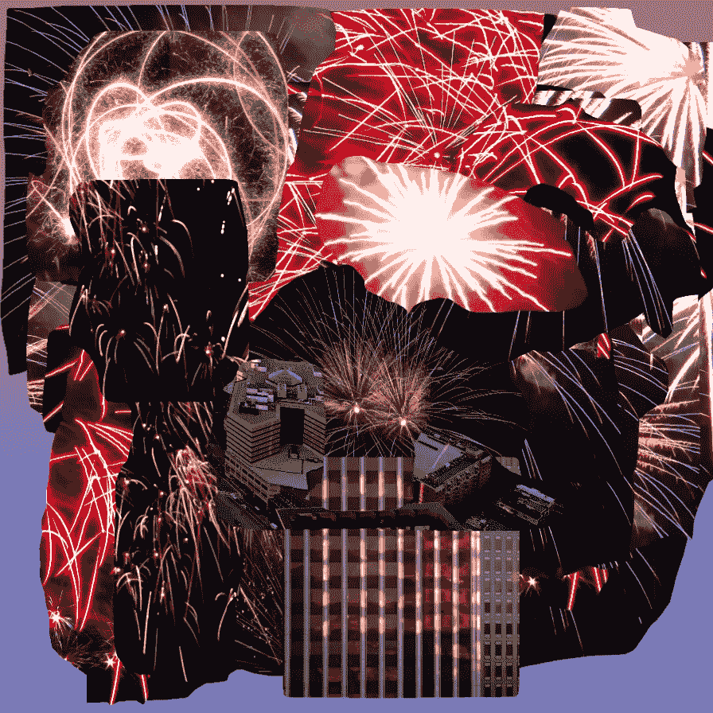**

****波士顿天际线上的烟花**，作者图片**

## **一只哈巴狗在用萨克斯管演奏的铜管乐队里**

**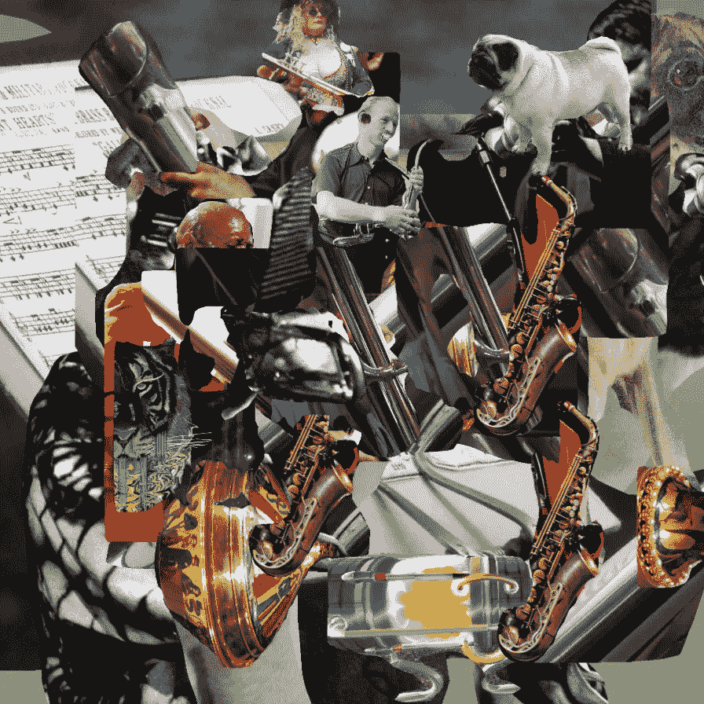**

****一只哈巴狗在铜管乐队中吹奏萨克斯管**，图片由作者提供**

## **与蝴蝶一起奔跑的抽象人**

**这一个只用了两个图像剪切。**

**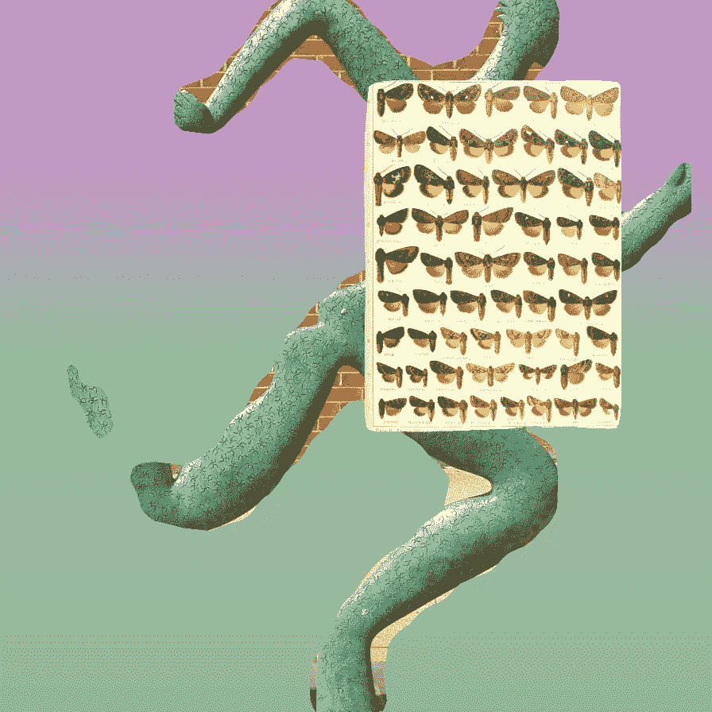**

****与蝴蝶一起奔跑的抽象男子**，作者图片**

**为了无限制地访问 Medium 上的所有文章，[成为](https://robgon.medium.com/membership)的会员，每月 5 美元。非会员每月只能看三个锁定的故事。**