# 线性回归的封闭解

> 原文：<https://towardsdatascience.com/closed-form-solution-to-linear-regression-e1fe14c1cbef>

## 一步一步的指导理论背后的美丽封闭形式的解决方案

如果你想进入机器学习领域，[线性回归](https://machinelearningmastery.com/linear-regression-for-machine-learning/#:~:text=Linear%20regression%20is%20a%20linear,the%20input%20variables%20(x).)是理解机器学习基础的一个很好的起点。线性回归是一种非常简单但通用的机器学习工具。它广泛应用于工业和研究领域，所以如果你想在专业或学术环境中应用你的机器学习知识和技能，掌握它是关键。

线性回归是少数几个可以有封闭形式解决方案的机器学习应用程序之一。

如果可以的话，应该总是使用封闭形式的解来代替迭代算法，因为这是找到最优解的最直接的方法。

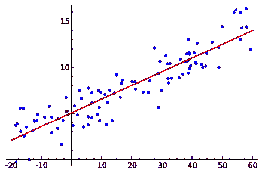

[线性回归](https://en.wikipedia.org/wiki/File:Linear_regression.svg)

# 什么是封闭解？

闭式解是一个可以用函数和数学运算来求解的方程。Wolfram MathWorld 对它有一个非常[广泛和理论化的定义](https://mathworld.wolfram.com/Closed-FormSolution.html)，但是它很复杂。

一种简单的思考方式是，是否有可能用一些老派的微积分而不是完整的机器学习算法来解决你的优化问题。而不是让你的算法迭代地改进优化函数，就像你使用[梯度下降](https://builtin.com/data-science/gradient-descent)、[遗传算法](https://www.sciencedirect.com/topics/engineering/genetic-algorithm)等。，您对损失最小化函数进行求导，将其设置为零，并找到权重和偏差的最佳值(也称为您的 *y = mx + b* 等式的 *m* 和 *b* )。

这不可能在所有情况下都做到，但我将在稍后概述何时可以使用它。如果可能的话，简单的数学解决方案将会直接引导你找到最优的解决方案。让我们更深入地了解一下封闭形式的解决方案是如何工作的。

照片由[米卡·鲍梅斯特](https://unsplash.com/@mbaumi?utm_source=medium&utm_medium=referral)在 [Unsplash](https://unsplash.com?utm_source=medium&utm_medium=referral) 上拍摄

# 封闭式解释

如果优化问题相对于权重 *w* 是可微的并且导数可以被求解，则该优化问题是封闭形式可解的，但是这仅在最小/最大优化问题的情况下才成立。

为了弄清楚是否是这种情况，你采用最优化方程，根据权重 *w* 对其进行推导，将其设置为零，并求解 *w* 。

# 线性回归封闭解的推导

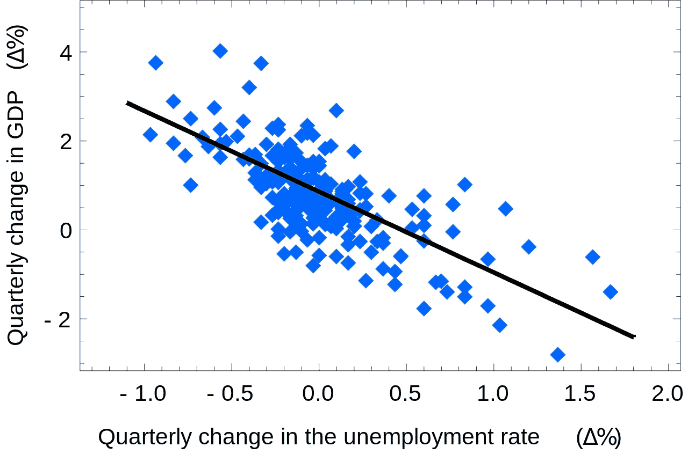

[失业率对 GDP 的线性回归](https://en.wikipedia.org/wiki/Simple_linear_regression#/media/File:Okuns_law_quarterly_differences.svg)

在机器学习中，我们经常使用 2D 可视化来更好地理解我们可怜的小人类的眼睛和大脑。然而，我们几乎从来没有 2D 的数据。虽然整篇文章中使用的图形是 2D，但是这个解决方案适用于多维输入和输出的问题。

给定一组维度为 *D* 的 *N* 输入向量(在可视化中，D=1，因此我们有一维输入数据)和一组维度为 *S* 的输出向量(在可视化中，S=1)，我们正在寻找从输入到目标的映射函数。

观察结果:

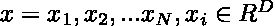

目标:

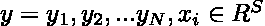

映射功能:

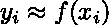

因为我们使用线性回归，函数 *f* 是线性的。任何线性函数的形式都是 y = mx + b。像 y = mx + b 这样的一维映射意味着单个 x 值输出单个 y 值，就像如果 y = 2x+ 3，当 x = 2，y = 7。在这种情况下，我们的函数看起来像 f: 1 - > 1。然而，在现实世界中，我们有多维数据，所以公式有点不同。我们希望将多维输入映射到多维输出。

让我们一步一步来，首先从多维输入映射到一维输出，所以 f: D ->1。在这种情况下，输入 *x* 成为一个向量，我们需要权重因子 *m* 成为一个权重向量而不是一个标量值。我们的映射函数演变为:f: D - > 1:

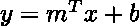

如果我们更进一步，从多维输入映射到多维输出，我们需要找到一个映射 f: D ->S，其中 *D* 是我们输入的维度， *S* 是输出的维度。思考这个问题的一种方法是为输出的每个维度找到权重向量 *m* 和偏差 *b* 。这就好像我们在堆积一堆这样的功能:

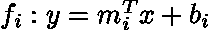

如果我们正式地将这些映射堆叠在一起，偏差 *b* 就是堆叠的偏差 bi，并且权重矩阵 *W* 可以通过堆叠所有的 *m* 向量 so 来公式化

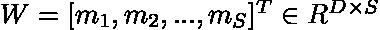

我们很少在一个数据集中只有一个样本。我们通常，如上所述，有一组 *N* 个数据样本。我们可以将所有这些数据样本添加到两个矩阵中，一个用于输入和输出。

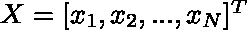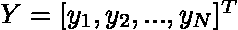

我们希望同时通过函数传递所有这些信息，这意味着我们需要扩展函数以获得表单

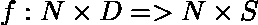

这一步的功能是:

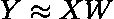

令人惊讶的是，得出这个公式相当简单。我们只需要吸收偏见。我们将改变矩阵 *X* ，在末尾添加一列 1，创建:

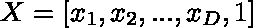

而矩阵 *W* 通过添加偏置向量作为最后一行，所以 W 变成

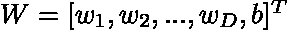

我们的新维度是:

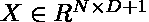

我们成功地吸收了偏差，XW 接近 y。

现在我们需要制定优化。因为我们想让 *XW* 尽可能接近 Y，所以优化是最小化 f(X) = XW 和 Y 之间的距离，或者:

这本质上是最小二乘损失函数，其经典形式如下:

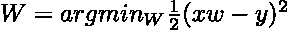

但是我们已经把它改编成矩阵。它只是为了让我们在求导时更容易些。我们使用最小二乘法策略，因为当分析线性回归时，如果 y = 3，f(x) = 1 或 f(x) = 5 并不重要，因为它们都会产生相同的误差。

正如我在开始时提到的，为了找到一个封闭形式的解决方案，我们现在需要进行映射并导出它。

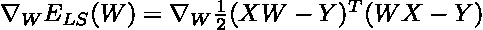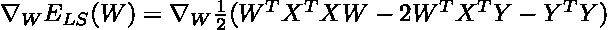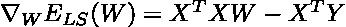

万岁！我们已经成功地推导出了相对于权重 *W* 的映射函数。现在我们要做的就是将它设置为零，并求解 *W* 以找到最优解。

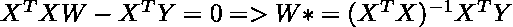

就是这样！ *W** 代表最佳权重。

对于那些真正热爱他们的理论线性代数的人来说，请随意挖掘令人眼花缭乱的伪逆世界。伪逆是:

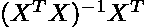

也有一个正式的证明来说明为什么我们可以颠倒第一项，因为这是不可假设的。首先，我们假设 *X* 是满秩的。x 是一个维数为 N x D 的矩阵。满秩意味着有 D 或 N 个线性独立的列和行，以较小者为准。n 是我们的样本大小，D 是输入数据的特征数量。为了使其工作，样本数 N 必须大于特征数 d，我们只需要证明列是线性独立的。我们可以这样假设，因为如果不是这样，我们的数据集中的要素不会添加任何信息，例如，如果我们将摄氏和华氏温度都作为每个数据点的要素。这两个值是线性相关的，所以我们可以只去掉其中的一列。如果 X 是满秩，根据秩的定义，

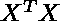

这也是满秩二次的。所以，可以倒过来！

# 何时使用封闭解

应尽可能使用封闭形式的解决方案，因为它提供了最佳解决方案。在机器学习中，我们通常寻求最小化误差函数或等价问题，如果被优化的函数是可微分的，并且微分可以针对我们正在优化的变量求解，则问题有封闭形式的解决方案。虽然机器学习让很多人难以接受，但有时一点基本的线性代数是更干净的解决方案。

这种方法有几个缺点，其中最明显的是我们只能解决线性问题。这严重限制了使用这种方法可以解决的一系列问题。

但是，您可以使用基函数将封闭形式的解决方案应用于非线性数据。基函数是一种没有任何可学习参数的函数，但允许您将数据转换到不同的空间。

闭合形式的解决方案是一个简单而优雅的方式来找到一个线性回归问题的最佳解决方案。在大多数情况下，找到封闭形式的解决方案比使用迭代优化算法(如梯度下降)进行优化要快得多。

*公开招聘自由职业技术写作和代笔工作:*【margo.hatcher.writes@gmail.com】T2*。我专注于数据科学和前端编程。*