# 云基础:自动扩展服务器

> 原文：<https://towardsdatascience.com/cloud-basics-auto-scaling-servers-71aa9945178a>

## AWS 中基于负载自动扩展服务器的教程


Jorge Ramirez 在 [Unsplash](https://unsplash.com?utm_source=medium&utm_medium=referral) 上的照片

云的优势之一是不必提前为生产中的工作负载准确预测和调配资源。在内部模型中，您需要通过纵向扩展(增加现有服务器的 cpu、内存等)来过度配置硬件资源。)或水平(添加更多同等资源的服务器)来尝试满足预期的峰值工作负载。这导致大部分时间服务器资源利用不足和浪费。

云允许我们根据各种参数自动扩展和缩减资源(服务器)。

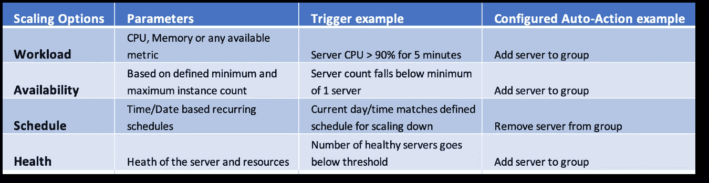

图 1:云中的自动扩展选项

在本教程中，我们将根据上面列出的选项#1 和#2 测试自动缩放，步骤如下:

1.  在负载平衡器后面的自动扩展组中启动一组 2 个 EC2 web 服务器。
2.  基于测试工作负载的自动扩展
    -手动触发 CPU 峰值超过 90%持续 2.5 分钟
    -观察额外的服务器被自动创建
    -观察服务器在 CPU 低于 70%的 2 分钟后被移除
3.  测试基于可用性的自动伸缩
    -手动删除 1 台服务器&观察新服务器的创建

# 先决条件

从下面链接的帖子中完成以下部分。

1.  AWS 设置
2.  GitHub 帐户设置和安装

[](/cloud-basics-interacting-with-aws-da179d3f5829) [## 云基础知识:与 AWS 交互

### 关于使用各种接口创建云资源的教程

towardsdatascience.com](/cloud-basics-interacting-with-aws-da179d3f5829) 

## 1.启动自动扩展堆栈

目标:使用 CloudFormation 模板在负载平衡器后面的自动扩展组中启动一组 web 服务器。

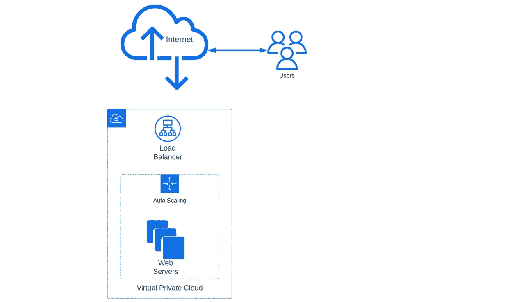

图 2:虚拟私有云中负载平衡器后面的自动扩展服务器组的架构

1.  转到[https://github.com/shrestha-ajay/cloud-basics2.git](https://github.com/shrestha-ajay/cloud-basics2.git)
2.  遵循"**自述文件中的步骤。MD** 文件中的回购或遵循以下步骤
3.  通过点击 GitHub UI 中的“Fork”来分叉这个库
4.  通过运行以下命令，将此存储库克隆到您的本地计算机上:

```
$ git clone [git@github.com:YOUR-USERNAME/YOUR-REPOSITORY.git](http://git@github.com:YOUR-USERNAME/YOUR-REPOSITORY.git)
$ cd YOUR-Repository-Folder
```

6.确保按照先决条件在您的计算机中配置了 AWS CLI

7.运行以下命令创建自动扩展解决方案堆栈

```
aws cloudformation deploy \
  --stack-name my-cloudbasic-autoscaling \
  --template-file AutoScalingMultiAZWithNotifications.template \
  --parameter-overrides KeyName="EC2Keypair" OperatorEMail="Email"
```

> *注:用您的值替换*ec2 key pair*&*Email*。*

8.转到 AWS 控制台> CloudFormation 和 AWS 控制台> EC2 以确认资源已创建。

9.从云信息堆栈的*输出*选项卡中打开 *URL*

10.堆栈启动后，检查您的电子邮件并确认订阅通知

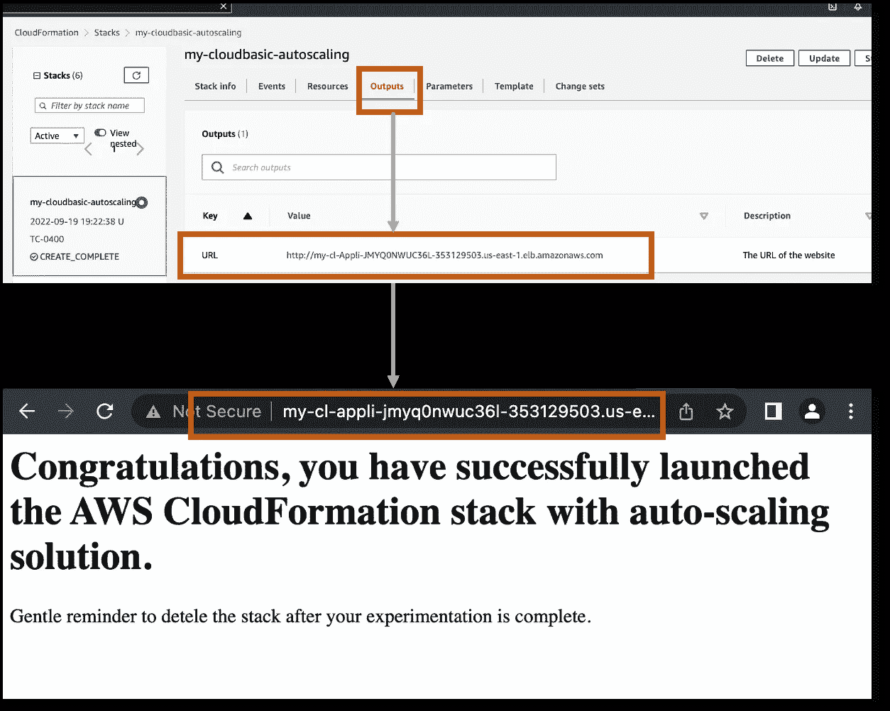

图 3:从 CloudFormation 堆栈创建的负载平衡器的 URL

## 2.基于工作负载的自动扩展

目标:连接堆栈中的两台服务器，在 2.5 分钟内将服务器的 CPU 提高到 90%以上。这将触发组中新服务器的创建。这可能需要 5-7 分钟。当服务器上的负载在 2.5 分钟内降至 70%以下时，第三台服务器将自动终止。

代码 1:如果 CPU 负载在 2 分钟内> 90%,则自动添加新服务器的 CloudFormation 代码片段

**步骤**

1.  从 AWS 管理控制台> EC2 列出当前作为自动伸缩组的一部分运行的 2 个服务器实例

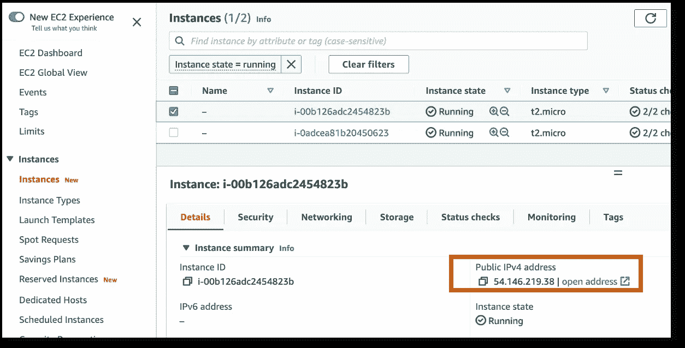

图 4:自动缩放组的 EC2 实例列表

2.SSH 到服务器的公共 IP，并运行以下命令

```
$ **sudo ssh -i "yourEC2key.pem" ec2-user@54.146.219.38**[ec2-user@ip-10-0-1-116 ~]$ **yes > /dev/null &**[1] 12777[ec2-user@ip-10-0-1-116 ~]$ **top**[ec2-user@ip-10-0-1-116 ~]$ **kill -9 12777**[ec2-user@ip-10-0-1-116 ~]$ **top**
```

> 注意:
> a. ssh *命令*:*Replace "*yourec 2 key . PEM*"和* IP *来匹配你的值* b. top *命令* : *显示 CPU 和资源利用率
> c.* kill *命令:只有在第 3 台服务器启动后才运行* kill *。用你的进程 ID 替换* 12777 *。* ***警告*** *:请勿在您的电脑中运行“***yes>/dev/null&”***。这可能会导致您的计算机过热。*

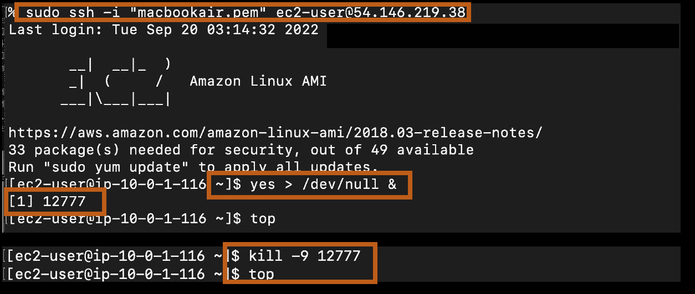

图 5:显示执行命令序列的屏幕截图

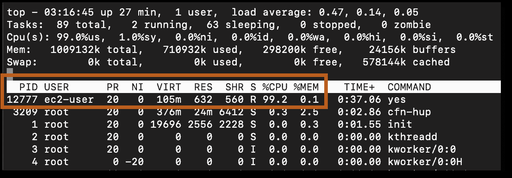

图 6:增加 CPU 后运行 top 命令的输出

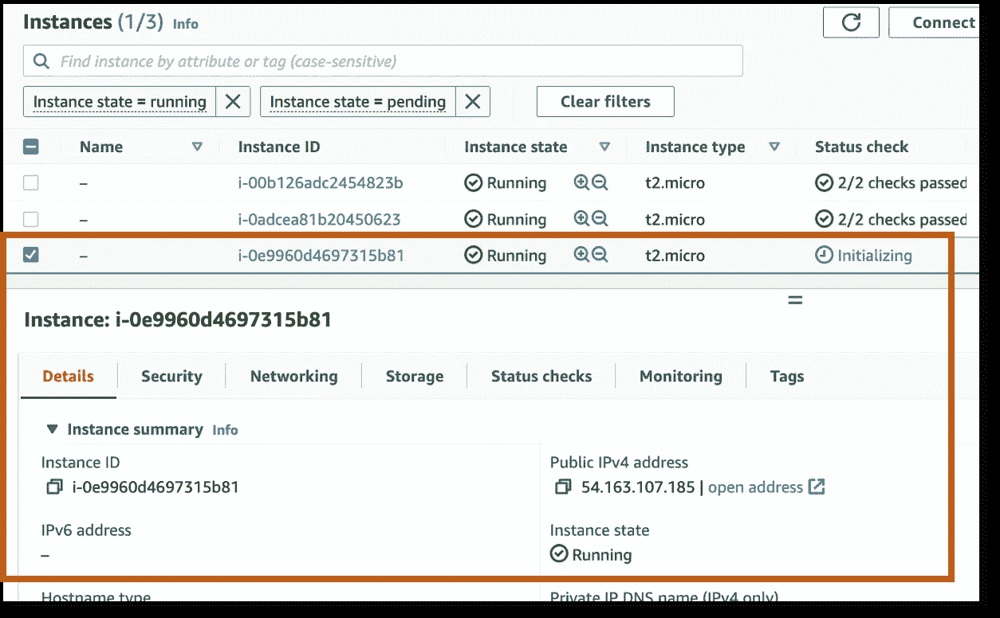

图 7:显示创建第三个 EC2 实例的屏幕截图


图 8:显示服务器高 CPU 的屏幕截图

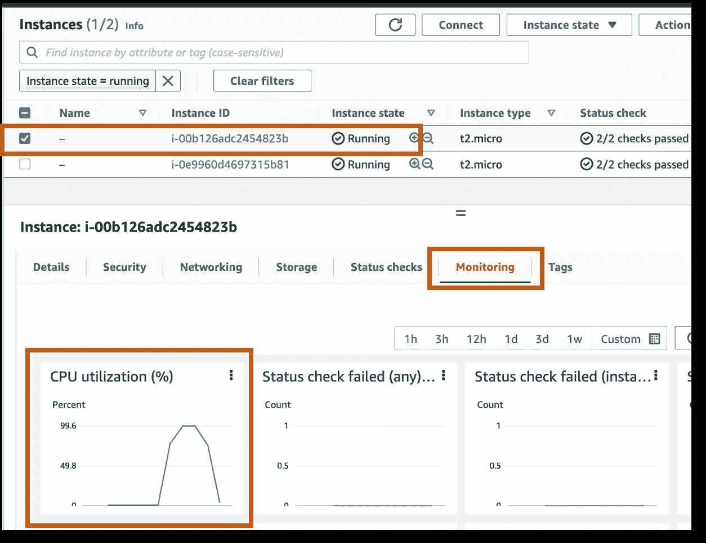

图 9:显示低 CPU 和移除(自动终止)第三个服务器的屏幕截图

## 3.基于可用性的自动扩展

目标:终止两个正在运行的服务器中的一个，并看到一个新的服务器被自动创建，因为 CloudFormation 模板表明我们需要至少两个服务器一直运行。

代码 2:定义自动扩展组中最小和最大服务器数量的云信息资源

**步骤:**

1.  从 AWS 管理控制台> EC2 终止服务器
2.  等待几分钟，让新服务器自动配置。

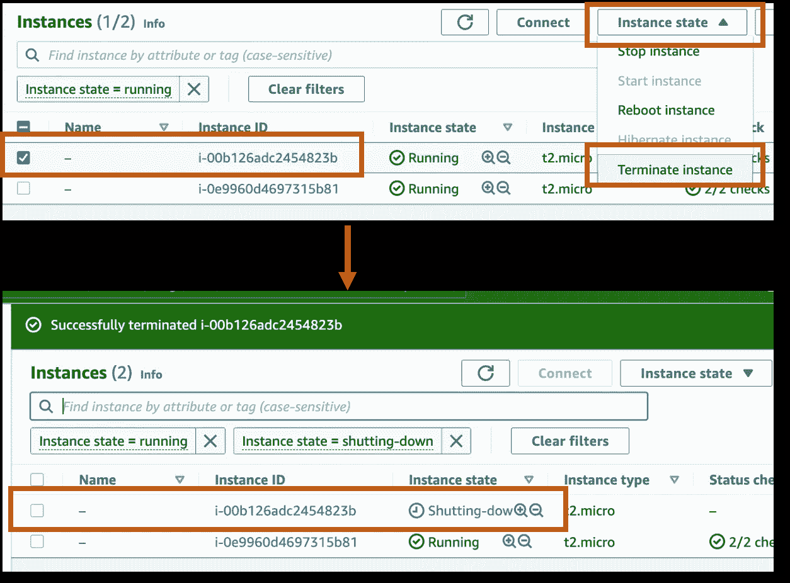

图 10:终止正在运行的实例，并看到自动创建的新实例

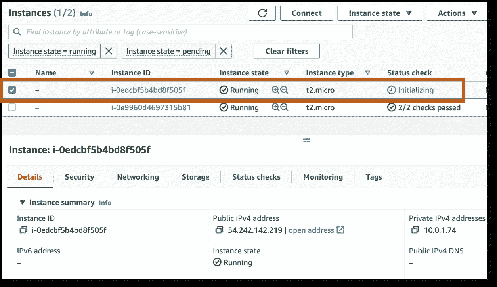

图 11:自动创建的实例的初始化

# 摘要

在本教程中，我们演示了自动伸缩如何适用于基于负载和可用性的场景。请注意，在整个实验中，负载平衡器的 URL 应该是打开的，而服务器根据负载和最低可用性进行伸缩。自动伸缩实现了 web 服务的高可用性和可靠性。有关实现的更多信息，请查看 GitHub 资源库中的 CloudFormation 基础设施代码。


图 12:从 CloudFormation 堆栈创建的负载平衡器的 URL

## 清除

温和的提醒删除云形成堆栈，以避免在你的实验后被收费。删除云形成堆栈后，应终止 EC2 服务器。

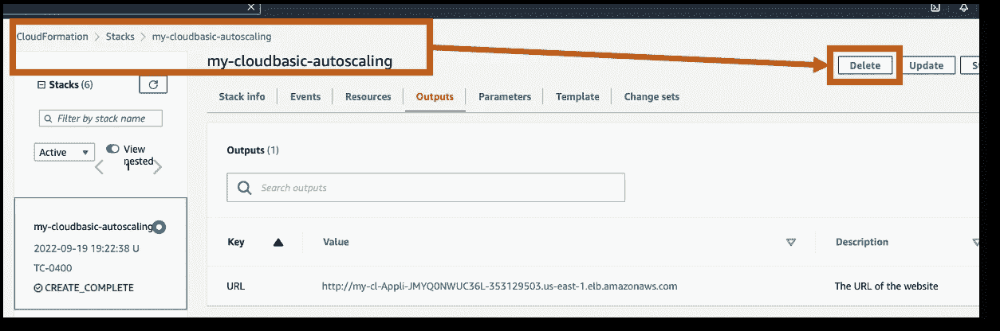

图 13:显示堆栈终止的屏幕截图

## 资源

1.  [https://aws.amazon.com/autoscaling/](https://aws.amazon.com/autoscaling/)
2.  https://aws.amazon.com/cloudformation/
3.  【https://github.com/shrestha-ajay/cloud-basics2 
4.  [https://en . Wikipedia . org/wiki/Yes _(Unix)](https://en.wikipedia.org/wiki/Yes_(Unix))